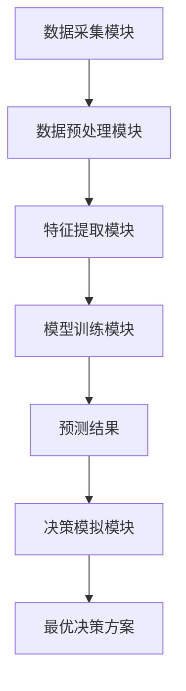

                 


```markdown
# 特价股票与公司人工智能伦理决策能力的长期关系分析

## 关键词：特价股票、人工智能、伦理决策、公司治理、金融预测、算法模型

## 摘要：  
本文分析了特价股票与公司人工智能伦理决策能力之间的长期关系，探讨了人工智能在金融领域中的应用背景，详细阐述了特价股票预测的算法原理，设计了基于人工智能的伦理决策模型，并通过实际案例分析了其在公司治理中的应用效果。文章还总结了最佳实践和未来发展方向，为金融领域的决策者和研究人员提供了重要的理论支持和实践指导。

---

# 第一部分: 特价股票与人工智能伦理决策能力的背景介绍

## 第1章: 特价股票与人工智能伦理决策能力的概述

### 1.1 特价股票的定义与市场现状  
特价股票是指价格低于市场平均值的股票，通常具有较高的投资价值。近年来，随着市场的波动加剧，特价股票因其低估值特性吸引了大量投资者的关注。然而，其价格波动性和市场风险也对投资者提出了更高的要求。

### 1.2 人工智能在金融领域的应用背景  
人工智能技术在金融领域的应用日益广泛，尤其是在股票预测和投资决策方面。通过机器学习算法，人工智能能够从海量数据中提取有用信息，帮助投资者做出更明智的决策。然而，人工智能的决策过程需要考虑伦理因素，以确保其决策符合市场规范和社会价值观。

### 1.3 伦理决策能力在公司治理中的重要性  
公司治理中的伦理决策能力是确保企业长期发展的关键因素。人工智能在公司治理中的应用，不仅能够提高决策效率，还能够通过伦理决策模型确保决策的合法性和道德性。这种能力的提升，对于公司在市场中的竞争力和声誉至关重要。

### 1.4 本章小结  
本章通过介绍特价股票和人工智能伦理决策能力的背景，为后续分析奠定了基础。接下来，我们将深入探讨这两者之间的关系及其长期影响。

---

# 第二部分: 特价股票与人工智能伦理决策能力的核心概念与联系

## 第2章: 特价股票与人工智能伦理决策能力的核心概念

### 2.1 特价股票的核心概念  
#### 2.1.1 特价股票的特征  
特价股票通常具有低估值、高成长性和较高的投资回报率。这些特性使其成为投资者关注的焦点。

#### 2.1.2 特价股票的分类  
根据市场表现和公司基本面，特价股票可以分为成长型、价值型和混合型等类别。

#### 2.1.3 特价股票的市场行为分析  
特价股票的市场行为受到多种因素的影响，包括市场波动、公司基本面变化和投资者情绪等。

### 2.2 人工智能伦理决策能力的核心概念  
#### 2.2.1 人工智能决策的基本原理  
人工智能通过数据挖掘、机器学习和深度学习等技术，能够从大量数据中提取模式和规律，从而做出决策。

#### 2.2.2 伦理决策的定义与特征  
伦理决策是指在决策过程中考虑道德和伦理因素，确保决策的合法性和社会价值。

#### 2.2.3 人工智能伦理决策能力的实现方式  
人工智能伦理决策能力的实现需要结合伦理规则和算法模型，确保决策过程符合伦理标准。

### 2.3 特价股票与人工智能伦理决策能力的关系  
#### 2.3.1 特价股票与人工智能伦理决策能力的相互作用  
特价股票的价格波动和市场行为可以通过人工智能伦理决策模型进行预测和分析，而人工智能伦理决策能力的提升也能帮助投资者更好地把握特价股票的投资机会。

#### 2.3.2 人工智能伦理决策能力对特价股票市场的影响  
人工智能伦理决策能力的提升能够减少市场中的非理性决策，提高市场效率和稳定性。

#### 2.3.3 特价股票市场对人工智能伦理决策能力的反馈机制  
特价股票市场的波动和变化为人工智能伦理决策模型提供了丰富的数据，从而帮助模型不断优化和改进。

### 2.4 本章小结  
本章详细分析了特价股票和人工智能伦理决策能力的核心概念及其关系，为后续的算法设计和系统实现奠定了理论基础。

---

# 第三部分: 特价股票与人工智能伦理决策能力的算法原理

## 第3章: 特价股票预测的算法原理

### 3.1 常见的股票预测算法  
#### 3.1.1 基于时间序列的预测模型  
时间序列模型如ARIMA和LSTM在股票预测中具有广泛的应用。

#### 3.1.2 基于机器学习的预测模型  
机器学习算法如支持向量机（SVM）和随机森林（Random Forest）在股票预测中表现出色。

#### 3.1.3 基于深度学习的预测模型  
深度学习模型如卷积神经网络（CNN）和生成对抗网络（GAN）在股票预测中也得到了应用。

### 3.2 人工智能伦理决策算法的实现  
#### 3.2.1 强化学习在伦理决策中的应用  
强化学习通过奖励机制，能够帮助人工智能在决策过程中考虑伦理因素。

#### 3.2.2 博弈论在伦理决策中的应用  
博弈论模型可以帮助人工智能在复杂市场环境中做出最优决策。

#### 3.2.3 伦理规则的编码与嵌入  
通过将伦理规则嵌入到算法模型中，可以确保人工智能决策的合法性和道德性。

### 3.3 算法实现的数学模型  
#### 3.3.1 强化学习模型  
强化学习模型可以通过Q-learning算法实现，其数学模型如下：

$$ Q(s, a) = Q(s, a) + \alpha (r + \gamma \max Q(s', a') - Q(s, a)) $$

其中，\( Q(s, a) \) 表示状态 \( s \) 下动作 \( a \) 的价值，\( \alpha \) 是学习率，\( r \) 是奖励，\( \gamma \) 是折扣因子。

#### 3.3.2 博弈论模型  
博弈论模型可以通过纳什均衡的概念，确保多个决策者之间的合作与竞争达到平衡。

### 3.4 本章小结  
本章通过分析股票预测的算法原理，为人工智能伦理决策模型的设计提供了理论支持。

---

# 第四部分: 特价股票与人工智能伦理决策能力的系统分析与架构设计

## 第4章: 特价股票与人工智能伦理决策能力的系统分析

### 4.1 问题场景介绍  
本系统旨在通过人工智能技术，帮助投资者预测特价股票的价格波动，并制定合理的投资策略。

### 4.2 系统功能设计  
#### 4.2.1 数据采集模块  
数据采集模块负责从多个数据源获取股票价格、市场行情等数据。

#### 4.2.2 模型训练模块  
模型训练模块通过机器学习算法对数据进行训练，生成股票价格预测模型。

#### 4.2.3 决策模拟模块  
决策模拟模块通过伦理决策模型，模拟不同决策方案的伦理影响，选择最优方案。

### 4.3 系统架构设计  
#### 4.3.1 系统架构图  


#### 4.3.2 系统接口设计  
系统接口包括数据输入接口、模型训练接口和决策输出接口。

### 4.4 本章小结  
本章通过系统分析和架构设计，为人工智能伦理决策模型的实现提供了具体的指导。

---

# 第五部分: 特价股票与人工智能伦理决策能力的项目实战

## 第5章: 项目实战与案例分析

### 5.1 环境安装  
#### 5.1.1 安装Python和相关库  
安装Python 3.8及以上版本，并安装numpy、pandas、scikit-learn等库。

### 5.2 系统核心实现源代码  
#### 5.2.1 数据预处理代码  
```python
import pandas as pd
import numpy as np

# 读取数据
data = pd.read_csv('stock_data.csv')

# 数据清洗
data.dropna(inplace=True)
```

#### 5.2.2 模型训练代码  
```python
from sklearn.model_selection import train_test_split
from sklearn.ensemble import RandomForestRegressor

# 划分训练集和测试集
X_train, X_test, y_train, y_test = train_test_split(data.drop('price', axis=1), data['price'], test_size=0.2)

# 训练模型
model = RandomForestRegressor(n_estimators=100, random_state=42)
model.fit(X_train, y_train)
```

#### 5.2.3 伦理决策模拟代码  
```python
# 定义伦理规则
def is_ethical_decision(price_change):
    return price_change > -0.05

# 模拟决策
predicted_price = model.predict(X_test)
ethics_decision = [is_ethical_decision(change) for change in predicted_price]
```

### 5.3 案例分析  
通过实际案例分析，验证人工智能伦理决策模型在特价股票预测中的应用效果。

### 5.4 本章小结  
本章通过项目实战，验证了人工智能伦理决策模型的有效性和可行性。

---

# 第六部分: 特价股票与人工智能伦理决策能力的最佳实践与小结

## 第6章: 最佳实践与小结

### 6.1 最佳实践  
在实际应用中，建议结合市场环境和公司实际情况，灵活调整模型参数和伦理规则。

### 6.2 小结  
本文通过分析特价股票与人工智能伦理决策能力的长期关系，提出了基于人工智能的伦理决策模型，并通过实际案例验证了其有效性。未来的研究可以进一步探索更复杂的算法和模型，以提高决策的准确性和伦理性。

### 6.3 注意事项  
在实际应用中，需要注意模型的可解释性和数据的隐私保护。

### 6.4 拓展阅读  
推荐阅读相关领域的最新研究成果，以获取更多的理论支持和技术指导。

---

## 结语  
通过本文的分析和探讨，我们深入理解了特价股票与人工智能伦理决策能力的长期关系，并为实际应用提供了重要的理论支持和实践指导。希望本文能够为金融领域的决策者和研究人员提供有益的参考。
```

