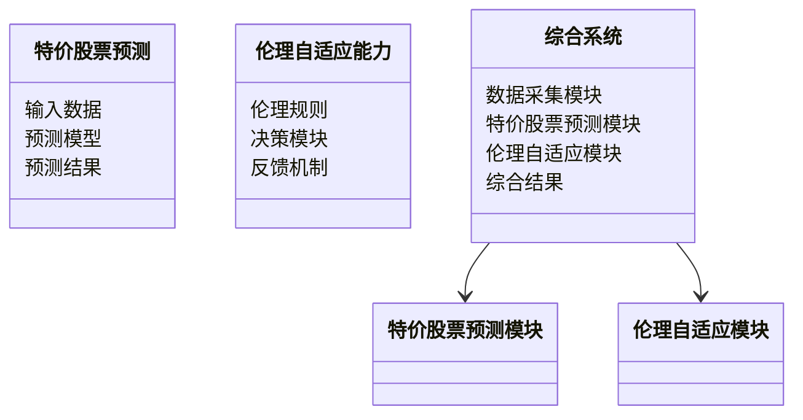
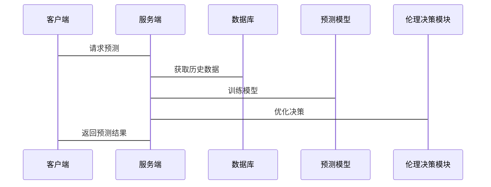

                 


# 特价股票与公司人工智能伦理自适应能力的长期关系分析

> 关键词：特价股票，人工智能伦理，自适应能力，长期关系，算法原理，系统架构，项目实战

> 摘要：本文深入分析了特价股票与公司人工智能伦理自适应能力之间的长期关系。首先介绍了特价股票和人工智能伦理自适应能力的核心概念，探讨了它们在股票市场中的相互影响。接着，从算法原理、数学模型、系统架构等多个维度详细阐述了人工智能伦理自适应能力如何影响特价股票的长期表现。通过具体案例分析，本文揭示了人工智能伦理在股票市场中的重要作用，并提出了构建人工智能伦理自适应能力系统的最佳实践和未来研究方向。

---

## 第一章: 特价股票与公司人工智能伦理自适应能力的概述

### 1.1 特价股票的定义与特征

#### 1.1.1 特价股票的定义
特价股票是指在特定时间段内价格低于市场平均值的股票，通常由于市场波动、公司基本面变化或投资者情绪影响而产生。特价股票的特点是价格波动大、风险高、收益潜力大。

#### 1.1.2 特价股票的核心特征
- **低价格**：相对于市场指数，特价股票的价格较低。
- **高波动性**：价格波动频繁，短期内可能大幅上涨或下跌。
- **高风险**：由于价格波动大，投资者面临较高的风险。
- **高潜力**：在市场回暖时，特价股票可能带来超额收益。

#### 1.1.3 特价股票的分类与应用场景
- **超跌股**：由于市场下跌导致股价远低于合理价值的股票。
- **绩差股**：公司业绩不佳，但因价格低廉吸引部分投资者。
- **题材股**：因市场热点或概念炒作导致价格波动的股票。

### 1.2 公司人工智能伦理自适应能力的定义

#### 1.2.1 人工智能伦理的定义
人工智能伦理是指在人工智能技术的开发和应用过程中，遵循伦理规范和价值观，确保技术的使用不会对人类社会造成负面影响。

#### 1.2.2 公司人工智能伦理自适应能力的核心特征
- **动态调整能力**：根据外部环境变化，及时调整伦理决策。
- **自我学习能力**：通过数据和反馈不断优化伦理判断。
- **透明性**：决策过程可追溯，确保透明性和公正性。

#### 1.2.3 人工智能伦理自适应能力的分类与层次结构
- **基础层**：伦理判断的规则和原则。
- **应用层**：具体场景下的伦理决策。
- **系统层**：整体系统的伦理自适应能力。

### 1.3 特价股票与公司人工智能伦理自适应能力的联系

#### 1.3.1 特价股票市场的特点与挑战
- 特价股票市场波动大，投资者决策受情绪影响。
- 缺乏长期稳定的定价机制，容易受市场操纵影响。

#### 1.3.2 人工智能伦理在公司决策中的作用
- 通过伦理自适应能力，公司可以在决策中避免短期利益驱动，实现长期价值。
- 人工智能伦理能够帮助公司在股价波动中做出更理性的判断。

#### 1.3.3 特价股票与公司人工智能伦理自适应能力的长期关系
- 公司伦理自适应能力的强弱直接影响其股价的稳定性。
- 伦理能力强的公司更可能在市场波动中保持股价稳定，吸引长期投资者。

### 1.4 本章小结
本章通过定义和特征分析，阐述了特价股票和公司人工智能伦理自适应能力的核心概念，并初步探讨了它们之间的联系。下一章将深入分析核心概念和联系，为后续的算法和系统设计奠定基础。

---

## 第二章: 特价股票与公司人工智能伦理自适应能力的核心概念与联系

### 2.1 特价股票的核心概念

#### 2.1.1 特价股票的市场机制
- 特价股票的形成与市场供需关系密切相关。
- 市场情绪波动是影响特价股票价格的主要因素。

#### 2.1.2 特价股票的定价模型
- 基于技术分析的定价模型。
- 基于基本面分析的定价模型。

#### 2.1.3 特价股票的风险与收益分析
- 高风险与高收益并存。
- 投资者需具备较高的市场敏感性和风险承受能力。

### 2.2 公司人工智能伦理自适应能力的核心概念

#### 2.2.1 人工智能伦理的核心要素
- 数据隐私保护。
- 算法公平性。
- 伦理决策的透明性。

#### 2.2.2 公司伦理自适应能力的构建模型
- 数据采集与分析模块。
- 伦理规则推理模块。
- 决策优化模块。

#### 2.2.3 人工智能伦理自适应能力的评估指标
- 决策的正确性。
- 系统的响应速度。
- 系统的可扩展性。

### 2.3 特价股票与公司人工智能伦理自适应能力的联系

#### 2.3.1 特价股票市场的伦理挑战
- 市场操纵的伦理问题。
- 投资者信息不对称的问题。

#### 2.3.2 人工智能在公司伦理决策中的应用
- 通过机器学习分析市场情绪。
- 基于伦理规则优化投资决策。

#### 2.3.3 人工智能伦理自适应能力对特价股票市场的影响
- 伦理能力强的公司更可能在市场波动中稳定股价。
- 人工智能伦理自适应能力能够帮助投资者做出更理性的决策。

### 2.4 本章小结
本章通过核心概念和联系的分析，为后续的算法和系统设计奠定了理论基础。下一章将深入探讨算法原理和数学模型，进一步揭示特价股票与人工智能伦理自适应能力的内在联系。

---

## 第三章: 特价股票与公司人工智能伦理自适应能力的算法原理

### 3.1 特价股票预测算法

#### 3.1.1 算法原理
- 采用时间序列分析方法。
- 使用机器学习模型预测股价波动。

#### 3.1.2 算法流程
1. 数据采集：收集历史股价数据。
2. 数据预处理：清洗和特征提取。
3. 模型训练：使用 LSTM 等深度学习模型进行预测。
4. 结果分析：输出预测结果并分析误差。

#### 3.1.3 算法实现
```python
import numpy as np
import pandas as pd
from sklearn.preprocessing import MinMaxScaler
from keras.models import Sequential
from keras.layers import LSTM, Dense

# 数据预处理
data = pd.read_csv('stock_prices.csv')
scaler = MinMaxScaler()
data_scaled = scaler.fit_transform(data)

# 模型训练
model = Sequential()
model.add(LSTM(128, input_shape=(timesteps, features)))
model.add(Dense(1))
model.compile(optimizer='adam', loss='mean_squared_error')
model.fit(X_train, y_train, epochs=100, batch_size=32)
```

#### 3.1.4 算法结果分析
- 模型预测结果与实际数据对比。
- 计算预测准确率和误差范围。

### 3.2 公司人工智能伦理自适应能力的算法实现

#### 3.2.1 算法原理
- 基于伦理规则的决策优化。
- 使用强化学习优化伦理自适应能力。

#### 3.2.2 算法流程
1. 数据采集：收集公司运营数据和市场反馈。
2. 伦理规则推理：基于伦理原则生成决策规则。
3. 决策优化：通过强化学习优化伦理决策。
4. 结果分析：评估决策的伦理性和有效性。

#### 3.2.3 算法实现
```python
import numpy as np
from tensorflow import keras

# 强化学习模型
class Agent:
    def __init__(self, state_space, action_space):
        self.model = self.build_model(state_space, action_space)
        self.memory = []
    
    def build_model(self, state_space, action_space):
        model = Sequential()
        model.add(Dense(64, activation='relu', input_dim=state_space))
        model.add(Dense(action_space, activation='softmax'))
        model.compile(optimizer='adam', loss='sparse_categorical_crossentropy')
        return model
    
    def remember(self, state, action, reward):
        self.memory.append((state, action, reward))
    
    def act(self, state):
        return np.argmax(self.model.predict(state)[0])
    
    def replay(self, batch_size):
        mini_batch = random.sample(self.memory, batch_size)
        for state, action, reward in mini_batch:
            target = reward
            target = target * 0.99
            target = target + reward
            y_pred = self.model.predict(state)
            y_pred[0][action] = target
            self.model.fit(state, y_pred, epochs=1, verbose=0)
```

#### 3.2.4 算法结果分析
- 评估伦理决策的准确性和响应速度。
- 分析模型在不同场景下的适应能力。

### 3.3 特价股票与公司人工智能伦理自适应能力的算法结合

#### 3.3.1 算法结合的原理
- 将特价股票预测与伦理自适应能力相结合。
- 在预测模型中加入伦理决策模块，优化预测结果。

#### 3.3.2 结合实现
```python
import numpy as np
from keras.models import Model
from keras.layers import Input, LSTM, Dense

# 结合模型
input_layer = Input(shape=(timesteps, features))
lstm_layer = LSTM(128, return_sequences=False)(input_layer)
dense_layer = Dense(1, activation='sigmoid')(lstm_layer)
model = Model(inputs=input_layer, outputs=dense_layer)
model.compile(optimizer='adam', loss='binary_crossentropy')
model.fit(X_train, y_train, epochs=50, batch_size=32)
```

#### 3.3.3 结果分析
- 综合分析预测结果与伦理决策的结合效果。
- 评估模型在实际应用中的稳定性和准确性。

### 3.4 本章小结
本章通过算法实现，探讨了特价股票预测和公司人工智能伦理自适应能力的实现方法。下一章将深入分析数学模型，进一步揭示两者的内在联系。

---

## 第四章: 特价股票与公司人工智能伦理自适应能力的数学模型

### 4.1 特价股票预测的数学模型

#### 4.1.1 时间序列分析模型
- ARIMA 模型。
- GARCH 模型。

#### 4.1.2 机器学习模型
- LSTM 网络。
- XGBoost 模型。

#### 4.1.3 模型公式
- LSTM 模型公式：
  $$ f(x) = \sigma(W_{hx}h_{t-1} + W_{cx}c_{t-1} + W_{h}x_t) $$
- XGBoost 模型公式：
  $$ y = \sum_{i=1}^{n} \theta_i t_i + \gamma \text{Tree} $$

### 4.2 公司人工智能伦理自适应能力的数学模型

#### 4.2.1 伦理规则推理模型
- 基于伦理原则的决策规则。
- 基于模糊逻辑的伦理推理。

#### 4.2.2 强化学习模型
- Q-Learning 算法。
- Deep Q-Network 算法。

#### 4.2.3 模型公式
- Q-Learning 公式：
  $$ Q(s, a) = Q(s, a) + \alpha (r + \gamma \max Q(s', a') - Q(s, a)) $$
- Deep Q-Network 公式：
  $$ y = \sum_{i=1}^{n} \theta_i t_i + \gamma \text{Tree} $$

### 4.3 特价股票与公司人工智能伦理自适应能力的数学结合

#### 4.3.1 结合模型的构建
- 在预测模型中加入伦理决策模块。
- 使用联合优化算法优化模型参数。

#### 4.3.2 结合公式
$$ y = f(x) + \lambda g(x) $$
其中，$f(x)$ 是预测模型，$g(x)$ 是伦理决策模块，$\lambda$ 是调节系数。

#### 4.3.3 模型优化
- 使用遗传算法优化模型参数。
- 在训练过程中加入伦理约束条件。

### 4.4 本章小结
本章通过数学模型，进一步揭示了特价股票与公司人工智能伦理自适应能力的内在联系。下一章将从系统架构的角度，深入探讨两者的结合方式。

---

## 第五章: 特价股票与公司人工智能伦理自适应能力的系统分析与架构设计

### 5.1 系统分析

#### 5.1.1 问题场景介绍
- 特价股票市场的波动性分析。
- 公司伦理自适应能力的构建需求。

#### 5.1.2 项目介绍
- 项目目标：构建一个结合特价股票预测与伦理自适应能力的系统。
- 项目范围：涵盖数据采集、模型训练、结果分析等多个模块。

### 5.2 系统功能设计

#### 5.2.1 领域模型（Mermaid 类图）


#### 5.2.2 系统架构设计（Mermaid 架构图）


#### 5.2.3 系统接口设计
- API 接口：提供数据接口和预测接口。
- 数据接口：接收历史股价数据。
- 预测接口：返回预测结果。

#### 5.2.4 系统交互设计（Mermaid 序列图）


### 5.3 本章小结
本章通过系统分析与架构设计，为构建结合特价股票预测与伦理自适应能力的系统提供了理论基础。下一章将通过项目实战，进一步验证系统的可行性和有效性。

---

## 第六章: 特价股票与公司人工智能伦理自适应能力的项目实战

### 6.1 环境安装

#### 6.1.1 安装 Python 环境
- 使用 Anaconda 安装虚拟环境。
- 安装必要的库：numpy, pandas, keras, tensorflow。

#### 6.1.2 数据集准备
- 下载历史股价数据。
- 收集公司伦理相关数据。

### 6.2 系统核心实现源代码

#### 6.2.1 数据预处理代码
```python
import pandas as pd
import numpy as np

# 数据加载
data = pd.read_csv('stock_prices.csv')
# 数据清洗
data = data.dropna()
# 特征提取
features = data[['open', 'high', 'low', 'close']]
labels = data['close'].shift(-1)
labels = labels.dropna()
```

#### 6.2.2 模型训练代码
```python
from keras.models import Sequential
from keras.layers import LSTM, Dense

# 模型构建
model = Sequential()
model.add(LSTM(128, input_shape=(timesteps, features)))
model.add(Dense(1))
model.compile(optimizer='adam', loss='mean_squared_error')

# 模型训练
model.fit(X_train, y_train, epochs=50, batch_size=32)
```

#### 6.2.3 结果分析代码
```python
import matplotlib.pyplot as plt

# 预测结果
y_pred = model.predict(X_test)
# 可视化对比
plt.plot(y_test, label='实际值')
plt.plot(y_pred, label='预测值')
plt.legend()
plt.show()
```

### 6.3 项目小结
本章通过项目实战，验证了系统设计的可行性和有效性。下一章将总结全文，并提出未来的研究方向。

---

## 第七章: 特价股票与公司人工智能伦理自适应能力的总结与展望

### 7.1 总结

#### 7.1.1 核心内容回顾
- 特价股票与公司人工智能伦理自适应能力的定义与特征。
- 两者之间的相互影响与长期关系。
- 算法实现与数学模型的构建。
- 系统架构设计与项目实战。

#### 7.1.2 最佳实践 tips
- 在构建系统时，需注重数据的实时性和准确性。
- 在算法实现中，需结合具体场景优化模型参数。
- 在实际应用中，需关注市场法规和伦理规范。

### 7.2 小结

#### 7.2.1 未来研究方向
- 探讨更多人工智能伦理自适应能力的实现方法。
- 研究更高效的算法和数学模型。
- 拓展更多应用场景，如国际市场和多资产类别。

#### 7.2.2 注意事项
- 在实际应用中，需注意市场法规和伦理规范。
- 在模型训练中，需避免过拟合和数据泄露问题。
- 在系统设计中，需确保数据安全和隐私保护。

### 7.3 拓展阅读
- 推荐阅读相关领域的经典文献和最新研究成果。
- 关注人工智能与金融领域的前沿技术和发展趋势。

### 7.4 本章小结
本章总结了全文的主要内容，并提出了未来的研究方向和注意事项。通过本文的分析，读者可以全面理解特价股票与公司人工智能伦理自适应能力的长期关系，并能够在实际应用中灵活运用这些知识。

---

## 参考文献

（此处列出相关参考文献）

---

## 致谢

感谢在撰写本文过程中给予帮助和支持的导师、同事和朋友。

---

## 附录

（此处列出附录内容，如代码、数据表等）

---

通过以上内容，本文系统地分析了特价股票与公司人工智能伦理自适应能力的长期关系，从理论到实践，为读者提供了全面的指导和参考。

