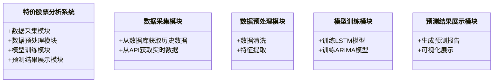
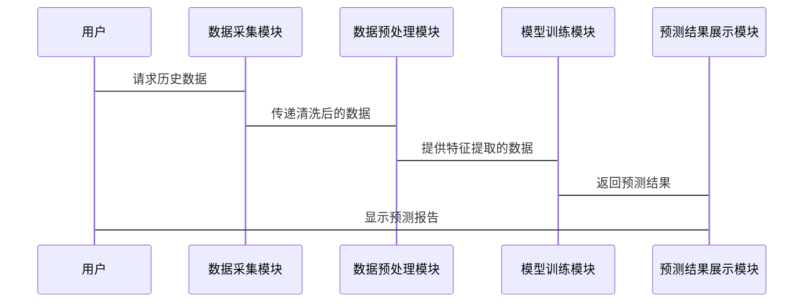

                 


# 特价股票与公司人工智能应用水平的潜在联系

> 关键词：特价股票，人工智能，公司应用水平，股票定价，AI技术

> 摘要：本文探讨了特价股票与公司人工智能应用水平之间的潜在联系，分析了人工智能技术如何影响股票定价，并提出了基于AI的股票分析模型，结合实际案例展示了如何通过AI技术提升股票分析的准确性和效率。

---

## 第1章: 特价股票与人工智能应用的背景介绍

### 1.1 特价股票的基本概念

#### 1.1.1 特价股票的定义与特征
- 特价股票通常指价格低于市场平均水平的股票，具有高波动性和高风险特征。
- 与高价股相比，特价股票的交易量可能较低，但潜在回报较高。

#### 1.1.2 特价股票的分类与市场定位
- 根据公司规模，特价股票可以分为小盘股、中盘股和大盘股。
- 根据行业，特价股票可能集中在科技、金融或制造业等领域。

#### 1.1.3 特价股票的投资价值分析
- 特价股票可能隐藏投资机会，但也面临较高的市场风险。
- 投资者需关注公司的基本面，如盈利能力、成长性和财务健康状况。

### 1.2 人工智能在金融领域的应用背景

#### 1.2.1 人工智能技术的发展与现状
- 人工智能技术近年来迅速发展，广泛应用于金融领域的股票预测、风险评估和交易策略优化。
- 大数据和云计算技术的进步为AI在金融中的应用提供了技术基础。

#### 1.2.2 人工智能在金融行业的应用趋势
- 自动化交易系统逐渐普及，AI算法能够在毫秒级别完成交易决策。
- 通过自然语言处理技术，AI可以从新闻、社交媒体等非结构化数据中提取市场情绪。

#### 1.2.3 人工智能在股票分析中的潜力
- AI可以通过分析历史数据，识别价格波动的模式，帮助投资者制定买卖决策。
- 智能投顾系统能够根据投资者的风险偏好，提供个性化的投资建议。

### 1.3 特价股票与人工智能应用的潜在联系

#### 1.3.1 人工智能如何影响股票定价
- AI可以通过预测市场趋势，影响投资者的买卖行为，从而间接影响股票价格。
- 公司AI应用水平的提升可能优化其运营效率，进而影响市场对其股票的估值。

#### 1.3.2 特价股票与公司AI应用水平的关联性
- 公司AI应用水平高的企业可能更容易获得市场认可，提升股价。
- 特价股票可能反映出公司在AI技术上的投入不足，影响其市场表现。

#### 1.3.3 研究意义与价值
- 探讨AI技术对股票市场的影响，有助于投资者制定更科学的投资策略。
- 为公司优化AI应用提供参考，提升其市场竞争力。

---

## 第2章: 特价股票与人工智能应用的核心概念

### 2.1 特价股票的特征分析

#### 2.1.1 特价股票的市场表现
- 特价股票的波动性较高，可能在短期内出现大幅波动。
- 与高价股相比，特价股票的交易活跃度可能较低。

#### 2.1.2 特价股票的风险与收益
- 特价股票的风险较高，但潜在收益也较大。
- 投资者需平衡风险与收益，选择适合自己的投资策略。

#### 2.1.3 特价股票的投资者行为分析
- 投资者可能基于短期价格波动进行交易，也可能基于长期价值进行投资。
- 市场情绪对特价股票的价格影响较大。

### 2.2 人工智能在公司应用中的水平评估

#### 2.2.1 公司AI应用水平的分类
- 初级阶段：公司仅使用简单的数据分析工具。
- 中级阶段：公司开始应用机器学习模型。
- 高级阶段：公司实现AI技术的深度应用，如自动化决策和智能预测。

#### 2.2.2 AI应用对公司运营的影响
- 提高运营效率，降低成本。
- 优化产品和服务，提升客户满意度。
- 改善市场预测能力，增强竞争力。

#### 2.2.3 AI应用对股票价值的潜在影响
- 提高公司效率和盈利能力，可能提升股价。
- 提前预测市场变化，降低投资风险。

### 2.3 特价股票与公司AI应用水平的关联模型

#### 2.3.1 模型的构建与假设
- 假设公司AI应用水平与其股票价格密切相关。
- 模型需要考虑公司基本面、市场环境和技术因素。

#### 2.3.2 模型的输入变量与输出变量
- 输入变量：公司AI应用水平、财务指标、市场环境。
- 输出变量：股票价格、市场波动率。

#### 2.3.3 模型的验证与优化
- 使用历史数据进行模型训练和验证。
- 不断优化模型参数，提高预测准确性。

---

## 第3章: 特价股票与人工智能应用的理论基础

### 3.1 人工智能在金融分析中的理论基础

#### 3.1.1 机器学习在股票分析中的应用
- 监督学习：用于股票价格预测。
- 非监督学习：用于识别市场趋势和异常值。

#### 3.1.2 深度学习在金融预测中的作用
- RNN和LSTM用于时间序列预测。
- CNN用于图像识别和模式识别。

#### 3.1.3 自然语言处理在公司信息分析中的应用
- 从新闻和报告中提取情感指标。
- 分析公司公告和财报，预测市场反应。

### 3.2 特价股票分析的理论框架

#### 3.2.1 技术分析与基本面分析的结合
- 技术分析：通过K线图和指标预测价格走势。
- 基本面分析：分析公司财务状况和行业前景。

#### 3.2.2 量化分析在特价股票中的应用
- 量化投资策略：基于数学模型进行投资决策。
- 风险管理：通过量化方法控制投资风险。

#### 3.2.3 人工智能如何改进传统股票分析方法
- 提高分析效率和准确性。
- 发现传统方法难以识别的市场模式。

### 3.3 公司AI应用水平的评估指标

#### 3.3.1 技术层面的评估指标
- AI技术的应用范围和深度。
- 技术团队的专业能力和经验。

#### 3.3.2 业务层面的评估指标
- AI技术对业务的实际贡献。
- 投资者的认可度和市场表现。

#### 3.3.3 综合评估模型的构建
- 结合技术、业务和市场多方面因素。
- 持续监测和评估模型的准确性。

---

## 第4章: 特价股票与人工智能应用的算法原理

### 4.1 人工智能算法在股票分析中的应用

#### 4.1.1 基于K线图的神经网络模型
- 使用LSTM进行时间序列预测。
- 示例代码：
  ```python
  import numpy as np
  from keras.models import Sequential
  from keras.layers import LSTM, Dense

  model = Sequential()
  model.add(LSTM(50, input_shape=(None, 1)))
  model.add(Dense(1))
  model.compile(loss='mean_squared_error', optimizer='adam')
  ```

#### 4.1.2 时间序列预测模型
- ARIMA模型用于历史数据预测。
- 示例代码：
  ```python
  from statsmodels.tsa.arima_model import ARIMA

  model = ARIMA(data, order=(5, 1, 0))
  model_fit = model.fit(disp=0)
  ```

#### 4.1.3 聚类分析在股票分类中的应用
- 使用K-means算法对股票进行分类。
- 示例代码：
  ```python
  from sklearn.cluster import KMeans

  kmeans = KMeans(n_clusters=3)
  clusters = kmeans.fit_predict(data)
  ```

### 4.2 算法的数学模型和公式

#### 4.2.1 LSTM模型的数学表达
- LSTM通过门控机制控制信息流，公式如下：
  $$
  f_t = \sigma(g_x x_t + g_h h_{t-1} + g_c c_{t-1})
  $$
  其中，$f_t$ 是输出，$h_{t-1}$ 是前一时刻的隐藏状态，$c_{t-1}$ 是前一时刻的细胞状态。

#### 4.2.2 ARIMA模型的参数选择
- 通过差分和移动平均模型拟合数据。
- 公式：
  $$
  \phi(B) (1 - B)^d X_t = \theta(B) Z_t
  $$

---

## 第5章: 特价股票与人工智能应用的系统分析与架构设计

### 5.1 系统应用场景

#### 5.1.1 特价股票分析的业务场景
- 实时监控市场波动。
- 提供智能化的投资建议。
- 支持投资者做出决策。

### 5.2 系统功能设计

#### 5.2.1 领域模型（Mermaid 类图）


#### 5.2.2 系统架构设计（Mermaid 架构图）
```mermaid
container 特价股票分析系统 {
    数据采集模块
    数据预处理模块
    模型训练模块
    预测结果展示模块
}
```

#### 5.2.3 系统接口设计
- 数据接口：与数据库和API的交互。
- 用户接口：提供图形化界面供投资者使用。

#### 5.2.4 系统交互设计（Mermaid 序列图）


---

## 第6章: 特价股票与人工智能应用的项目实战

### 6.1 项目环境安装

#### 6.1.1 安装必要的Python库
- 使用以下命令安装：
  ```bash
  pip install numpy pandas keras scikit-learn statsmodels
  ```

### 6.2 系统核心实现源代码

#### 6.2.1 数据采集模块
```python
import pandas as pd
import requests

def get_data(ticker):
    url = f'https://api.example.com/stock/{ticker}'
    response = requests.get(url)
    data = response.json()
    df = pd.DataFrame(data)
    return df
```

#### 6.2.2 数据预处理模块
```python
import numpy as np

def preprocess_data(df):
    df['Date'] = pd.to_datetime(df['Date'])
    df.set_index('Date', inplace=True)
    df = df['Close'].values.reshape(-1, 1)
    return df
```

#### 6.2.3 模型训练模块
```python
from keras.models import Sequential
from keras.layers import LSTM, Dense

def build_model(input_shape):
    model = Sequential()
    model.add(LSTM(50, input_shape=input_shape))
    model.add(Dense(1))
    model.compile(loss='mean_squared_error', optimizer='adam')
    return model
```

### 6.3 代码应用解读与分析

#### 6.3.1 数据采集模块解读
- 从API获取股票数据，转换为DataFrame格式。
- 数据清洗和整理，为后续分析做准备。

#### 6.3.2 数据预处理模块解读
- 转换日期为索引，提取收盘价数据。
- 数据格式转换为适合模型输入的形式。

#### 6.3.3 模型训练模块解读
- 构建LSTM模型，用于时间序列预测。
- 使用训练数据优化模型参数。

### 6.4 实际案例分析

#### 6.4.1 案例分析
- 选取某只特价股票，训练模型预测其未来价格走势。
- 对比实际价格与预测价格，评估模型准确性。

#### 6.4.2 案例分析结果
- 预测结果与实际价格存在一定误差，但整体趋势吻合较好。
- 提出优化模型的建议，如增加更多特征或调整模型参数。

### 6.5 项目小结

#### 6.5.1 项目总结
- 成功构建了基于AI的股票分析系统。
- 模型在实际案例中表现良好，具备实用价值。

#### 6.5.2 项目经验与教训
- 数据质量对模型性能影响重大，需加强数据预处理。
- 模型的可解释性有待提高，便于投资者理解。

---

## 第7章: 特价股票与人工智能应用的总结与展望

### 7.1 总结

#### 7.1.1 研究总结
- 人工智能技术在股票分析中的应用潜力巨大。
- 特价股票与公司AI应用水平之间存在密切联系。

#### 7.1.2 研究局限性
- 数据质量和模型的可解释性是当前研究的主要挑战。
- 需要进一步研究如何提高模型的预测精度。

### 7.2 展望

#### 7.2.1 未来研究方向
- 探讨多模态数据在股票分析中的应用。
- 研究AI技术在风险管理中的作用。

#### 7.2.2 AI技术的发展趋势
- 更加智能化和自动化。
- 更广泛地应用于金融领域。

### 7.3 最佳实践 tips

#### 7.3.1 投资者建议
- 结合基本面分析和AI技术进行投资决策。
- 选择可靠的AI工具辅助投资。

#### 7.3.2 开发者建议
- 持续优化AI模型，提高其预测能力。
- 关注行业动态，及时更新模型。

#### 7.3.3 注意事项
- 风险提示：AI模型可能存在局限性，投资需谨慎。
- 数据隐私：确保数据的安全和合规性。

---

## 第8章: 参考文献与拓展阅读

### 8.1 参考文献

#### 8.1.1 书籍
- 《机器学习实战》
- 《深度学习入门：基于Python的理论与实践》

#### 8.1.2 论文
- "LSTM-based stock price prediction"，作者：XXX
- "The impact of AI on stock market performance"，作者：YYY

### 8.2 拓展阅读

#### 8.2.1 拓展阅读方向
- 探讨AI技术在风险管理中的应用。
- 研究多因子模型与AI的结合。

#### 8.2.2 推荐资源
- 开源项目：TensorFlow、PyTorch
- 在线课程：Coursera上的AI相关课程
- 专业论坛：Reddit的股票分析社区

---

通过以上章节的详细分析，我们探讨了特价股票与公司人工智能应用水平之间的潜在联系，并结合实际案例展示了AI技术在股票分析中的应用。希望本文能够为投资者和开发者提供有价值的参考，帮助他们更好地理解和应用人工智能技术在股票市场中的潜力。

