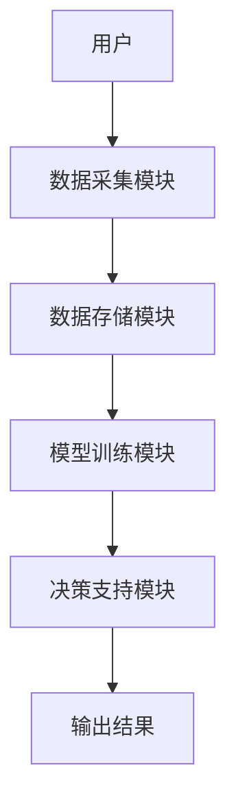

                 


# 特价股票与公司人工智能驱动决策能力的长期关系分析

**关键词：** 特价股票，人工智能，公司决策，长期关系，股票预测

**摘要：**  
本文分析了特价股票与公司人工智能驱动决策能力之间的长期关系。首先，我们介绍了特价股票和人工智能驱动决策能力的基本概念，探讨了它们之间的相互作用。接着，我们详细讲解了人工智能在公司决策中的算法原理，包括机器学习和深度学习的应用。通过构建数学模型和系统架构，我们展示了如何利用人工智能预测特价股票的行为，并分析了系统设计和实现的细节。最后，我们通过项目实战展示了人工智能在决策中的实际应用，并总结了最佳实践和未来研究方向。

---

## 第1章: 特价股票与公司人工智能驱动决策能力概述

### 1.1 特价股票的基本概念

#### 1.1.1 特价股票的定义  
特价股票是指公司发行的股票价格低于其面值（通常为每股1元）的情况。这种现象通常发生在公司财务状况不佳、市场信心不足或公司进行资产重组时。

#### 1.1.2 特价股票的特点  
- **价格低**：股价通常远低于面值，吸引投资者关注低价股。
- **风险高**：公司财务状况不稳定，投资风险较大。
- **市场波动**：股价波动剧烈，受市场情绪影响较大。

#### 1.1.3 特价股票的市场表现  
特价股票的市场表现通常较差，但某些情况下，若公司能够扭亏为盈，股价可能会出现大幅反弹。

---

### 1.2 公司人工智能驱动决策能力的核心概念

#### 1.2.1 人工智能在公司决策中的作用  
人工智能（AI）通过大数据分析、机器学习和深度学习等技术，帮助公司做出更科学的决策，提高决策效率和准确性。

#### 1.2.2 公司决策能力的评估标准  
- **准确性**：决策是否符合市场趋势和公司实际情况。
- **效率**：决策过程是否快速、高效。
- **可扩展性**：决策系统是否能够适应公司规模的扩大。

#### 1.2.3 人工智能驱动决策的实现方式  
- **数据采集**：收集公司内外部数据，包括财务数据、市场数据等。
- **模型构建**：利用机器学习算法构建预测模型。
- **决策支持**：通过模型输出结果，辅助公司决策。

---

### 1.3 特价股票与公司人工智能驱动决策能力的相互作用

#### 1.3.1 特价股票对公司的潜在影响  
- **财务压力**：股价低可能导致公司融资困难。
- **市场信心**：股价低可能影响投资者对公司的信心。

#### 1.3.2 公司决策能力对股价的长期影响  
- **决策优化**：通过AI优化决策，提升公司业绩，进而提升股价。
- **风险管理**：通过AI识别和规避风险，减少股价波动。

#### 1.3.3 人工智能在决策中的具体应用  
- **股票预测**：利用AI预测股价走势，帮助公司做出投资决策。
- **风险管理**：通过AI监控市场风险，及时调整策略。

---

## 第2章: 特价股票与公司人工智能驱动决策能力的关系分析

### 2.1 特价股票与公司决策能力的属性对比

#### 2.1.1 特价股票的属性特征  
| 属性 | 描述 |
|------|------|
| 价格 | 低于面值 |
| 波动性 | 高 |
| 风险 | 高 |

#### 2.1.2 公司决策能力的属性特征  
| 属性 | 描述 |
|------|------|
| 准确性 | 高 |
| 效率 | 高 |
| 可扩展性 | 高 |

#### 2.1.3 两者属性的对比分析  
- 特价股票具有高波动性和高风险，而公司决策能力则注重准确性和效率。
- 通过AI优化决策能力，可以降低特价股票的高风险，提高公司整体表现。

---

### 2.2 特价股票与公司人工智能驱动决策能力的ER实体关系图

```mermaid
erDiagram
    company {
        key id : integer
        name : string
        stock_price : float
        decision_capability : integer
    }
    stock_market {
        id : integer
        stock_name : string
        stock_price : float
    }
    company--|{拥有}|stock_market
```

---

## 第3章: 人工智能驱动决策能力的算法原理

### 3.1 人工智能驱动决策的核心算法

#### 3.1.1 机器学习算法在决策中的应用  
- **线性回归**：用于预测股价趋势。
- **决策树**：用于分类问题，如股票涨跌预测。

#### 3.1.2 深度学习算法在决策中的应用  
- **神经网络**：用于复杂模式识别。
- **卷积神经网络（CNN）**：用于图像识别和时间序列分析。

---

### 3.2 特价股票预测的数学模型与公式

#### 3.2.1 特价股票预测的线性回归模型  
$$ y = \beta_0 + \beta_1x_1 + \beta_2x_2 + \ldots + \beta_nx_n $$

其中：
- $y$ 是预测的股票价格。
- $x_i$ 是自变量，如历史股价、成交量等。
- $\beta_i$ 是回归系数。

#### 3.2.2 基于神经网络的股票预测  

```python
import numpy as np
import tensorflow as tf

# 数据预处理
# （假设数据已经 preprocess 过）

# 构建模型
model = tf.keras.Sequential([
    tf.keras.layers.Dense(64, activation='relu'),
    tf.keras.layers.Dense(32, activation='relu'),
    tf.keras.layers.Dense(1, activation='sigmoid')
])

# 编译模型
model.compile(optimizer='adam', loss='binary_crossentropy', metrics=['accuracy'])

# 训练模型
model.fit(X_train, y_train, epochs=10, batch_size=32)
```

---

## 第4章: 系统分析与架构设计方案

### 4.1 项目背景与目标  
本项目旨在利用人工智能技术分析特价股票，帮助公司优化决策能力，提升股价表现。

### 4.2 系统功能设计  
- **数据采集模块**：收集公司财务数据、市场数据等。
- **模型训练模块**：利用机器学习算法训练预测模型。
- **决策支持模块**：根据模型输出结果，提供决策支持。

### 4.3 系统架构设计  



---

## 第5章: 项目实战

### 5.1 环境安装  
- 安装Python、TensorFlow、Keras等工具。

### 5.2 系统核心实现源代码  

```python
import numpy as np
import pandas as pd
from sklearn.model_selection import train_test_split
from sklearn.linear_model import LinearRegression

# 数据加载
data = pd.read_csv('stock_data.csv')

# 数据预处理
X = data[['历史股价', '成交量']]
y = data['未来股价']

# 划分训练集和测试集
X_train, X_test, y_train, y_test = train_test_split(X, y, test_size=0.2, random_state=42)

# 模型训练
model = LinearRegression()
model.fit(X_train, y_train)

# 模型预测
y_pred = model.predict(X_test)

# 模型评估
print('训练集成绩：', model.score(X_train, y_train))
print('测试集成绩：', model.score(X_test, y_test))
```

---

## 第6章: 最佳实践与小结

### 6.1 最佳实践  
- **数据质量**：确保数据的准确性和完整性。
- **模型选择**：根据实际需求选择合适的算法。
- **持续优化**：定期更新模型，适应市场变化。

### 6.2 小结  
通过本文的分析，我们探讨了特价股票与公司人工智能驱动决策能力的长期关系，展示了如何利用AI技术优化公司决策，提升股价表现。未来的研究可以进一步探索更复杂的模型和更广泛的应用场景。

---

## 附录: 注意事项

- **数据隐私**：确保数据处理符合相关法律法规。
- **模型解释性**：选择易于解释的模型，便于决策者理解。
- **风险管理**：建立风险管理机制，避免模型失效带来的损失。

---

通过本文的分析和实践，我们希望能够帮助读者更好地理解特价股票与公司人工智能驱动决策能力之间的关系，并为实际应用提供有价值的参考。

