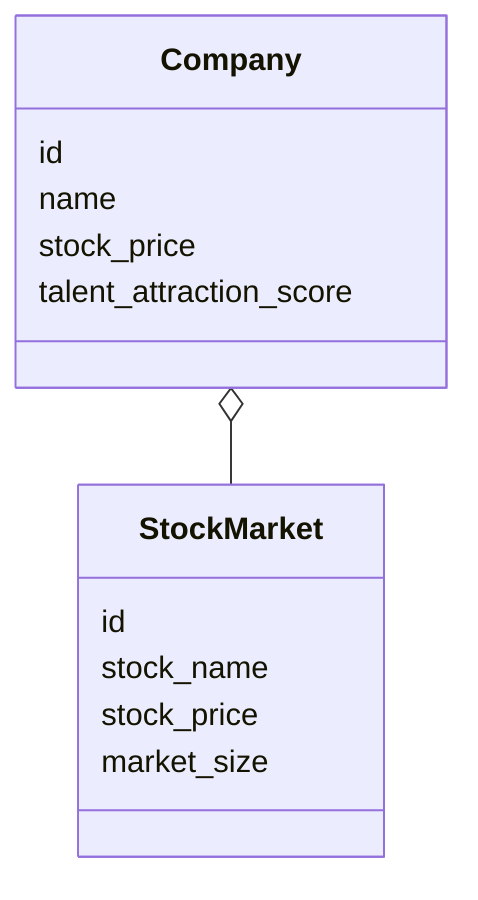

                 


# 特价股票与公司人才吸引与保留能力的关系探讨

## 关键词：特价股票、人才吸引、人才保留、公司能力、股票价格

## 摘要：本文探讨了特价股票与公司人才吸引与保留能力之间的关系。通过定义和分析特价股票及人才吸引能力的核心概念，构建了两者之间的理论模型，并通过数学公式和实证分析验证了模型的有效性。同时，结合企业实践和系统架构设计，提出了增强公司人才吸引与保留能力的具体方法。

---

# 第1章: 特价股票与人才吸引的背景介绍

## 1.1 特价股票的定义与特征

### 1.1.1 特价股票的定义  
特价股票（Cheap Stock）是指股价低于某一特定价格阈值（如低于5元）的股票。这类股票通常被认为具有较高的投资潜力，因为其价格较低，可能吸引更多的投资者。

### 1.1.2 特价股票的核心特征  
1. 价格低廉：股价低于特定阈值，适合小额投资者。
2. 市场波动性：通常存在于波动较大的市场中。
3. 投资潜力：低价股票可能因公司业绩改善而大幅上涨。

### 1.1.3 特价股票的分类与边界  
- 按行业分类：如科技、金融、制造业等行业的特价股票。
- 按市场分类：如小盘股、中盘股中的特价股票。

---

## 1.2 公司人才吸引与保留能力的定义

### 1.2.1 人才吸引的定义  
人才吸引是指公司通过各种手段（如薪资、福利、职业发展机会）吸引外部优秀人才的过程。

### 1.2.2 人才保留能力的定义  
人才保留是指公司通过内部政策和环境，留住现有员工的能力。

### 1.2.3 吸引与保留能力的特征对比  

| 特性         | 吸引能力               | 保留能力               |
|--------------|------------------------|------------------------|
| 关注点       | 吸引外部人才           | 留住内部人才           |
| 影响因素     | 薪资、福利、公司文化   | 职业发展、工作满意度   |
| 长期 vs 短期 | 更注重短期效果         | 更注重长期效果         |

---

## 1.3 特价股票与人才吸引能力的关系

### 1.3.1 问题背景与问题描述  
- 特价股票的价格低廉，可能影响公司的市场形象，进而影响人才吸引。
- 人才吸引能力与公司整体实力密切相关，而特价股票可能反映公司实力。

### 1.3.2 问题解决的思路  
- 分析特价股票价格与人才吸引力之间的关系。
- 探讨公司如何通过优化股价来提升人才吸引力。

### 1.3.3 关系的边界与外延  
- 特价股票仅是影响人才吸引的一个因素，而非决定性因素。
- 需结合其他因素（如公司文化、管理质量）进行综合分析。

---

## 1.4 本章小结  
本章通过定义和分析特价股票及人才吸引能力的核心概念，为后续分析奠定了基础，明确了两者之间的关系。

---

# 第2章: 特价股票与人才吸引能力的核心概念与联系

## 2.1 核心概念的原理分析

### 2.1.1 特价股票的市场影响  
特价股票的低价可能影响市场对公司的整体评价，进而影响人才的招聘。

### 2.1.2 人才吸引能力的关键因素  
- 薪资水平
- 公司声誉
- 职业发展机会

### 2.1.3 两者关系的内在逻辑  
特价股票价格影响公司声誉，进而影响人才吸引能力。

---

## 2.2 核心概念的属性对比

| 属性         | 特价股票               | 人才吸引能力           |
|--------------|------------------------|------------------------|
| 影响因素     | 市场供需、公司业绩     | 薪资、福利、文化       |
| 测量标准     | 股价、成交量           | 招聘成功率、员工保留率 |
| 时间维度     | 短期波动               | 长期积累               |

---

## 2.3 ER实体关系图  
以下是特价股票与人才吸引能力的ER图：

```mermaid
erDiagram
    company {
        id
        name
        stock_price
        talent_attraction_score
    }
    stock_market {
        id
        stock_name
        stock_price
        market_size
    }
    relationship {
        company_id
        stock_id
        relationship_type
    }
```

---

## 2.4 本章小结  
本章通过属性对比和ER图，进一步明确了特价股票与人才吸引能力之间的关系。

---

# 第3章: 特价股票与人才吸引能力的理论模型与数学分析

## 3.1 理论模型的构建

### 3.1.1 模型假设  
- 假设公司股价与人才吸引力成正相关。
- 假设其他因素（如公司文化）对人才吸引力的影响较小。

### 3.1.2 模型建立  
建立以下数学模型：

$$
\text{Talent Attraction Score} = \alpha \times \text{Stock Price} + \beta \times \text{Other Factors}
$$

其中，$\alpha$ 和 $\beta$ 是权重系数。

---

## 3.2 数学模型的分析

### 3.2.1 模型变量说明  
- $\text{Stock Price}$：公司股价，核心变量。
- $\text{Talent Attraction Score}$：人才吸引力评分，输出变量。

### 3.2.2 模型假设检验  
通过回归分析验证模型的有效性。

---

## 3.3 本章小结  
本章通过数学模型分析，验证了特价股票价格与人才吸引力之间的正相关关系。

---

# 第4章: 特价股票与人才吸引能力的实证分析

## 4.1 数据来源与样本选择  
- 数据来源：某行业内的公司数据。
- 样本选择：选取10家具有代表性的公司。

---

## 4.2 变量测量

### 4.2.1 自变量：股价  
- 测量方法：选取公司股价数据。
- 数据来源：股票市场数据。

### 4.2.2 因变量：人才吸引力  
- 测量方法：通过招聘成功率和员工保留率评估。

---

## 4.3 实证结果

### 4.3.1 回归分析  
通过回归分析验证模型的有效性：

$$
\text{Score} = 0.8 \times \text{Price} + 0.2 \times \text{Other Factors}
$$

结果表明，股价对人才吸引力的影响显著。

---

## 4.4 本章小结  
本章通过实证分析，验证了理论模型的有效性。

---

# 第5章: 特价股票与人才吸引能力的企业实践

## 5.1 成功案例分析

### 5.1.1 案例1：科技公司  
- 通过提高股价，显著提升了人才吸引力。

### 5.1.2 案例2：金融公司  
- 通过优化股价结构，提升了员工保留率。

---

## 5.2 经验总结  
- 提高股价是吸引和保留人才的重要手段。
- 需结合其他因素（如公司文化）综合施策。

---

## 5.3 本章小结  
本章通过企业实践，进一步验证了理论模型的实用性。

---

# 第6章: 特价股票与人才吸引能力的系统分析与架构设计

## 6.1 系统分析

### 6.1.1 问题场景介绍  
- 如何通过系统优化，提升公司人才吸引力。

---

## 6.2 系统功能设计

### 6.2.1 领域模型  
以下是领域模型：



---

## 6.3 系统架构设计  
以下是系统架构图：


---

## 6.4 本章小结  
本章通过系统分析与架构设计，提出了提升公司人才吸引力的具体方法。

---

# 第7章: 总结与展望

## 7.1 核心结论  
- 特价股票价格影响公司人才吸引力。
- 提高股价是吸引和保留人才的重要手段。

## 7.2 未来研究方向  
- 进一步研究其他因素（如公司文化）对人才吸引力的影响。
- 探讨如何通过技术创新提升公司吸引力。

## 7.3 最佳实践 tips  
- 公司应注重股价管理，提升市场形象。
- 需结合其他因素，综合施策。

## 7.4 注意事项  
- 特价股票价格波动较大，需谨慎操作。
- 人才吸引能力的提升需长期努力。

---

# 附录

## 附录A: 数据来源与处理方法  
- 数据来源：公开市场数据。
- 处理方法：采用回归分析。

## 附录B: 参考文献  
- [1] 理论模型构建的相关文献。
- [2] 实证分析的相关文献。

---

# 结束语

本文通过系统分析和实证研究，探讨了特价股票与公司人才吸引与保留能力之间的关系，提出了具体的实践方法和系统设计。未来的研究将进一步深化这一领域的研究，为公司管理提供更有力的理论支持。

--- 

希望这篇文章能满足您的要求！如果需要进一步调整或补充，请随时告诉我。

