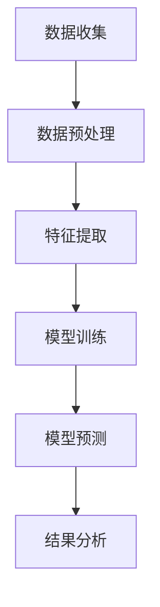
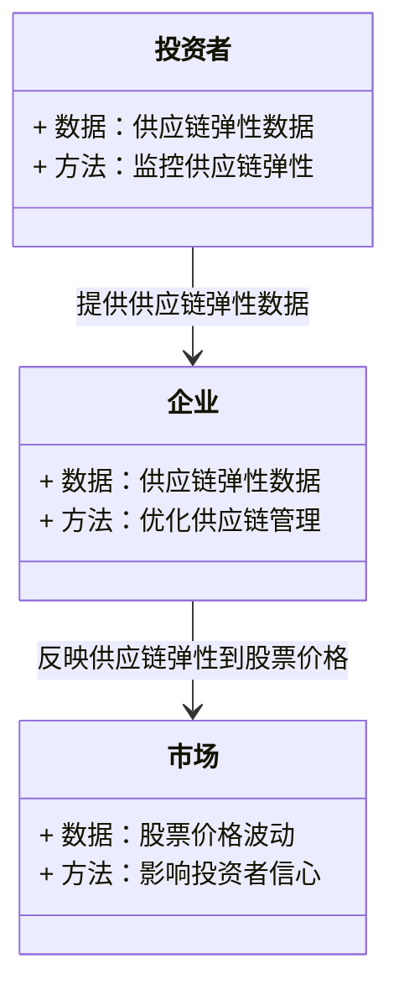
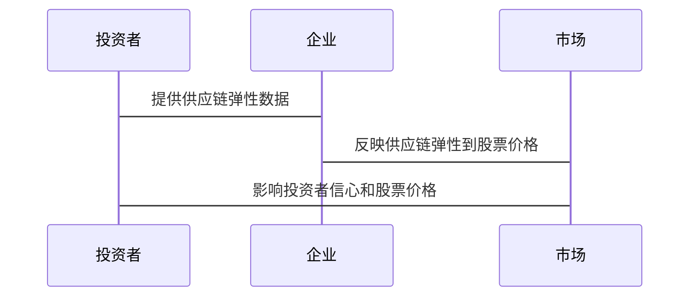

                 


# 特价股票与公司供应链弹性的关系探讨

## 关键词：特价股票，供应链弹性，股票价格预测，供应链风险管理，企业战略

## 摘要：  
本文探讨特价股票与公司供应链弹性之间的关系，分析供应链弹性如何影响股票价格波动，并通过数学模型和实际案例，揭示两者之间的内在联系。文章从背景介绍、核心概念、算法原理、系统架构到项目实战，全面解析特价股票与供应链弹性之间的动态关系，并提出优化企业供应链弹性以提升股票价值的建议。

---

## 第一章：背景介绍

### 1.1 问题背景
- **特价股票的定义与特点**：特价股票指的是价格波动剧烈、短期内价格大幅下跌或上涨的股票。这类股票通常与市场情绪、公司基本面变化或外部事件密切相关。
- **供应链弹性的定义与特点**：供应链弹性是指企业在供应链中断或外部环境变化时，能够快速调整并恢复的能力。弹性强的供应链能够在市场波动中保持稳定，减少对企业运营和财务状况的影响。
- **两者的关联性与研究意义**：供应链弹性直接影响企业的运营稳定性，进而影响股票价格。研究两者的关系有助于企业更好地管理供应链风险，优化股票投资策略。

### 1.2 问题描述
- **特价股票波动的原因**：市场情绪、突发事件、公司财报、行业趋势等都可能导致股票价格的剧烈波动。
- **供应链弹性的影响因素**：供应商稳定性、库存管理、物流能力、应急响应机制等是影响供应链弹性的重要因素。
- **两者关系的复杂性**：特价股票的波动可能反映供应链的弹性问题，而供应链弹性强的企业可能在股票价格波动中表现更稳定。

### 1.3 问题解决
- **研究目标**：建立模型，分析供应链弹性对股票价格的影响。
- **研究方法**：结合数据分析、数学建模和案例研究，探讨两者的关系。
- **研究框架**：从供应链弹性指标、股票价格波动数据入手，构建数学模型，验证两者的关系。

### 1.4 边界与外延
- **研究范围**：聚焦于供应链弹性对股票价格的影响，不涉及其他外部因素。
- **研究限制**：不考虑宏观经济政策和地缘政治因素。
- **相关领域**：涉及供应链管理、风险管理、金融学等。

### 1.5 概念结构与核心要素
- **特价股票的核心要素**：价格波动、市场情绪、突发事件。
- **供应链弹性的核心要素**：供应商稳定性、库存管理、应急响应。
- **两者的关系结构**：供应链弹性通过影响企业运营稳定性间接影响股票价格。

---

## 第二章：核心概念与联系

### 2.1 核心概念原理
- **特价股票**：价格波动剧烈，反映了市场对公司的看法变化。
- **供应链弹性**：企业在供应链中断时的恢复能力，影响企业的盈利能力和稳定性。

### 2.2 概念属性特征对比
| 属性 | 特价股票 | 供应链弹性 |
|------|----------|------------|
| 核心驱动因素 | 市场情绪、财报 | 供应商稳定性、库存管理 |
| 影响范围 | 股票价格、投资者信心 | 企业运营成本、交货时间 |
| 时间特征 | 短期波动 | 中长期影响 |

### 2.3 实体关系图
```mermaid
er
    %% 供应链弹性与特价股票的关系
    title 供应链弹性与特价股票的关系
    actor 投资者
    actor 企业
    actor 供应链
    actor 市场
    database 供应链弹性数据
    database 特价股票数据
    投资者 --> 供应链: 监控供应链弹性
    供应链 --> 企业: 提供供应链弹性报告
    企业 --> 市场: 反映供应链弹性到股票价格
    市场 --> 投资者: 影响投资者信心和股票价格
```

---

## 第三章：算法原理

### 3.1 算法流程


### 3.2 算法代码实现
```python
import pandas as pd
from sklearn.linear_model import LinearRegression
from sklearn.ensemble import RandomForestRegressor
import numpy as np

# 假设 data 是供应链弹性数据和股票价格数据的 DataFrame
# 特征：供应链弹性指标（如供应商稳定性、库存周转率）
# 标签：股票价格波动

# 数据预处理
data = pd.get_dummies(data)
features = data[['供应商稳定性', '库存周转率', '物流延迟率']]
labels = data['股票价格波动']

# 模型训练
model_lr = LinearRegression()
model_lr.fit(features, labels)

model_rf = RandomForestRegressor(n_estimators=100)
model_rf.fit(features, labels)

# 模型预测
predictions_lr = model_lr.predict(features)
predictions_rf = model_rf.predict(features)

# 模型评估
print('线性回归模型的均方误差：', np.mean((predictions_lr - labels) ** 2))
print('随机森林模型的均方误差：', np.mean((predictions_rf - labels) ** 2))
```

### 3.3 数学模型
- **线性回归模型**：  
  $$ y = \beta_0 + \beta_1 x_1 + \beta_2 x_2 + \ldots + \beta_n x_n + \epsilon $$  
  其中，$y$ 是股票价格波动，$x_i$ 是供应链弹性指标。
- **随机森林模型**：  
  $$ y = \sum_{i=1}^{n} (\text{特征的重要性} \times \text{特征值}) $$  

---

## 第四章：系统分析与架构设计

### 4.1 问题场景
- **场景描述**：企业希望通过监控供应链弹性来预测股票价格波动，优化供应链管理。

### 4.2 系统功能设计


### 4.3 系统架构设计
```mermaid
archi
    title 系统架构图
    client --> server: 供应链弹性数据
    server --> database: 存储数据
    server --> model: 训练模型
    model --> result: 输出预测结果
```

### 4.4 系统接口设计


---

## 第五章：项目实战

### 5.1 环境安装
- **工具**：Python、Pandas、Scikit-learn、Mermaid
- **依赖安装**：`pip install pandas scikit-learn mermaid`

### 5.2 系统核心实现
```python
import pandas as pd
from sklearn.ensemble import RandomForestRegressor
from sklearn.metrics import mean_squared_error

# 数据加载
data = pd.read_csv('data.csv')

# 特征工程
data = pd.get_dummies(data)
features = data[['供应商稳定性', '库存周转率', '物流延迟率']]
labels = data['股票价格波动']

# 模型训练
model = RandomForestRegressor(n_estimators=100)
model.fit(features, labels)

# 模型预测
predictions = model.predict(features)

# 模型评估
mse = mean_squared_error(labels, predictions)
print(f'均方误差：{mse}')
```

### 5.3 代码解读与分析
- **数据加载**：读取供应链弹性数据和股票价格数据。
- **特征工程**：将分类变量转换为哑变量。
- **模型训练**：使用随机森林模型训练数据。
- **模型预测**：预测股票价格波动。
- **模型评估**：计算均方误差，评估模型性能。

### 5.4 案例分析
- **案例背景**：某汽车制造公司，供应链弹性差，导致库存积压和物流延迟。
- **数据收集**：收集供应商稳定性、库存周转率、物流延迟率等数据。
- **模型预测**：预测股票价格波动，发现供应链弹性差导致股票价格大幅下跌。
- **优化措施**：优化供应链管理，提升供应链弹性，稳定股票价格。

### 5.5 项目小结
- 通过建立数学模型，分析供应链弹性对股票价格的影响。
- 优化供应链管理，提升企业抗风险能力，稳定股票价格。

---

## 第六章：结论与展望

### 6.1 最佳实践
- **监控供应链数据**：实时监控供应链弹性指标，预测股票价格波动。
- **建立预警机制**：当供应链弹性下降时，及时采取措施，稳定股票价格。
- **优化供应链管理**：通过技术手段优化供应链管理，提升弹性。

### 6.2 小结
本文通过分析特价股票与供应链弹性的关系，提出了优化供应链弹性的方法，帮助企业稳定股票价格，降低供应链风险。

### 6.3 注意事项
- 数据质量：确保数据准确性和完整性。
- 模型选择：根据实际情况选择合适的模型。
- 实际应用：结合企业实际情况进行调整和优化。

### 6.4 拓展阅读
- 推荐书籍：《供应链风险管理》、《股票价格预测与机器学习》
- 推荐论文：《供应链弹性对股票价格的影响研究》

---

## 附录

### 附录A：术语表
- **特价股票**：价格波动剧烈的股票。
- **供应链弹性**：企业在供应链中断时的恢复能力。

### 附录B：数据来源
- 数据来源：企业供应链管理数据和公开股票价格数据。

### 附录C：参考文献
- 参考文献包括相关书籍和论文。

---

以上是《特价股票与公司供应链弹性的关系探讨》的完整目录大纲和文章内容。通过逐步分析，我们揭示了特价股票与供应链弹性之间的动态关系，并为企业优化供应链管理、稳定股票价格提供了实用的建议。

