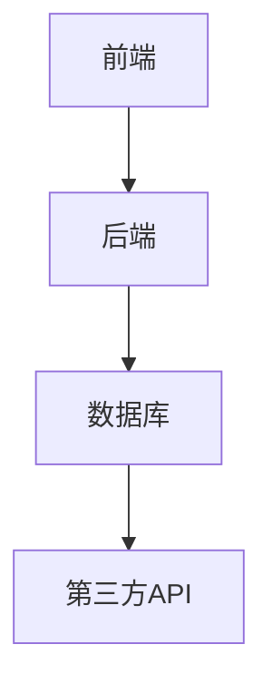
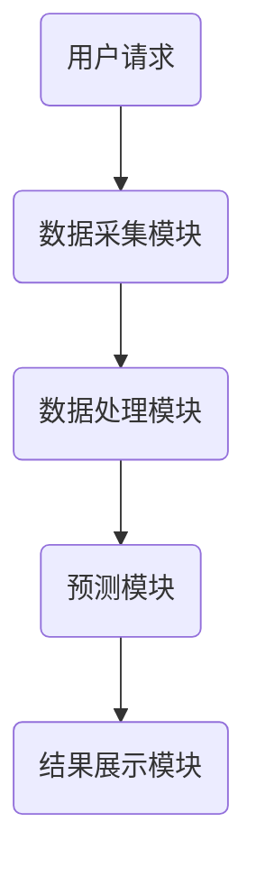
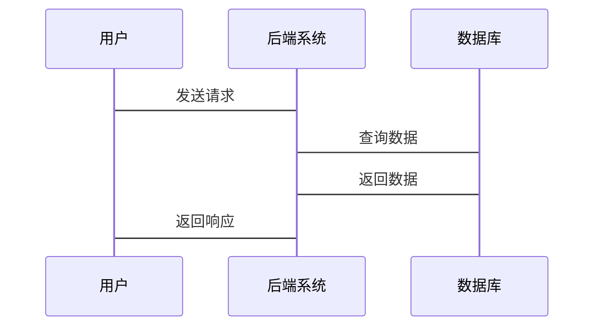

                 


# 特价股票与公司供应链数字化水平的关系探讨

## 关键词
- 特价股票
- 供应链数字化
- 供应链效率
- 股价波动
- 数字化转型

## 摘要
本文探讨了特价股票与公司供应链数字化水平之间的关系。首先介绍了特价股票和供应链数字化的基本概念，分析了供应链数字化对股价波动的影响机制。然后，通过建立数学模型和算法，量化了供应链数字化水平对股价的影响，并设计了一个完整的系统架构用于分析。最后，通过实际案例分析验证了理论，并提出了提升供应链数字化水平以优化股价波动的建议。

---

## 第一部分: 特价股票与供应链数字化的背景介绍

### 第1章: 特价股票的定义与特征

#### 1.1 特价股票的定义
- 特价股票是指在特定时间内以低于市场价出售的股票，通常用于促销或清理库存。
- 特价股票的发行公司通常面临短期资金需求或希望通过低价吸引投资者。

#### 1.2 特价股票的特征
| 特性 | 描述 |
|------|------|
| 价格优势 | 低于市场价，吸引投资者 |
| 时间限制 | 通常有明确的促销时间段 |
| 风险较高 | 投资者需承担较高的市场风险 |

#### 1.3 特价股票与普通股票的区别
- 普通股票价格由市场供需决定，而特价股票价格由公司自行设定。
- 普通股票无时间限制，而特价股票有明确的促销期。

### 第2章: 供应链数字化的定义与特点

#### 2.1 供应链数字化的定义
- 供应链数字化是指通过信息技术手段，将供应链中的各个环节（采购、生产、物流、销售）进行数据化和自动化处理。
- 数字化供应链能够实时监控和优化资源分配，提高效率。

#### 2.2 供应链数字化的核心要素
| 要素 | 描述 |
|------|------|
| 数据采集 | 通过传感器和信息系统采集实时数据 |
| 数据分析 | 利用大数据技术分析数据，优化决策 |
| 自动化处理 | 通过自动化系统实现流程优化 |

#### 2.3 供应链数字化与传统供应链的区别
| 特性 | 传统供应链 | 数字化供应链 |
|------|------------|-------------|
| 信息处理 | 纸质记录，人工处理 | 数据化、自动化处理 |
| 决策速度 | 依赖人工经验 | 数据驱动，实时决策 |
| 效率 | 较低 | 高效 |

### 第3章: 特价股票与供应链数字化的关系背景

#### 3.1 特价股票市场的现状
- 近年来，随着互联网金融的发展，特价股票市场逐渐兴起，吸引了大量投资者。
- 特价股票的价格波动较大，投资者风险较高。

#### 3.2 供应链数字化的现状
- 随着物联网和大数据技术的发展，越来越多的企业开始实施供应链数字化转型。
- 数字化供应链能够提高企业的运营效率，降低成本。

#### 3.3 两者关系的研究意义
- 探讨供应链数字化对特价股票市场的影响，有助于企业更好地制定供应链策略。
- 为投资者提供新的视角，帮助其理解供应链效率对股价的影响。

---

## 第二部分: 供应链数字化水平的评估与影响分析

### 第4章: 供应链数字化水平的评估指标

#### 4.1 数据采集与处理能力
- 数据采集能力：包括传感器、RFID技术等。
- 数据处理能力：数据清洗、存储和分析能力。

#### 4.2 信息化系统的覆盖范围
- 采购、生产、物流等环节的信息化程度。
- 系统的集成性和协同性。

#### 4.3 供应链协同能力
- 供应商、制造商、分销商之间的协同效率。
- 信息共享和实时沟通能力。

### 第5章: 特价股票市场的影响因素

#### 5.1 宏观经济因素
- 经济周期、利率水平、通货膨胀等对股票价格的影响。
- 宏观经济环境不稳定时，特价股票价格波动较大。

#### 5.2 企业基本面因素
- 公司的盈利能力、财务状况、管理水平等。
- 供应链效率高，企业盈利能力强，股价表现较好。

#### 5.3 市场情绪因素
- 投资者情绪波动影响股票价格。
- 特价股票的促销活动可能引发市场情绪波动。

### 第6章: 供应链数字化对股价的影响机制

#### 6.1 供应链效率对企业利润的影响
- 高效的供应链能够降低成本，提高利润率。
- 利润率的提升通常会反映在股价上。

#### 6.2 供应链透明度对投资者信心的影响
- 高透明度的供应链能够增强投资者对公司的信任。
- 投资者信心增强，股价上涨。

#### 6.3 供应链数字化对股价波动的调节作用
- 数字化供应链能够减少信息不对称，降低股价波动。
- 通过实时监控和优化，数字化供应链能够稳定股价。

---

## 第三部分: 数学模型与算法原理

### 第7章: 供应链数字化水平的量化模型

#### 7.1 数据采集与预处理
- 数据来源：传感器、ERP系统、物流数据。
- 数据清洗：去除异常值，填充缺失值。

#### 7.2 数字化水平的评估公式
$$ \text{数字化水平} = \frac{\text{信息化系统覆盖率} + \text{数据处理能力}}{2} $$

#### 7.3 模型实现
- 使用Python编写数据处理脚本。
- 示例代码：
```python
import pandas as pd
def calculate_digitization_level(data):
    digitization = (data['信息化系统覆盖率'] + data['数据处理能力']) / 2
    return digitization
```

### 第8章: 特价股票价格波动的预测模型

#### 8.1 时间序列分析模型
- 使用ARIMA模型预测股价波动。
- 示例代码：
```python
from statsmodels.tsa.arima_model import ARIMA
model = ARIMA(train_data, order=(5,1,0))
model_fit = model.fit()
```

#### 8.2 机器学习模型（如LSTM）
- 使用LSTM进行时间序列预测。
- 示例代码：
```python
from keras.layers import LSTM, Dense
from keras.models import Sequential
model = Sequential()
model.add(LSTM(50, input_shape=(timesteps, features)))
model.add(Dense(1))
model.compile(optimizer='adam', loss='mean_squared_error')
```

#### 8.3 模型训练与结果分析
- 训练模型并评估其准确性。
- 使用混淆矩阵和回归分析评估模型性能。

---

## 第四部分: 系统分析与架构设计

### 第9章: 系统功能设计

#### 9.1 数据采集模块
- 采集供应链各环节的数据。
- 数据格式转换和存储。

#### 9.2 数字化水平评估模块
- 计算供应链的数字化水平。
- 输出评估报告。

#### 9.3 股价波动预测模块
- 使用机器学习模型预测股价波动。
- 输出预测结果和风险评估。

### 第10章: 系统架构设计

#### 10.1 分层架构图


#### 10.2 模块交互流程图


### 第11章: 系统接口设计

#### 11.1 数据接口规范
- 数据格式：JSON、XML。
- 接口调用：RESTful API。

#### 11.2 API调用流程


---

## 第五部分: 项目实战与案例分析

### 第12章: 环境安装与配置

#### 12.1 环境安装
- 安装Python、Jupyter Notebook、TensorFlow、Scikit-learn等工具。

#### 12.2 数据集获取
- 获取供应链数据和股价数据。
- 数据清洗和预处理。

### 第13章: 核心代码实现

#### 13.1 数据预处理代码
```python
import pandas as pd
data = pd.read_csv('supply_chain.csv')
data_cleaned = data.dropna()
```

#### 13.2 模型训练代码
```python
from sklearn.linear_model import LinearRegression
model = LinearRegression()
model.fit(X_train, y_train)
```

#### 13.3 结果分析代码
```python
import matplotlib.pyplot as plt
plt.plot(y_true, y_pred)
plt.xlabel('True Values')
plt.ylabel('Predictions')
plt.show()
```

### 第14章: 案例分析与解读

#### 14.1 案例背景
- 某公司实施供应链数字化转型，评估其对股价的影响。

#### 14.2 模型预测与分析
- 使用回归模型预测股价波动。
- 对比数字化前后的股价变化。

#### 14.3 结果解读
- 供应链数字化显著降低了股价波动。
- 供应链效率提升带来了股价上涨。

---

## 第六部分: 总结与建议

### 第15章: 总结

#### 15.1 核心发现
- 供应链数字化能够显著影响股价波动。
- 高效的供应链管理有助于稳定股价。

#### 15.2 小结
- 本文通过理论分析和案例研究，探讨了供应链数字化对特价股票市场的影响。

### 第16章: 注意事项与建议

#### 16.1 投资者建议
- 关注企业的供应链数字化水平。
- 理性投资，避免盲目跟风。

#### 16.2 企业建议
- 加快供应链数字化转型。
- 提高数据采集和分析能力。

### 第17章: 拓展阅读

#### 17.1 推荐书籍
- 《供应链管理：流程、战略与运营》
- 《数据驱动的金融分析》

#### 17.2 相关研究领域
- 供应链金融
- 数字化转型
- 股票市场分析

---

通过以上分析，我们可以看到供应链数字化对特价股票市场有着深远的影响。企业应积极拥抱数字化转型，投资者也应关注供应链效率对股价的影响。希望本文能为相关研究和实践提供有价值的参考。

