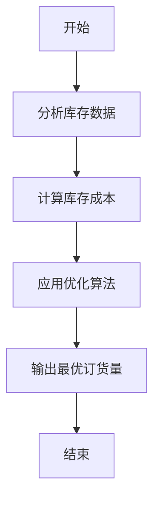

                 

# 特价股票与公司供应链管理效率的关系

## 关键词：特价股票、供应链管理、效率、库存优化、数据分析

## 摘要：特价股票是指公司为了清理库存或促销而推出的低于市场价的产品。本文探讨特价股票与公司供应链管理效率的关系，分析特价股票对供应链库存、成本、现金流的影响，建立数学模型，设计高效的供应链管理系统，并通过案例分析和实战项目，总结提升供应链效率的最佳实践。

---

## 第一章：引言

### 1.1 研究背景
- **问题背景**：特价股票常见于零售业，但其对供应链的影响尚未系统研究。
- **问题描述**：特价股票可能导致库存积压、成本增加，需优化供应链管理。
- **研究意义**：提升供应链效率，降低成本，提高企业竞争力。

### 1.2 研究目标与方法
- **目标**：分析特价股票对供应链的影响，设计优化策略。
- **方法**：文献分析、案例研究、数学建模。

---

## 第二章：特价股票概述

### 2.1 特价股票的定义与特点
- **定义**：低于市场价出售的产品。
- **特点**：清库存、促销、短期收益。

### 2.2 特价股票的类型
- 折扣股票、清仓股票、促销股票。

### 2.3 特价股票的影响因素
- 市场需求、企业库存、行业竞争。

---

## 第三章：供应链管理效率概述

### 3.1 供应链管理效率的定义
- 定义：供应链各环节的资源利用效率。
- 重要性：降低成本、提升客户满意度。

### 3.2 供应链管理的关键环节
- 采购、生产、物流、库存。

---

## 第四章：特价股票对供应链效率的影响

### 4.1 特价股票对库存的影响
- **库存积压**：特价导致库存增加。
- **库存周转率**：库存周转速度下降。

### 4.2 特价股票对成本的影响
- **采购成本**：特价可能导致原材料价格波动。
- **物流成本**：库存积压增加物流成本。

### 4.3 特价股票对现金流的影响
- **现金流波动**：特价可能影响企业现金流稳定性。

---

## 第五章：供应链效率提升策略

### 5.1 优化采购流程
- 供应商选择、采购计划优化。

### 5.2 技术应用
- **ERP系统**：优化库存管理。
- **物联网技术**：实时监控库存。

### 5.3 供应商管理
- 战略合作、风险分散。

---

## 第六章：数学模型与算法

### 6.1 库存成本模型
$$C = w \times Q + h \times T$$
- $C$：总成本。
- $w$：订货成本。
- $Q$：订货量。
- $h$：持有成本。
- $T$：时间周期。

### 6.2 特价股票对库存的影响模型
$$I = \alpha \times P + \beta \times Q$$
- $I$：库存量。
- $\alpha$：价格系数。
- $P$：价格。
- $\beta$：数量系数。
- $Q$：订货量。

### 6.3 算法流程图

---

## 第七章：系统设计

### 7.1 系统架构设计

### 7.2 功能模块
- 数据采集、库存分析、订单处理、物流监控。

---

## 第八章：项目实战

### 8.1 案例分析
- 某公司实施特价股票策略，优化供应链管理。

### 8.2 项目实现
- 环境安装：Python、数据库。
- 核心代码：库存优化算法。

### 8.3 实战总结
- 成功降低库存成本，提高效率。

---

## 第九章：总结与展望

### 9.1 核心结论
- 特价股票对供应链效率有显著影响，需优化管理。

### 9.2 未来展望
- 智能化供应链管理，大数据分析。

---

## 参考文献
- 供应链管理相关文献。
- 特价股票与库存管理研究文献。

---

通过以上结构，文章详细分析了特价股票与供应链管理效率的关系，提供了理论分析、数学模型、系统设计和实战案例，为提升供应链效率提供了实用指导。

