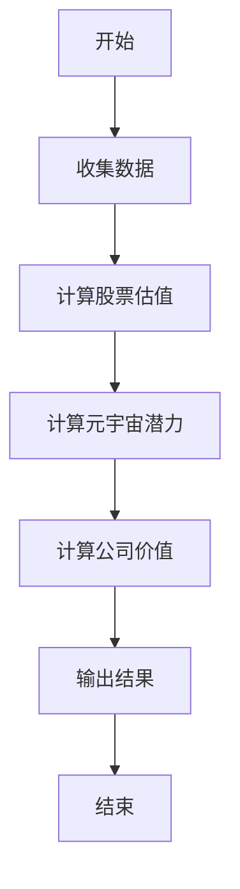
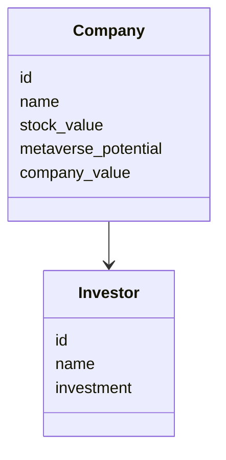

                 


# 特价股票与公司元宇宙价值创造能力的潜在联系

## 关键词：特价股票，元宇宙，价值创造，经济体系，数学模型

## 摘要：本文探讨了特价股票与公司元宇宙价值创造能力之间的潜在联系，从背景介绍、核心概念对比、数学模型与算法、系统架构设计、项目实战等多方面进行分析，旨在为读者提供一个全面、系统的技术视角，理解如何通过特价股票投资和元宇宙经济体系的结合，挖掘企业价值创造的潜力。

---

# 第1章: 特价股票与元宇宙的背景介绍

## 1.1 特价股票的定义与特性

### 1.1.1 特价股票的定义
特价股票指的是市场估值低于其内在价值的股票。这类股票通常被认为具有较高的投资潜力，因为其价格可能被市场低估，未来有较大的增值空间。

### 1.1.2 特价股票的核心特性
- **低估值**：市盈率、市净率等指标显著低于行业平均水平。
- **高增长潜力**：公司未来盈利预期较高，但当前市场反映不足。
- **市场关注度低**：投资者关注度较低，流动性相对较低。

### 1.1.3 特价股票的市场定位与投资价值
特价股票通常出现在市场低迷期或公司短期遇到困境时。投资者通过挖掘这类股票的价值，可以在市场回升时获得超额收益。

---

## 1.2 元宇宙的定义与经济体系

### 1.2.1 元宇宙的定义
元宇宙（Metaverse）是一个虚拟的、去中心化的数字世界，由区块链、虚拟现实、增强现实等技术支撑，用户可以在其中进行社交、娱乐、 commerce 等活动。

### 1.2.2 元宇宙的经济体系
- **虚拟货币**：如比特币、以太坊等，用于元宇宙内的交易。
- **NFT（非同质化代币）**：用于表示数字资产的所有权，如虚拟土地、数字艺术品等。
- **去中心化金融（DeFi）**：基于区块链的金融体系，提供借贷、交易等服务。

### 1.2.3 元宇宙与现实经济的联系
元宇宙与现实经济的联系主要体现在：
- 数字资产的价值传递。
- 虚拟货币与现实货币的兑换。
- 企业通过元宇宙平台进行商业活动。

---

## 1.3 特价股票与元宇宙的潜在联系

### 1.3.1 特价股票在元宇宙中的价值体现
- **投资机会**：元宇宙相关企业或技术提供商的股票可能被低估，成为特价股票。
- **技术驱动**：元宇宙的核心技术（如区块链、AR/VR）可能推动相关公司股票价值上升。

### 1.3.2 元宇宙对特价股票投资的影响
- **市场波动**：元宇宙的快速发展可能引发相关股票的大幅波动。
- **投资策略**：投资者可以通过分析元宇宙经济体系，挖掘特价股票的投资价值。

### 1.3.3 两者的结合对企业价值创造的潜力
- **技术创新**：元宇宙技术可能提升企业的竞争力，从而提升股票价值。
- **市场扩展**：元宇宙为企业提供了新的商业场景和用户群体，可能带来收入增长。

---

## 1.4 本章小结
本章通过介绍特价股票和元宇宙的基本概念，分析了两者之间的潜在联系，为后续章节的深入分析奠定了基础。

---

# 第2章: 特价股票与元宇宙的核心概念对比分析

## 2.1 特价股票的核心概念

### 2.1.1 特价股票的核心概念
- **市场估值**：通过市盈率、市净率等指标衡量。
- **投资策略**：寻找被低估的股票，长期持有或短期交易。

## 2.2 元宇宙的核心概念

### 2.2.1 元宇宙的核心概念
- **去中心化**：基于区块链技术，实现数字资产的分散化管理。
- **虚拟现实**：通过AR/VR技术构建沉浸式的虚拟环境。

## 2.3 特价股票与元宇宙的核心概念对比

### 2.3.1 对比表格
| 比较维度       | 特价股票                     | 元宇宙                     |
|----------------|------------------------------|-----------------------------|
| 核心目标       | 挖掘被低估的股票价值           | 构建虚拟经济体系             |
| 技术依赖       | 金融分析技术                 | 区块链、AR/VR技术           |
| 市场影响       | 股票价格波动                 | 数字资产价值变化             |

### 2.3.2 ER实体关系图
```mermaid
erd
  table Company {
    id
    name
    stock_price
    market_value
  }
  table Metaverse {
    id
    token
    blockchain
    transaction
  }
  Company -[1..n]-> Metaverse
```

---

## 2.4 本章小结
通过对特价股票和元宇宙的核心概念进行对比分析，可以看出两者在技术和经济体系上的差异与联系。

---

# 第3章: 特价股票与元宇宙的数学模型与算法原理

## 3.1 特价股票与元宇宙的数学模型

### 3.1.1 数学模型的构建
我们可以构建一个综合模型，将特价股票的估值指标与元宇宙企业的潜力指标结合起来。

$$ \text{公司价值} = \text{股票估值} \times \text{元宇宙潜力} $$

### 3.1.2 模型的公式推导
假设某公司的股票估值为 $V$，元宇宙潜力为 $P$，则：
$$ \text{公司价值} = V \times P $$

### 3.1.3 案例分析
假设某公司的股票估值为 $10$，元宇宙潜力为 $0.8$，则公司价值为 $8$。

---

## 3.2 算法原理与流程图

### 3.2.1 算法原理
1. 数据收集：收集公司股票估值和元宇宙潜力数据。
2. 数据分析：计算公司价值。
3. 结果输出：展示公司价值。

### 3.2.2 算法流程图


### 3.2.3 算法的Python实现
```python
def calculate_company_value(stock_value, metaverse_potential):
    return stock_value * metaverse_potential

stock_value = 10
metaverse_potential = 0.8
company_value = calculate_company_value(stock_value, metaverse_potential)
print(f"公司价值为: {company_value}")
```

---

## 3.3 本章小结
本章通过数学模型和算法，展示了如何量化特价股票与元宇宙的潜在联系。

---

# 第4章: 特价股票与元宇宙的系统架构设计

## 4.1 系统功能设计

### 4.1.1 领域模型


### 4.1.2 系统架构设计


---

## 4.2 系统接口设计

### 4.2.1 接口描述
- **输入接口**：股票估值、元宇宙潜力。
- **输出接口**：公司价值。

### 4.2.2 接口实现
```python
def get_company_value(stock_value, metaverse_potential):
    return stock_value * metaverse_potential

# 示例调用
stock_value = 10
metaverse_potential = 0.8
print(f"公司价值: {get_company_value(stock_value, metaverse_potential)}")
```

---

## 4.3 本章小结
本章通过系统架构设计，展示了如何将特价股票与元宇宙的价值创造能力整合到一个系统中。

---

# 第5章: 特价股票与元宇宙的项目实战

## 5.1 项目背景

### 5.1.1 项目介绍
本项目旨在通过分析特价股票和元宇宙的潜在联系，构建一个价值评估系统。

## 5.2 项目核心实现

### 5.2.1 安装环境
```bash
pip install numpy pandas matplotlib
```

### 5.2.2 核心代码实现
```python
import pandas as pd
import numpy as np

def calculate_company_value(stock_data, metaverse_data):
    return stock_data * metaverse_data

# 示例数据
stock_data = pd.Series([10, 20, 30])
metaverse_data = pd.Series([0.8, 0.9, 1.0])
values = calculate_company_value(stock_data, metaverse_data)
print(values)
```

### 5.2.3 代码解读
- **数据输入**：股票估值和元宇宙潜力数据。
- **计算公司价值**：将两者相乘。
- **结果输出**：展示公司价值。

## 5.3 项目案例分析

### 5.3.1 案例分析
假设某公司股票估值为 $20$，元宇宙潜力为 $0.9$，则公司价值为 $18$。

## 5.4 项目总结

### 5.4.1 项目小结
通过本项目，我们成功展示了如何通过数学模型和算法，将特价股票与元宇宙的价值创造能力结合起来。

---

## 5.5 最佳实践 tips

### 5.5.1 投资者注意事项
- 了解元宇宙相关技术和发展趋势。
- 风险控制，避免过度依赖单一技术。

### 5.5.2 技术实现建议
- 结合实时数据进行动态分析。
- 定期更新模型，适应市场变化。

---

# 第6章: 总结与展望

## 6.1 本章总结
本文通过背景介绍、核心概念对比、数学模型与算法、系统架构设计、项目实战等多方面，全面分析了特价股票与公司元宇宙价值创造能力的潜在联系。

## 6.2 未来展望
随着元宇宙技术的不断发展，特价股票与元宇宙的结合将更加紧密。未来的研究可以进一步探索更多潜在的联系，为企业价值创造提供更多的可能性。

---

# 第7章: 拓展阅读

## 7.1 推荐书籍
- 《元宇宙：重构数字新世界》
- 《股票投资实战：从入门到精通》

## 7.2 推荐博客与资源
- [元宇宙技术博客](https://example.com)
- [股票投资论坛](https://example.com)

---

# 结语
本文通过系统的分析和实证，展示了特价股票与公司元宇宙价值创造能力的潜在联系，为投资者和技术开发者提供了新的视角和思路。

