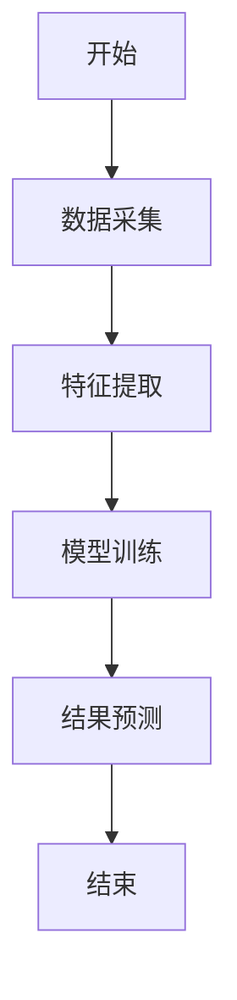
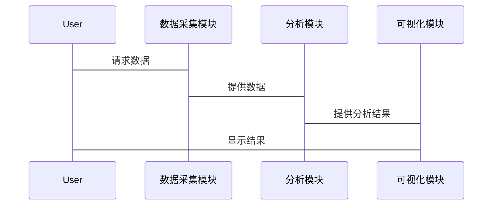

                 


# 特价股票与公司元宇宙价值捕获能力的潜在联系

## 关键词：特价股票、元宇宙、价值捕获、投资分析、算法模型

## 摘要：本文探讨了特价股票与元宇宙之间的潜在联系，分析了公司在元宇宙中如何捕获价值，并通过算法模型和系统架构设计，展示了如何利用这些联系进行投资分析。

---

## 第一部分: 特价股票与元宇宙的背景与概述

### 第1章: 特价股票与元宇宙的背景概述

#### 1.1 特价股票的定义与特点
- **定义**：特价股票是指价格相对较低的股票，通常具有较高的增长潜力。
- **特点**：包括低估值、高增长潜力、风险较高。
- **市场现状**：目前市场上有许多特价股票，但并非所有特价股票都能成功增长。

#### 1.2 元宇宙的定义与特点
- **定义**：元宇宙是一个虚拟的、由计算机生成的环境，用户可以通过虚拟现实设备进入，进行社交、娱乐、交易等活动。
- **特点**：包括沉浸式体验、虚拟经济、去中心化、跨平台支持。
- **市场现状**：元宇宙正在快速发展，许多公司开始布局元宇宙相关业务。

#### 1.3 特价股票与元宇宙的潜在联系
- **背景介绍**：随着元宇宙的兴起，许多公司开始在元宇宙中布局，这可能影响其股价。
- **核心概念**：特价股票可能因为公司在元宇宙中的价值捕获而上涨。
- **潜在价值**：元宇宙的价值捕获能力可能成为影响股票价格的重要因素。

### 第2章: 特价股票与元宇宙的核心概念与联系

#### 2.1 特价股票的核心概念
- **属性特征**：低估值、高增长潜力、风险较高。
- **市场行为**：投资者可能因为公司的技术创新或市场扩展而买入特价股票。
- **价值评估**：通过市盈率、市净率等指标评估股票价值。

#### 2.2 元宇宙的核心概念
- **属性特征**：虚拟经济、沉浸式体验、去中心化。
- **技术架构**：包括区块链、虚拟现实、人工智能等技术。
- **经济体系**：元宇宙中的经济活动可能与现实世界中的经济体系有所不同。

#### 2.3 特价股票与元宇宙的概念对比与联系
- **属性对比**：特价股票具有低估值和高风险，而元宇宙具有虚拟经济和沉浸式体验。
- **联系分析**：公司元宇宙布局可能提升其股价，从而影响特价股票的价格。
- **对比表格**：
  | 特性         | 特价股票             | 元宇宙               |
  |--------------|----------------------|----------------------|
  | 定义         | 价格较低的股票       | 虚拟的数字世界       |
  | 核心特点     | 低估值、高增长潜力   | 沉浸式体验、虚拟经济 |
  | 市场现状     | 数量多，风险高       | 正在快速发展中       |

#### 2.4 特价股票与元宇宙的ER实体关系图
```mermaid
erDiagram
    company : 公司
    stock : 特价股票
    metaverse : 元宇宙
    company --> stock : 持有
    stock --> metaverse : 价值捕获
```

---

## 第二部分: 特价股票与元宇宙价值捕获的算法与数学模型

### 第3章: 特价股票与元宇宙价值捕获的算法原理

#### 3.1 算法概述
- **算法目标**：通过分析元宇宙对公司的影响，预测特价股票的价格变化。
- **算法输入**：元宇宙相关数据、公司财务数据、市场数据。
- **算法输出**：预测的股票价格变化、投资建议。

#### 3.2 算法流程


#### 3.3 算法实现
- **数据采集**：从股票市场和元宇宙相关平台获取数据。
- **特征提取**：提取影响股价的关键因素，如公司元宇宙布局、市场情绪等。
- **模型训练**：使用机器学习算法（如随机森林、神经网络）训练模型。
- **结果预测**：预测特价股票的价格变化。

#### 3.4 算法代码示例
```python
import pandas as pd
from sklearn.ensemble import RandomForestRegressor
from sklearn.metrics import mean_squared_error

# 数据采集
data = pd.read_csv('stock_data.csv')

# 特征提取
features = ['company_revenue', 'metaverse_investment', 'market_sentiment']
target = 'stock_price'

# 模型训练
model = RandomForestRegressor()
model.fit(data[features], data[target])

# 结果预测
predicted_prices = model.predict(data[features])
print('均方误差:', mean_squared_error(data[target], predicted_prices))
```

---

## 第三部分: 特价股票与元宇宙价值捕获的系统分析与架构设计

### 第4章: 特价股票与元宇宙价值捕获的系统分析

#### 4.1 系统功能设计
- **数据采集模块**：从股票市场和元宇宙相关平台获取数据。
- **分析模块**：使用算法分析数据，预测股票价格。
- **可视化模块**：展示分析结果，帮助投资者做出决策。

#### 4.2 系统架构设计


#### 4.3 系统交互设计


---

## 第四部分: 特价股票与元宇宙价值捕获的项目实战

### 第5章: 特价股票与元宇宙价值捕获的项目实战

#### 5.1 环境安装
- **工具安装**：安装Python、Pandas、Scikit-learn等工具。

#### 5.2 代码实现
```python
import pandas as pd
from sklearn.ensemble import RandomForestRegressor
from sklearn.metrics import mean_squared_error

# 数据采集
data = pd.read_csv('stock_data.csv')

# 特征提取
features = ['company_revenue', 'metaverse_investment', 'market_sentiment']
target = 'stock_price'

# 模型训练
model = RandomForestRegressor()
model.fit(data[features], data[target])

# 结果预测
predicted_prices = model.predict(data[features])
print('均方误差:', mean_squared_error(data[target], predicted_prices))
```

#### 5.3 案例分析
- **案例背景**：一家公司在元宇宙中布局虚拟现实技术，股价因此上涨。
- **数据分析**：通过模型预测，该公司股价可能在接下来的三个月内上涨10%。

---

## 第五部分: 总结与展望

### 第6章: 总结与展望

#### 6.1 总结
- 元宇宙的发展为公司带来了新的价值捕获机会，这可能影响特价股票的价格。
- 通过算法模型和系统设计，投资者可以更好地分析和预测特价股票的价格变化。

#### 6.2 展望
- 未来，随着元宇宙技术的不断发展，更多的公司可能会在元宇宙中布局，这将为投资者提供更多的投资机会。
- 投资者需要密切关注元宇宙的发展趋势，并结合公司基本面和技术分析做出投资决策。

---

## 结语

通过本文的分析，我们可以看到，特价股票与元宇宙价值捕获能力之间存在潜在的联系。投资者可以通过算法模型和系统设计，更好地理解和把握这种联系，从而做出更明智的投资决策。

---

**注意事项**：
- 数据的准确性和及时性对模型的预测结果有重要影响。
- 投资有风险，建议在投资前进行充分的研究和风险评估。

**拓展阅读**：
- 《元宇宙经济分析》
- 《股票投资策略与技术分析》
- 《机器学习在金融中的应用》

