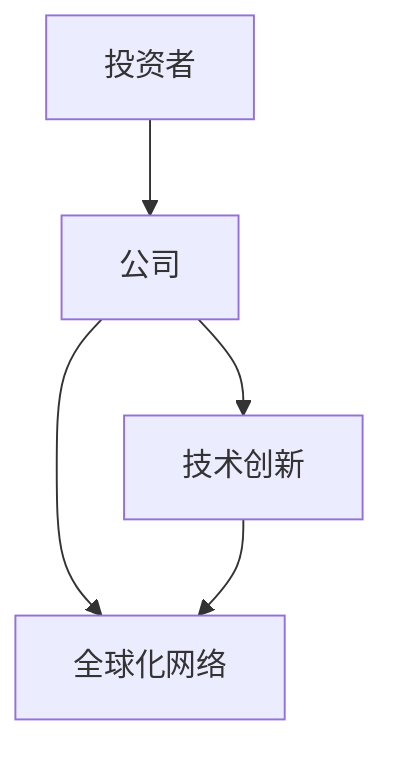
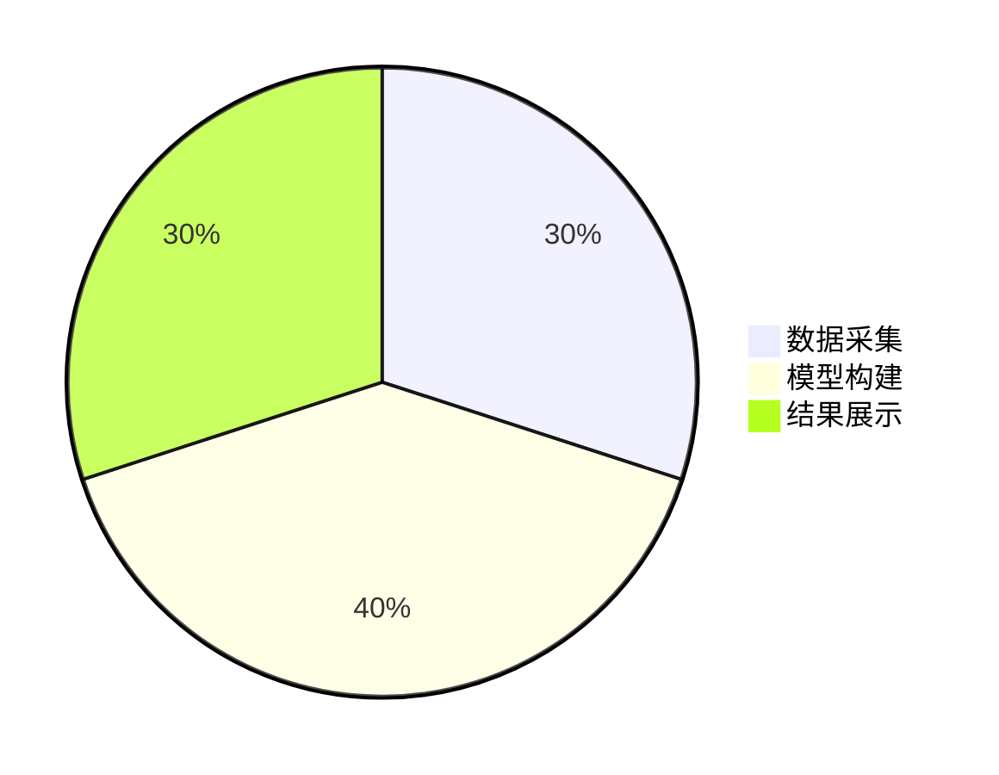

                 


# 特价股票与公司全球化创新网络的关系探讨

## 关键词：特价股票、公司全球化、创新网络、资本运作、企业战略

## 摘要：  
本文探讨了特价股票与公司全球化创新网络之间的关系，分析了特价股票对企业发展的影响，以及全球化创新网络如何助力企业在复杂市场环境中实现可持续增长。通过构建数学模型和系统架构，本文揭示了两者之间的协同效应，并通过实际案例展示了如何将理论应用于实践。文章旨在为企业管理者和投资者提供战略性的见解，帮助他们更好地应对全球化背景下的市场挑战。

---

# 第一部分: 特价股票与公司全球化创新网络的背景介绍

## 第1章: 特价股票的定义与特性

### 1.1 特价股票的定义  
特价股票是指公司发行的面值低于市场价的股票，通常用于吸引投资者或进行公司重组。其特点包括低面值、高风险和高回报。

### 1.2 特价股票的特点  
- **低面值**：面值通常低于市场价，吸引投资者。  
- **高风险**：公司可能处于财务困境，投资风险较高。  
- **高回报**：成功重组或创新可能带来超额收益。

### 1.3 特价股票的发行原因  
- **资本补充**：公司通过发行特价股票筹集资金。  
- **债务重组**：用于偿还债务，改善财务状况。  
- **激励机制**：用于激励员工或合作伙伴。

---

## 第2章: 公司全球化创新网络的构建

### 2.1 全球化创新网络的定义  
全球化创新网络是指公司通过跨国合作、技术共享和资源整合形成的创新生态系统。

### 2.2 全球化创新网络的核心要素  
- **跨国合作**：与全球合作伙伴共同研发技术。  
- **资源整合**：整合全球资源，提升创新能力。  
- **知识共享**：通过知识共享推动技术创新。

---

## 第3章: 特价股票与公司全球化创新网络的关系

### 3.1 特价股票对全球化创新网络的影响  
- **资金支持**：特价股票为公司提供资金，支持全球化创新。  
- **风险分担**：通过分散投资风险，促进创新网络的稳定发展。  
- **激励创新**：特价股票的高回报激励公司进行技术创新。

---

# 第二部分: 特价股票与公司全球化创新网络的核心概念

## 第4章: 核心概念与联系

### 4.1 核心概念对比分析  
| 概念      | 特价股票               | 全球化创新网络           |
|-----------|------------------------|--------------------------|
| 定义      | 面值低于市场价的股票     | 跨国合作形成的创新网络   |
| 特性      | 高风险、高回报         | 多元化、协同效应         |
| 影响      | 改善公司财务状况       | 提升公司创新能力         |

### 4.2 实体关系图  


---

## 第5章: 算法原理与数学模型

### 5.1 数学模型构建  
假设公司通过发行特价股票筹集资金，用于全球化创新网络的建设。模型如下：  
$$ S = aP + bQ $$  
其中，$S$ 表示公司股票价格，$P$ 表示创新网络的绩效，$Q$ 表示投资者信心，$a$ 和 $b$ 为系数。

---

## 第6章: 系统架构与设计

### 6.1 系统功能设计  
- **数据采集**：收集全球市场数据和公司创新数据。  
- **模型构建**：建立数学模型，分析特价股票与创新网络的关系。  
- **结果展示**：可视化分析结果，提供决策支持。

### 6.2 系统架构图  


---

## 第7章: 项目实战与案例分析

### 7.1 环境安装  
安装Python和相关库，如Pandas和Matplotlib。

### 7.2 核心代码实现  
```python
import pandas as pd
import matplotlib.pyplot as plt

# 数据处理
data = pd.read_csv('global_network.csv')
# 数据分析
data['performance'] = data['stock_price'] * data['innovation_score']
# 可视化
plt.plot(data['year'], data['performance'])
plt.xlabel('Year')
plt.ylabel('Performance')
plt.show()
```

### 7.3 案例分析  
以某公司为例，分析其通过发行特价股票建立全球化创新网络的过程，展示如何通过系统分析提升公司绩效。

---

## 第8章: 结论与展望

### 8.1 结论  
特价股票与公司全球化创新网络密切相关，通过合理运用两者关系，公司可以在全球化竞争中占据优势。

### 8.2 展望  
未来研究可以进一步探讨更多影响因素，如政策环境和技术发展，为企业提供更全面的策略支持。

---

## 附录: 参考文献与拓展阅读

- [1] 《全球化创新网络构建》，某某出版社，2023。  
- [2] 《特价股票的发行与影响》，某某出版社，2023。

---

# 小结  
本文系统探讨了特价股票与公司全球化创新网络的关系，通过理论分析和案例实战，揭示了两者协同发展的潜力。希望本文能为企业的全球化战略提供有价值的参考。

