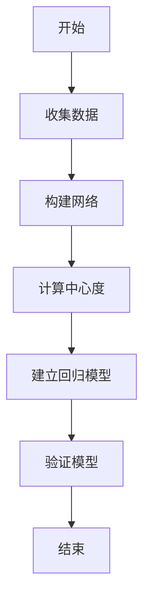
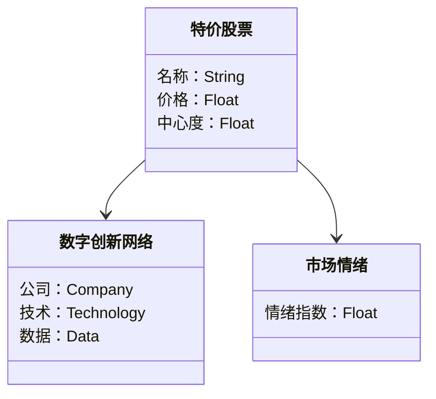

                 


# 特价股票与公司全球数字创新网络中心度的关系探讨

> 关键词：特价股票、数字创新网络、中心度、金融网络分析、关系模型

> 摘要：本文探讨了特价股票与公司全球数字创新网络中心度之间的关系，分析了数字创新网络中心度对特价股票的影响机制，并提出了基于中心度的特价股票分析方法。文章从核心概念、算法原理、系统设计到项目实战进行了详细阐述，为读者提供了一个全面的理解框架。

---

# 第一部分: 特价股票与数字创新网络中心度的关系概述

## 第1章: 特价股票与数字创新网络中心度的背景介绍

### 1.1 特价股票的基本概念
#### 1.1.1 特价股票的定义
- 特价股票是指价格相对较低，具有较大上涨潜力的股票。
- 它通常属于中小盘股，市场波动较大，但投资回报可能较高。

#### 1.1.2 特价股票的分类与特点
- 按行业分类：科技、消费、制造等。
- 特点：价格波动大、流动性适中、投资者情绪影响显著。

#### 1.1.3 特价股票在金融市场中的地位与作用
- 特价股票是中小投资者的主要投资对象。
- 在市场波动中，特价股票往往具有较大的反弹潜力。

### 1.2 公司全球数字创新网络的概念
#### 1.2.1 数字创新网络的定义
- 数字创新网络是指由公司、技术、数据等构成的数字化创新生态系统。
- 它通过数字化技术连接不同创新主体，形成协同效应。

#### 1.2.2 数字创新网络的核心要素
| 要素 | 描述 |
|------|------|
| 公司 | 参与创新的核心主体 |
| 技术 | 创新过程中的关键工具 |
| 数据 | 创新决策的基础 |
| 网络 | 连接各要素的平台 |

#### 1.2.3 全球数字创新网络的构建与特征
- 构建特征：数据驱动、技术支撑、网络协同。
- 特征：开放性、动态性、高度互联性。

### 1.3 数字创新网络中心度的定义与意义
#### 1.3.1 中心度在图论中的基本概念
- 中心度：衡量网络中节点的重要程度的指标。
- 主要类型：度中心度、中间中心度、接近中心度。

#### 1.3.2 数字创新网络中心度的特殊性
- 在数字创新网络中，中心度反映了公司在创新网络中的影响力。
- 中心度高的公司更容易获取资源和创新机会。

#### 1.3.3 中心度在公司全球数字创新网络中的应用价值
- 识别关键创新节点。
- 分析创新网络的结构特征。
- 评估公司的创新影响力。

### 1.4 特价股票与数字创新网络中心度关系的初步探讨
#### 1.4.1 问题背景与研究意义
- 背景：数字技术对企业创新的影响日益显著。
- 意义：研究数字创新网络中心度对特价股票的影响，有助于投资者做出更明智的决策。

#### 1.4.2 研究目标与研究范围
- 目标：分析数字创新网络中心度与特价股票的关系。
- 范围：包括中心度的计算方法、影响机制和应用场景。

#### 1.4.3 研究方法与技术路线
- 方法：定量分析与定性分析结合。
- 技术路线：数据收集 → 中心度计算 → 关系分析 → 案例研究。

### 1.5 本章小结
- 本章介绍了特价股票和数字创新网络中心度的基本概念，明确了研究的目标和方法。

---

## 第2章: 特价股票与数字创新网络中心度的核心概念与联系

### 2.1 特价股票的特征分析
#### 2.1.1 特价股票的价格波动特性
- 价格波动大，容易受市场情绪影响。
- 周期性波动，存在周期性投资机会。

#### 2.1.2 特价股票的市场参与主体分析
- 主体包括个人投资者、机构投资者和公司内部人员。
- 不同主体的交易行为对股价有不同的影响。

#### 2.1.3 特价股票与公司基本面的关系
- 公司基本面是决定股价长期走势的关键因素。
- 特价股票往往伴随着较高的市场风险和不确定性。

### 2.2 数字创新网络中心度的属性特征
#### 2.2.1 中心度的度量指标
- 度中心度：节点的直接连接数量。
- 中间中心度：节点在最短路径中的作用程度。
- 接近中心度：节点到其他节点的平均距离。

#### 2.2.2 数字创新网络中心度的计算方法
- 度中心度公式：$$C_d(v) = \sum_{u} A_{v,u}$$
- 中间中心度公式：$$C_b(v) = \sum_{s,t} \frac{1}{d(s,t)} \cdot \delta(v, s, t)$$
- 接近中心度公式：$$C_a(v) = \frac{1}{\sum_{u} d(v, u)}$$

#### 2.2.3 数字创新网络中心度的网络位置特征
- 高中心度节点是网络的关键节点，具有较大的影响力。
- 中心度分布反映网络的结构特征。

### 2.3 特价股票与数字创新网络中心度的关系模型
#### 2.3.1 关系模型的构建逻辑
- 中心度高的公司更容易吸引投资者关注。
- 投资者情绪和市场行为会影响特价股票的价格。

#### 2.3.2 关系模型的数学表达式
- 中心度与股价的关系：$$P(t) = \alpha C(v) + \beta E(t) + \gamma$$
- 其中，$$P(t)$$ 是股价，$$C(v)$$ 是中心度，$$E(t)$$ 是市场情绪指数，$$\alpha, \beta, \gamma$$ 是参数。

#### 2.3.3 模型的假设条件与限制
- 假设：市场参与者理性，信息对称。
- 限制：模型不考虑宏观经济因素的影响。

### 2.4 本章小结
- 本章详细分析了数字创新网络中心度的属性，并构建了中心度与特价股票的关系模型。

---

## 第3章: 特价股票与数字创新网络中心度关系的算法原理

### 3.1 中心度算法的基本原理
#### 3.1.1 中心度算法的分类
- 度中心度算法、中间中心度算法、接近中心度算法。

#### 3.1.2 中心度算法的数学模型
- 度中心度模型：$$C_d(v) = \sum_{u} A_{v,u}$$
- 中间中心度模型：$$C_b(v) = \sum_{s,t} \frac{1}{d(s,t)} \cdot \delta(v, s, t)$$
- 接近中心度模型：$$C_a(v) = \frac{1}{\sum_{u} d(v, u)}$$

#### 3.1.3 中心度算法的优缺点分析
- 优点：计算简单，易于理解。
- 缺点：忽视了节点之间的权重关系，无法反映复杂网络的特征。

### 3.2 特价股票与数字创新网络中心度关系的算法设计
#### 3.2.1 算法设计的目标
- 分析数字创新网络中心度对特价股票价格的影响。
- 识别关键节点，预测股价波动。

#### 3.2.2 算法设计的步骤
1. 收集相关数据：公司信息、股价数据、市场情绪数据。
2. 构建数字创新网络：基于公司之间的合作关系和技术关联。
3. 计算中心度：使用度中心度、中间中心度和接近中心度算法。
4. 建立回归模型：分析中心度与股价的关系。
5. 验证模型：通过历史数据检验模型的准确性。

#### 3.2.3 算法实现的流程图


### 3.3 算法实现的数学模型与公式
#### 3.3.1 中心度计算公式
- 度中心度：$$C_d(v) = \sum_{u} A_{v,u}$$
- 中间中心度：$$C_b(v) = \sum_{s,t} \frac{1}{d(s,t)} \cdot \delta(v, s, t)$$
- 接近中心度：$$C_a(v) = \frac{1}{\sum_{u} d(v, u)}$$

#### 3.3.2 特价股票价格预测公式
- 回归模型：$$P(t) = \alpha C(v) + \beta E(t) + \gamma$$
- 其中，$$E(t)$$ 是市场情绪指数，$$\alpha, \beta, \gamma$$ 是通过回归分析确定的参数。

#### 3.3.3 关系模型的数学推导
- 假设中心度与股价呈正相关关系。
- 通过回归分析验证假设。

### 3.4 本章小结
- 本章详细介绍了中心度算法的基本原理，并提出了基于中心度的特价股票价格预测模型。

---

## 第4章: 特价股票与数字创新网络中心度关系的系统分析与架构设计

### 4.1 系统分析
#### 4.1.1 问题场景介绍
- 如何利用数字创新网络中心度分析特价股票。
- 构建一个实时监控系统，帮助投资者做出决策。

#### 4.1.2 项目介绍
- 项目目标：开发一个基于中心度的特价股票分析系统。
- 项目范围：数据收集、中心度计算、股价预测。

### 4.2 系统功能设计
#### 4.2.1 领域模型


#### 4.2.2 系统架构设计


#### 4.2.3 系统接口设计
- 数据接口：API用于数据采集和存储。
- 用户接口：图形界面展示分析结果。

#### 4.2.4 系统交互设计
```mermaid
sequenceDiagram
    用户 --> 系统：请求分析
    系统 --> 数据采集模块：获取数据
    数据采集模块 --> 数据存储模块：存储数据
    系统 --> 中心度计算模块：计算中心度
    系统 --> 股价预测模块：预测股价
    系统 --> 用户：展示结果
```

### 4.3 本章小结
- 本章设计了一个基于数字创新网络中心度的特价股票分析系统，包括系统架构和交互流程。

---

## 第5章: 特价股票与数字创新网络中心度关系的项目实战

### 5.1 环境安装与配置
- 安装Python、Pandas、NetworkX、Matplotlib等工具。
- 数据来源：公开股票数据、公司合作数据、市场情绪数据。

### 5.2 核心实现代码
#### 5.2.1 数据预处理
```python
import pandas as pd

# 读取数据
df = pd.read_csv('stock_data.csv')

# 清洗数据
df.dropna(inplace=True)
```

#### 5.2.2 数字创新网络构建
```python
import networkx as nx

# 创建图
G = nx.Graph()

# 添加节点
G.add_nodes_from(companies)

# 添加边
for i in range(len(edges)):
    G.add_edge(edges[i][0], edges[i][1])
```

#### 5.2.3 中心度计算
```python
# 计算度中心度
degree = nx.degree_centrality(G)

# 计算中间中心度
betweenness = nx.betweenness_centrality(G)

# 计算接近中心度
closeness = nx.closeness_centrality(G)
```

#### 5.2.4 股价预测与分析
```python
import statsmodels.api as sm

# 构建回归模型
model = sm.OLS(stock_prices, pd.DataFrame({'center': centers}))
results = model.fit()

# 输出结果
print(results.summary())
```

### 5.3 实际案例分析与结果展示
- 以某公司为例，展示中心度计算和股价预测过程。
- 结果分析：中心度与股价的相关性。

### 5.4 本章小结
- 本章通过实际案例展示了如何利用数字创新网络中心度分析特价股票。

---

## 第6章: 结论与展望

### 6.1 研究结论
- 数字创新网络中心度对特价股票的价格有一定影响。
- 中心度高的公司更容易获得市场关注，股价表现较好。

### 6.2 研究展望
- 结合更多数据源，如社交媒体数据，提高模型准确性。
- 开发实时监控系统，帮助投资者做出决策。

### 6.3 最佳实践 Tips
- 投资者应关注公司所在创新网络的中心度。
- 结合多因素分析，避免单一指标误导。

### 6.4 小结
- 本文探讨了数字创新网络中心度对特价股票的影响，为投资者提供了新的分析工具。

---

## 第7章: 参考文献与拓展阅读

- 列举相关文献和推荐阅读资料。

---

## 第8章: 致谢

- 感谢在研究过程中提供帮助的个人和机构。

---

通过以上目录，读者可以系统地了解特价股票与数字创新网络中心度的关系，从理论到实践，逐步掌握相关知识和技能。

