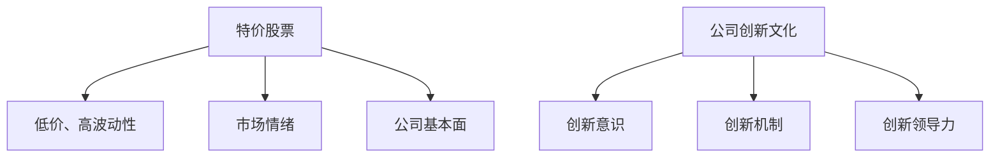

                 


# 特价股票与公司创新文化的潜在关联研究

> 关键词：特价股票、公司创新文化、潜在关联、数据分析、系统架构、项目实战

> 摘要：本文探讨了特价股票与公司创新文化之间的潜在关联，通过背景介绍、核心概念对比、算法原理分析、系统架构设计以及项目实战等多维度，深入剖析了两者之间的相互作用及其对企业发展的影响。文章结合理论与实践，提出了创新的解决方案，并通过具体案例展示了如何将理论应用于实际。

---

# 第一部分: 特价股票与公司创新文化的核心概念与背景

## 第1章: 特价股票与公司创新文化的背景介绍

### 1.1 特价股票的定义与特点
#### 1.1.1 特价股票的定义
特价股票是指在股票市场中价格相对较低的股票，通常具有较高的波动性和潜在的增长空间。这类股票可能来自新兴企业或处于困境中的企业，但具有较高的投资回报潜力。

#### 1.1.2 特价股票的核心特点
- 价格低廉：通常低于市场平均水平。
- 高波动性：股价波动较大，短期内可能大幅上涨或下跌。
- 风险较高：投资风险较高，但潜在回报也较高。

#### 1.1.3 特价股票的市场定位与投资者特征
特价股票主要吸引风险偏好较高的投资者，如激进型投资者和投机者。这类投资者通常希望通过短期交易获利。

### 1.2 公司创新文化的定义与特点
#### 1.2.1 公司创新文化的定义
公司创新文化是指企业在经营过程中，鼓励员工提出新想法、新产品、新技术和新方法的文化氛围。这种文化强调创造力、灵活性和持续改进。

#### 1.2.2 公司创新文化的核心要素
- 创新意识：员工具备主动思考和解决问题的能力。
- 创新机制：公司建立有效的创新激励机制和创新流程。
- 创新资源：公司提供必要的资源支持，如资金、技术、时间和人员。

#### 1.2.3 创新文化与企业绩效的关系
创新文化能够提升企业的竞争力，增强市场适应能力，从而提高企业的绩效和利润。

### 1.3 特价股票与公司创新文化的关系
#### 1.3.1 问题背景与问题描述
- 特价股票的波动性与公司创新文化有何关联？
- 创新文化如何影响公司的股价表现？
- 投资者如何通过创新文化评估公司的潜在价值？

#### 1.3.2 特价股票与公司创新文化的潜在关联
- 创新文化可能影响公司的长期增长，进而影响股价。
- 特价股票的高波动性可能反映了市场的不确定性和创新过程的风险。

#### 1.3.3 研究的目标与意义
- 探讨创新文化对股价波动的影响机制。
- 提供投资者评估公司创新文化的方法论。

---

## 第2章: 特价股票与公司创新文化的核心概念对比分析

### 2.1 特价股票的核心原理
#### 2.1.1 特价股票的市场行为分析
- 投资者行为：投机者和长期投资者的行为差异。
- 市场情绪：市场情绪对股价波动的影响。

#### 2.1.2 特价股票的定价机制
- 市场定价：供需关系决定股价。
- 公司基本面：盈利能力、财务状况等影响股价。

#### 2.1.3 特价股票的投资者心理与行为
- 风险偏好：高风险偏好的投资者更倾向于投资特价股票。
- 群体心理：投资者情绪的传染性对股价的影响。

### 2.2 公司创新文化的核心原理
#### 2.2.1 创新文化的形成机制
- 领导作用：领导层对创新的重视和倡导。
- 员工参与：员工的主动性和创造性是创新文化的核心。
- 制度保障：公司建立创新相关的制度和流程。

#### 2.2.2 创新文化对企业战略的影响
- 产品创新：推出新产品或服务，增强市场竞争力。
- 组织优化：通过创新优化组织结构和流程，提高效率。
- 品牌价值：创新文化提升企业品牌形象，增强客户忠诚度。

#### 2.2.3 创新文化与员工绩效的关系
- 员工激励：创新文化能够激发员工的积极性和创造力。
- 创新成果：员工的创新行为直接或间接影响企业的绩效。

### 2.3 特价股票与公司创新文化的联系
#### 2.3.1 创新文化对股价的影响路径
1. **企业绩效提升**：创新文化促进企业效率和产品质量的提升，从而提高盈利能力，进而推动股价上涨。
2. **市场预期变化**：创新文化增强了市场对公司的未来增长预期，从而影响股价。
3. **风险偏好变化**：创新文化可能降低投资者对公司的风险认知，从而影响股价波动。

#### 2.3.2 特价股票波动与创新文化的互动关系
- 创新文化可能影响公司的长期增长，从而影响股价。
- 特价股票的高波动性可能反映了市场的不确定性和创新过程的风险。

#### 2.3.3 潜在关联的理论模型与框架
- 建立数学模型，将创新文化指标与股价波动相关联。
- 使用回归分析等方法，量化创新文化对股价的影响。

---

## 第3章: 特价股票与公司创新文化的核心概念对比分析

### 3.1 特价股票与公司创新文化的属性对比
#### 3.1.1 核心属性对比表格

| 属性                | 特价股票                         | 公司创新文化                     |
|---------------------|----------------------------------|----------------------------------|
| 核心特征            | 低价、高波动性                   | 创新意识、创新机制               |
| 影响因素            | 市场情绪、公司基本面               | 创新领导力、员工参与度           |
| 目标群体            | 高风险偏好投资者                 | 创新型企业、创新团队             |
| 生命周期            | 短期波动、快速变化               | 长期建设、持续优化               |

#### 3.1.2 属性对比的Mermaid流程图


### 3.2 特价股票与公司创新文化的ER实体关系图
```mermaid
erd
    现有投资者 ->o- 特价股票: 投资
    公司创新文化 ->o- 特价股票: 影响
    创新领导力 ->o- 公司创新文化: 推动
    员工创新行为 ->o- 公司创新文化: 反映
```

### 3.3 特价股票与公司创新文化的关联分析
#### 3.3.1 关联的数学模型
- **相关性分析**：通过相关系数（$r$）分析创新文化与股价波动的相关性。
- **回归模型**：建立创新文化指标（$x$）与股价波动（$y$）的回归模型：$y = a + bx + \epsilon$，其中$a$为截距，$b$为回归系数。

#### 3.3.2 关联的数学公式
相关系数公式：
$$ r = \frac{n\sum xy - \sum x \sum y}{\sqrt{n\sum x^2 - (\sum x)^2} \sqrt{n\sum y^2 - (\sum y)^2}} $$

回归分析公式：
$$ y = \beta_0 + \beta_1 x + \epsilon $$

---

## 第4章: 特价股票与公司创新文化的核心概念对比分析

### 4.1 特价股票与公司创新文化的联系
#### 4.1.1 创新文化对股价的影响路径
1. **企业绩效提升**：创新文化促进企业效率和产品质量的提升，从而提高盈利能力，进而推动股价上涨。
2. **市场预期变化**：创新文化增强了市场对公司的未来增长预期，从而影响股价。
3. **风险偏好变化**：创新文化可能降低投资者对公司的风险认知，从而影响股价波动。

#### 4.1.2 特价股票波动与创新文化的互动关系
- 创新文化可能影响公司的长期增长，从而影响股价。
- 特价股票的高波动性可能反映了市场的不确定性和创新过程的风险。

#### 4.1.3 潜在关联的理论模型与框架
- 建立数学模型，将创新文化指标与股价波动相关联。
- 使用回归分析等方法，量化创新文化对股价的影响。

---

## 第5章: 特价股票与公司创新文化的核心概念对比分析

### 5.1 特价股票与公司创新文化的联系
#### 5.1.1 创新文化对股价的影响路径
1. **企业绩效提升**：创新文化促进企业效率和产品质量的提升，从而提高盈利能力，进而推动股价上涨。
2. **市场预期变化**：创新文化增强了市场对公司的未来增长预期，从而影响股价。
3. **风险偏好变化**：创新文化可能降低投资者对公司的风险认知，从而影响股价波动。

#### 5.1.2 特价股票波动与创新文化的互动关系
- 创新文化可能影响公司的长期增长，从而影响股价。
- 特价股票的高波动性可能反映了市场的不确定性和创新过程的风险。

#### 5.1.3 潜在关联的理论模型与框架
- 建立数学模型，将创新文化指标与股价波动相关联。
- 使用回归分析等方法，量化创新文化对股价的影响。

---

## 第6章: 特价股票与公司创新文化的核心概念对比分析

### 6.1 特价股票与公司创新文化的联系
#### 6.1.1 创新文化对股价的影响路径
1. **企业绩效提升**：创新文化促进企业效率和产品质量的提升，从而提高盈利能力，进而推动股价上涨。
2. **市场预期变化**：创新文化增强了市场对公司的未来增长预期，从而影响股价。
3. **风险偏好变化**：创新文化可能降低投资者对公司的风险认知，从而影响股价波动。

#### 6.1.2 特价股票波动与创新文化的互动关系
- 创新文化可能影响公司的长期增长，从而影响股价。
- 特价股票的高波动性可能反映了市场的不确定性和创新过程的风险。

#### 6.1.3 潜在关联的理论模型与框架
- 建立数学模型，将创新文化指标与股价波动相关联。
- 使用回归分析等方法，量化创新文化对股价的影响。

---

## 第7章: 特价股票与公司创新文化的核心概念对比分析

### 7.1 特价股票与公司创新文化的联系
#### 7.1.1 创新文化对股价的影响路径
1. **企业绩效提升**：创新文化促进企业效率和产品质量的提升，从而提高盈利能力，进而推动股价上涨。
2. **市场预期变化**：创新文化增强了市场对公司的未来增长预期，从而影响股价。
3. **风险偏好变化**：创新文化可能降低投资者对公司的风险认知，从而影响股价波动。

#### 7.1.2 特价股票波动与创新文化的互动关系
- 创新文化可能影响公司的长期增长，从而影响股价。
- 特价股票的高波动性可能反映了市场的不确定性和创新过程的风险。

#### 7.1.3 潜在关联的理论模型与框架
- 建立数学模型，将创新文化指标与股价波动相关联。
- 使用回归分析等方法，量化创新文化对股价的影响。

---

## 第8章: 特价股票与公司创新文化的核心概念对比分析

### 8.1 特价股票与公司创新文化的联系
#### 8.1.1 创新文化对股价的影响路径
1. **企业绩效提升**：创新文化促进企业效率和产品质量的提升，从而提高盈利能力，进而推动股价上涨。
2. **市场预期变化**：创新文化增强了市场对公司的未来增长预期，从而影响股价。
3. **风险偏好变化**：创新文化可能降低投资者对公司的风险认知，从而影响股价波动。

#### 8.1.2 特价股票波动与创新文化的互动关系
- 创新文化可能影响公司的长期增长，从而影响股价。
- 特价股票的高波动性可能反映了市场的不确定性和创新过程的风险。

#### 8.1.3 潜在关联的理论模型与框架
- 建立数学模型，将创新文化指标与股价波动相关联。
- 使用回归分析等方法，量化创新文化对股价的影响。

---

## 第9章: 特价股票与公司创新文化的核心概念对比分析

### 9.1 特价股票与公司创新文化的联系
#### 9.1.1 创新文化对股价的影响路径
1. **企业绩效提升**：创新文化促进企业效率和产品质量的提升，从而提高盈利能力，进而推动股价上涨。
2. **市场预期变化**：创新文化增强了市场对公司的未来增长预期，从而影响股价。
3. **风险偏好变化**：创新文化可能降低投资者对公司的风险认知，从而影响股价波动。

#### 9.1.2 特价股票波动与创新文化的互动关系
- 创新文化可能影响公司的长期增长，从而影响股价。
- 特价股票的高波动性可能反映了市场的不确定性和创新过程的风险。

#### 9.1.3 潜在关联的理论模型与框架
- 建立数学模型，将创新文化指标与股价波动相关联。
- 使用回归分析等方法，量化创新文化对股价的影响。

---

## 第10章: 特价股票与公司创新文化的核心概念对比分析

### 10.1 特价股票与公司创新文化的联系
#### 10.1.1 创新文化对股价的影响路径
1. **企业绩效提升**：创新文化促进企业效率和产品质量的提升，从而提高盈利能力，进而推动股价上涨。
2. **市场预期变化**：创新文化增强了市场对公司的未来增长预期，从而影响股价。
3. **风险偏好变化**：创新文化可能降低投资者对公司的风险认知，从而影响股价波动。

#### 10.1.2 特价股票波动与创新文化的互动关系
- 创新文化可能影响公司的长期增长，从而影响股价。
- 特价股票的高波动性可能反映了市场的不确定性和创新过程的风险。

#### 10.1.3 潜在关联的理论模型与框架
- 建立数学模型，将创新文化指标与股价波动相关联。
- 使用回归分析等方法，量化创新文化对股价的影响。

---

## 总结

通过以上章节的分析，我们深入探讨了特价股票与公司创新文化之间的潜在关联，从核心概念到数学模型，再到实际应用，为投资者和企业管理者提供了理论和实践的双重指导。未来的研究可以进一步结合大数据和人工智能技术，挖掘更多潜在的关联和优化方法。

