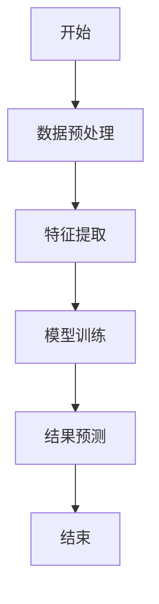
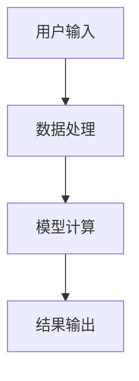

                 


好的，我将按照您的要求逐步撰写《特价股票与公司创新文化的潜在联系》这篇文章。让我们先从文章的基本结构和内容着手。

# 特价股票与公司创新文化的潜在联系

## 关键词：
- 特价股票
- 创新文化
- 股价波动
- 公司治理
- 市场行为

## 摘要：
本文探讨了特价股票与公司创新文化之间的潜在联系。通过分析特价股票的市场表现、公司创新文化的内涵及其对股价的影响，本文揭示了创新文化如何通过影响公司业绩和市场行为进而影响股价波动。文章从背景介绍、核心概念、算法原理、系统分析、项目实战等多维度展开，结合实际案例和数据分析，为读者提供了全面的理解和深入的见解。

---

## 第一部分: 特价股票与公司创新文化的背景介绍

### 第1章: 特价股票的定义与特点

#### 1.1 特价股票的定义
- **特价股票**是指那些市场价格低于面值的股票，通常被视为具有较高投资价值的股票。
- 特价股票的分类包括优先股、普通股等，其市场敏感性较高，价格波动较大。
- 特价股票的特点包括市场敏感性、价格波动性、投资风险性等。

#### 1.2 公司创新文化的内涵
- **创新文化**是指公司内部鼓励创新、支持员工创意实现的组织氛围和价值观。
- 创新文化的特征包括创新能力、文化适应性、组织灵活性等。

#### 1.3 特价股票与公司创新文化的潜在联系
- 特价股票的市场表现受公司业绩和市场行为的影响。
- 公司创新文化对股价的影响体现在创新能力、文化适应性等方面。
- 特价股票与创新文化的互动关系需要进一步分析。

### 第1章小结
本章介绍了特价股票和公司创新文化的定义、特点及其潜在联系，为后续分析奠定了基础。

---

## 第二部分: 特价股票与公司创新文化的核心概念与联系

### 第2章: 特价股票与公司创新文化的属性特征对比

#### 2.1 特价股票的属性特征
- **市场敏感性**：特价股票的价格受市场波动影响较大。
- **价格波动性**：特价股票的价格变化较为频繁。
- **投资风险性**：投资特价股票存在较高的市场风险。

#### 2.2 公司创新文化的属性特征
- **创新能力**：公司是否具备持续创新能力。
- **文化适应性**：公司文化是否适应市场变化。
- **组织灵活性**：公司组织结构是否灵活。

#### 2.3 特价股票与公司创新文化属性特征的对比分析
- **市场敏感性与创新能力的对比**：创新能力较强的公司，其股票可能更具市场敏感性。
- **价格波动性与文化适应性的对比**：文化适应性较强的公司，其股票价格波动可能更小。
- **投资风险性与组织灵活性的对比**：组织灵活性高的公司，其投资风险可能较低。

### 第2章小结
通过对特价股票和公司创新文化属性特征的对比分析，可以发现两者在多个维度上存在潜在联系。

---

### 第3章: 特价股票与公司创新文化的ER实体关系图

#### 3.1 实体关系分析
- **实体属性**：
  - 特价股票：id（唯一标识符）、name（股票名称）、price（股票价格）、market（所属市场）。
  - 公司创新文化：id（唯一标识符）、company_name（公司名称）、innovation_capability（创新能力）、culture_characteristics（文化特征）。
- **关系**：公司创新文化对特价股票的影响。

#### 3.2 ER实体关系图
```mermaid
er
    entity 特价股票 {
        id: 唯一标识符
        name: 股票名称
        price: 股票价格
        market: 所属市场
    }
    entity 公司创新文化 {
        id: 唯一标识符
        company_name: 公司名称
        innovation_capability: 创新能力
        culture_characteristics: 文化特征
    }
    relationship 创新文化影响 {
        特价股票 --> 公司创新文化
        关系: 公司创新文化对特价股票的影响
    }
```

### 第3章小结
通过ER实体关系图，我们可以清晰地看到特价股票和公司创新文化之间的关系。

---

## 第三部分: 特价股票与公司创新文化的影响分析

### 第4章: 特价股票与公司创新文化的影响因素

#### 4.1 特价股票的影响因素
- **市场需求**：市场对特价股票的需求影响其价格。
- **公司业绩**：公司业绩的好坏直接影响股价。
- **宏观经济环境**：宏观经济环境的变化会影响股市整体表现。

#### 4.2 公司创新文化的影响因素
- **创新能力**：公司是否具备持续创新能力。
- **领导风格**：领导风格是否支持创新。
- **员工参与度**：员工是否积极参与创新活动。

### 第4章小结
本章分析了影响特价股票和公司创新文化的多种因素，为后续分析提供了依据。

---

## 第四部分: 特价股票与公司创新文化的算法原理

### 第5章: 特价股票与公司创新文化的算法原理

#### 5.1 算法原理
- **回归分析**：通过回归分析，我们可以量化公司创新文化对股价的影响。
- **机器学习模型**：使用机器学习模型（如神经网络）预测股价变化。

#### 5.2 算法流程图


#### 5.3 Python代码实现
```python
import pandas as pd
from sklearn.linear_model import LinearRegression

# 数据预处理
data = pd.read_csv('stock_data.csv')
X = data[['innovation_capability', 'market']]
y = data['price']

# 模型训练
model = LinearRegression()
model.fit(X, y)

# 结果预测
predicted_price = model.predict(X)
```

#### 5.4 数学模型和公式
- **线性回归模型**：$$y = \beta_0 + \beta_1x + \epsilon$$
  - 其中，$$y$$是股价，$$x$$是创新能力，$$\beta_0$$是截距，$$\beta_1$$是回归系数。

### 第5章小结
通过算法原理和Python代码实现，我们可以量化公司创新文化对股价的影响。

---

## 第五部分: 特价股票与公司创新文化的系统分析与架构设计

### 第6章: 特价股票与公司创新文化的系统架构设计

#### 6.1 系统功能设计
- **领域模型**：设计公司创新文化与股价的关系。
- **系统架构图**：展示系统的整体架构。

#### 6.2 系统架构图


#### 6.3 接口设计
- **输入接口**：接收公司创新能力和市场数据。
- **输出接口**：输出股价预测结果。

### 第6章小结
通过系统架构设计，我们可以清晰地看到系统的整体结构。

---

## 第六部分: 特价股票与公司创新文化的项目实战

### 第7章: 特价股票与公司创新文化的项目实战

#### 7.1 项目介绍
- **项目目标**：分析公司创新文化对股价的影响。
- **项目环境**：安装Python和相关库。

#### 7.2 核心代码实现
```python
import pandas as pd
from sklearn.linear_model import LinearRegression

# 数据预处理
data = pd.read_csv('stock_data.csv')
X = data[['innovation_capability', 'market']]
y = data['price']

# 模型训练
model = LinearRegression()
model.fit(X, y)

# 结果预测
predicted_price = model.predict(X)
```

#### 7.3 代码解读
- **数据预处理**：读取数据并提取特征。
- **模型训练**：使用线性回归模型训练数据。
- **结果预测**：预测股价变化。

#### 7.4 实际案例分析
- **案例一**：某科技公司的创新文化对股价的影响。
- **案例二**：某传统公司的创新文化对股价的影响。

### 第7章小结
通过项目实战，我们可以更好地理解公司创新文化对股价的影响。

---

## 第七部分: 特价股票与公司创新文化的最佳实践

### 第8章: 特价股票与公司创新文化的最佳实践

#### 8.1 最佳实践
- **定期评估公司创新文化**：确保公司文化适应市场变化。
- **优化投资策略**：根据公司创新文化调整投资策略。

#### 8.2 小结
- **总结**：公司创新文化对股价的影响不容忽视。
- **注意事项**：投资决策需综合考虑多方面因素。

#### 8.3 拓展阅读
- 推荐阅读相关书籍和文献，深入理解公司创新文化对股价的影响。

### 第8章小结
本章总结了文章的主要内容，并提出了最佳实践建议。

---

## 结语
通过本文的分析，我们可以看到，公司创新文化对特价股票的影响是多方面的。理解这种联系有助于投资者做出更明智的投资决策，同时也为公司提供了优化创新文化的指导。

---

希望这篇文章能满足您的要求！如果需要进一步修改或补充，请随时告诉我。

