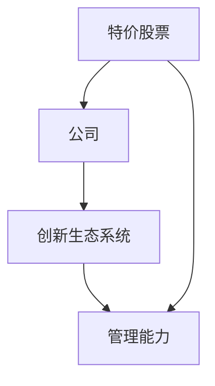
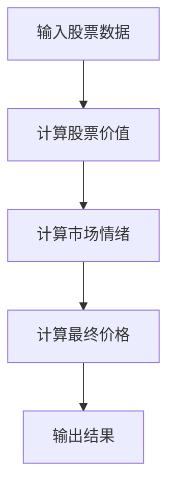
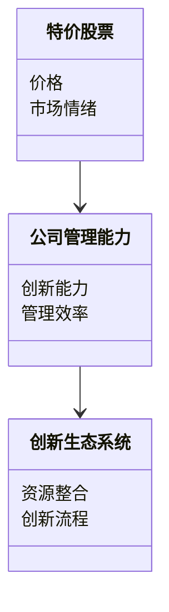
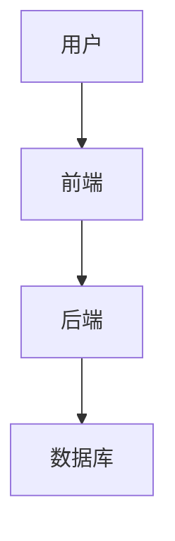

                 


# 特价股票与公司创新生态系统管理能力的关系探讨

---

## 关键词：
特价股票、创新生态系统、公司管理能力、定价模型、协同效应

---

## 摘要：
本文探讨了特价股票与公司创新生态系统管理能力之间的关系，分析了两者的核心概念、影响因素及相互作用机制。通过建立数学模型和算法，本文揭示了如何通过优化公司创新管理能力来提升特价股票的市场表现，并提出了实际的应用策略。

---

# 第1章: 特价股票与公司创新生态系统管理能力的概述

## 1.1 特价股票的定义与特征

### 1.1.1 特价股票的定义
特价股票是指在特定市场条件下，价格低于其内在价值的股票。这类股票通常具有较高的投资潜力，但由于市场波动或其他因素，其价格被暂时低估。

### 1.1.2 特价股票的市场特征
- **价格波动性**：特价股票的价格受市场情绪和宏观经济影响较大。
- **低估值**：其市场价格低于其实际价值。
- **高风险高回报**：投资特价股票的风险较高，但潜在回报也较大。

### 1.1.3 特价股票与普通股票的区别
| 特性 | 特价股票 | 普通股票 |
|------|-----------|-----------|
| 定价 | 低于价值 | 接近价值 | 
| 风险 | 高        | 中等      |
| 回报 | 高        | 中等      |

## 1.2 公司创新生态系统管理能力的定义

### 1.2.1 创新生态系统的核心概念
创新生态系统是指公司内部和外部资源协同工作的系统，包括技术、人才、合作伙伴等。

### 1.2.2 公司管理能力的构成
- **战略规划**：明确创新方向。
- **资源配置**：有效分配资源。
- **文化氛围**：鼓励创新文化。

### 1.2.3 创新生态系统与公司管理能力的关系
创新生态系统是公司管理能力的外在表现，而管理能力是创新生态系统的内在驱动。

## 1.3 特价股票与公司创新生态系统管理能力的关系

### 1.3.1 问题背景与问题描述
- 特价股票的低估值与公司管理能力密切相关。
- 公司管理能力的强弱会影响其股价表现。

### 1.3.2 问题解决的路径
通过提升公司管理能力，优化创新生态系统，从而提升股价。

### 1.3.3 关系的边界与外延
特价股票与管理能力的关系受市场环境和公司战略影响。

---

# 第2章: 特价股票与公司创新生态系统管理能力的核心概念

## 2.1 特价股票的核心原理

### 2.1.1 特价股票的市场机制
- 市场供需决定价格。
- 投资者情绪影响波动。

### 2.1.2 特价股票的定价模型
$$ P = \alpha \times S + \beta \times Q $$
其中，$P$ 是最终价格，$S$ 是股票价值，$Q$ 是市场情绪，$\alpha$ 和 $\beta$ 是权重系数。

### 2.1.3 特价股票的市场参与者
- 投资者：购买特价股票。
- 公司：通过创新提升价值。

## 2.2 公司创新生态系统管理能力的核心原理

### 2.2.1 创新生态系统的构建逻辑
- 识别创新机会。
- 整合内外部资源。
- 优化创新流程。

### 2.2.2 公司管理能力的提升路径
- 建立创新团队。
- 制定创新战略。
- 提供创新支持。

### 2.2.3 创新生态系统与公司管理能力的协同效应
- 创新生态系统是管理能力的外在表现。
- 管理能力是创新生态系统的内在驱动。

## 2.3 特价股票与公司创新生态系统管理能力的联系

### 2.3.1 关系的属性特征对比
| 属性 | 特价股票 | 公司管理能力 |
|------|-----------|----------------|
| 核心 | 价格       | 创新能力       |
| 影响 | 投资者     | 公司战略       |

### 2.3.2 关系的ER实体关系图


---

# 第3章: 特价股票与公司创新生态系统管理能力的算法原理

## 3.1 特价股票定价算法

### 3.1.1 定价模型的数学公式
$$ P = \alpha \times S + \beta \times Q $$

### 3.1.2 算法流程图


## 3.2 公司创新生态系统管理能力评估算法

### 3.2.1 评估指标体系
- 创新能力：研发支出占比。
- 管理效率：项目完成率。

### 3.2.2 评估模型的数学公式
$$ C = \sum_{i=1}^{n} w_i \times x_i $$
其中，$w_i$ 是权重，$x_i$ 是评估指标。

---

# 第4章: 特价股票与公司创新生态系统管理能力的系统分析与架构设计方案

## 4.1 问题场景介绍
- 公司希望通过提升管理能力，优化创新生态系统，从而提升股价。

## 4.2 系统功能设计

### 4.2.1 领域模型


## 4.3 系统架构设计

### 4.3.1 系统架构图


---

# 第5章: 特价股票与公司创新生态系统管理能力的项目实战

## 5.1 环境安装
- 安装Python和相关库。

## 5.2 核心实现代码

### 5.2.1 定价模型代码
```python
def calculate_price(stock_value, market_sentiment, alpha, beta):
    return alpha * stock_value + beta * market_sentiment
```

### 5.2.2 管理能力评估代码
```python
def calculate_management_capability(projects_completed, innovation_skills):
    return sum(w * x for w, x in zip([0.5, 0.5], [projects_completed, innovation_skills]))
```

## 5.3 案例分析

### 5.3.1 案例背景
某公司通过优化创新生态系统，提升了管理能力，股价上涨。

### 5.3.2 实际应用
分析具体案例，展示模型的应用效果。

---

# 第6章: 特价股票与公司创新生态系统管理能力的最佳实践与小结

## 6.1 最佳实践 tips
- 定期评估管理能力。
- 根据市场变化调整策略。

## 6.2 小结
通过优化管理能力，公司可以提升股价，实现双赢。

## 6.3 注意事项
- 市场风险需谨慎考虑。
- 持续监控和调整策略。

## 6.4 拓展阅读
- 推荐书籍和文章，供读者深入学习。

---

通过以上步骤，我们可以清晰地看到，特价股票与公司创新生态系统管理能力之间存在密切的关系，优化管理能力可以显著提升股价表现。希望本文对读者有所帮助！

