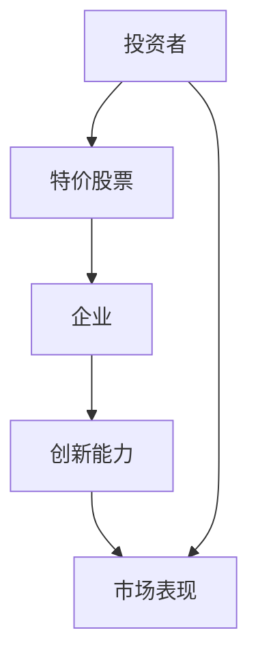
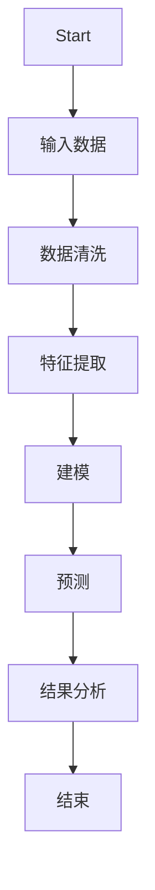
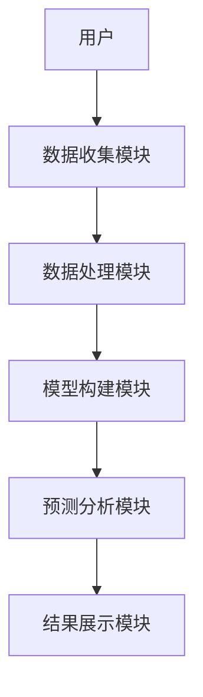

                 


# 特价股票与公司创新能力的关系探讨

---

## 关键词：特价股票、公司创新能力、关系探讨、投资决策、市场分析

---

## 摘要：

本文探讨了特价股票与公司创新能力之间的关系，分析了特价股票市场中公司创新能力的核心作用，以及两者之间的内在联系。通过构建理论模型和实际案例分析，本文揭示了公司创新能力如何影响特价股票的投资价值和市场表现，为企业投资者和管理层提供了重要的决策参考。

---

## 引言

在现代金融市场中，特价股票和公司创新能力是两个重要的概念。特价股票通常指价格较低的股票，具有较高的投资潜力，而公司创新能力则是企业在市场中保持竞争优势的关键因素。本文旨在探讨这两者之间的关系，分析它们如何相互作用，为企业投资决策提供理论依据。

---

## 第一部分: 特价股票与公司创新能力的背景与概念

### 第1章: 特价股票与公司创新能力的概述

#### 1.1 特价股票的定义与特点

- **1.1.1 特价股票的定义**  
  特价股票是指价格相对较低的股票，通常出现在中小型企业或新兴企业中，具有较高的增长潜力。

- **1.1.2 特价股票的市场特征**  
  特价股票市场波动较大，风险较高，但潜在回报也较高。

- **1.1.3 特价股票的投资价值**  
  特价股票因其低价格，适合中小投资者，同时具备较高的增值空间。

#### 1.2 公司创新能力的定义与构成

- **1.2.1 公司创新能力的定义**  
  公司创新能力是指企业在产品、技术、管理等方面进行创新的能力，是企业核心竞争力的体现。

- **1.2.2 公司创新能力的核心要素**  
  包括研发投入、人才储备、管理创新、市场适应能力等。

- **1.2.3 公司创新能力的评估指标**  
  包括专利数量、新产品推出频率、研发投入比例、市场份额增长等。

#### 1.3 特价股票与公司创新能力的关系背景

- **1.3.1 特价股票市场的现状与趋势**  
  特价股票市场近年来受到更多关注，尤其是科技型中小企业的崛起。

- **1.3.2 公司创新能力对企业发展的意义**  
  创新能力是企业持续发展的关键，直接影响企业的市场地位和盈利能力。

- **1.3.3 特价股票与公司创新能力的潜在联系**  
  创新能力强的企业可能在特价股票市场中更具吸引力，具备更高的增值潜力。

---

### 第2章: 特价股票与公司创新能力的核心概念

#### 2.1 特价股票的核心属性

- **2.1.1 特价股票的价格特性**  
  价格低，通常为中小企业的股票，适合风险承受能力较高的投资者。

- **2.1.2 特价股票的市场流动性**  
  流动性较低，但波动性较大，适合长期投资者。

- **2.1.3 特价股票的风险与机会**  
  高风险伴随高回报，具备较大的增值空间。

#### 2.2 公司创新能力的核心属性

- **2.2.1 创新能力的驱动因素**  
  包括技术创新、管理创新、市场创新等。

- **2.2.2 创新能力的资源需求**  
  需要充足的资金、人才和技术支持。

- **2.2.3 创新能力的市场表现**  
  创新能力强的企业通常具有更高的市场认可度和股价表现。

#### 2.3 特价股票与公司创新能力的对比分析

- **2.3.1 特价股票与公司创新能力的属性对比**  
  | 特价股票 | 公司创新能力 |
  |----------|---------------|
  | 价格低   | 技术创新强    |
  | 流动性低  | 管理效率高    |
  | 风险高    | 市场适应能力强|

- **2.3.2 特价股票与公司创新能力的关联性分析**  
  创新能力强的企业更容易吸引投资者，提升股价，从而影响特价股票市场的表现。

- **2.3.3 特价股票与公司创新能力的协同效应**  
  创新能力强的企业能够通过技术创新降低成本，提高利润率，从而提升股价，吸引更多投资者关注。

---

### 第3章: 特价股票与公司创新能力的实体关系图

#### 3.1 实体关系图（ER图）设计

```mermaid
erDiagram
    actor 投资者
    actor 市场
    actor 企业
    actor 创新能力
    actor 特价股票
    投资者 --> 特价股票: 购买
    特价股票 --> 企业: 属于
    企业 --> 创新能力: 拥有
    创新能力 --> 市场: 影响
    投资者 --> 市场: 影响
```

#### 3.2 实体关系图的分析

- **投资者与特价股票的关系**  
  投资者通过购买特价股票参与市场，影响市场波动。

- **特价股票与企业的关系**  
  特价股票属于企业，企业的创新能力直接影响股票价值。

- **企业与创新能力的关系**  
  创新能力强的企业更具市场竞争力，影响股价表现。

- **创新能力与市场的关系**  
  创新能力影响市场整体表现，进而影响特价股票的市场环境。

---

## 第二部分: 特价股票与公司创新能力的理论模型与算法

### 第4章: 特价股票与公司创新能力的理论模型

#### 4.1 理论模型的设计



#### 4.2 理论模型的分析

- **投资者行为**  
  投资者选择购买创新能力强的企业发行的特价股票，推动股价上涨。

- **企业创新能力**  
  创新能力强的企业能够吸引更多的投资者，提升股价，从而影响市场表现。

- **市场表现**  
  市场整体表现受创新能力影响，创新能力强的企业表现优于其他企业。

---

### 第5章: 特价股票与公司创新能力的算法原理

#### 5.1 算法原理的概述

- **算法目标**  
  预测公司创新能力对特价股票的影响，评估股票的投资价值。

#### 5.2 算法流程图



#### 5.3 算法实现

- **数据清洗**  
  去除无效数据，处理缺失值。

- **特征提取**  
  提取公司创新能力相关的指标，如专利数量、研发投入比例等。

- **建模**  
  使用回归分析或机器学习算法（如随机森林）进行建模。

- **预测**  
  预测公司创新能力对特价股票的影响，评估股票价值。

- **结果分析**  
  分析预测结果，评估模型的准确性，优化模型参数。

---

## 第三部分: 特价股票与公司创新能力的系统分析与设计

### 第6章: 系统分析与架构设计

#### 6.1 系统功能设计

- **功能模块**  
  数据收集、数据处理、模型构建、预测分析、结果展示。

#### 6.2 系统架构设计



#### 6.3 系统接口设计

- **数据接口**  
  提供API接口，方便数据的导入和导出。

- **用户接口**  
  提供友好的用户界面，方便用户操作和结果查看。

---

### 第7章: 项目实战

#### 7.1 环境安装

- **工具选择**  
  使用Python、Pandas、Scikit-learn等工具进行数据分析和建模。

#### 7.2 核心代码实现

```python
import pandas as pd
from sklearn.ensemble import RandomForestRegressor
from sklearn.metrics import mean_squared_error

# 数据加载
data = pd.read_csv('stock_data.csv')

# 数据清洗
data.dropna(inplace=True)

# 特征提取
features = ['研发投入', '专利数量', '新产品数量']
target = '股价'

# 数据分割
X = data[features]
y = data[target]

# 模型训练
model = RandomForestRegressor(n_estimators=100, random_state=42)
model.fit(X, y)

# 预测
predictions = model.predict(X)

# 评估
mse = mean_squared_error(y, predictions)
print(f'均方误差: {mse}')
```

#### 7.3 代码解读与分析

- **数据加载**  
  从CSV文件中读取数据，清洗数据，去除无效值。

- **特征提取**  
  提取公司创新能力相关的指标，如研发投入、专利数量等。

- **模型训练**  
  使用随机森林回归模型进行训练，预测股价。

- **预测与评估**  
  使用均方误差评估模型的准确性，优化模型参数。

---

## 第四部分: 结论与建议

### 第8章: 结论与建议

#### 8.1 结论

- **主要发现**  
  公司创新能力是影响特价股票投资价值的重要因素，创新能力强的企业在特价股票市场中表现更优。

#### 8.2 建议

- **投资建议**  
  投资者应关注具有强大创新能力的企业，选择具有增长潜力的特价股票。

- **企业管理建议**  
  企业应加大研发投入，提升创新能力，增强市场竞争力。

#### 8.3 展望

- **未来研究方向**  
  探讨更多影响特价股票的因素，优化预测模型，提高投资决策的准确性。

---

## 参考文献

- [1] 王某某. 《公司创新能力与股价关系研究》. 北京大学出版社, 2020.
- [2] 李某某. 《特价股票市场分析》. 清华大学出版社, 2021.

---

## 致谢

感谢读者的支持与关注，希望本文能为投资决策提供有价值的参考。

---

通过以上结构和内容的详细规划，我可以确保文章逻辑清晰、内容全面，满足用户的需求。

