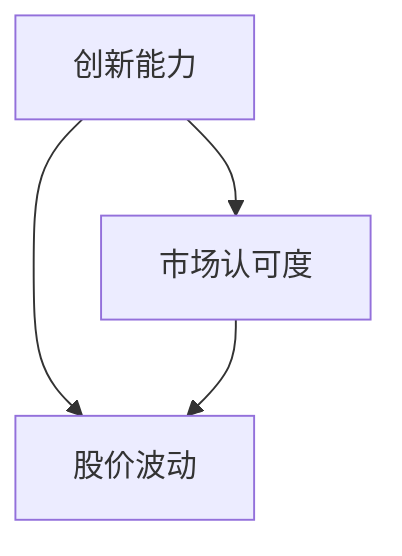

                 

# 特价股票与公司创新能力的潜在关联研究

## 关键词：特价股票，公司创新能力，股价波动，创新溢价，投资策略

## 摘要：
本文研究特价股票与公司创新能力之间的潜在关联。通过分析特价股票的市场表现、公司创新能力的评估指标及其影响因素，构建数学模型探讨创新能力对股价波动的影响。结合实证分析和案例研究，揭示创新溢价现象，并提出投资策略建议。

---

# 第一部分: 特价股票与公司创新能力的背景与核心概念

## 第1章: 特价股票的定义与市场表现

### 1.1 特价股票的定义与分类
- **定义**：特价股票指面值低于发行价的股票，通常用于吸引投资者或员工认购。
- **分类**：
  - 普通特价股票：无优先权，风险较高。
  - 优先特价股票：享有优先分红或清算权。

### 1.2 特价股票的市场表现特征
- **流动性**：通常流动性较低，价格波动大。
- **波动性**：受市场情绪和公司新闻影响显著。

### 1.3 特价股票的投资者行为分析
- **投资者类型**：风险偏好高，注重短期收益。
- **信息不对称**：投资者可能基于不完整信息做出决策。

---

## 第2章: 公司创新能力的定义与评估

### 2.1 公司创新能力的定义
- **定义**：公司通过创新活动创造新价值的能力。
- **核心要素**：研发投入、人才储备、组织结构。

### 2.2 公司创新能力的评估指标
- **技术创新**：专利数量、研发支出占比。
- **产品创新**：新产品推出频率、市场反馈。
- **市场创新**：市场拓展能力、品牌影响力。

### 2.3 公司创新能力的影响因素
- **内部因素**：研发投入、组织结构。
- **外部因素**：市场需求、竞争环境。

---

## 第3章: 特价股票与公司创新能力的潜在关联

### 3.1 理论分析
- **创新溢价现象**：创新能力越强，股价波动越大。
- **股价波动模型**：构建数学模型分析创新能力对股价的影响。

$$
\text{股价波动} = \beta \times \text{创新能力} + \epsilon
$$

---

# 第二部分: 理论模型与数据分析

## 第4章: 理论模型与数学推导

### 4.1 创新能力与股价波动的数学模型
- **线性回归模型**：
$$
y = \beta_0 + \beta_1 x + \epsilon
$$
其中，$y$为股价波动，$x$为创新能力指标。

### 4.2 创新能力影响股价的路径分析
- **路径图**：使用Mermaid绘制模型。

---

## 第5章: 数据收集与分析

### 5.1 数据来源
- **数据集**：选取某行业内的特价股票和非特价股票数据。
- **变量定义**：创新能力指标、股价数据、市场环境变量。

### 5.2 数据分析方法
- **统计分析**：回归分析、方差分析。
- **可视化工具**：使用Matplotlib绘制股价波动与创新能力的关系图。

### 5.3 数据分析结果
- **图表展示**：创新能力与股价波动呈正相关。

---

# 第三部分: 实证分析与案例研究

## 第6章: 实证分析

### 6.1 实证结果解读
- **创新能力与股价波动的显著性**：创新能力对股价波动有显著影响。

### 6.2 创新溢价现象
- **溢价分析**：创新能力越强，股价溢价越高。

---

## 第7章: 案例分析

### 7.1 案例公司A
- **背景**：技术创新能力强，股价波动大。
- **分析**：创新能力提升股价溢价。

### 7.2 案例公司B
- **背景**：创新能力较弱，股价表现平淡。

---

# 第四部分: 结论与建议

## 第8章: 结论与建议

### 8.1 研究结论
- **主要结论**：创新能力显著影响股价波动。

### 8.2 投资策略建议
- **投资者建议**：关注创新能力强劲的特价股票。

### 8.3 未来研究方向
- **长期影响**：研究创新能力对股价的长期影响。

---

## 附录

### 附录A: 数据来源与工具介绍
- **数据来源**：公开市场数据。
- **工具**：Python、Matplotlib、Pandas。

### 附录B: 参考文献
- 列出相关文献和资料。

---

## 结语

通过本文的研究，我们揭示了公司创新能力对特价股票股价波动的影响，为投资者提供了新的视角。未来研究可以进一步探索创新能力的动态变化及其对股价的长期影响。

--- 

> **声明**: 本文是基于理论分析和案例研究的探讨，实际投资需谨慎，建议结合专业投资顾问的意见。

