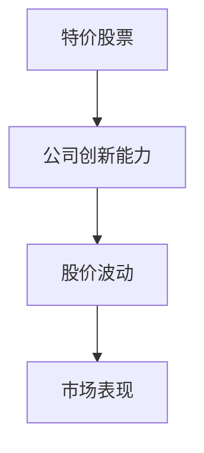
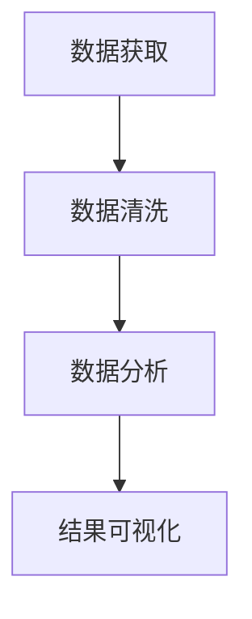
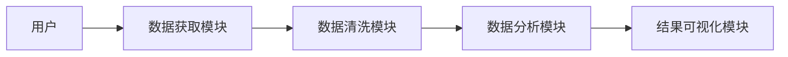
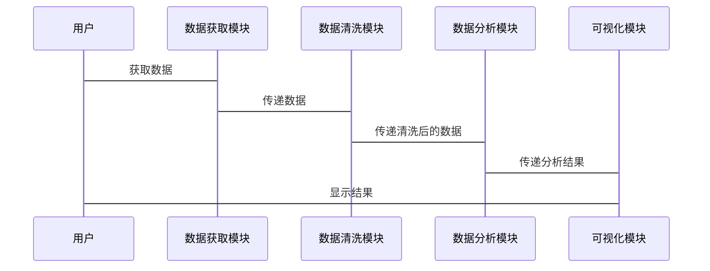

                 


# 特价股票与公司创新能力的潜在联系

## 关键词：特价股票，公司创新能力，潜在联系，算法分析，系统设计

## 摘要：本文探讨了特价股票与公司创新能力之间的潜在联系。首先，定义了特价股票和公司创新能力的基本概念，并分析了它们的属性和相互作用。然后，通过回归分析和时间序列分析等算法，探讨了公司创新能力对股价的影响。最后，提出了一个系统设计框架，用于分析和预测特价股票与公司创新能力的关系，并给出了实际应用案例和最佳实践建议。

---

# 特价股票与公司创新能力的潜在联系

## 第一部分：背景与概念

### 第1章：特价股票与公司创新能力的背景介绍

#### 1.1 特价股票的定义与特征
特价股票指的是价格显著低于其内在价值或行业平均水平的股票。这些股票通常被视为被市场低估的投资机会。以下是特价股票的主要特征：
- **低估值**：市盈率、市净率等指标低于行业平均水平。
- **高潜力**：公司基本面良好，具备未来增长潜力。
- **市场波动性**：受市场情绪影响较大，价格波动频繁。

#### 1.2 公司创新能力的内涵
公司创新能力是指公司在产品、技术、商业模式等方面进行创新的能力。它是企业持续发展的核心竞争力，主要体现在以下几个方面：
- **技术创新**：研发投入、专利数量。
- **产品创新**：新产品开发速度、市场竞争力。
- **管理创新**：组织结构优化、管理模式创新。

#### 1.3 特价股票与公司创新能力的联系
特价股票与公司创新能力之间存在相互影响的关系：
- **公司创新能力影响股价**：创新能力强的公司更容易获得市场认可，股价表现较好。
- **股价波动影响创新能力**：股价波动可能影响公司的资金投入和创新活动。

---

## 第二部分：核心概念与联系

### 第2章：特价股票与公司创新能力的核心概念分析

#### 2.1 特价股票与公司创新能力的属性对比
以下是特价股票与公司创新能力的属性对比表：

| 属性           | 特价股票                         | 公司创新能力                   |
|----------------|----------------------------------|-------------------------------|
| 定义           | 股价低于其价值的股票             | 创新能力，包括技术创新等       |
| 影响因素       | 市场情绪、宏观经济               | R&D投入、管理效率             |
| 评估指标       | 市盈率、市净率                   | 专利数量、新产品推出速度       |

#### 2.2 特价股票与公司创新能力的关系
以下是特价股票与公司创新能力的关系图：



---

## 第三部分：算法原理讲解

### 第3章：回归分析与时间序列分析

#### 3.1 回归分析
回归分析用于研究公司创新能力对股价的影响。以下是一个线性回归模型的公式：

$$ y = \beta_0 + \beta_1 x + \epsilon $$

其中，$y$ 是目标变量（股价），$x$ 是自变量（创新能力指标），$\beta_0$ 是截距，$\beta_1$ 是回归系数，$\epsilon$ 是误差项。

#### 3.2 时间序列分析
时间序列分析用于分析股价的波动性。以下是一个简单的ARIMA模型公式：

$$ y_t = \phi y_{t-1} + \theta \epsilon_{t-1} + \epsilon_t $$

其中，$\phi$ 是自回归系数，$\theta$ 是移动平均系数，$\epsilon_t$ 是白噪声。

以下是回归分析的Python代码示例：

```python
import pandas as pd
import numpy as np
from sklearn.linear_model import LinearRegression

# 数据准备
data = pd.DataFrame({
    '创新指标': [0.5, 0.6, 0.7, 0.8, 0.9],
    '股价': [10, 12, 15, 14, 16]
})

# 建立回归模型
model = LinearRegression()
model.fit(data[['创新指标']], data['股价'])

# 预测
预测值 = model.predict([[0.75]])
print(预测值)
```

---

## 第四部分：系统分析与架构设计

### 第4章：系统功能与架构设计

#### 4.1 系统功能设计
以下是系统功能模块图：



#### 4.2 系统架构设计
以下是系统架构图：



#### 4.3 系统接口设计
以下是系统接口设计：



---

## 第五部分：项目实战

### 第5章：环境安装与核心代码实现

#### 5.1 环境安装
安装所需的Python库：

```bash
pip install pandas numpy scikit-learn matplotlib
```

#### 5.2 核心代码实现
以下是项目实战的代码示例：

```python
import pandas as pd
import numpy as np
from sklearn.linear_model import LinearRegression
import matplotlib.pyplot as plt

# 数据准备
data = pd.DataFrame({
    '创新指标': np.random.rand(10),
    '股价': np.random.rand(10) * 10
})

# 数据可视化
plt.scatter(data['创新指标'], data['股价'])
plt.xlabel('创新指标')
plt.ylabel('股价')
plt.title('创新指标与股价关系')
plt.show()

# 建立回归模型
model = LinearRegression()
model.fit(data[['创新指标']], data['股价'])

# 可视化回归线
plt.scatter(data['创新指标'], data['股价'])
plt.plot(data['创新指标'], model.predict(data[['创新指标']]), color='red')
plt.xlabel('创新指标')
plt.ylabel('股价')
plt.title('回归线')
plt.show()
```

---

## 第六部分：最佳实践与总结

### 第6章：总结与建议

#### 6.1 总结
本文探讨了特价股票与公司创新能力之间的潜在联系，分析了它们的属性和相互作用，并提出了一个系统设计框架。

#### 6.2 最佳实践
- 定期监控公司创新能力指标。
- 结合市场情绪和宏观经济因素进行综合分析。
- 使用回归分析和时间序列分析等算法进行预测。

#### 6.3 注意事项
- 数据质量和完整性对分析结果影响重大。
- 需要考虑市场波动性和外部因素的影响。
- 结果需结合实际情况进行验证和调整。

#### 6.4 拓展阅读
- 《投资学基础》
- 《机器学习实战》
- 《系统设计的艺术》

---

# 结语

通过本文的分析，读者可以更好地理解特价股票与公司创新能力之间的潜在联系，并能够在实际投资和分析中应用相关的方法和工具。希望本文对您有所帮助！

