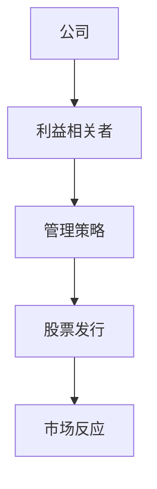
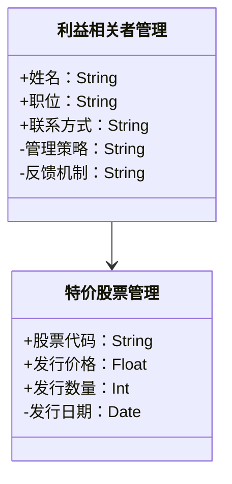
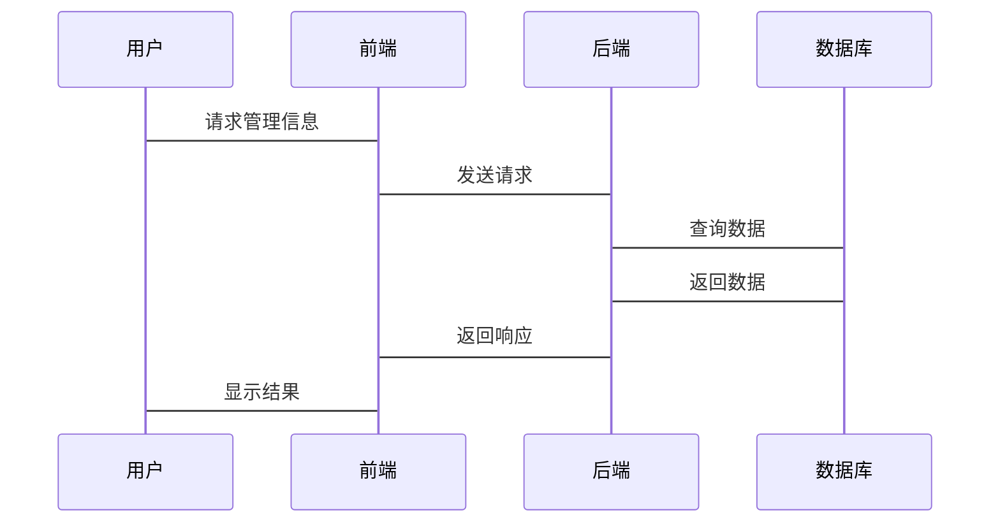

                 


# 特价股票与公司利益相关者管理的关联性研究

> 关键词：特价股票、公司利益相关者、管理关联性、博弈论模型、系统设计、案例分析

> 摘要：本文深入探讨了特价股票与公司利益相关者管理之间的关联性，从理论基础到数学模型，再到系统设计与案例分析，系统性地分析了两者之间的相互影响。通过构建数学模型和设计管理系统，本文提出了有效的管理策略，为公司利益相关者管理提供了新的视角和实践方法。

---

## 第1章: 特价股票与公司利益相关者管理的背景介绍

### 1.1 特价股票的基本概念

#### 1.1.1 特价股票的定义与分类
- **定义**：特价股票是指公司发行的股票价格低于其面值的股票，通常用于激励员工或吸引投资者。
- **分类**：包括限制性股票、期权、认股证等，具体形式多样。

#### 1.1.2 特价股票的发行机制
- **发行方式**：包括定向增发、公开增发等。
- **发行目的**：用于激励员工、并购或其他财务安排。

#### 1.1.3 特价股票的市场影响
- **市场波动**：可能影响股价波动。
- **投资者行为**：激励投资者参与公司治理。

### 1.2 公司利益相关者管理的基本概念

#### 1.2.1 利益相关者的定义与分类
- **定义**：包括股东、债权人、员工、客户、供应商等。
- **分类**：分为内部利益相关者（如员工）和外部利益相关者（如股东）。

#### 1.2.2 利益相关者管理的必要性
- **公司治理**：确保各方利益平衡。
- **风险管理**：降低利益冲突带来的风险。

#### 1.2.3 利益相关者管理的策略与方法
- **沟通机制**：建立有效的沟通渠道。
- **激励机制**：通过激励措施维护各方利益。

### 1.3 特价股票与公司利益相关者管理的关联性背景

#### 1.3.1 问题背景与研究意义
- **背景**：特价股票的发行可能影响公司治理结构。
- **意义**：研究其关联性有助于优化公司管理。

#### 1.3.2 研究目标与研究范围
- **目标**：分析特价股票与利益相关者管理的相互影响。
- **范围**：涵盖发行机制、市场影响和管理策略。

#### 1.3.3 研究方法与研究框架
- **方法**：采用定性与定量结合的方法。
- **框架**：从理论到实践，构建分析模型。

---

## 第2章: 特价股票与公司利益相关者管理的核心概念与联系

### 2.1 特价股票与公司利益相关者管理的核心概念

#### 2.1.1 特价股票的核心属性与特征
- **价格折扣**：低于面值发行。
- **激励作用**：用于激励员工或吸引投资。

#### 2.1.2 公司利益相关者的核心属性与特征
- **多样性**：涵盖不同利益方。
- **动态性**：利益关系随环境变化。

#### 2.1.3 两者之间的概念结构与核心要素组成
- **结构**：特价股票影响利益相关者管理。
- **要素**：包括发行方式、管理策略等。

### 2.2 特价股票与公司利益相关者管理的关联性分析

#### 2.2.1 特价股票对利益相关者管理的影响机制
- **激励机制**：通过价格优惠激励员工。
- **治理结构**：影响公司治理效率。

#### 2.2.2 利益相关者管理对特价股票发行的影响
- **决策影响**：管理策略影响发行决策。
- **市场反应**：管理效果影响市场对特价股票的接受度。

#### 2.2.3 两者之间的相互作用与协同效应
- **协同作用**：优化管理策略提升股票价值。
- **反馈机制**：利益相关者反馈影响股票管理。

### 2.3 特价股票与公司利益相关者管理的关联性模型

#### 2.3.1 关联性模型的构建与解释
- **模型构建**：将特价股票与管理策略纳入同一框架。
- **解释**：展示两者之间的相互影响。

#### 2.3.2 关联性模型的验证与应用
- **验证**：通过案例验证模型的有效性。
- **应用**：应用于实际管理决策中。

---

## 第3章: 特价股票与公司利益相关者管理的博弈论模型

### 3.1 博弈论模型的基本原理

#### 3.1.1 博弈论的基本概念
- **参与者**：公司和利益相关者。
- **策略**：管理策略和股票发行策略。

#### 3.1.2 博弈论在管理中的应用
- **纳什均衡**：分析各方利益平衡点。

### 3.2 特价股票与公司利益相关者管理的博弈模型

#### 3.2.1 模型构建


#### 3.2.2 模型分析
- **纳什均衡**：各方利益平衡点的确定。
- **数学公式**：构建收益函数，求解均衡点。

### 3.3 案例分析

#### 3.3.1 案例背景
- **公司A**：发行特价股票激励员工。

#### 3.3.2 模型应用
- **分析**：员工激励与股价波动的关系。

#### 3.3.3 结果解读
- **结论**：激励机制提升股价稳定性。

---

## 第4章: 特价股票与公司利益相关者管理的系统设计

### 4.1 系统功能设计

#### 4.1.1 领域模型设计


#### 4.1.2 功能模块划分
- **管理模块**：利益相关者管理。
- **股票模块**：特价股票发行与管理。

### 4.2 系统架构设计

#### 4.2.1 架构设计


#### 4.2.2 模块交互
- **前端**：用户界面。
- **后端**：业务逻辑处理。
- **数据库**：数据存储。

### 4.3 接口设计与交互流程

#### 4.3.1 接口设计
- **API接口**：提供RESTful API，如`/api/stakeholder`。

#### 4.3.2 交互流程


---

## 第5章: 特价股票与公司利益相关者管理的项目实战

### 5.1 环境安装与配置

#### 5.1.1 环境要求
- **操作系统**：Linux/Windows/MacOS。
- **开发工具**：IDE（如VS Code）。
- **依赖管理**：使用npm或pip管理依赖。

#### 5.1.2 系统安装
- **安装步骤**：安装Python、Django框架、数据库等。

### 5.2 系统核心实现

#### 5.2.1 核心代码实现
```python
# 模型定义
class Stakeholder:
    def __init__(self, name, role, contact):
        self.name = name
        self.role = role
        self.contact = contact

# 特价股票管理
class DiscountStock:
    def __init__(self, stock_code, price, quantity, issue_date):
        self.stock_code = stock_code
        self.price = price
        self.quantity = quantity
        self.issue_date = issue_date

    def calculate_total(self):
        return self.price * self.quantity
```

#### 5.2.2 代码应用解读与分析
- **功能实现**：管理利益相关者和特价股票。
- **业务逻辑**：处理股票发行与利益相关者反馈。

### 5.3 案例分析与详细解读

#### 5.3.1 案例背景
- **公司B**：发行特价股票激励员工。

#### 5.3.2 案例分析
- **实施步骤**：设计管理流程、发行股票、收集反馈。

#### 5.3.3 结果分析
- **成效**：员工积极性提升，股价稳定。

### 5.4 项目小结

#### 5.4.1 成功经验总结
- **成功因素**：系统设计合理，管理策略有效。

#### 5.4.2 改进方向
- **优化点**：引入实时反馈机制，增强系统互动性。

---

## 第6章: 特价股票与公司利益相关者管理的结论与展望

### 6.1 研究结论

#### 6.1.1 核心结论
- **结论**：特价股票与利益相关者管理相互影响，构建模型和系统有助于优化管理。

#### 6.1.2 经验总结
- **总结**：系统化管理提升公司治理效率。

### 6.2 未来研究方向

#### 6.2.1 拓展研究
- **方向**：探索更多管理策略与股票机制的结合。

#### 6.2.2 研究意义
- **意义**：推动公司治理创新。

### 6.3 最佳实践 tips

#### 6.3.1 管理建议
- **建议**：定期评估管理策略，及时调整。

#### 6.3.2 注意事项
- **注意**：避免利益冲突，确保公平。

#### 6.3.3 拓展阅读
- **推荐**：阅读相关博弈论与公司治理书籍。

---

## 第7章: 总结与展望

### 7.1 文章小结

#### 7.1.1 核心内容回顾
- **回顾**：探讨了特价股票与利益相关者管理的关联性。

#### 7.1.2 主要结论
- **结论**：构建模型和系统优化管理策略。

### 7.2 展望未来

#### 7.2.1 未来研究方向
- **方向**：深入研究管理策略与股票机制的协同优化。

#### 7.2.2 研究意义
- **意义**：推动公司治理理论与实践的发展。

---

## 附录: 术语表

- **特价股票**：低于面值发行的股票。
- **利益相关者**：公司内外部的利益方。
- **博弈论模型**：分析各方利益平衡的工具。

---

通过以上步骤，我们系统性地分析了特价股票与公司利益相关者管理的关联性，从理论到实践，构建了完整的分析框架和系统设计方案。这一研究为公司治理和股票管理提供了新的视角和实践方法。

