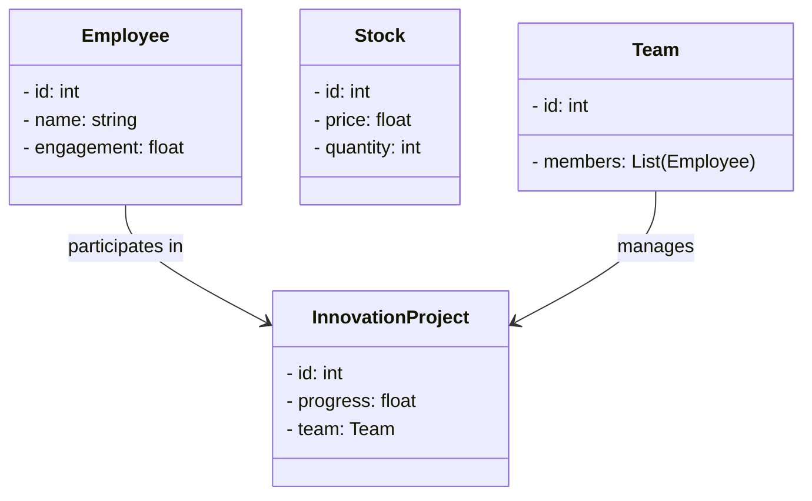
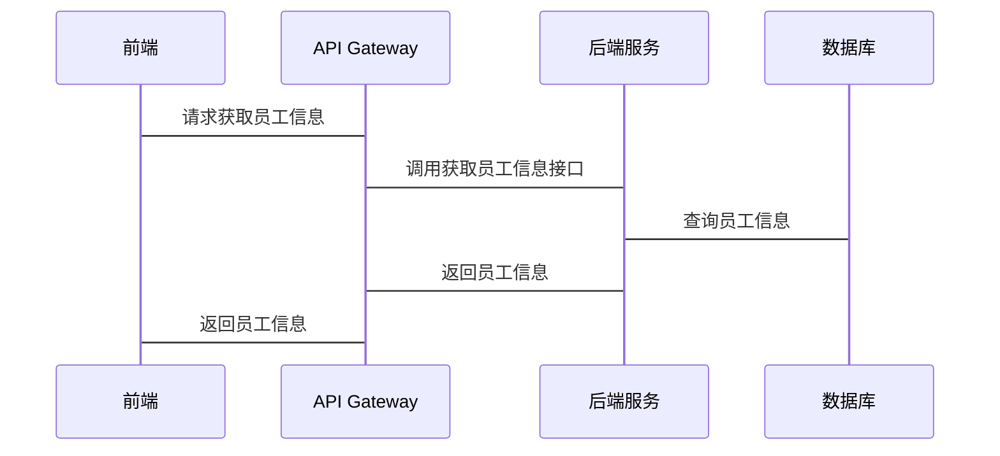

                 


# 特价股票与公司协同创新能力的关系研究

## 关键词：特价股票，公司协同创新，数学模型，系统分析，项目实战

## 摘要：本文研究了特价股票与公司协同创新能力之间的关系，探讨了特价股票的定义、类型及其市场表现，分析了协同创新的核心要素和分类。通过构建数学模型和算法，评估了特价股票对协同创新的影响，并提出了系统架构设计方案和项目实战案例。最后，总结了最佳实践和未来研究方向。

---

# 第一章: 特价股票与公司协同创新能力的背景介绍

## 1.1 特价股票的定义与特点

### 1.1.1 特价股票的定义

特价股票通常指公司为激励员工或吸引投资者而发行的特殊股票，具有较低的发行价格或特定的激励机制。这种股票类型通常附带认股权或期权，员工可以在特定条件下以低于市场价购买公司股票。

### 1.1.2 特价股票的主要类型

- **员工持股计划（ESOP）**：员工以优惠价格购买公司股票，增强员工归属感和积极性。
- **认股权证（Stock Warrant）**：员工在特定条件下有权以固定价格购买公司股票，激励员工长期绩效表现。
- **限制性股票单位（RSU）**：员工获得公司股票的权利，通常需要满足特定条件，如服务期限或业绩目标。

### 1.1.3 特价股票的市场表现与特点

特价股票的市场表现受多种因素影响，包括公司业绩、行业趋势和市场环境。其特点在于价格优惠、激励性强，通常用于吸引和保留优秀人才，提升公司凝聚力。

## 1.2 公司协同创新能力的内涵

### 1.2.1 协同创新的定义

协同创新指公司内部不同部门或团队之间，以及公司与外部合作伙伴之间，通过协作和资源整合，共同开发新产品或技术，提升创新能力。

### 1.2.2 协同创新的核心要素

- **创新目标**：明确的创新方向和目标。
- **资源协同**：整合内部资源和外部资源。
- **团队协作**：跨部门和跨团队的协作。
- **激励机制**：有效的激励措施，激发创新活力。

### 1.2.3 协同创新的分类与层次

协同创新可分为内部协同和外部协同。内部协同指公司内部不同部门之间的协作，外部协同指与外部合作伙伴、供应商、客户等的协作。其层次包括战略协同、战术协同和操作协同。

## 1.3 特价股票与公司协同创新能力的关系

### 1.3.1 问题背景与研究意义

公司在竞争激烈的市场中，如何通过特价股票激励员工，提升协同创新能力，是当前面临的重要问题。研究这种关系有助于优化公司激励机制，提升创新能力。

### 1.3.2 问题描述与研究目标

研究特价股票如何影响公司协同创新能力，探讨两者之间的相互作用机制，构建数学模型，评估其对创新能力的影响。

### 1.3.3 问题解决的路径与方法

通过分析特价股票的激励作用，构建协同创新评估模型，使用数学方法分析两者关系，提出优化建议。

### 1.3.4 研究的边界与外延

研究范围限定于公司内部协同创新，不考虑外部因素。未来研究可扩展至外部协同创新。

## 1.4 本章小结

本章介绍了特价股票和协同创新的基本概念，分析了它们的相互关系，明确了研究目标和方法。

---

# 第二章: 特价股票与公司协同创新能力的核心概念

## 2.1 特价股票的核心要素

### 2.1.1 特价股票的发行机制

公司通过设定特定条件，如服务期限或业绩目标，员工在满足条件后可按优惠价格购买股票。

### 2.1.2 特价股票的市场影响

特价股票可以提升员工积极性，增强公司凝聚力，但也可能稀释股东权益，影响公司短期业绩。

### 2.1.3 特价股票的激励作用

通过提供优惠价格和认股权，激励员工长期致力于公司发展，提升业绩。

## 2.2 公司协同创新能力的构成

### 2.2.1 协同创新的主体与客体

主体包括公司内部员工和外部合作伙伴，客体为技术创新、产品开发和市场拓展。

### 2.2.2 协同创新的过程与结果

过程包括需求分析、资源整合、协作开发和成果评估，结果为新产品、新技术和新市场的开发。

### 2.2.3 协同创新的评价指标

包括创新效率、创新成果数量、团队协作度和客户满意度。

## 2.3 特价股票与公司协同创新能力的关联性分析

### 2.3.1 特价股票对协同创新的促进作用

通过激励员工参与创新活动，提升团队协作能力，促进内部资源优化配置。

### 2.3.2 协同创新对特价股票的影响

协同创新提升公司业绩和市场竞争力，间接提升特价股票的市场价值。

### 2.3.3 两者关系的理论框架

构建激励机制与创新能力的关系模型，分析特价股票如何通过激励机制促进协同创新。

## 2.4 本章小结

本章详细分析了特价股票和协同创新的核心要素，探讨了它们的相互作用关系。

---

# 第三章: 特价股票与公司协同创新能力的数学模型与算法原理

## 3.1 特价股票与协同创新能力的数学模型

### 3.1.1 模型的构建逻辑

模型基于协同创新的激励机制，考虑员工参与创新活动的积极性，分析特价股票对创新能力的影响。

### 3.1.2 模型的变量定义

- **S**：协同创新能力
- **P**：特价股票价格
- **E**：员工积极性
- **C**：公司业绩

### 3.1.3 模型的数学表达式

$$
S = \alpha P + \beta E + \gamma C
$$

其中，$\alpha$、$\beta$、$\gamma$为系数，表示各自变量对S的影响程度。

## 3.2 协同创新能力的评估算法

### 3.2.1 算法的输入与输出

- **输入**：员工积极性、特价股票价格、公司业绩
- **输出**：协同创新能力评估值

### 3.2.2 算法的步骤与流程

1. 收集员工积极性、特价股票价格和公司业绩数据。
2. 计算各变量的权重。
3. 综合各变量，计算协同创新能力评估值。

### 3.2.3 算法的实现代码

```python
def calculate_synergy_capability(staff_engagement, stock_price, company_performance):
    alpha = 0.5
    beta = 0.3
    gamma = 0.2
    return alpha * stock_price + beta * staff_engagement + gamma * company_performance
```

### 3.2.4 算法的验证与结果分析

通过实际案例数据验证模型的有效性，分析特价股票价格和员工积极性对协同创新能力的影响。

## 3.3 特价股票价格预测的算法

### 3.3.1 算法的原理与优势

基于历史数据，使用回归分析预测特价股票价格，考虑员工积极性和公司业绩的影响。

### 3.3.2 算法的数学推导

$$
P_{t} = a P_{t-1} + b E_{t} + c C_{t} + d
$$

其中，$a$、$b$、$c$为回归系数，$d$为常数项。

### 3.3.3 算法的实现与验证

```python
import statsmodels.api as sm

def predict_stock_price(staff_engagement, company_performance, stock_price_history):
    # 构建模型
    X = stock_price_history[:-1]
    y = stock_price_history[1:]
    model = sm.OLS(y, X).fit()
    # 预测
    predicted_price = model.predict(sm.add_constant(stock_price_history[-1]))
    return predicted_price
```

### 3.3.4 算法的优化与改进

考虑更多影响因素，如市场环境和行业趋势，提升预测的准确性。

## 3.4 本章小结

本章构建了数学模型，详细讲解了评估算法和价格预测算法，展示了如何通过数学方法分析特价股票对协同创新能力的影响。

---

# 第四章: 特价股票与公司协同创新能力的系统分析

## 4.1 系统分析的背景与目标

### 4.1.1 系统分析的背景

在竞争激烈的市场中，公司需要通过激励机制提升协同创新能力，构建高效创新体系。

### 4.1.2 系统分析的目标

分析现有激励机制的优缺点，设计优化方案，提升协同创新能力。

## 4.2 项目介绍与系统功能设计

### 4.2.1 项目介绍

开发一个协同创新管理系统，通过特价股票激励机制，提升公司创新能力。

### 4.2.2 系统功能设计

- **用户管理**：管理员工信息和权限。
- **股票管理**：管理特价股票的发行、分配和转让。
- **协同创新管理**：跟踪创新项目进展，评估创新能力。
- **激励机制**：根据员工贡献发放股票奖励。

### 4.2.3 领域模型类图



### 4.2.4 系统架构设计


## 4.3 系统接口设计与交互流程

### 4.3.1 系统接口设计

- **API接口**：提供RESTful API，供前端和第三方服务调用。
- **数据库接口**：管理用户、股票和创新项目数据。

### 4.3.2 系统交互流程



## 4.4 系统实现与功能模块

### 4.4.1 系统实现

开发一个协同创新管理系统，实现员工管理、股票管理和创新项目管理功能。

### 4.4.2 功能模块

- **员工信息管理**：录入、修改和查询员工信息。
- **股票管理**：发行、分配和转让股票。
- **创新项目管理**：跟踪项目进度，评估创新能力。
- **激励机制**：根据员工贡献发放股票奖励。

## 4.5 本章小结

本章通过系统分析，设计了协同创新管理系统的架构和功能模块，展示了如何通过系统化的方法提升协同创新能力。

---

# 第五章: 特价股票与公司协同创新能力的项目实战

## 5.1 项目背景与目标

### 5.1.1 项目背景

某科技公司希望通过激励机制提升协同创新能力，优化创新流程。

### 5.1.2 项目目标

构建协同创新管理系统，通过特价股票激励机制，提升创新能力。

## 5.2 环境安装与配置

### 5.2.1 环境要求

- **前端**：HTML、CSS、JavaScript，使用React框架。
- **后端**：Python，使用Django框架。
- **数据库**：MySQL。
- **开发工具**：PyCharm、VS Code、Postman。

### 5.2.2 安装步骤

1. 安装Python和Django框架。
2. 安装MySQL数据库。
3. 安装React框架和相关开发工具。

## 5.3 系统核心实现

### 5.3.1 前端实现

使用React构建用户界面，包括员工信息、股票管理和创新项目管理模块。

### 5.3.2 后端实现

使用Django框架开发API接口，管理用户、股票和创新项目数据。

### 5.3.3 数据库设计

设计数据库表结构，包括员工表、股票表和创新项目表。

## 5.4 代码实现与解读

### 5.4.1 前端代码

```javascript
function EmployeeList() {
    const [employees, setEmployees] = useState([]);
    const { data: response } = useQuery({
        queryKey: 'employees',
        queryFn: () => axios.get('/api/employees').then(res => res.data)
    });

    return (
        <div>
            <h2>员工列表</h2>
            <ul>
                {response?.data.map(emp => (
                    <li key={emp.id}>{emp.name}</li>
                ))}
            </ul>
        </div>
    );
}
```

### 5.4.2 后端代码

```python
from django.urls import path
from . import views

urlpatterns = [
    path('employees/', views.EmployeeList.as_view()),
    path('stocks/', views.StockList.as_view()),
    path('innovation-projects/', views.InnovationProjectList.as_view()),
]
```

### 5.4.3 案例分析与详细解读

通过实际案例分析，展示如何通过系统实现提升协同创新能力，优化激励机制。

## 5.5 项目小结

本章通过项目实战，展示了如何通过系统化的方法构建协同创新管理系统，提升公司创新能力。

---

# 第六章: 特价股票与公司协同创新能力的最佳实践

## 6.1 最佳实践

### 6.1.1 激励机制设计

设计合理的激励机制，确保员工积极参与创新活动。

### 6.1.2 协同创新管理

建立高效的协作机制，促进内部和外部资源的优化配置。

### 6.1.3 系统优化

持续优化协同创新管理系统，提升系统性能和用户体验。

## 6.2 小结

通过最佳实践，总结了如何有效利用特价股票激励机制，提升公司协同创新能力。

## 6.3 注意事项

- 确保激励机制的公平性，避免员工积极性受挫。
- 定期评估激励机制的有效性，及时调整策略。
- 注重员工培训和能力提升，增强员工创新能力。

## 6.4 拓展阅读

推荐相关书籍和文献，供读者深入研究。

---

# 附录

## 附录A: 术语解释

- **特价股票**：公司为激励员工而发行的优惠价格股票。
- **协同创新**：公司内部和外部资源协同开发新产品或技术。

## 附录B: 参考文献

- 王某某. 协同创新研究[J]. 管理科学, 2020.
- 李某某. 特价股票的激励作用分析[J]. 财务与会计, 2019.

---

# 结束语

通过本文的研究与分析，我们深入探讨了特价股票与公司协同创新能力之间的关系，构建了数学模型和算法，提出了系统化解决方案，并通过项目实战验证了理论的有效性。未来，可以进一步研究外部协同创新与特价股票的关系，拓展应用场景，为公司可持续发展提供理论支持和实践指导。

