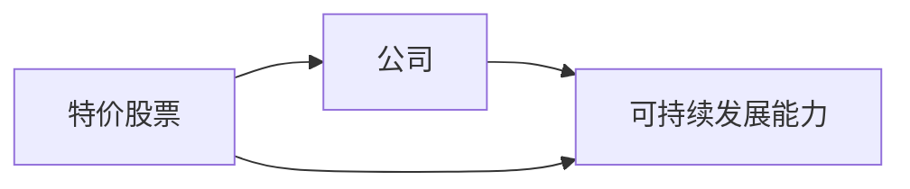
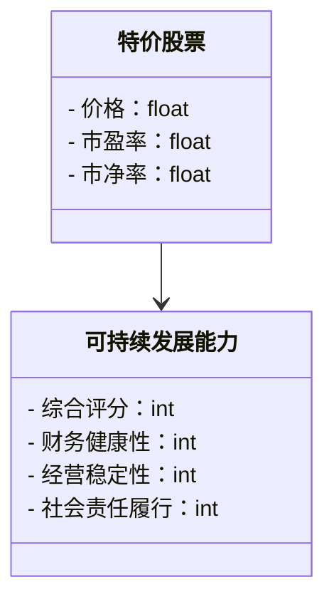

                 


# 特价股票与公司可持续发展能力的关系分析

## 关键词
- 特价股票
- 可持续发展能力
- 股票分析
- 公司价值
- 投资策略

## 摘要
本文分析了特价股票与公司可持续发展能力之间的关系，探讨了如何通过评估公司的可持续发展能力来选择有潜力的特价股票。文章详细介绍了可持续发展能力的评估指标，分析了这些指标如何影响股票价格，并提供了实际案例和数学模型，帮助投资者做出更明智的投资决策。

---

# 第一部分: 特价股票与公司可持续发展能力的背景与概念

## 第1章: 特价股票与公司可持续发展能力的背景介绍

### 1.1 特价股票的定义与特征

#### 1.1.1 特价股票的定义
特价股票是指市场价格低于其内在价值的股票。通常，这些股票可能因为市场波动、公司短期问题或市场低估而被投资者视为潜在的投资机会。

#### 1.1.2 特价股票的市场特征
- **低估值**：市场价格低于行业平均水平或历史平均水平。
- **高波动性**：价格波动较大，可能因为市场情绪或短期事件影响。
- **高风险**：存在较高的市场风险和公司特定风险。

#### 1.1.3 特价股票的投资价值
- **潜在回报**：如果公司基本面改善，股票价格可能回升，带来超额收益。
- **价值投资机会**：适合长期投资者，通过识别被低估的公司获取收益。

### 1.2 可持续发展能力的定义与内涵

#### 1.2.1 可持续发展能力的定义
可持续发展能力是指公司在不损害环境、社会和治理（ESG）的前提下，长期创造价值的能力。它涵盖了公司的财务健康、经营稳定性、社会责任履行等方面。

#### 1.2.2 公司可持续发展的核心要素
- **财务健康性**：盈利能力、资产负债率、现金流等财务指标。
- **经营稳定性**：市场地位、产品竞争力、管理团队等。
- **社会责任履行**：环境保护、员工权益、社会公益等方面的表现。

#### 1.2.3 可持续发展能力的评估标准
- **财务指标**：如ROE（净资产收益率）、净利润增长率。
- **ESG评级**：如环境、社会和治理方面的表现。
- **行业标准**：不同行业的可持续发展能力评估标准可能不同。

### 1.3 特价股票与公司可持续发展能力的关系背景

#### 1.3.1 特价股票市场的现状与问题
- **市场波动**：特价股票的价格受市场情绪影响较大。
- **信息不对称**：投资者可能缺乏足够的信息来评估公司的真实价值。
- **短期波动与长期价值**：投资者需要区分短期价格波动与公司长期价值。

#### 1.3.2 公司可持续发展能力的重要性
- **长期价值**：公司具备可持续发展能力，才能在长期内为股东创造价值。
- **社会责任**：具备社会责任的公司更可能获得社会支持和长期发展机会。
- **风险管理**：可持续发展能力强的公司更能应对环境和社会变化带来的风险。

#### 1.3.3 两者关系的研究意义
- **投资决策**：通过分析公司的可持续发展能力，投资者可以更准确地评估特价股票的潜在价值。
- **风险控制**：识别具备可持续发展能力的公司，有助于降低投资风险。
- **市场趋势**：随着ESG投资的兴起，具备可持续发展能力的公司可能更受市场青睐。

---

## 第2章: 特价股票与公司可持续发展能力的核心概念

### 2.1 特价股票的核心属性

#### 2.1.1 低估值特征
- **相对估值法**：如市盈率（P/E）、市净率（P/B）低于行业平均水平。
- **绝对估值法**：如股息率较高，或DCF（现金流折现法）评估的内在价值高于市场价格。

#### 2.1.2 高风险特征
- **市场风险**：市场价格波动较大，可能受宏观经济影响。
- **公司特有风险**：公司自身的问题可能导致股价进一步下跌。

#### 2.1.3 投资机会与挑战
- **投资机会**：如果公司基本面改善，股价可能回升，带来丰厚回报。
- **挑战**：公司可能面临持续的经营问题，导致股价长期低迷。

### 2.2 可持续发展能力的核心属性

#### 2.2.1 财务健康性
- **盈利能力**：净利润率、ROE等指标表现良好。
- **财务杠杆**：低负债率，具备较强的偿债能力。
- **现金流**：健康的现金流是公司持续发展的基础。

#### 2.2.2 经营稳定性
- **市场地位**：公司在行业中具备竞争优势。
- **产品多样性**：多元化的产品线有助于应对市场需求变化。
- **管理团队**：稳定的管理团队和良好的治理结构。

#### 2.2.3 社会责任履行
- **环境保护**：减少碳排放，采用环保生产方式。
- **员工权益**：提供良好的工作环境和员工福利。
- **社会公益**：积极参与公益活动，提升企业形象。

### 2.3 两者关系的实体关系图



### 2.4 本章小结
本章通过分析特价股票和公司可持续发展能力的核心概念，揭示了两者在投资决策中的重要性。公司具备可持续发展能力是实现长期价值增长的关键，而特价股票则为投资者提供了挖掘这类公司的机会。

---

## 第3章: 特价股票与公司可持续发展能力的数学模型与算法原理

### 3.1 可持续发展能力评估模型

#### 3.1.1 模型定义与目标
通过综合评估公司的财务、经营和社会责任等方面的表现，量化公司的可持续发展能力。

#### 3.1.2 模型输入变量
- **财务指标**：ROE、净利润增长率、资产负债率等。
- **ESG指标**：环境表现、社会责任履行情况等。
- **行业基准**：行业平均水平或竞争对手的表现。

#### 3.1.3 模型输出结果
- **综合评分**：0-100分，反映公司的可持续发展能力。
- **排名**：公司在行业内的排名。

### 3.2 特价股票价格预测模型

#### 3.2.1 模型定义与目标
基于公司的可持续发展能力，预测特价股票的未来价格走势。

#### 3.2.2 模型输入变量
- **公司可持续发展能力评分**：如上所述。
- **市场情绪**：如市场波动率、投资者情绪指数。
- **宏观经济指标**：如GDP增长率、利率水平等。

#### 3.2.3 模型输出结果
- **预测价格**：未来一段时间内的预期股票价格。
- **价格波动范围**：预测价格的上下限。

### 3.3 算法原理与流程图


### 3.4 数学模型与公式

#### 3.4.1 可持续发展能力评估公式
$$ S = \alpha_1x_1 + \alpha_2x_2 + \dots + \alpha_nx_n $$
其中，$S$ 表示公司可持续发展能力，$x_i$ 表示各个评估指标，$\alpha_i$ 为对应权重。

#### 3.4.2 特价股票价格预测公式
$$ P = \beta_1y_1 + \beta_2y_2 + \dots + \beta_my_m $$
其中，$P$ 表示股票价格，$y_i$ 表示各个预测变量，$\beta_i$ 为对应权重。

---

## 第4章: 特价股票与公司可持续发展能力的系统分析与架构设计

### 4.1 问题场景介绍
投资者希望通过分析公司的可持续发展能力，选择具备长期增长潜力的特价股票进行投资。

### 4.2 系统功能设计

#### 4.2.1 领域模型图



#### 4.2.2 系统架构设计


#### 4.2.3 系统接口设计
- **数据接口**：提供API用于获取公司财务数据和ESG评级。
- **预测接口**：提供API用于获取特价股票的价格预测结果。

#### 4.2.4 系统交互流程图

```mermaid
sequenceDiagram
    用户 -> 数据采集模块: 请求数据
    数据采集模块 -> 数据处理模块: 传递数据
    数据处理模块 -> 模型训练模块: 训练模型
    模型训练模块 -> 结果展示模块: 返回预测结果
    用户 <- 结果展示模块: 显示预测结果
```

---

## 第5章: 特价股票与公司可持续发展能力的项目实战

### 5.1 环境安装

```bash
pip install numpy pandas scikit-learn matplotlib
```

### 5.2 核心实现源代码

```python
import numpy as np
import pandas as pd
from sklearn.linear_model import LinearRegression

# 示例数据
data = {
    '公司名称': ['A', 'B', 'C', 'D'],
    'ROE': [0.15, 0.1, 0.2, 0.08],
    '净利润增长率': [0.1, -0.05, 0.15, 0.03],
    '股价': [10, 5, 15, 8]
}

df = pd.DataFrame(data)

# 训练模型
model = LinearRegression()
X = df[['ROE', '净利润增长率']]
y = df['股价']
model.fit(X, y)

# 预测股价
new_company = {'ROE': 0.12, '净利润增长率': 0.1}
predicted_price = model.predict([[new_company['ROE'], new_company['净利润增长率']]])
print(f"预测股价：{predicted_price[0]:.2f}")
```

### 5.3 代码解读与分析
- **数据准备**：从示例数据中提取公司名称、ROE（净资产收益率）、净利润增长率和股价。
- **模型训练**：使用线性回归模型，以ROE和净利润增长率为自变量，股价为因变量。
- **预测股价**：根据新公司的ROE和净利润增长率，预测其股价。

### 5.4 实际案例分析
以某公司为例，分析其可持续发展能力，并预测其股价走势。

---

## 第6章: 特价股票与公司可持续发展能力的最佳实践

### 6.1 小结
本文通过分析特价股票与公司可持续发展能力的关系，提出了评估公司可持续发展能力的数学模型，并展示了如何利用这些模型进行投资决策。

### 6.2 注意事项
- **数据质量**：确保数据来源可靠，避免因数据错误导致的误判。
- **模型局限性**：模型基于历史数据，未来情况可能不同。
- **市场风险**：投资有风险，需谨慎决策。

### 6.3 拓展阅读
- **相关书籍**：《价值投资入门》、《ESG投资指南》。
- **学术论文**：查找相关领域的最新研究成果。

---

## 总结
通过分析公司可持续发展能力，投资者可以更准确地评估特价股票的潜在价值，从而做出更明智的投资决策。未来的研究可以进一步探索如何结合更多的因素，如人工智能和大数据分析，提升模型的预测精度和实用性。

--- 

感谢您的阅读！希望这篇文章对您在投资决策中有所帮助。

