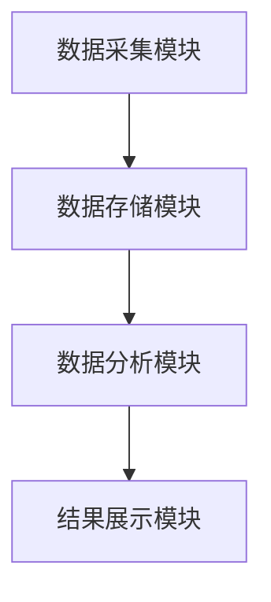

                 


# 特价股票与公司品牌价值的关联分析

**关键词**：特价股票、品牌价值、市场行为、关联性分析、数学模型

**摘要**：本文探讨了特价股票与公司品牌价值之间的关联性，分析了市场行为和品牌价值对股票定价的影响。通过建立数学模型和算法，我们对实证数据进行分析，揭示了两者之间的内在联系，并提出了优化公司品牌价值以提升股票价值的策略。

---

## 第1章: 特价股票与品牌价值的背景介绍

### 1.1 特价股票的基本概念
#### 1.1.1 特价股票的定义与分类
- 定义：特价股票指低于面值发行的股票，通常用于公司资本结构调整或吸引投资者。
- 分类：包括优先股、可转换债券等，具有不同的权利和风险。

#### 1.1.2 特价股票的市场特征
- 价格波动大：特价股票价格受市场情绪影响较大。
- 流动性较低：交易量小，买卖价差大。
- 投机性较强：投资者更关注短期收益而非长期价值。

#### 1.1.3 特价股票与公司价值的关系
- 特价股票是公司资本结构的一部分，影响公司整体价值。
- 价格波动反映市场对公司财务状况和前景的评估。

### 1.2 公司品牌价值的核心要素
#### 1.2.1 品牌价值的定义与测量
- 定义：品牌价值是消费者对公司产品或服务的认可度和偏好度的量化。
- 测量方法：包括市场评估法、经济增加值法和品牌强度法。

#### 1.2.2 品牌价值的影响因素
- 品牌知名度：高知名度带来更高的市场认知度和溢价能力。
- 产品质量：优质产品增强品牌忠诚度。
- 市场定位：准确的市场定位有助于品牌价值提升。

#### 1.2.3 品牌价值与公司市值的关系
- 品牌价值影响公司市值：高品牌价值通常对应高市值。
- 市值波动反映品牌价值变化：市场对公司品牌价值的重新评估影响股价。

### 1.3 特价股票与品牌价值的关联性
#### 1.3.1 特价股票市场的特点
- 投资者结构：投机者为主，长期投资者较少。
- 市场信息不透明：缺乏足够的信息支持投资决策。

#### 1.3.2 品牌价值在股票定价中的作用
- 品牌溢价：高品牌价值公司享有更高的市盈率。
- 品牌风险：品牌危机可能导致股价大幅下跌。

#### 1.3.3 特价股票与品牌价值的双向影响
- 品牌价值影响特价股票价格：高品牌价值公司发行的特价股票可能吸引投资者。
- 特价股票价格影响品牌价值：股价波动传递公司品牌信息，影响市场对公司品牌的认知。

---

## 第2章: 特价股票与品牌价值的核心概念与联系

### 2.1 特价股票的市场行为分析
#### 2.1.1 投资者心理与市场情绪
- 投资者行为受情绪影响：贪婪和恐惧主导市场行为。
- 市场情绪的传染效应：投资者情绪波动影响整个市场的流动性。

#### 2.1.2 市场供需与股票价格的关系
- 供需平衡决定价格：供大于求导致价格下跌，供小于求导致价格上涨。
- 市场深度影响流动性：深度越大，价格波动越小。

#### 2.1.3 特价股票的市场流动性
- 流动性风险：交易量小导致买卖价差大，影响市场深度。
- 流动性溢价：投资者愿意为高流动性的股票支付溢价。

### 2.2 品牌价值的经济属性分析
#### 2.2.1 品牌价值的形成机制
- 品牌资产：包括品牌知名度、品牌忠诚度和品牌形象。
- 品牌资本：品牌作为无形资产的价值体现。

#### 2.2.2 品牌价值的量化方法
- 市场法：基于市场交易数据进行评估。
- 收益法：基于未来现金流折现进行评估。
- 综合法：结合市场和收益法进行综合评估。

#### 2.2.3 品牌价值与企业绩效的关系
- 品牌价值与企业绩效正相关：高品牌价值企业通常具有更高的盈利能力。
- 品牌价值受企业绩效影响：企业绩效不佳可能导致品牌价值下降。

### 2.3 特价股票与品牌价值的关联模型
#### 2.3.1 关联性分析的理论基础
- 市场理论：股票价格反映市场对公司的整体评估。
- 品牌理论：品牌价值影响消费者和投资者的决策。

#### 2.3.2 关联性分析的数学模型
- 相关性分析公式：
  $$ r = \frac{\sum (x_i - \bar{x})(y_i - \bar{y})}{\sqrt{\sum (x_i - \bar{x})^2 \sum (y_i - \bar{y})^2}} $$
- 回归分析公式：
  $$ y = \beta x + \epsilon $$

#### 2.3.3 关联性分析的实证研究
- 数据收集：收集特价股票价格和公司品牌价值数据。
- 数据分析：使用统计软件进行相关性分析和回归分析。

---

## 第3章: 特价股票与品牌价值的关联分析方法

### 3.1 统计分析方法
#### 3.1.1 相关性分析
- 计算相关系数：判断变量之间的相关性。
- 相关性矩阵：展示多个变量之间的相关性。

#### 3.1.2 回归分析
- 线性回归：预测特价股票价格对品牌价值的影响。
- 逻辑回归：分类分析品牌价值对股票价格的影响。

#### 3.1.3 时间序列分析
- 自回归模型：分析历史数据预测未来趋势。
- 移动平均模型：平滑数据消除随机波动。

### 3.2 机器学习方法
#### 3.2.1 支持向量机（SVM）模型
- 数据分类：将特价股票和品牌价值进行分类。
- 核函数选择：使用径向基函数提高分类性能。

#### 3.2.2 神经网络模型
- 网络结构：设计多层感知机（MLP）进行预测。
- 训练过程：使用反向传播算法优化权重。

#### 3.2.3 集成学习方法
- 模型集成：通过投票或加权平均提高预测准确率。
- 调参优化：选择合适的超参数提升性能。

### 3.3 数据挖掘方法
#### 3.3.1 聚类分析
- 聚类方法：使用K-means算法将股票分为不同类别。
- 聚类评估：计算轮廓系数评估聚类效果。

#### 3.3.2 分类分析
- 分类算法：使用决策树、随机森林等方法进行分类。
- 特征选择：筛选重要特征提高分类准确率。

#### 3.3.3 关联规则挖掘
- 关联规则：发现股票价格和品牌价值之间的关联项。
- 支持度和置信度：衡量关联规则的强度。

---

## 第4章: 特价股票与品牌价值的数学模型与算法实现

### 4.1 特价股票与品牌价值的数学模型
#### 4.1.1 相关性系数公式
$$ r = \frac{\sum (x_i - \bar{x})(y_i - \bar{y})}{\sqrt{\sum (x_i - \bar{x})^2 \sum (y_i - \bar{y})^2}} $$
- 解释：r表示变量x和y之间的相关性，r值在-1到1之间，绝对值越大，相关性越强。

#### 4.1.2 回归分析公式
$$ y = \beta x + \epsilon $$
- 解释：y是被解释变量，x是解释变量，β是回归系数，ε是误差项。

### 4.2 算法实现
#### 4.2.1 使用Python进行相关性分析
```python
import pandas as pd
import numpy as np

# 假设data是包含特价股票价格和品牌价值的数据框
correlation_matrix = data.corr()
print(correlation_matrix)
```

#### 4.2.2 使用Scikit-learn进行回归分析
```python
from sklearn.linear_model import LinearRegression
import pandas as pd

# 假设X是解释变量，y是被解释变量
model = LinearRegression()
model.fit(X, y)
print('回归系数:', model.coef_)
print('截距:', model.intercept_)
```

#### 4.2.3 使用XGBoost进行分类分析
```python
import xgboost as xgb

# 假设dtrain是训练数据，dtest是测试数据
model = xgb.XGBClassifier()
model.fit(dtrain)
predictions = model.predict(dtest)
print('预测准确率:', accuracy_score(predictions, dtest.label))
```

### 4.3 算法优化与调优
#### 4.3.1 参数调优
- 确定最佳参数：使用网格搜索（Grid Search）或随机搜索（Random Search）。
- 交叉验证：通过k折交叉验证评估模型性能。

#### 4.3.2 模型评估
- 分类评估指标：准确率、召回率、F1分数。
- 回归评估指标：均方误差（MSE）、决定系数（R²）。

### 4.4 本章小结
- 介绍了多种数学模型和算法，包括相关性分析、回归分析和机器学习方法。
- 强调了数据预处理和参数调优的重要性。

---

## 第5章: 系统分析与架构设计方案

### 5.1 项目背景与目标
- 项目目标：建立一个分析特价股票与品牌价值关联性的系统。
- 项目范围：涵盖数据采集、分析和结果展示。

### 5.2 系统功能设计
#### 5.2.1 数据采集模块
- 数据来源：股票市场数据和公司品牌价值数据。
- 数据清洗：处理缺失值和异常值。

#### 5.2.2 数据分析模块
- 数据分析方法：统计分析、机器学习和数据挖掘。
- 可视化工具：使用Matplotlib和Seaborn进行数据可视化。

#### 5.2.3 结果展示模块
- 可视化报告：生成图表和报告展示分析结果。
- 界面设计：用户友好的界面方便数据查看和操作。

### 5.3 系统架构设计
#### 5.3.1 系统架构图


#### 5.3.2 接口设计
- API接口：提供REST API供其他系统调用。
- 数据格式：JSON格式传输数据，确保兼容性和可扩展性。

### 5.4 系统实现
#### 5.4.1 数据采集实现
```python
import requests

url = "https://api.example.com/stock_data"
response = requests.get(url)
data = response.json()
```

#### 5.4.2 数据分析实现
```python
from sklearn.ensemble import RandomForestRegressor

model = RandomForestRegressor()
model.fit(X, y)
```

#### 5.4.3 结果展示实现
```python
import matplotlib.pyplot as plt

plt.plot(time_series_data)
plt.title('Time Series Analysis')
plt.show()
```

### 5.5 系统测试与优化
#### 5.5.1 功能测试
- 测试数据采集模块：确保数据正确采集。
- 测试数据分析模块：验证算法准确性。
- 测试结果展示模块：检查可视化效果。

#### 5.5.2 性能优化
- 数据库优化：使用索引提高查询速度。
- 算法优化：选择高效的算法和参数。

---

## 第6章: 项目实战与案例分析

### 6.1 项目实战
#### 6.1.1 环境安装
- 安装必要的Python库：pandas、numpy、scikit-learn、xgboost。
- 配置开发环境：安装Jupyter Notebook或VS Code。

#### 6.1.2 核心代码实现
```python
import pandas as pd
from sklearn.ensemble import RandomForestClassifier

# 加载数据
data = pd.read_csv('data.csv')

# 数据预处理
X = data.drop('target', axis=1)
y = data['target']

# 训练模型
model = RandomForestClassifier()
model.fit(X, y)

# 预测结果
predictions = model.predict(X)
print('预测准确率:', accuracy_score(y, predictions))
```

#### 6.1.3 代码解读与分析
- 数据加载：使用pandas读取CSV文件。
- 数据预处理：删除目标变量，分割特征和标签。
- 模型训练：使用随机森林分类器进行训练。
- 模型评估：计算预测准确率。

### 6.2 实际案例分析
#### 6.2.1 案例背景
- 公司A发行特价股票，品牌价值较高。
- 公司B发行特价股票，品牌价值较低。

#### 6.2.2 数据分析
- 使用回归分析评估品牌价值对股价的影响。
- 使用分类分析预测股价走势。

#### 6.2.3 结果解读
- 高品牌价值公司发行的特价股票具有更高的市场认可度。
- 低品牌价值公司发行的特价股票风险较大，投资者需谨慎。

### 6.3 项目总结
- 成功建立模型，揭示了特价股票与品牌价值之间的关联性。
- 提出了优化公司品牌价值的策略，以提升股票价值。

---

## 第7章: 最佳实践与注意事项

### 7.1 最佳实践
#### 7.1.1 数据预处理
- 清洗数据：处理缺失值和异常值。
- 特征工程：提取有用的特征，删除冗余特征。

#### 7.1.2 模型选择
- 根据问题类型选择合适的算法。
- 尝试多种算法，选择性能最优的模型。

#### 7.1.3 模型调优
- 使用网格搜索或随机搜索选择最佳参数。
- 进行交叉验证评估模型性能。

### 7.2 注意事项
#### 7.2.1 数据质量问题
- 数据偏差：确保数据具有代表性，避免样本偏差。
- 数据隐私：遵守数据隐私法规，保护用户隐私。

#### 7.2.2 模型局限性
- 过度拟合：避免模型在训练数据上表现良好，但在测试数据上表现不佳。
- 解释性：选择易于解释的模型，便于业务人员理解和应用。

### 7.3 拓展阅读
- 推荐书籍：《机器学习实战》、《数据挖掘导论》。
- 推荐博客：技术博客、数据分析社区。

---

## 第8章: 小结与展望

### 8.1 小结
- 总结了特价股票与品牌价值的关联性分析，提出了数学模型和算法。
- 展示了系统设计与实现，提供了实际案例分析。

### 8.2 展望
- 进一步研究其他因素对股票定价的影响，如宏观经济指标和行业趋势。
- 探索更先进的算法，如深度学习和强化学习，提升分析精度。

---

## 参考文献

- [1] 《机器学习实战》, 周志华
- [2] 《数据挖掘导论》, 花岛隆
- [3] 《股票投资策略》, 乔尔·蒂博勒

---

**附录**：代码示例与数据表格

