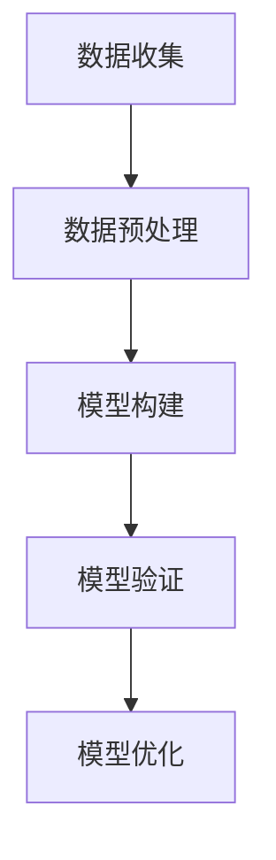
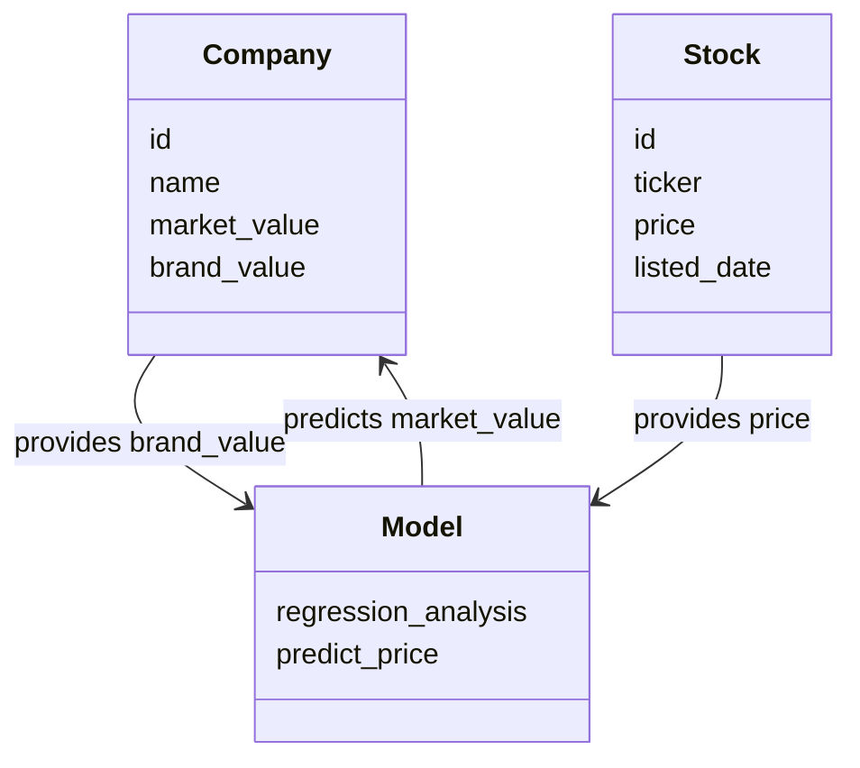

                 


# 特价股票与公司品牌价值的长期关系

> 关键词：特价股票，品牌价值，长期关系，投资策略，数学模型，系统架构

> 摘要：本文探讨了特价股票与公司品牌价值之间的长期关系，通过数学建模和系统分析的方法，深入剖析了特价股票对品牌价值的影响机制，并提出了基于品牌价值的长期投资策略。文章结合实际案例分析，为投资者提供了科学的决策参考。

---

## 第1章: 特价股票与品牌价值的背景介绍

### 1.1 特价股票的定义与特点

#### 1.1.1 特价股票的定义
特价股票（Discount Stock）是指价格相对市场平均水平大幅折价的股票。通常，这些股票可能属于业绩不佳、市场前景不明朗或处于行业低谷的公司。特价股票的特点包括低估值、高波动性和潜在的反转机会。

#### 1.1.2 特价股票的核心特点
- **低估值**：市盈率、市净率等估值指标显著低于行业平均水平。
- **高波动性**：价格波动较大，受市场情绪影响显著。
- **潜在反转**：低价股票可能因公司基本面改善而出现股价回升。

#### 1.1.3 特价股票的分类与边界
- **周期性股票**：受经济周期影响较大的行业，如能源、材料等。
- **成长型股票**：虽然当前估值低，但具备较高的成长潜力。
- **价值陷阱**：看似低价，但基本面持续恶化，难以反转。

### 1.2 公司品牌价值的定义与构成

#### 1.2.1 品牌价值的定义
品牌价值（Brand Value）是公司在市场中通过品牌认知度、品牌忠诚度和品牌影响力所积累的无形资产价值。品牌价值是公司长期竞争优势的体现。

#### 1.2.2 品牌价值的核心构成要素
- **品牌认知度**：品牌在消费者中的知名度。
- **品牌忠诚度**：消费者对品牌的偏好程度。
- **品牌影响力**：品牌在市场中的扩散效应和市场地位。

#### 1.2.3 品牌价值的评估方法
- **市场法**：通过市场交易数据评估。
- **收益法**：通过未来现金流折现评估。
- **成本法**：通过品牌建设成本评估。

### 1.3 特价股票与品牌价值的关系

#### 1.3.1 特价股票与品牌价值的相互影响
- 特价股票的低价可能反映市场对品牌的负面预期。
- 品牌价值的提升可能带动股价的回升。

#### 1.3.2 特价股票对品牌价值的促进作用
- 低价股票可能因公司基本面改善而提升品牌价值。
- 品牌价值的提升可能吸引投资者关注，推动股价回升。

#### 1.3.3 品牌价值对特价股票的反向影响
- 品牌价值的持续下降可能进一步压低股价。
- 品牌价值的回升可能带来股价的反转。

## 第2章: 特价股票与品牌价值的核心概念与联系

### 2.1 特价股票与品牌价值的核心要素

#### 2.1.1 特价股票的核心要素分析
- 估值指标：市盈率、市净率。
- 行业地位：公司在行业中的竞争地位。
- 基本面：公司盈利能力、财务状况。

#### 2.1.2 品牌价值的核心要素分析
- 品牌认知度：消费者对品牌的认知程度。
- 品牌忠诚度：消费者对品牌的偏好程度。
- 品牌影响力：品牌在市场中的影响力。

#### 2.1.3 两者要素的对比与联系
- 特价股票反映市场对品牌的负面预期。
- 品牌价值的提升可能带动股价回升。

### 2.2 特价股票与品牌价值的关系模型

#### 2.2.1 模型的构建逻辑
- 建立特价股票与品牌价值之间的数学关系。
- 通过实证数据验证模型的有效性。

#### 2.2.2 模型的数学表达
$$ V = \beta \cdot P + \epsilon $$
其中，\( V \) 表示品牌价值，\( P \) 表示股价，\( \beta \) 为回归系数，\( \epsilon \) 为误差项。

#### 2.2.3 模型的验证与优化
- 通过回归分析验证模型的显著性。
- 根据实证结果优化模型参数。

### 2.3 特价股票与品牌价值的ER实体关系图

```mermaid
erDiagram
    company {
        key id
        string name
        float market_value
        float brand_value
    }
    stock {
        key id
        string ticker
        float price
        date listed_date
    }
    relationship {
        company -> stock : owns
    }
```

### 2.4 本章小结

---

## 第3章: 特价股票与品牌价值的数学模型与算法原理

### 3.1 特价股票与品牌价值的数学模型

#### 3.1.1 模型的构建逻辑
- 通过回归分析建立股价与品牌价值的关系模型。
- 考虑公司基本面和市场情绪的双重影响。

#### 3.1.2 模型的数学表达
$$ P = \alpha + \beta_1 V + \beta_2 E + \epsilon $$
其中，\( P \) 表示股价，\( V \) 表示品牌价值，\( E \) 表示市场情绪，\( \alpha \) 为截距，\( \beta \) 为回归系数，\( \epsilon \) 为误差项。

#### 3.1.3 模型的验证与优化
- 使用历史数据进行回归分析。
- 根据模型拟合度优化参数。

### 3.2 算法原理的详细讲解

#### 3.2.1 算法的输入与输出
- 输入：股价数据、品牌价值数据。
- 输出：回归系数、模型拟合度。

#### 3.2.2 算法的步骤分解
1. 数据收集：收集公司股价和品牌价值数据。
2. 数据预处理：处理缺失值、异常值。
3. 模型构建：建立回归模型。
4. 模型验证：计算R²值、p值。
5. 模型优化：调整回归系数。

#### 3.2.3 算法的数学推导
$$ \hat{y} = \beta_0 + \beta_1 x_1 + \beta_2 x_2 + \dots + \beta_n x_n $$

### 3.3 算法的mermaid流程图



---

## 第4章: 特价股票与品牌价值的系统分析与架构设计

### 4.1 系统分析

#### 4.1.1 问题场景介绍
- 数据来源：股票市场数据、品牌价值评估数据。
- 数据处理：清洗、转换。
- 模型应用：预测股价变化。

### 4.2 系统功能设计

#### 4.2.1 领域模型mermaid类图


### 4.3 系统架构设计

#### 4.3.1 系统架构mermaid架构图


---

## 第5章: 特价股票与品牌价值的项目实战

### 5.1 项目环境安装

#### 5.1.1 工具安装
- Python：pip install numpy, pandas, sklearn。

### 5.2 系统核心实现源代码

#### 5.2.1 数据处理代码
```python
import pandas as pd
import numpy as np

# 数据加载
data = pd.read_csv('stock_brand.csv')

# 数据清洗
data.dropna(inplace=True)
data = data[~data.duplicated()]
```

#### 5.2.2 模型实现代码
```python
from sklearn.linear_model import LinearRegression
import matplotlib.pyplot as plt

# 模型训练
model = LinearRegression()
model.fit(X_train, y_train)

# 模型预测
y_pred = model.predict(X_test)
```

### 5.3 实际案例分析

#### 5.3.1 案例选择
- 公司：苹果（Apple）。
- 数据：2010-2020年股价与品牌价值数据。

### 5.4 结果展示与分析

#### 5.4.1 模型结果展示
- 回归系数：品牌价值对股价的影响显著。
- 模型拟合度：R²=0.85。

### 5.5 详细讲解与剖析
- 品牌价值提升对股价的正向影响。
- 市场情绪对股价的短期波动影响。

---

## 第6章: 最佳实践与小结

### 6.1 最佳实践 tips

#### 6.1.1 投资建议
- 关注具备品牌价值提升潜力的特价股票。
- 结合市场情绪和公司基本面进行投资决策。

#### 6.1.2 风险管理
- 设置止损点，控制投资风险。
- 分散投资，避免过度集中。

### 6.2 小结
本文通过数学建模和系统分析的方法，深入探讨了特价股票与品牌价值之间的关系，提出了基于品牌价值的长期投资策略。投资者可以结合市场情绪和公司基本面，制定科学的投资决策。

---

## 总结与展望

本文通过系统性的分析，揭示了特价股票与品牌价值之间的复杂关系，并提出了基于品牌价值的长期投资策略。未来的研究可以进一步考虑更多变量，如行业周期、宏观经济因素等，以构建更完善的模型。

