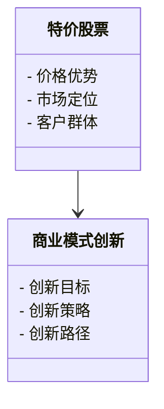
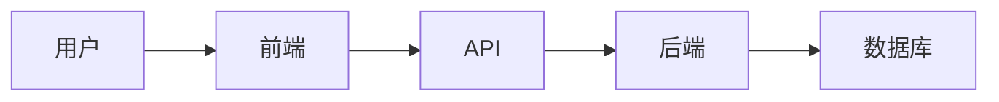
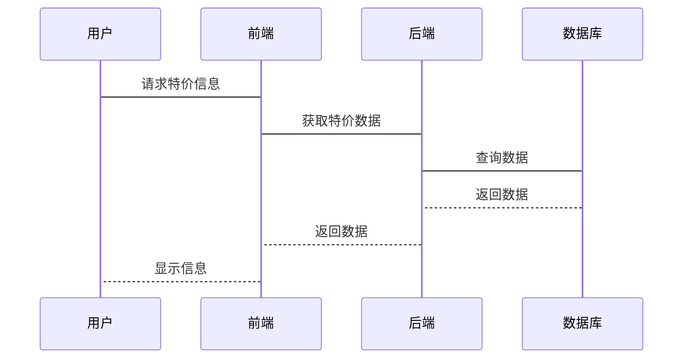

                 


# 《特价股票与公司商业模式创新的关系探讨》

---

## 关键词：
- 特价股票
- 商业模式创新
- 企业战略
- 价格策略
- 创新管理

---

## 摘要：
本文系统探讨了特价股票与公司商业模式创新之间的关系，从背景、核心概念、系统分析到项目实战，层层递进，结合实际案例和算法模型，深入剖析了特价股票如何影响商业模式创新，并为企业的战略制定提供了实践指导和优化建议。

---

# 第一部分: 特价股票与公司商业模式创新的背景与概念

# 第1章: 特价股票与公司商业模式创新的背景

## 1.1 特价股票的定义与特征
### 1.1.1 特价股票的定义
特价股票指的是以低于市场价甚至成本价销售的产品或服务，其核心目标是通过价格优势吸引大量客户，扩大市场份额，建立品牌忠诚度。这种策略常见于零售、科技和服务业，例如亚马逊的Prime会员专属优惠和Netflix的订阅模式。

### 1.1.2 特价股票的核心特征
- **价格优势**：低于市场价或成本价，吸引价格敏感型客户。
- **市场定位**：面向大众市场或特定客户群体，如学生、老年人等。
- **客户关系**：通过优惠绑定客户，提升客户忠诚度。

### 1.1.3 特价股票的市场定位与目标客户
- **目标客户**：价格敏感型客户、新客户获取、品牌忠诚度培养。
- **市场定位**：通过低价策略进入新市场或扩大现有市场份额。

## 1.2 公司商业模式创新的背景
### 1.2.1 商业模式的概念与演变
商业模式是企业创造和传递价值的方式，经历了从传统的产品销售到订阅制、免费增值等多元化模式的演变。当前，数字化转型和技术驱动使得商业模式创新成为企业保持竞争力的关键。

### 1.2.2 当前商业模式创新的趋势
- **订阅制**：Netflix、SaaS模式的成功案例。
- **免费增值**：通过免费基础服务吸引用户，付费解锁高级功能。
- **数据驱动**：利用大数据优化定价策略和用户体验。

### 1.2.3 商业模式创新的核心驱动力
- **技术进步**：云计算、人工智能等技术降低了运营成本，提高了效率。
- **市场需求变化**：消费者对个性化、便捷性需求的增加。
- **竞争压力**：行业竞争加剧，迫使企业不断创新以保持竞争优势。

## 1.3 特价股票与公司商业模式创新的关系
### 1.3.1 特价股票对商业模式的影响
- **收入来源多样化**：通过特价吸引新客户，进而通过订阅或其他增值服务变现。
- **成本结构优化**：规模化效应降低单位成本，提升整体盈利能力。

### 1.3.2 商业模式创新对特价股票的作用
- **提升客户粘性**：通过创新商业模式，如捆绑销售、会员制度，增强客户对特价产品的依赖。
- **扩大收入来源**：将特价策略与增值服务结合，实现多元化收入。

### 1.3.3 两者关系的理论框架
通过商业模式画布分析，特价股票作为价值主张的一部分，影响企业的客户关系、收入来源和成本结构。商业模式创新则通过优化这些要素，提升特价策略的效果。

## 1.4 本章小结
本章介绍了特价股票和商业模式创新的基本概念，并分析了它们之间的关系。接下来将深入探讨核心概念和系统架构，进一步分析两者如何相互作用。

---

# 第二部分: 特价股票与公司商业模式创新的核心概念与联系

# 第2章: 特价股票与公司商业模式创新的核心概念

## 2.1 特价股票的商业模式分析
### 2.1.1 特价股票的收入来源
- **直接收入**：通过特价销售获得的收入。
- **间接收入**：通过会员、广告等其他增值服务获得收入。

### 2.1.2 特价股票的成本结构
- **采购成本**：产品的生产或采购成本。
- **运营成本**：物流、仓储、客服等成本。
- **营销成本**：特价推广的广告和促销费用。

### 2.1.3 特价股票的客户关系
- **客户获取**：通过特价吸引新客户。
- **客户保留**：通过会员制度、优惠券等增强客户粘性。

## 2.2 公司商业模式创新的要素
### 2.2.1 创新目标
- **提升客户体验**：通过个性化服务、便捷的购买渠道等提升客户满意度。
- **降低成本**：通过技术优化、流程再造降低运营成本。

### 2.2.2 创新策略
- **产品创新**：开发新产品或服务。
- **服务创新**：优化客户服务流程，提升服务质量。
- **流程创新**：采用新技术或新方法优化内部流程。

### 2.2.3 创新实施路径
- **技术驱动**：利用人工智能、大数据等技术优化定价策略和运营流程。
- **组织驱动**：建立创新团队，鼓励内部创新文化。

## 2.3 特价股票与商业模式创新的对比分析
### 2.3.1 核心要素对比
通过对比表格分析特价股票和商业模式创新在收入来源、成本结构、客户关系等方面的差异和联系。

| 要素         | 特价股票                | 商业模式创新            |
|--------------|------------------------|-----------------------|
| 收入来源     | 特价销售、增值服务       | 多元化收入来源          |
| 成本结构     | 采购、物流、营销成本     | 技术、管理优化成本      |
| 客户关系     | 吸引新客户、增强粘性     | 提升客户体验、忠诚度    |

### 2.3.2 优劣势分析
- **优势**：特价股票通过价格优势快速获取市场份额，商业模式创新通过多元化收入提升整体盈利能力。
- **劣势**：特价股票可能导致短期亏损，商业模式创新需要较高的研发投入和时间成本。

### 2.3.3 综合评价框架
通过ER图展示特价股票和商业模式创新的关系，分析它们如何在企业中相互作用，提升整体竞争力。

```mermaid
erDiagram
    customer
    {
        <name>
        <id>
    }
    product
    {
        <name>
        <price>
        <description>
    }
    subscription
    {
        <type>
        <cost>
        <benefits>
    }
    transaction
    {
        <id>
        <date>
        <total>
    }
    customer --> product : 购买
    customer --> subscription : 订阅
    product --> transaction : 订单
    subscription --> transaction : 费用
```

## 2.4 本章小结
本章通过对比分析，深入探讨了特价股票和商业模式创新的核心要素及其关系。接下来将从系统架构的角度，分析如何将这些概念应用到实际企业运营中。

---

# 第三部分: 特价股票与公司商业模式创新的系统分析

# 第3章: 特价股票与公司商业模式创新的系统架构

## 3.1 系统功能设计
### 3.1.1 领域模型设计
通过领域模型分析特价股票和商业模式创新在系统中的作用。



### 3.1.2 系统架构设计
设计一个支持特价股票和商业模式创新的系统架构。


### 3.1.3 功能模块设计
- **用户界面**：展示特价信息、订阅选项。
- **订单处理**：处理特价订单和订阅服务。
- **数据分析**：分析特价策略对商业模式创新的影响。

## 3.2 系统实现细节
### 3.2.1 数据流设计
展示系统中的数据流动。



### 3.2.2 系统交互设计
通过序列图展示用户与系统之间的交互。



## 3.3 本章小结
本章通过系统架构和数据流分析，展示了如何将特价股票和商业模式创新整合到企业系统中。接下来将通过实际案例进一步验证这些理论。

---

# 第四部分: 特价股票与公司商业模式创新的项目实战

# 第4章: 项目实战分析

## 4.1 项目背景与目标
以某科技公司为例，分析其如何通过特价股票和商业模式创新提升竞争力。

## 4.2 数据准备与分析
### 4.2.1 数据收集
收集公司过去几年的销售数据、客户反馈、竞争对手分析等。

### 4.2.2 数据分析
使用Python进行数据分析，识别特价策略对客户留存率和收入的影响。

```python
import pandas as pd
import matplotlib.pyplot as plt

# 加载数据
data = pd.read_csv('sales_data.csv')

# 绘制特价与非特价产品的销售对比图
plt.figure(figsize=(10,6))
data['is_promo'].value_counts().plot(kind='bar')
plt.title('特价与非特价产品销售对比')
plt.xlabel('是否特价')
plt.ylabel('销售数量')
plt.show()
```

## 4.3 系统实现
### 4.3.1 系统设计
设计一个包含特价股票和商业模式创新功能的系统。

### 4.3.2 系统实现
通过Python代码实现部分核心功能，例如客户分群、价格预测等。

```python
from sklearn.linear_model import LinearRegression
import numpy as np

# 数据准备
X = np.array([[1], [2], [3], [4], [5]])
y = np.array([1, 2, 3, 4, 5])

# 训练模型
model = LinearRegression()
model.fit(X, y)

# 预测
print(model.predict([[6]]))
```

## 4.4 项目总结与优化建议
### 4.4.1 项目总结
总结项目实施的效果，评估特价股票和商业模式创新对公司的实际影响。

### 4.4.2 优化建议
基于项目结果，提出进一步优化的建议，例如调整定价策略、优化客户服务流程等。

---

# 第五部分: 总结与展望

# 第5章: 总结与展望

## 5.1 本文总结
总结全文内容，强调特价股票和商业模式创新之间的相互作用，以及它们对企业战略的重要性。

## 5.2 未来展望
探讨未来可能的发展趋势，例如人工智能在定价策略中的应用，数据驱动的商业模式创新等。

## 5.3 最佳实践 tips
- **数据驱动**：利用数据分析优化定价策略。
- **客户为中心**：通过客户反馈调整商业模式。
- **技术赋能**：采用新技术提升运营效率。

## 5.4 注意事项
- **风险控制**：避免因低价策略导致短期亏损。
- **客户体验**：确保创新不影响用户体验。

## 5.5 拓展阅读
推荐相关书籍和论文，供读者进一步学习。

---

通过以上目录结构，本文系统地探讨了特价股票与公司商业模式创新的关系，结合理论分析和实际案例，为企业的战略制定提供了有价值的参考。

