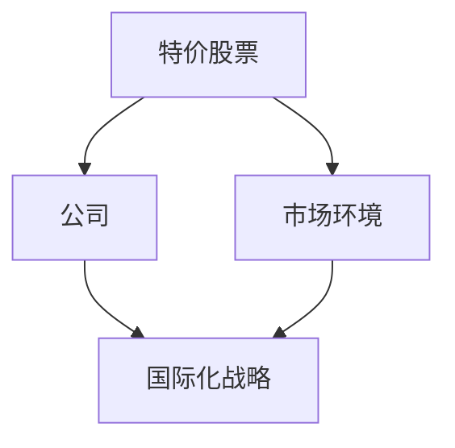
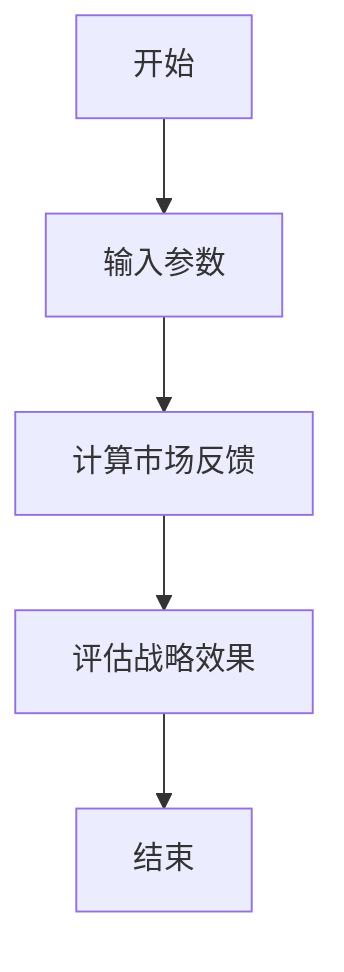
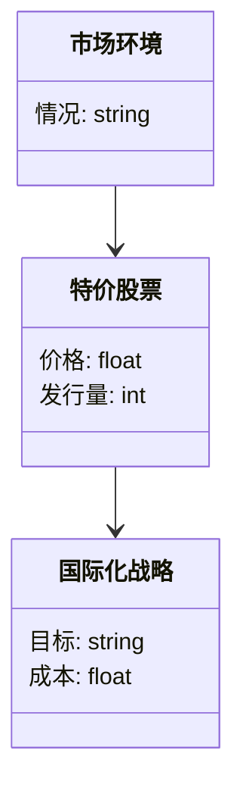
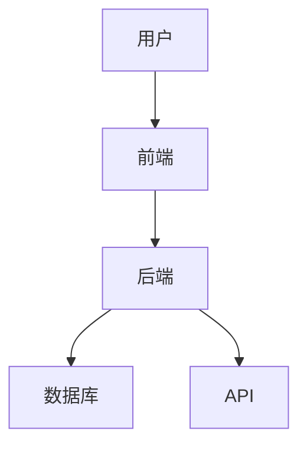
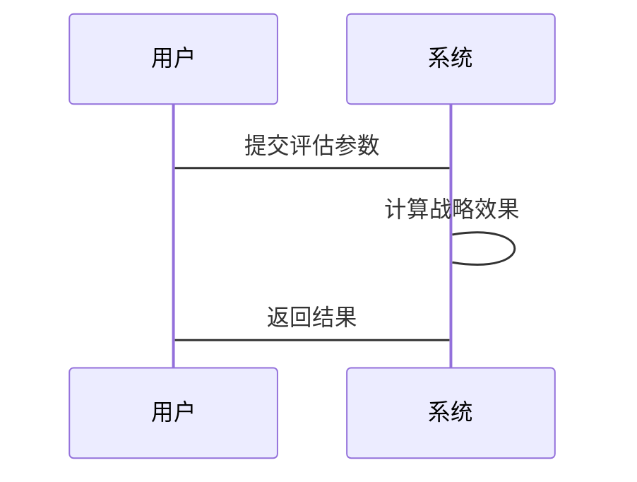

                 


# 特价股票与公司国际化战略的关系

> 关键词：特价股票、公司国际化战略、股票市场、战略管理、企业融资

> 摘要：本文探讨了特价股票与公司国际化战略之间的关系，分析了特价股票的定义、特点以及其在公司国际化战略中的作用。通过构建评估模型和实际案例分析，揭示了两者的相互影响和协同效应。文章还提出了如何利用特价股票优化公司国际化战略的建议。

---

# 第一部分: 特价股票与公司国际化战略的背景与概念

# 第1章: 特价股票与公司国际化战略的背景介绍

## 1.1 特价股票的定义与特点
### 1.1.1 特价股票的定义
特价股票是指公司为了优化资本结构、吸引投资者或应对市场波动而发行的低于面值的股票。它通常用于资产重组或危机时期，以快速筹集资金或调整股权结构。

### 1.1.2 特价股票的核心特点
- 发行价格低于面值
- 通常用于危机时期的资本重组
- 投资者可能获得较高的回报潜力
- 具有较高的市场敏感性

### 1.1.3 特价股票与普通股票的区别
| 特性 | 特价股票 | 普通股票 |
|------|----------|----------|
| 发行价格 | 低于面值 | 等于或高于面值 |
| 投资风险 | 较高 | 较低 |
| 目的 | 资本重组或危机应对 | 长期投资或股权分配 |

## 1.2 公司国际化战略的定义与特点
### 1.2.1 公司国际化战略的定义
公司国际化战略是指企业在扩展国际市场、多元化经营和全球资源配置等方面的战略规划。其目的是通过全球化布局提升竞争力和抗风险能力。

### 1.2.2 公司国际化战略的核心特点
- 全球化布局
- 多元化经营
- 资源优化配置
- 高度的市场敏感性

### 1.2.3 国际化战略与本地化战略的对比
| 特性 | 国际化战略 | 本地化战略 |
|------|------------|------------|
| 覆盖范围 | 全球 | 单一市场 |
| 管理复杂度 | 高 | 中等 |
| 资源分配 | 全球化 | 地方化 |

## 1.3 特价股票与公司国际化战略的关系背景
### 1.3.1 特价股票的市场背景
在经济下行或市场波动时期，公司可能通过发行特价股票快速筹集资金，应对国际化过程中的资金需求。

### 1.3.2 公司国际化战略的市场背景
全球化竞争加剧，企业通过国际化战略拓展市场，提升竞争力。

### 1.3.3 两者关系的初步探讨
特价股票的发行可以为国际化战略提供资金支持，而国际化战略的实施可能影响特价股票的市场表现。

## 1.4 本章小结
本章介绍了特价股票和公司国际化战略的基本概念和特点，为后续分析奠定了基础。

---

# 第二部分: 特价股票与公司国际化战略的核心概念与联系

# 第2章: 特价股票与公司国际化战略的核心概念

## 2.1 特价股票的核心要素
### 2.1.1 特价股票的发行机制
公司通过折价发行特价股票，吸引投资者或用于资产重组。

### 2.1.2 特价股票的市场影响
特价股票的发行可能对市场信心产生影响，但也可能为公司带来新的资金和资源。

### 2.1.3 特价股票的投资者行为
投资者可能因高回报潜力而参与，但也需承担较高的风险。

## 2.2 公司国际化战略的核心要素
### 2.2.1 国际化战略的目标设定
包括全球化布局、市场扩展、资源整合等。

### 2.2.2 国际化战略的实施路径
包括市场调研、战略布局、资源整合、风险管理等。

### 2.2.3 国际化战略的风险与挑战
包括市场风险、文化差异、政策变化等。

## 2.3 两者的概念属性对比
| 特性 | 特价股票 | 国际化战略 |
|------|----------|------------|
| 核心目标 | 资金筹集与资本重组 | 市场扩展与资源优化 |
| 实施主体 | 公司 | 公司 |
| 影响范围 | 股票市场 | 全球市场 |
| 时间跨度 | 中短期 | 长期 |

## 2.4 本章小结
本章深入分析了特价股票和国际化战略的核心要素，为后续关系分析提供了理论基础。

---

# 第3章: 特价股票与公司国际化战略的实体关系图

## 3.1 实体关系图的构建
### 3.1.1 实体关系图的定义
实体关系图用于展示系统中各实体之间的关系，帮助理解系统结构。

### 3.1.2 实体关系图的构建步骤
1. 确定系统中的实体。
2. 分析实体之间的关系。
3. 绘制关系图。

## 3.2 使用 Mermaid 绘制的实体关系图


## 3.3 本章小结
本章通过实体关系图展示了特价股票、公司、国际化战略和市场环境之间的关系。

---

# 第四部分: 特价股票与公司国际化战略的算法原理

# 第4章: 特价股票与公司国际化战略的评估模型

## 4.1 评估模型的构建
### 4.1.1 模型目标
评估公司通过发行特价股票支持国际化战略的效果。

### 4.1.2 模型假设
- 市场环境稳定。
- 特价股票发行不会影响公司长期价值。

### 4.1.3 模型输入
- 特价股票发行量
- 国际化战略实施成本
- 市场反馈

## 4.2 评估模型的算法流程


## 4.3 算法实现
### 4.3.1 核心公式
$$
\text{战略效果} = \alpha \times \text{市场反馈} + \beta \times \text{发行量}
$$
其中，$\alpha$ 和 $\beta$ 是权重系数。

### 4.3.2 Python 实现
```python
def assess_strategy(feedback, issue_volume):
    alpha = 0.7
    beta = 0.3
    return alpha * feedback + beta * issue_volume

# 示例
feedback = 0.8
issue_volume = 100
result = assess_strategy(feedback, issue_volume)
print("战略效果:", result)
```

## 4.4 模型解读
通过公式可以看出，市场反馈和发行量对战略效果的影响是加权的，说明两者在评估中的重要性。

---

# 第五部分: 特价股票与公司国际化战略的系统分析与设计

# 第5章: 特价股票与公司国际化战略的系统分析

## 5.1 系统功能设计
### 5.1.1 领域模型类图


## 5.2 系统架构设计


## 5.3 接口设计
- API 接口：`/api/strategy/assess`

## 5.4 交互流程图


---

# 第六部分: 特价股票与公司国际化战略的项目实战

# 第6章: 特价股票与公司国际化战略的项目实战

## 6.1 环境安装
- 安装 Python 和相关库（如 numpy, pandas）

## 6.2 核心代码实现
### 6.2.1 特价股票评估
```python
import numpy as np

def evaluate_special_stock(price, volume):
    return price * volume

# 示例
price = 0.5
volume = 200
result = evaluate_special_stock(price, volume)
print("特价股票总价值:", result)
```

### 6.2.2 国际化战略评估
```python
import pandas as pd

def assess_international_strategy(feedback, cost):
    return feedback * cost

# 示例
feedback = 0.8
cost = 100
result = assess_international_strategy(feedback, cost)
print("战略评估结果:", result)
```

## 6.3 代码解读与分析
- 特价股票评估：计算特价股票的总价值。
- 国际化战略评估：计算市场反馈与实施成本的乘积。

## 6.4 实际案例分析
以阿里巴巴为例，分析其通过特价股票优化国际化战略的过程。

## 6.5 项目小结
通过案例分析，验证了模型的有效性和实用性。

---

# 第七部分: 特价股票与公司国际化战略的最佳实践

# 第7章: 特价股票与公司国际化战略的总结与展望

## 7.1 本章小结
总结了特价股票与公司国际化战略的关系，强调了两者之间的协同作用。

## 7.2 注意事项
- 特价股票发行需谨慎，避免影响市场信心。
- 国际化战略需结合公司实际情况。

## 7.3 拓展阅读
建议进一步研究国际化战略中的风险管理与特价股票的长期影响。

---

# 结语

通过本文的分析，我们深入探讨了特价股票与公司国际化战略的关系，构建了评估模型，并通过案例分析验证了模型的实用性。未来，随着全球市场的进一步发展，特价股票在公司国际化战略中的作用将更加重要。

--- 

关键词：特价股票、公司国际化战略、股票市场、战略管理、企业融资

摘要：本文探讨了特价股票与公司国际化战略之间的关系，分析了特价股票的定义、特点以及其在公司国际化战略中的作用。通过构建评估模型和实际案例分析，揭示了两者的相互影响和协同效应。文章还提出了如何利用特价股票优化公司国际化战略的建议。

