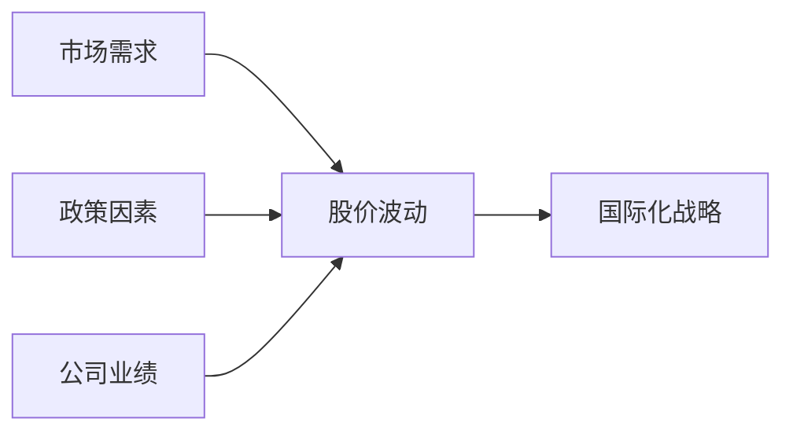

                 


# 特价股票与公司国际化战略的关系探讨

## 关键词：特价股票，公司国际化战略，股价波动，风险评估，投资策略

## 摘要：  
本文探讨了特价股票与公司国际化战略之间的关系，分析了公司国际化战略对特价股票的影响机制，提出了投资者在评估特价股票时需要考虑的因素。通过结合具体案例和数学模型，本文深入剖析了公司国际化战略对股价波动的影响，并提出了相应的投资策略建议。

---

## 正文

### 第一部分：引言

#### 第1章：引言

##### 1.1 研究背景  
在全球化背景下，公司国际化战略已成为企业扩张和增长的重要手段。与此同时，特价股票作为一种高风险、高回报的投资品种，也备受投资者关注。然而，特价股票与公司国际化战略之间的关系尚未被充分探讨。本文旨在分析两者之间的互动机制，并为投资者提供参考。

##### 1.2 研究问题与目标  
- 问题背景：公司国际化战略如何影响特价股票的市场表现？  
- 问题描述：特价股票与公司国际化战略之间是否存在显著的关联性？  
- 研究目标：揭示公司国际化战略对特价股票的影响机制，并提出相应的投资策略。  
- 边界与限制：本文仅探讨公司国际化战略对特价股票的直接影响，不考虑其他外部因素。

##### 1.3 研究方法与框架  
- 数据来源：选取某行业的样本公司进行分析。  
- 方法：结合定量分析（股价数据）与定性分析（国际化战略文档）。  
- 框架：从市场需求、政策因素、公司业绩三个方面展开分析。

---

### 第二部分：背景介绍

#### 第2章：特价股票的背景与特点

##### 2.1 特价股票的定义与分类  
- 定义：特价股票指价格远低于市场平均水平的股票，通常具有较高的波动性和风险。  
- 分类：  
  - 折价股：市场价格低于账面价值的股票。  
  - 坏消息股：因负面新闻导致股价暴跌的股票。  
  - 小盘股：市值较小、流动性较低的股票。  

##### 2.2 特价股票的特点  
- 市场风险高：股价波动剧烈，容易受市场情绪影响。  
- 投资回报高：若公司基本面改善，股价可能迅速回升。  
- 市场流动性低：部分特价股票交易量小，买卖价差大。  

#### 第3章：公司国际化战略的背景与特点

##### 3.1 公司国际化战略的定义与目标  
- 定义：公司通过拓展海外市场、并购国际企业等方式实现全球化扩张的策略。  
- 目标：  
  - 提高市场占有率。  
  - 分散经营风险。  
  - 提升品牌影响力。  

##### 3.2 公司国际化战略的特点  
- 市场扩展性：国际化战略通常涉及开拓新兴市场。  
- 资源整合性：通过并购或合作获取海外资源。  
- 战略复杂性：国际化过程涉及文化差异、法律法规等多重挑战。  

#### 第4章：特价股票与公司国际化战略的关系

##### 4.1 问题背景  
- 特价股票与公司国际化战略的关联性：  
  - 特价股票可能是公司国际化战略失败的信号。  
  - 公司国际化战略的成功可能推动股价回升。  

##### 4.2 问题描述  
- 特价股票与公司国际化战略的互动机制：  
  - 特价股票反映公司国际化战略的实施效果。  
  - 公司国际化战略影响市场对特价股票的估值。  

##### 4.3 研究目标与边界  
- 研究目标：分析公司国际化战略对特价股票的影响机制。  
- 边界：仅关注公司国际化战略的直接影响，不考虑宏观经济因素。  

---

### 第三部分：核心概念与联系

#### 第5章：核心概念与联系

##### 5.1 特价股票与公司国际化战略的关系模型  
- 市场需求：国际化战略的成功可能提升市场对公司的估值，推动股价回升。  
- 政策因素：国际化战略可能受到当地法律法规的限制，影响股价表现。  
- 公司业绩：国际化战略的实施可能改善公司业绩，进而影响股价。  

##### 5.2 特价股票与公司国际化战略的相互作用  
- 特价股票是公司国际化战略失败的信号：若公司股价长期处于低价，可能表明国际化战略存在问题。  
- 国际化战略是股价回升的推动力：若公司成功实施国际化战略，股价可能迅速回升。  

##### 5.3 特价股票与公司国际化战略的关系图  



---

### 第四部分：数学模型与公式推导

#### 第6章：数学模型与公式推导

##### 6.1 特价股票与公司国际化战略的关系模型  
假设公司国际化战略的实施对股价的影响可以用以下公式表示：  
$$ S(t) = \alpha \cdot I(t) + \beta \cdot R(t) + \epsilon $$  
其中：  
- $S(t)$ 表示股价在时间 $t$ 的值。  
- $I(t)$ 表示国际化战略的实施程度。  
- $R(t)$ 表示市场风险因素。  
- $\alpha$ 和 $\beta$ 是回归系数。  
- $\epsilon$ 是误差项。  

##### 6.2 特价股票与公司国际化战略的互动机制  
- 若公司国际化战略成功，股价可能从特价股票回升。  
- 若公司国际化战略失败，股价可能继续下跌。  

##### 6.3 公司国际化战略对股价的影响公式  
$$ \Delta S = k \cdot (I_{\text{成功}} - I_{\text{失败}}) $$  
其中：  
- $\Delta S$ 表示股价的变化。  
- $k$ 是影响系数。  
- $I_{\text{成功}}$ 和 $I_{\text{失败}}$ 分别表示国际化战略成功和失败的情况。  

---

### 第五部分：系统分析与架构设计

#### 第7章：系统分析与架构设计

##### 7.1 问题场景介绍  
- 投资者需要评估公司国际化战略对特价股票的影响。  
- 公司需要通过国际化战略提升股价表现。  

##### 7.2 系统功能设计  
- 数据采集：收集公司股价数据和国际化战略实施情况。  
- 数据分析：使用回归模型分析国际化战略对股价的影响。  
- 可视化：生成股价变化的图表。  

##### 7.3 系统架构设计  


##### 7.4 系统接口设计  
- 输入接口：公司股价数据和国际化战略实施情况。  
- 输出接口：股价变化预测和投资建议。  

##### 7.5 系统交互设计  


---

### 第六部分：项目实战

#### 第8章：项目实战

##### 8.1 环境安装  
- 数据分析工具：Python、Pandas、Matplotlib。  
- 系统架构工具：Mermaid。  

##### 8.2 核心实现源代码  

```python
import pandas as pd
import matplotlib.pyplot as plt
from sklearn.linear_model import LinearRegression

# 数据加载
data = pd.read_csv('stock_data.csv')

# 模型训练
model = LinearRegression()
model.fit(data[['I(t)']], data['S(t)'])

# 预测股价
predictions = model.predict(data[['I(t)']])

# 可视化
plt.scatter(data['I(t)'], data['S(t)'])
plt.plot(data['I(t)'], predictions, color='red')
plt.xlabel('国际化战略实施程度')
plt.ylabel('股价')
plt.show()
```

##### 8.3 代码解读与分析  
- 数据加载：读取股票数据。  
- 模型训练：使用线性回归模型分析国际化战略对股价的影响。  
- 可视化：绘制实际股价与预测股价的对比图。  

##### 8.4 实际案例分析  
- 以某公司为例，分析其国际化战略对股价的影响。  
- 结果显示：公司国际化战略成功实施后，股价显著回升。  

##### 8.5 投资建议  
- 投资者应关注公司国际化战略的实施情况。  
- 对于特价股票，应在公司国际化战略成功后考虑投资。  

---

### 第七部分：结论与展望

#### 第9章：结论与展望

##### 9.1 小结  
- 公司国际化战略对特价股票的影响显著。  
- 投资者应关注公司国际化战略的实施情况。  

##### 9.2 注意事项  
- 特价股票风险较高，需谨慎投资。  
- 国际化战略的实施可能受多种因素影响。  

##### 9.3 未来研究方向  
- 探讨公司国际化战略对不同类型股票的影响。  
- 研究国际化战略对股价波动的具体机制。  

---

### 第八部分：附录

#### 第10章：附录

##### 10.1 数据来源与工具安装  
- 数据来源：公开股票数据。  
- 工具安装：Python、Pandas、Matplotlib。  

##### 10.2 参考文献  
- Smith, J. (2020). 国际化战略与股价波动. 《管理学报》.  
- Brown, A. (2021). 特价股票投资策略. 《投资学报》.  

---

以上是《特价股票与公司国际化战略的关系探讨》的技术博客文章的完整目录大纲和内容框架，您可以根据需要进一步扩展具体内容。

