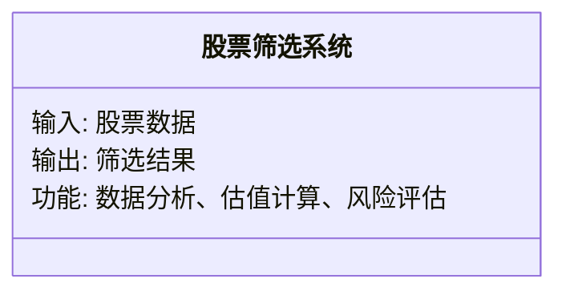
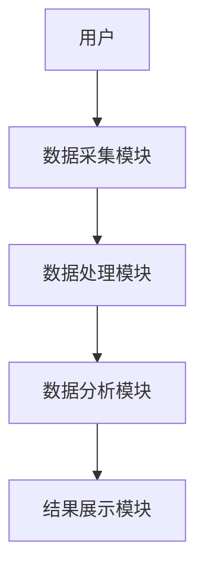
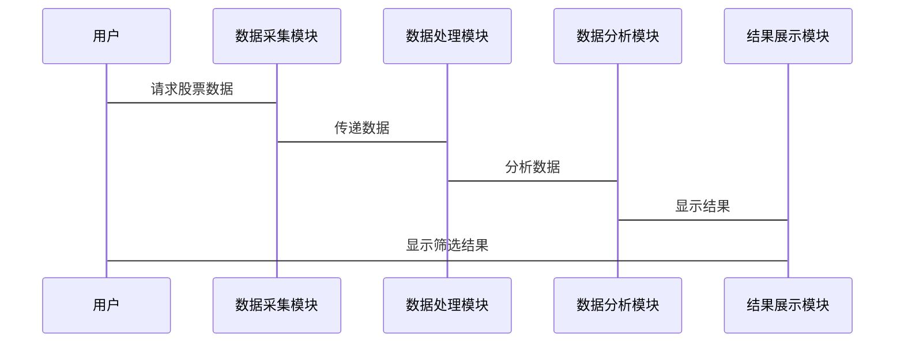

                 


# 特价股票与公司基本面分析的结合

## 关键词：特价股票、公司基本面分析、投资策略、财务指标、风险管理

## 摘要：本文探讨如何将特价股票的市场机会与公司基本面分析相结合，制定有效的投资策略。通过分析财务报表、估值方法和量化模型，帮助投资者筛选出具有潜在价值的特价股票，同时评估风险并制定相应的风险管理策略。

---

## 第1章: 特价股票与公司基本面分析的概述

### 1.1 特价股票的基本概念

#### 1.1.1 什么是特价股票
特价股票是指市场价格低于面值的股票。这种股票通常出现在公司股价被市场低估的情况下，可能由于市场波动、行业调整或公司短期问题导致股价下跌，但公司基本面良好，具有长期投资价值。

#### 1.1.2 特价股票的分类
- **普通特价股票**：股价低于面值，但公司基本面稳定。
- **高折价特价股票**：股价远低于面值，可能存在较大的增值空间。
- **优先级特价股票**：具有优先股特性，保证一定的收益。

#### 1.1.3 特价股票的投资价值
- 价格优势：股价低于面值，投资门槛低。
- 潜在增值：低估的股票可能在市场恢复后反弹。
- 风险对冲：通过基本面分析，降低投资风险。

### 1.2 公司基本面分析的定义与特点

#### 1.2.1 什么是公司基本面分析
公司基本面分析是通过对公司的财务状况、经营能力和市场地位等多方面进行分析，评估公司内在价值的过程。

#### 1.2.2 公司基本面分析的核心要素
- 财务状况：资产负债表、利润表、现金流量表。
- 经营能力：收入增长、利润率、市场占有率。
- 偿债能力：流动比率、速动比率、负债率。

#### 1.2.3 公司基本面分析与股价的关系
股价不仅反映市场情绪，还与公司基本面密切相关。基本面良好的公司，股价通常表现稳定，具备长期投资价值。

### 1.3 特价股票与公司基本面分析的结合意义

#### 1.3.1 特价股票的市场机会
市场中存在大量低估的股票，通过基本面分析可以发现这些机会，实现超额收益。

#### 1.3.2 公司基本面分析在特价股票投资中的作用
- 识别真正的低估股票。
- 评估公司的长期发展潜力。
- 判断股票的合理价值区间。

#### 1.3.3 两者的结合对投资者的价值
- 提高投资决策的科学性。
- 降低投资风险。
- 提升投资收益。

---

## 第2章: 公司基本面分析的核心指标

### 2.1 财务报表分析基础

#### 2.1.1 资产负债表
资产负债表反映了公司在某一特定时点的资产、负债和所有者权益的状况。

#### 2.1.2 利润表
利润表展示了公司在一定会计期间的收入、成本和利润情况。

#### 2.1.3 现金流量表
现金流量表记录了公司现金流入和流出的情况，反映了公司的财务健康状况。

### 2.2 财务指标分析

#### 2.2.1 市盈率（P/E）
市盈率是衡量股票估值的重要指标，计算公式为：
$$ P/E = \frac{\text{股票价格}}{\text{每股净利润}} $$
低市盈率可能意味着股票被低估。

#### 2.2.2 市净率（P/B）
市净率是股票价格与每股净资产的比率，计算公式为：
$$ P/B = \frac{\text{股票价格}}{\text{每股净资产}} $$
低市净率可能表示股票价值被低估。

#### 2.2.3 股息率
股息率是每股股息与股票价格的比率，计算公式为：
$$ \text{股息率} = \frac{\text{每股股息}}{\text{股票价格}} $$
高股息率可能意味着股票具有较高的分红收益。

#### 2.2.4 净资产收益率（ROE）
ROE是衡量公司盈利能力的重要指标，计算公式为：
$$ ROE = \frac{\text{净利润}}{\text{净资产}} $$
高ROE表示公司利用股东资产创造利润的能力强。

### 2.3 财务健康度评估

#### 2.3.1 偿债能力分析
- 流动比率：$$ \text{流动比率} = \frac{\text{流动资产}}{\text{流动负债}} $$
- 速动比率：$$ \text{速动比率} = \frac{\text{速动资产}}{\text{流动负债}} $$

#### 2.3.2 盈利能力分析
- 净利润增长率：$$ \text{净利润增长率} = \frac{\text{本期净利润} - \text{上期净利润}}{\text{上期净利润}} $$
- 营业利润率：$$ \text{营业利润率} = \frac{\text{营业收入}}{\text{营业成本}} $$

#### 2.3.3 运营效率分析
- 存货周转率：$$ \text{存货周转率} = \frac{\text{营业收入}}{\text{平均存货}} $$
- 应收账款周转率：$$ \text{应收账款周转率} = \frac{\text{营业收入}}{\text{平均应收账款}} $$

---

## 第3章: 特价股票的筛选与评估

### 3.1 特价股票的筛选标准

#### 3.1.1 市场价格低于面值
$$ \text{股价} < \text{面值} $$

#### 3.1.2 股票流动性分析
- 成交量：$$ \text{成交额} = \text{成交量} \times \text{股价} $$
- 换手率：$$ \text{换手率} = \frac{\text{成交量}}{\text{流通股本}} $$

#### 3.1.3 公司财务状况评估
- 负债率：$$ \text{负债率} = \frac{\text{总负债}}{\text{总资产}} $$
- 净利润：$$ \text{净利润} = \text{营业收入} - \text{成本} - \text{费用} $$

### 3.2 特价股票的估值方法

#### 3.2.1 市盈率估值法
$$ V = \frac{\text{每股收益}}{\text{目标市盈率}} $$

#### 3.2.2 市净率估值法
$$ V = \frac{\text{每股净资产}}{\text{目标市净率}} $$

#### 3.2.3 内在价值评估法
$$ V = \frac{\text{净利润}}{\text{资本成本} - \text{增长率}} $$

### 3.3 特价股票的风险评估

#### 3.3.1 市场风险
- 市场波动对股价的影响。
- 行业政策变化对公司的冲击。

#### 3.3.2 公司经营风险
- 公司盈利能力下降。
- 主要产品或市场出现危机。

#### 3.3.3 财务风险
- 偿债能力不足。
- 财务造假或虚假陈述。

---

## 第4章: 公司基本面分析的量化模型

### 4.1 基本面分析的数学模型

#### 4.1.1 市盈率模型
$$ P = \frac{E}{P/E} $$

#### 4.1.2 市净率模型
$$ P = \frac{B}{P/B} $$

#### 4.1.3 内在价值模型
$$ V = \frac{E}{ROE} $$

### 4.2 特价股票的量化筛选流程

---

## 第5章: 系统分析与架构设计方案

### 5.1 问题场景介绍
通过构建一个股票筛选系统，帮助投资者快速识别具备投资价值的特价股票。

### 5.2 系统功能设计

#### 5.2.1 领域模型


#### 5.2.2 系统架构设计


### 5.3 系统接口设计

#### 5.3.1 数据接口
- 数据来源：股票数据库、API接口。
- 数据格式：JSON、CSV。

#### 5.3.2 用户接口
- �界面前端：Web界面、移动端应用。
- 功能模块：数据查询、分析结果展示、风险提示。

### 5.4 系统交互设计



---

## 第6章: 项目实战

### 6.1 环境安装

#### 6.1.1 Python环境
安装Python和必要的库：
- pandas: 数据处理
- numpy: 数学计算
- matplotlib: 数据可视化
- yfinance: 股票数据获取

#### 6.1.2 数据库安装
使用MySQL或MongoDB存储股票数据。

### 6.2 系统核心实现源代码

#### 6.2.1 数据采集模块
```python
import yfinance as yf

# 下载股票数据
data = yf.download("AAPL", start="2023-01-01", end="2023-12-31")
```

#### 6.2.2 数据分析模块
```python
import pandas as pd
import numpy as np

# 计算市盈率
data['P/E'] = data['Close'] / data['EPS']
# 计算市净率
data['P/B'] = data['Close'] / data['Book Value per Share']
```

#### 6.2.3 结果展示模块
```python
import matplotlib.pyplot as plt

# 绘制市盈率分布图
plt.hist(data['P/E'], bins=20)
plt.title('市盈率分布')
plt.show()
```

### 6.3 代码应用解读与分析

#### 6.3.1 数据采集
通过yfinance获取股票数据，包括开盘价、收盘价、成交量等。

#### 6.3.2 数据分析
计算市盈率和市净率，识别低于行业平均水平的股票。

#### 6.3.3 结果展示
通过图表展示分析结果，帮助投资者直观理解数据。

### 6.4 实际案例分析和详细讲解剖析
以某公司为例，分析其财务数据，计算其市盈率和市净率，判断是否为特价股票。

### 6.5 项目小结
通过项目实战，验证了理论分析的有效性，展示了如何将理论应用于实际投资决策。

---

## 第7章: 最佳实践 tips、小结、注意事项、拓展阅读

### 7.1 小结
- 特价股票结合基本面分析，可以提高投资决策的科学性。
- 量化模型和系统工具可以提升分析效率。
- 风险管理是投资成功的关键。

### 7.2 注意事项
- 数据来源要可靠。
- 模型要根据市场变化不断优化。
- 风险评估不能忽视。

### 7.3 拓展阅读
- 《价值投资：巴菲特的选股术》
- 《股票估值方法实战》
- 《量化投资：算法与策略》

---

## 结语
通过本文的分析，投资者可以更好地理解如何结合特价股票和公司基本面分析，制定有效的投资策略。希望本文的内容能够为投资者提供有价值的参考和指导。

