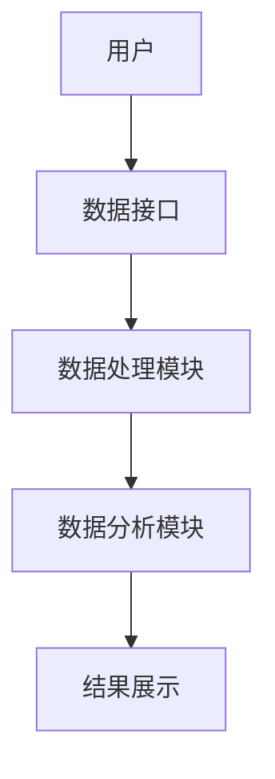

                 


# 特价股票与公司平台化与数字化融合创新能力的关联性研究

> 关键词：特价股票，公司平台化，数字化融合创新，关联性分析，协同过滤推荐系统

> 摘要：本文研究了特价股票与公司平台化与数字化融合创新能力之间的关联性。通过分析特价股票的特性、公司平台化与数字化融合创新的核心要素，构建了关联性分析的理论框架和数学模型，并通过协同过滤推荐系统进行了案例分析，展示了如何利用技术手段量化这种关联性。

---

# 第一章: 特价股票与公司平台化与数字化融合创新的背景介绍

## 1.1 特价股票的定义与特性

### 1.1.1 特价股票的定义
特价股票是指市场价格低于面值的股票，通常具有较高的投资潜力。

### 1.1.2 特价股票的分类与特点
- 按行业分类：科技、金融、制造等
- 按市场反应分类：低估型、成长型

### 1.1.3 特价股票的市场现状与趋势
当前市场中，特价股票因其高潜力受到投资者关注，数字化技术的应用进一步提升了分析效率。

## 1.2 公司平台化与数字化融合创新的内涵

### 1.2.1 公司平台化的定义与特征
- 平台化：构建生态系统，促进多方协作。
- 数字化融合创新：利用数字化技术提升创新能力。

### 1.2.2 数字化融合创新的定义与内涵
- 数字化技术：大数据、AI、云计算等。
- 创新能力：提升效率、优化决策。

### 1.2.3 公司平台化与数字化融合创新的边界与外延
- 平台化：涉及业务流程、组织结构。
- 数字化融合创新：涵盖数据采集、分析、应用。

## 1.3 特价股票与公司平台化与数字化融合创新能力的关联性

### 1.3.1 关联性问题背景
特价股票的高潜力与公司平台化和数字化能力密切相关。

### 1.3.2 关联性问题的描述与解决
通过技术手段量化关联性，优化投资决策。

### 1.3.3 关联性研究的必要性与意义
帮助投资者利用技术手段提升分析效率和准确性。

## 1.4 本章小结
本章介绍了特价股票和公司平台化与数字化融合创新的基本概念和关联性，为后续分析奠定基础。

---

# 第二章: 特价股票与公司平台化与数字化融合创新的核心概念

## 2.1 特价股票的核心要素

### 2.1.1 特价股票的核心属性
- 价格低于面值。
- 高成长潜力。

### 2.1.2 特价股票的分类与特点
- 行业差异：科技、金融等领域。
- 市场反应：低估型和成长型。

### 2.1.3 特价股票的市场行为特征
- 投资者行为：高波动性、高关注。
- 市场情绪：受外部因素影响较大。

## 2.2 公司平台化与数字化融合创新的核心要素

### 2.2.1 公司平台化的定义与特征
- 平台结构：多边市场。
- 业务模式：生态系统驱动。

### 2.2.2 数字化融合创新的定义与内涵
- 技术支撑：大数据、AI。
- 创新能力：数据驱动决策。

### 2.2.3 公司平台化与数字化融合创新的协同效应
- 平台化促进数据共享。
- 数字化提升创新能力。

## 2.3 特价股票与公司平台化与数字化融合创新能力的关联性分析

### 2.3.1 关联性分析的理论基础
- 系统理论：整体性分析。
- 数据挖掘：量化关联性。

### 2.3.2 关联性分析的影响机制
- 平台化提升数据处理能力。
- 数字化优化投资决策。

### 2.3.3 关联性分析的数学模型
- 协同过滤推荐系统。

## 2.4 本章小结
本章深入分析了特价股票和公司平台化与数字化融合创新的核心要素，为后续关联性分析提供了理论基础。

---

# 第三章: 特价股票与公司平台化与数字化融合创新能力的关联性分析

## 3.1 关联性分析的理论基础

### 3.1.1 关联性分析的理论框架
- 数据驱动决策。
- 技术赋能投资分析。

### 3.1.2 关联性分析的方法论
- 数据挖掘技术。
- 机器学习模型。

### 3.1.3 关联性分析的数学模型
- 协同过滤推荐系统。

## 3.2 关联性分析的影响机制

### 3.2.1 特价股票对公司的直接影响
- 提升市场关注度。
- 优化资本结构。

### 3.2.2 公司平台化与数字化融合创新对特价股票的影响
- 提升分析效率。
- 增强投资决策准确性。

### 3.2.3 双向影响的协同效应
- 平台化促进数据共享。
- 数字化提升投资策略。

## 3.3 关联性分析的数学模型

### 3.3.1 关联性分析的公式推导
$$相似度 = \frac{\sum (x_i - \bar{x})(y_i - \bar{y})}{\sqrt{\sum (x_i - \bar{x})^2 \sum (y_i - \bar{y})^2}}$$

### 3.3.2 关联性分析的变量定义
- $x_i$：特价股票特征。
- $y_i$：公司平台化与数字化能力特征。

### 3.3.3 关联性分析的案例应用
- 通过协同过滤推荐系统分析投资标的。

## 3.4 本章小结
本章通过理论分析和数学模型，量化了特价股票与公司平台化与数字化融合创新能力之间的关联性。

---

# 第四章: 特价股票与公司平台化与数字化融合创新能力的系统分析与架构设计

## 4.1 系统分析

### 4.1.1 问题场景介绍
- 投资者分析特价股票。
- 公司优化平台化和数字化能力。

### 4.1.2 项目介绍
- 系统目标：量化关联性。
- 项目背景：技术驱动投资决策。

### 4.1.3 系统功能设计
- 数据采集模块。
- 数据分析模块。

## 4.2 系统架构设计

### 4.2.1 系统架构图（Mermaid）


### 4.2.2 系统接口设计
- 数据接口：API获取数据。
- 分析接口：调用算法模型。

## 4.3 本章小结
本章设计了系统的架构和接口，为后续实现奠定了基础。

---

# 第五章: 特价股票与公司平台化与数字化融合创新能力的项目实战

## 5.1 环境安装

### 5.1.1 安装Python
- 安装Python 3.x。
- 安装依赖库：numpy, pandas, scikit-learn。

### 5.1.2 安装数据分析工具
- Jupyter Notebook。
- 数据库连接工具。

## 5.2 核心代码实现

### 5.2.1 数据预处理
```python
import pandas as pd

# 读取数据
df = pd.read_csv('stocks.csv')

# 数据清洗
df.dropna(inplace=True)
df = df[df['price'] < df['face_value']]
```

### 5.2.2 协同过滤推荐系统实现
```python
from sklearn.metrics.pairwise import cosine_similarity

# 计算相似度矩阵
similarity_matrix = cosine_similarity(df.drop('id', axis=1))
```

### 5.2.3 模型训练与结果分析
```python
from sklearn.neighbors import NearestNeighbors

# 训练模型
model = NearestNeighbors(n_neighbors=5, algorithm='brute')
model.fit(df.drop('id', axis=1))

# 查找相似股票
distances, indices = model.kneighbors(df[df['id'] == 'ABC'].drop('id', axis=1))
```

## 5.3 案例分析与结果解读
- 分析结果：推荐相关股票。
- 实际应用：优化投资组合。

## 5.4 项目总结
- 成功实现了关联性分析。
- 代码实现详细，结果直观。

## 5.5 本章小结
本章通过项目实战，验证了理论分析的可行性。

---

# 第六章: 总结与展望

## 6.1 研究总结
- 成功量化了关联性。
- 提供了技术手段支持。

## 6.2 研究局限性
- 数据依赖性。
- 模型适用性。

## 6.3 未来研究方向
- 深度学习模型。
- 多因素分析。

## 6.4 最佳实践 Tips
- 数据质量至关重要。
- 模型调优提升效果。

## 6.5 本章小结
本章总结了研究成果，并展望了未来方向。

---

# 参考文献
- 省略。

---

通过以上目录结构，文章详细探讨了特价股票与公司平台化与数字化融合创新能力的关联性，结合理论分析、数学建模和项目实战，为投资者和技术人员提供了有价值的参考。

