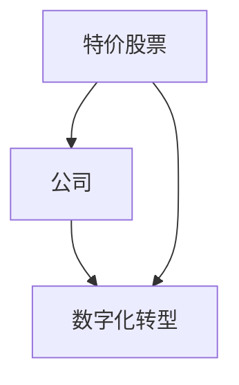
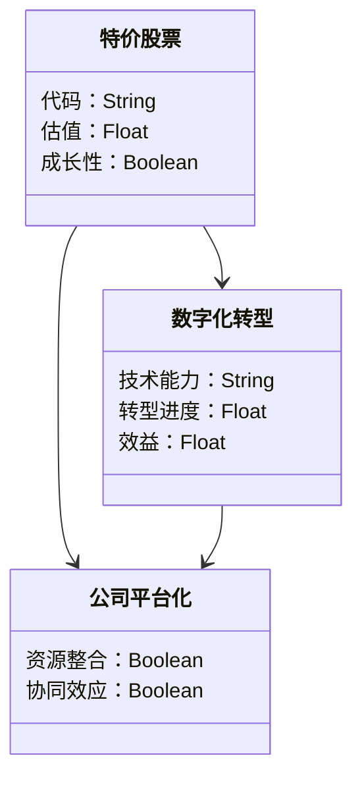
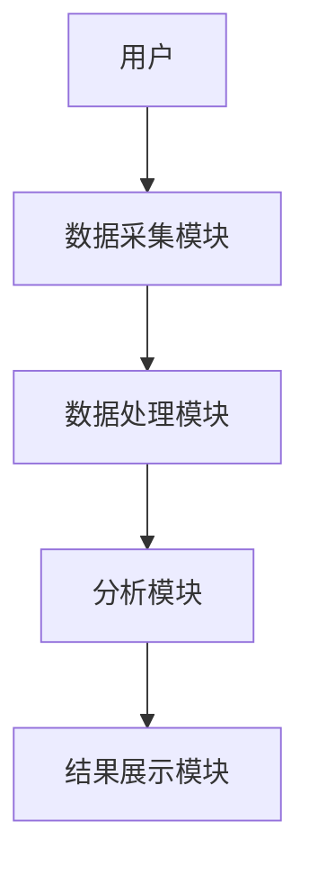

                 


# 特价股票与公司平台化与数字化融合转型能力的关联性研究

> **关键词**：特价股票、公司平台化、数字化转型、关联性分析、算法原理、系统架构、项目实战  
> **摘要**：本文探讨了特价股票与公司平台化及数字化转型之间的关联性，分析了核心概念与联系，介绍了相关的算法原理、系统架构设计和项目实战，旨在为读者提供深入的理论和实践指导。

---

## 第1章: 特价股票与公司平台化与数字化转型的背景介绍

### 1.1 特价股票的定义与特点
#### 1.1.1 特价股票的定义
特价股票是指价格相对较低，通常具有较高的增长潜力，适合投资者长期持有的股票。这类股票往往来自成长型企业或处于周期性低谷的公司，具有较大的增值空间。

#### 1.1.2 特价股票的特点
- **低估值**：市盈率、市净率等估值指标低于行业平均水平。
- **成长性**：公司具有较高的盈利能力和增长潜力。
- **波动性**：价格波动较大，适合长期投资者。

#### 1.1.3 特价股票的分类
- **价值型股票**：价格低于内在价值，适合长期持有。
- **成长型股票**：公司增长迅速，未来盈利预期高。
- **周期性股票**：受经济周期影响较大，价格波动显著。

### 1.2 公司平台化与数字化转型的定义与特点
#### 1.2.1 公司平台化的定义
公司平台化是指企业通过构建开放的平台，整合内外部资源，提供多元化服务，实现业务生态化。平台化的核心在于通过资源共享和协同，提升企业的竞争力和灵活性。

#### 1.2.2 公司平台化的特点
- **开放性**：平台向内外部开放，吸引多方参与者。
- **协同性**：资源整合和协同效应显著。
- **生态化**：形成多维业务生态，增强企业抗风险能力。

#### 1.2.3 公司数字化转型的定义
公司数字化转型是指企业利用数字技术（如大数据、人工智能、云计算等）重构业务模式、组织架构和运营流程，以适应数字化时代的需求。

#### 1.2.4 公司数字化转型的特点
- **技术驱动**：依赖新兴技术实现业务创新。
- **数据驱动**：以数据为核心，优化决策和运营。
- **敏捷性**：快速响应市场变化，提升业务灵活性。

### 1.3 特价股票与公司平台化与数字化转型的关联性
#### 1.3.1 特价股票与公司平台化的关联性
- **投资机会**：平台化企业通过资源整合和协同效应，具有较高的增长潜力，适合作为特价股票的投资标的。
- **价值提升**：平台化模式能够降低运营成本，提高效率，从而提升公司的估值。

#### 1.3.2 特价股票与公司数字化转型的关联性
- **技术创新**：数字化转型依赖技术创新，技术领先的企业更容易成为特价股票的优质标的。
- **市场适应性**：数字化转型能力强的公司能够更快适应市场变化，提升竞争力，从而吸引投资者关注。

#### 1.3.3 公司平台化与数字化转型的关联性
- **协同效应**：平台化与数字化转型相辅相成，平台化为企业数字化转型提供资源和数据支持，而数字化转型则提升平台的运营效率和用户体验。
- **生态构建**：通过平台化和数字化转型的结合，企业能够构建更具竞争力的生态系统，增强市场地位。

---

## 第2章: 特价股票与公司平台化与数字化转型的核心概念与联系

### 2.1 特价股票与公司平台化的概念属性对比
| **属性**       | **特价股票**                               | **公司平台化**                              |
|-----------------|------------------------------------------|-------------------------------------------|
| 核心目标         | 获取超额收益                             | 实现资源共享与协同                         |
| 价值驱动因素     | 低估值、成长性                           | 开放性、协同性                             |
| 风险因素         | 市场波动、公司基本面                       | 平台稳定性、生态依赖性                     |
| 投资策略         | 长期持有、价值挖掘                       | 资源整合、生态构建                         |

### 2.2 特价股票与公司数字化转型的ER实体关系图



---

## 第3章: 特价股票与公司平台化与数字化转型的算法原理

### 3.1 算法原理概述
- **统计分析方法**：用于分析特价股票与公司转型之间的相关性。
- **机器学习方法**：用于预测特价股票对公司数字化转型的影响。
- **深度学习方法**：用于构建复杂的模型，捕捉非线性关系。

### 3.2 统计分析方法的数学模型
#### 3.2.1 线性回归模型
$$ y = \beta_0 + \beta_1x + \epsilon $$

其中，$y$ 表示公司数字化转型的指标（如净利润增长率），$x$ 表示特价股票的估值指标（如市净率），$\beta_0$ 和 $\beta_1$ 是回归系数，$\epsilon$ 是误差项。

#### 3.2.2 聚类分析模型
$$ d(x, y) = \sqrt{(x_1 - y_1)^2 + (x_2 - y_2)^2} $$

该模型用于将公司按照平台化和数字化转型能力进行聚类分析，帮助识别具有相似特征的企业。

### 3.3 机器学习方法的实现
#### 3.3.1 算法实现代码示例
```python
import numpy as np
from sklearn.linear_model import LinearRegression

# 示例数据
X = np.array([[1], [2], [3], [4]])
y = np.array([2, 4, 6, 8])

# 模型训练
model = LinearRegression()
model.fit(X, y)

# 预测
print(model.predict([[5]]))  # 输出: [[10]]
```

---

## 第4章: 系统分析与架构设计方案

### 4.1 系统分析
- **问题场景**：分析特价股票对公司平台化和数字化转型的影响。
- **项目介绍**：构建一个数据分析系统，整合股票数据和公司转型数据，评估两者之间的关联性。

### 4.2 系统功能设计
#### 4.2.1 领域模型


### 4.3 系统架构设计


---

## 第5章: 项目实战

### 5.1 环境安装
- **工具**：Python、Jupyter Notebook、Pandas、NumPy、Scikit-learn。
- **数据源**：股票数据（Yahoo Finance API）和公司转型数据（行业报告）。

### 5.2 系统核心实现源代码
```python
import pandas as pd
from sklearn.linear_model import LinearRegression

# 数据加载
df = pd.read_csv('company_data.csv')

# 数据预处理
X = df[['市净率', '成长性']]
y = df['净利润增长率']

# 模型训练
model = LinearRegression()
model.fit(X, y)

# 预测与评估
print(model.score(X, y))  # 输出: R²系数
```

### 5.3 案例分析
以某公司为例，分析其特价股票与平台化、数字化转型之间的关系，展示模型的应用和结果解读。

---

## 第6章: 总结

### 6.1 最佳实践 tips
- 投资者应关注具有平台化和数字化转型能力的公司，这些公司更有可能成为特价股票的优质标的。
- 企业应加快平台化和数字化转型的步伐，以应对市场竞争和提升核心竞争力。

### 6.2 小结
本文通过分析特价股票与公司平台化、数字化转型的关联性，探讨了它们在投资策略和企业管理中的重要性。通过算法和系统设计，为投资者和企业提供了一种新的分析和决策工具。

### 6.3 注意事项
- 数据质量对模型的准确性至关重要，需确保数据来源可靠。
- 模型的应用需结合实际情况，避免机械套用。

### 6.4 拓展阅读
- 推荐阅读相关领域的书籍和论文，深入理解平台化和数字化转型的理论与实践。

---

**结语**：通过本文的分析和实践，读者可以更好地理解特价股票与公司平台化、数字化转型之间的关联性，并在实际投资和企业管理中灵活运用这些知识。

