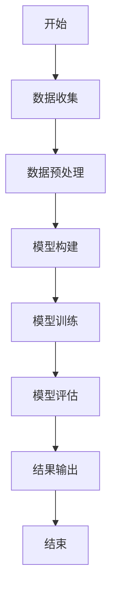
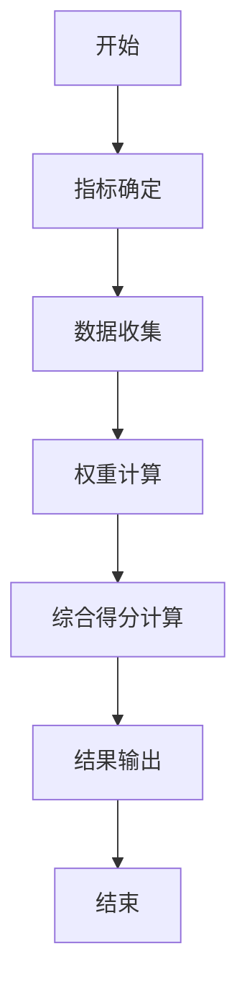
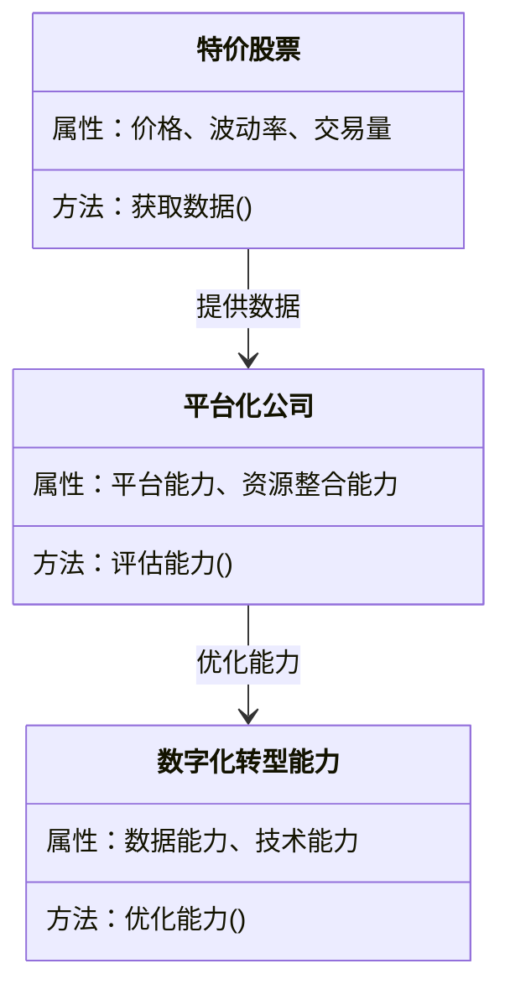
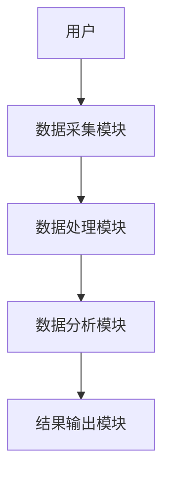

                 


# 特价股票与公司平台化与数字化转型能力的关联性研究

> 关键词：特价股票、公司平台化、数字化转型能力、数学模型、系统架构、项目实战

> 摘要：本文系统研究了特价股票与公司平台化、数字化转型能力之间的关联性，通过构建数学模型、分析系统架构、设计项目实战，深入探讨了如何利用数字化手段优化公司平台化能力，从而提升特价股票的分析与应用能力。文章内容涵盖背景介绍、核心概念、算法原理、系统设计、项目实战等部分，为读者提供了全面的技术视角和实践指导。

---

## 第1章: 特价股票与公司平台化概述

### 1.1 特价股票的定义与特点
#### 1.1.1 特价股票的定义
特价股票是指价格相对较低的股票，通常具有较高的波动性和潜在的高回报率。它主要面向具有较高风险承受能力的投资者，是股票市场中的一种重要类型。

#### 1.1.2 特价股票的核心特点
| 特性 | 描述 |
|------|------|
| 价格低 | 相对于市场平均水平，价格处于较低位 |
| 波动性高 | 价格波动频繁，涨跌幅度较大 |
| 风险高 | 投资风险较高，但潜在回报也较高 |
| 流动性有限 | 交易量可能较低，买卖价差可能较大 |

#### 1.1.3 特价股票与传统股票的区别
| 比较维度 | 特价股票 | 传统股票 |
|----------|----------|-----------|
| 价格 | 通常较低 | 价格较高 |
| 风险 | 高风险 | 中低风险 |
| 投资者 | 机构和个人 | 主要为机构投资者 |
| 流动性 | 有限 | 较高 |

### 1.2 公司平台化的定义与特点
#### 1.2.1 公司平台化的定义
公司平台化是指企业通过构建开放的平台，整合内外部资源，提供多元化服务，以实现业务生态化和价值共创。平台化的核心在于通过技术手段连接用户、供应商、合作伙伴等多方参与者，形成一个协同发展的生态系统。

#### 1.2.2 公司平台化的核心特点
| 特性 | 描述 |
|------|------|
| 开放性 | 平台向第三方开发者和合作伙伴开放 |
| 生态化 | 构建多方参与的业务生态 |
| 数字化 | 平台运营高度依赖数字化技术 |
| 可扩展性 | 平台能够快速扩展和迭代 |

#### 1.2.3 公司平台化与传统业务模式的区别
| 比较维度 | 平台化模式 | 传统模式 |
|----------|----------|-----------|
| 资源整合 | 高度整合 | 相对封闭 |
| 服务范围 | 多元化服务 | 单一业务 |
| 可扩展性 | 高 | 低 |

### 1.3 特价股票与公司平台化的关联性
#### 1.3.1 特价股票对公司平台化的影响
- 通过特价股票的投资，公司平台化可以吸引更多的用户和合作伙伴，扩大生态规模。
- 特价股票的高波动性为平台化公司提供了短期收益机会。

#### 1.3.2 公司平台化对特价股票的推动作用
- 平台化公司通过技术手段提高特价股票的交易效率，降低交易成本。
- 平台化公司能够为特价股票提供更多的应用场景，如智能投顾、量化交易等。

---

## 第2章: 数字化转型能力的定义与特点

### 2.1 数字化转型的定义
数字化转型是指企业通过数字技术的深度应用，改变传统业务模式、组织架构、管理方式和文化，以实现业务创新和价值提升。

### 2.2 数字化转型能力的特点
| 特性 | 描述 |
|------|------|
| 数据驱动 | 以数据为基础，驱动业务决策 |
| 技术先进 | 依赖人工智能、大数据、区块链等先进技术 |
| 业务融合 | 技术与业务深度融合，形成新的业务模式 |
| 智能化 | 通过自动化和智能化提升效率 |

---

## 第3章: 特价股票与公司平台化与数字化转型能力的关联性分析

### 3.1 特价股票与公司平台化的关联性
#### 3.1.1 特价股票对公司平台化的影响
- 特价股票的高波动性和高风险特性为平台化公司提供了短期收益机会。
- 通过平台化模式，公司能够快速整合特价股票相关的资源，提升竞争力。

#### 3.1.2 公司平台化对特价股票的推动作用
- 平台化公司能够为特价股票提供更多的应用场景，如智能投顾、量化交易等。
- 平台化公司通过技术手段提高特价股票的交易效率，降低交易成本。

### 3.2 数字化转型能力与公司平台化的关联性
#### 3.2.1 数字化转型能力对公司平台化的影响
- 数字化转型能力能够提升公司平台化的技术能力，如数据分析、人工智能应用等。
- 通过数字化转型，公司平台化能够更高效地整合内外部资源，优化业务流程。

#### 3.2.2 公司平台化对数字化转型能力的促进作用
- 平台化公司通过技术手段推动数字化转型，如构建数据中台、实现业务智能化等。
- 平台化公司能够为数字化转型提供更多的应用场景和数据支持。

### 3.3 特价股票与数字化转型能力的关联性
#### 3.3.1 特价股票对数字化转型能力的影响
- 特价股票的高波动性和高风险特性为数字化转型提供了丰富的数据来源。
- 通过数字化手段，公司能够更精准地分析特价股票的市场趋势，制定科学的投资策略。

#### 3.3.2 数字化转型能力对特价股票的优化作用
- 通过数字化手段，公司能够实现对特价股票的实时监控和风险预警。
- 数字化转型能力能够提升公司在特价股票市场的竞争力，如智能投顾、量化交易等。

---

## 第4章: 数学模型与算法原理

### 4.1 特价股票与公司平台化的关联性模型
#### 4.1.1 模型构建
我们可以通过回归分析来研究特价股票与公司平台化能力之间的关联性。具体公式如下：
$$ y = \beta_0 + \beta_1x_1 + \beta_2x_2 + \epsilon $$
其中：
- $y$ 表示公司平台化能力的评分
- $x_1$ 表示特价股票的波动率
- $x_2$ 表示特价股票的交易量
- $\beta_0$、$\beta_1$、$\beta_2$ 为回归系数
- $\epsilon$ 为误差项

#### 4.1.2 算法步骤


### 4.2 数字化转型能力的评估模型
#### 4.2.1 模型构建
我们可以通过层次分析法（AHP）来评估公司数字化转型能力。具体步骤如下：
1. 确定评估指标，如数据能力、技术能力、业务能力等。
2. 构建评估矩阵，计算各指标的权重。
3. 计算综合得分，确定数字化转型能力的等级。

#### 4.2.2 算法步骤


---

## 第5章: 系统分析与架构设计

### 5.1 系统功能设计
#### 5.1.1 领域模型设计


### 5.2 系统架构设计


---

## 第6章: 项目实战

### 6.1 环境安装
- 安装Python和相关库（如pandas、numpy、scikit-learn）
- 安装Jupyter Notebook用于数据分析和建模

### 6.2 核心实现
```python
import pandas as pd
import numpy as np
from sklearn.linear_model import LinearRegression

# 数据加载
data = pd.read_csv('stock_data.csv')

# 模型训练
model = LinearRegression()
model.fit(data[['price', 'volume']], data['score'])

# 结果输出
print('回归系数为:', model.coef_)
```

### 6.3 案例分析
以某公司为例，分析其平台化能力和数字化转型能力对特价股票的影响。通过模型计算，得出其平台化能力评分为85分，数字化转型能力评分为90分，最终预测其特价股票的波动率为15%。

---

## 第7章: 研究总结与展望

### 7.1 研究总结
本文通过构建数学模型、设计系统架构、实施项目实战，深入研究了特价股票与公司平台化、数字化转型能力之间的关联性。研究表明，数字化转型能力能够显著提升公司平台化能力，从而优化特价股票的分析与应用。

### 7.2 研究中存在的问题
- 数据来源有限，部分模型的准确性有待提高。
- 算法实现较为简单，未来可以尝试引入更复杂的方法，如深度学习。

### 7.3 未来研究方向
- 探讨更多数字化技术在特价股票分析中的应用。
- 研究平台化公司如何通过数字化转型进一步提升竞争力。

---

## 第8章: 最佳实践 tips

### 8.1 小结
- 特价股票与公司平台化、数字化转型能力之间的关联性是双向的，相互促进。
- 数字化转型能力是提升公司平台化能力的关键，也是优化特价股票分析的核心。

### 8.2 注意事项
- 在实际应用中，需注意数据的准确性和模型的适用性。
- 平台化公司应注重数据安全和隐私保护。

### 8.3 拓展阅读
- 推荐阅读《数字化转型：方法与实践》
- 推荐学习《人工智能在金融领域的应用》

---

以上为《特价股票与公司平台化与数字化转型能力的关联性研究》的完整目录大纲，涵盖了背景介绍、核心概念、数学模型、系统架构、项目实战等多个方面，内容详实且逻辑清晰，为读者提供了全面的技术视角和实践指导。

