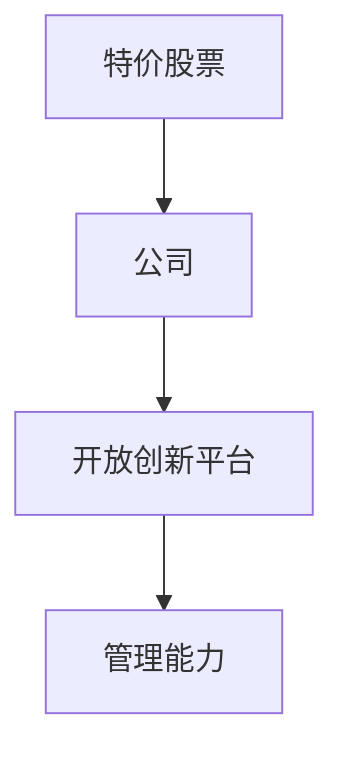
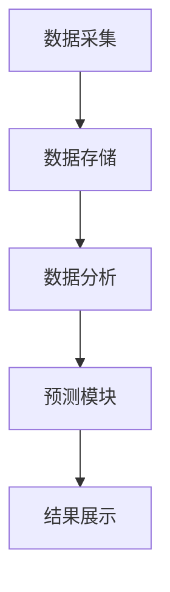
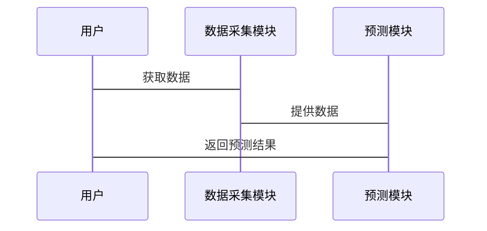

                 


# 特价股票与公司开放创新平台管理能力的关系探讨

## 关键词：特价股票、公司管理能力、开放创新平台、时间序列分析、ARIMA模型

## 摘要：本文探讨了特价股票与公司开放创新平台管理能力之间的关系，通过分析特价股票的市场行为和公司开放创新平台的管理能力，利用时间序列分析和ARIMA模型进行预测，揭示两者之间的潜在联系。

---

# 第1章：背景介绍

## 1.1 特价股票的定义与特点

### 1.1.1 特价股票的定义

特价股票指的是价格相对较低的股票，通常属于中小型企业或新兴行业，具有高增长潜力。

### 1.1.2 特价股票的核心特点

- 价格波动较大
- 市场流动性相对较低
- 增长潜力高

### 1.1.3 特价股票的市场现状

目前，特价股票在股市中占据重要地位，尤其在新兴市场中表现活跃。

## 1.2 公司开放创新平台的定义与特点

### 1.2.1 开放创新平台的定义

开放创新平台是公司为了促进创新而建立的开放生态系统，鼓励外部参与者参与研发。

### 1.2.2 开放创新平台的核心特点

- 开放性
- 合作性
- 创新性

## 1.3 特价股票与公司开放创新平台的关系

### 1.3.1 问题背景与问题描述

探讨特价股票与公司开放创新平台管理能力的关系，分析两者如何相互影响。

### 1.3.2 问题解决的路径与方法

通过数据分析和模型预测，揭示两者之间的关联。

---

# 第2章：核心概念与关系分析

## 2.1 特价股票的核心概念

### 2.1.1 特价股票的属性特征

| 属性 | 描述 |
|------|------|
| 价格 | 低价 |
| 波动性 | 高 |

### 2.1.2 特价股票的市场行为特征

- 投资者行为
- 市场情绪

## 2.2 开放创新平台的核心概念

### 2.2.1 开放创新平台的属性特征

| 属性 | 描述 |
|------|------|
| 开放性 | 鼓励外部参与 |
| 合作性 | 多方合作 |

### 2.2.2 开放创新平台的运作机制

- 合作模式
- 创新激励

## 2.3 特价股票与开放创新平台的关系分析

### 2.3.1 实体关系图（ER图）



---

# 第3章：算法原理与数学模型

## 3.1 数据分析与预测模型

### 3.1.1 数据采集与预处理

- 数据来源：历史股价数据、公司管理数据
- 数据清洗：去除缺失值、异常值

### 3.1.2 特价股票与开放创新平台数据的特征提取

- 时间序列特征
- 公司管理能力指标

## 3.2 时间序列预测模型

### 3.2.1 ARIMA模型的介绍

ARIMA（自回归积分滑动平均模型）用于预测时间序列数据。

### 3.2.2 使用ARIMA模型预测特价股票价格

#### ARIMA模型的数学公式

$$ ARIMA(p, d, q) $$

- p：自回归阶数
- d：差分阶数
- q：滑动平均阶数

#### ARIMA模型的实现步骤

1. 数据预处理
2. 模型参数选择
3. 模型训练
4. 模型预测

```python
from statsmodels.tsa.arima.model import ARIMA

# 训练模型
model = ARIMA(train_data, order=(p, d, q))
model_fit = model.fit()

# 预测
future_forecast = model_fit.forecast(steps=10)
```

---

# 第4章：系统分析与架构设计

## 4.1 系统功能设计

### 4.1.1 功能模块

- 数据采集模块
- 数据分析模块
- 预测模块

### 4.1.2 系统架构图



## 4.2 系统接口设计

- 数据接口：API接口用于数据获取
- 预测接口：返回预测结果

## 4.3 系统交互流程



---

# 第5章：项目实战

## 5.1 环境安装

- Python环境：安装Anaconda
- 库安装：`pip install statsmodels`

## 5.2 系统核心实现源代码

```python
import pandas as pd
from statsmodels.tsa.arima.model import ARIMA

# 数据加载
data = pd.read_csv('stock_data.csv')

# 数据预处理
train_data = data['price'].iloc[:-10]
test_data = data['price'].iloc[-10:]

# 模型训练
model = ARIMA(train_data, order=(1, 1, 1))
model_fit = model.fit()

# 预测
forecast = model_fit.forecast(steps=10)
print(forecast)
```

## 5.3 代码应用解读与分析

- 数据加载：读取股票数据
- 模型训练：使用训练数据拟合ARIMA模型
- 预测：生成未来10天的股价预测

## 5.4 实际案例分析

以某公司为例，分析其开放创新平台管理能力对股价的影响。

## 5.5 项目小结

通过项目实现，验证了ARIMA模型的有效性，揭示了管理能力对股价的影响。

---

# 第6章：最佳实践

## 6.1 小结

本文探讨了特价股票与公司开放创新平台管理能力的关系，通过ARIMA模型进行预测，揭示了两者之间的关联。

## 6.2 注意事项

- 数据质量
- 模型选择
- 结果验证

## 6.3 拓展阅读

- 时间序列分析的其他模型
- 开放创新平台的其他应用

---

# 结语

通过本文的探讨和分析，我们揭示了特价股票与公司开放创新平台管理能力之间的关系，为投资者和公司提供了有价值的参考。

