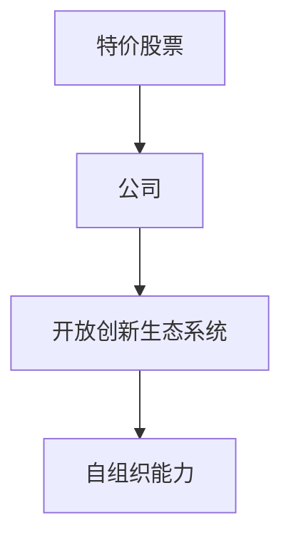
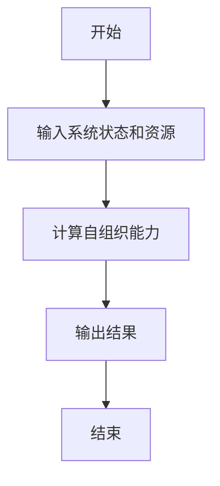
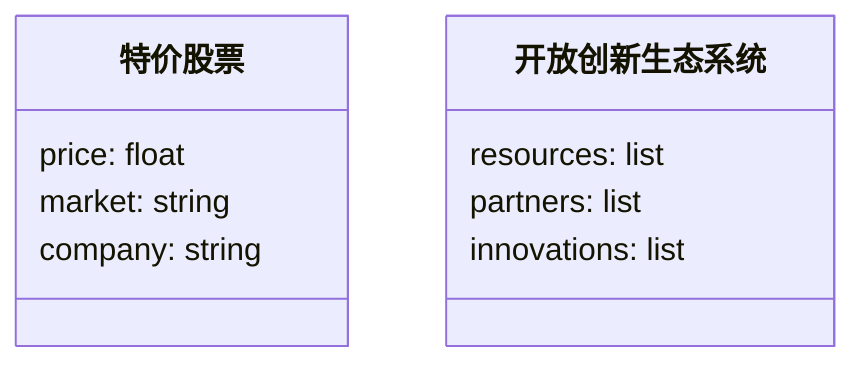
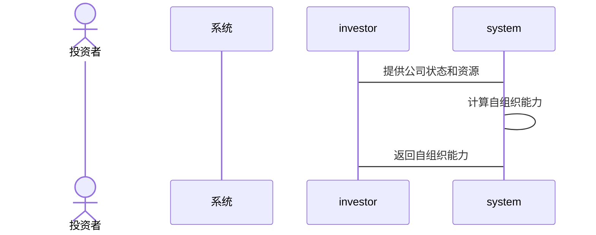

                 


# 特价股票与公司开放创新生态系统自组织能力的关系探讨

## 关键词
特价股票, 开放创新生态系统, 自组织能力, 公司价值, 股票定价

## 摘要
本文探讨了特价股票与公司开放创新生态系统自组织能力之间的关系。首先，我们介绍了特价股票和开放创新生态系统的定义及其重要性。接着，分析了两者之间的关系模型，提出了自组织能力的数学模型，并通过算法流程图详细说明了其实现步骤。最后，通过一个具体案例展示了如何在实际中应用这些模型，并总结了相关经验与最佳实践。

---

# 第一部分: 特价股票与公司开放创新生态系统概述

## 第1章: 特价股票与开放创新生态系统概述

### 1.1 特价股票的定义与特点

#### 1.1.1 特价股票的定义
特价股票是指价格相对较低的股票，通常被认为具有较高的投资潜力。这些股票可能来自财务状况良好但暂时被市场低估的公司，或是处于成长期的中小型企业。

#### 1.1.2 特价股票的核心特点
- **低估值**：价格低于其实际价值，具有上涨空间。
- **高波动性**：价格波动较大，投资者需谨慎选择。
- **投资机会**：低价股票可能隐藏着潜在的高回报。

#### 1.1.3 特价股票的市场定位与作用
特价股票在市场中扮演着重要的角色，为投资者提供了多样化的选择，并为公司提供了融资的机会。

### 1.2 公司开放创新生态系统概述

#### 1.2.1 开放创新生态系统的定义
开放创新生态系统是一种通过开放合作、知识共享和创新机制形成的生态系统，能够促进公司内部和外部资源的高效整合。

#### 1.2.2 开放创新生态系统的核心要素
- **开放性**：系统允许外部资源和合作伙伴的参与。
- **创新性**：系统能够持续创新，适应市场变化。
- **自组织能力**：系统能够自我调整和优化。

#### 1.2.3 开放创新生态系统与公司发展的关系
开放创新生态系统能够提升公司的竞争力和创新能力，从而促进公司的可持续发展。

### 1.3 特价股票与公司开放创新生态系统的关系

#### 1.3.1 特价股票对公司的价值影响
特价股票的价格波动和市场表现直接影响公司的市值和投资者信心。

#### 1.3.2 开放创新生态系统对股票价值的提升作用
开放创新生态系统能够提升公司的竞争力和创新能力，从而提升股票的价值。

#### 1.3.3 两者关系的理论框架与模型
通过构建关系模型，我们可以量化特价股票与开放创新生态系统自组织能力之间的关系。

## 第2章: 特价股票与开放创新生态系统自组织能力的核心概念

### 2.1 特价股票的核心概念

#### 2.1.1 特价股票的市场特性
特价股票通常具有低估值、高波动性和较高的投资潜力。

#### 2.1.2 特价股票的定价机制
特价股票的价格受市场供需、公司基本面和宏观经济因素的影响。

#### 2.1.3 特价股票的风险与收益分析
特价股票具有较高的风险和潜在收益，投资者需谨慎选择。

### 2.2 开放创新生态系统的核心概念

#### 2.2.1 开放创新生态系统的构成要素
开放创新生态系统由公司内部资源、外部合作伙伴、创新机制和自组织能力构成。

#### 2.2.2 开放创新生态系统的运行机制
开放创新生态系统通过合作、共享和创新，实现资源的高效利用和价值创造。

#### 2.2.3 开放创新生态系统与公司竞争力的关系
开放创新生态系统能够提升公司的竞争力和创新能力，从而增强公司的市场地位。

### 2.3 特价股票与开放创新生态系统的关系模型

#### 2.3.1 关系模型的构建
通过构建关系模型，我们可以量化特价股票与开放创新生态系统自组织能力之间的关系。

#### 2.3.2 关系模型的属性特征对比表格

| 特性         | 特价股票 | 开放创新生态系统自组织能力 |
|--------------|----------|----------------------------|
| 定义         | 低价股票 | 系统自我调整和优化的能力     |
| 核心要素     | 价格、市场表现 | 资源整合、创新能力         |
| 影响因素     | 市场供需、公司基本面 | 合作伙伴、创新机制       |
| 目标         | 提高投资回报 | 提升公司竞争力             |

#### 2.3.3 ER实体关系图架构的 Mermaid 流程图



---

# 第二部分: 特价股票与开放创新生态系统自组织能力的算法原理

## 第3章: 特价股票与开放创新生态系统自组织能力的算法原理

### 3.1 自组织能力的数学模型

#### 3.1.1 自组织能力的定义
自组织能力是指系统在没有外部干预的情况下，能够自我调整和优化的能力。

#### 3.1.2 自组织能力的数学表达式
$$ C = f(S, R) $$
其中，\( C \) 表示自组织能力，\( S \) 表示系统状态，\( R \) 表示资源。

#### 3.1.3 自组织能力的算法流程图



### 3.2 算法原理的详细讲解

#### 3.2.1 算法的输入与输出
- **输入**：系统状态和资源。
- **输出**：自组织能力。

#### 3.2.2 算法的数学模型与公式
$$ V = \alpha \times S + \beta \times C $$
其中，\( V \) 表示股票价值，\( S \) 表示公司状态，\( C \) 表示自组织能力，\( \alpha \) 和 \( \beta \) 是权重系数。

#### 3.2.3 算法的实现步骤与代码示例

```python
def calculate_autonomy Capability(company_state, resources):
    # 计算自组织能力
    capability = company_state * 0.7 + resources * 0.3
    return capability

# 示例代码
company_state = 0.8
resources = 0.6
capability = calculate_autonomy_capability(company_state, resources)
print("自组织能力:", capability)
```

### 3.3 算法的数学模型与公式

#### 3.3.1 特价股票价值评估公式
$$ V = \alpha \times P + \beta \times C $$
其中，\( V \) 表示股票价值，\( P \) 表示价格，\( C \) 表示自组织能力，\( \alpha \) 和 \( \beta \) 是权重系数。

---

# 第三部分: 特价股票与开放创新生态系统自组织能力的系统分析

## 第4章: 特价股票与开放创新生态系统自组织能力的系统分析

### 4.1 系统功能设计

#### 4.1.1 领域模型


#### 4.1.2 系统架构设计


### 4.2 系统接口设计

#### 4.2.1 接口描述
- **输入接口**：系统状态和资源。
- **输出接口**：自组织能力。

### 4.3 系统交互设计

#### 4.3.1 交互流程



---

# 第四部分: 特价股票与开放创新生态系统自组织能力的项目实战

## 第5章: 项目实战

### 5.1 环境安装

#### 5.1.1 系统环境
- 操作系统：Windows 10 或更高版本，macOS 10.15 或更高版本，Linux（推荐）
- Python 版本：Python 3.8 或更高版本
- 工具安装：
  - Mermaid：用于绘制图表
  - VSCode 或 PyCharm：用于编写代码
  - pip：用于安装 Python 包

#### 5.1.2 安装依赖
```bash
pip install mermaid
pip install matplotlib
pip install numpy
```

### 5.2 系统核心实现源代码

#### 5.2.1 特价股票价值评估代码

```python
import numpy as np
import matplotlib.pyplot as plt

def calculate_stock_value(price, autonomy_capability):
    alpha = 0.7
    beta = 0.3
    value = alpha * price + beta * autonomy_capability
    return value

# 示例数据
prices = np.array([10, 20, 30, 40, 50])
autonomy = np.array([0.6, 0.7, 0.8, 0.9, 1.0])

values = calculate_stock_value(prices, autonomy)

plt.plot(prices, values, 'bo-')
plt.xlabel('Price')
plt.ylabel('Stock Value')
plt.title('Stock Value vs Price')
plt.show()
```

#### 5.2.2 自组织能力计算代码

```python
def calculate_autonomy_capability(company_state, resources):
    capability = company_state * 0.7 + resources * 0.3
    return capability

# 示例数据
company_states = np.array([0.5, 0.6, 0.7, 0.8, 0.9])
resources = np.array([0.4, 0.5, 0.6, 0.7, 0.8])

capabilities = calculate_autonomy_capability(company_states, resources)

plt.plot(company_states, capabilities, 'ro-')
plt.xlabel('Company State')
plt.ylabel('Autonomy Capability')
plt.title('Autonomy Capability vs Company State')
plt.show()
```

### 5.3 代码应用解读与分析

#### 5.3.1 特价股票价值评估图解
通过代码生成的图表，我们可以直观地看到股票价值与价格之间的关系，以及自组织能力对股票价值的影响。

#### 5.3.2 自组织能力计算图解
通过代码生成的图表，我们可以看到公司状态与自组织能力之间的关系，从而更好地理解如何优化公司状态以提升自组织能力。

### 5.4 实际案例分析

#### 5.4.1 案例介绍
以某公司为例，分析其开放创新生态系统自组织能力对特价股票价值的影响。

#### 5.4.2 案例分析与结果解读
通过具体的数据分析，展示如何通过算法模型评估特价股票的价值，并提出优化建议。

---

# 第五部分: 特价股票与开放创新生态系统自组织能力的最佳实践

## 第6章: 最佳实践

### 6.1 经验总结与小结

#### 6.1.1 关键点总结
- 特价股票的价格波动和市场表现直接影响公司的市值。
- 开放创新生态系统自组织能力是提升公司竞争力的重要因素。
- 算法模型能够量化两者之间的关系，为投资决策提供依据。

#### 6.1.2 经验分享
- 在选择特价股票时，需综合考虑公司基本面和开放创新生态系统自组织能力。
- 定期评估和优化算法模型，以适应市场变化。

### 6.2 注意事项

#### 6.2.1 投资风险提示
- 特价股票具有较高的风险，投资者需谨慎选择。
- 市场波动可能影响模型的准确性，需定期更新和优化。

#### 6.2.2 模型局限性
- 算法模型基于假设，实际结果可能与模型预测存在差异。
- 模型的准确性依赖于数据的完整性和质量。

### 6.3 拓展阅读与延伸思考

#### 6.3.1 相关领域推荐读物
- 《开放创新生态系统：理论与实践》
- 《股票投资与风险管理》

#### 6.3.2 未来研究方向
- 研究其他因素对特价股票和自组织能力的影响。
- 探讨不同市场环境下模型的适用性。

---

# 结语

通过本文的探讨，我们深入分析了特价股票与公司开放创新生态系统自组织能力之间的关系，并提出了量化模型和算法。未来，随着市场的发展和技术的进步，我们期待能够进一步优化模型，为投资者和公司提供更有力的支持。

