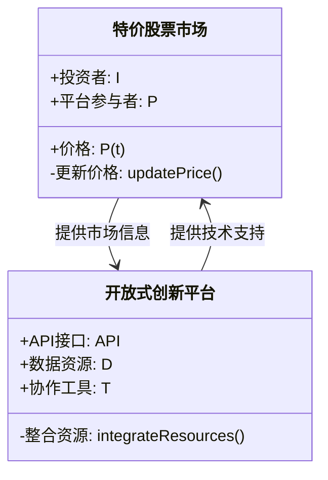

                 


# 特价股票与公司开放式创新平台生态系统的潜在关联研究

**关键词**：特价股票、公司开放式创新平台、生态系统、潜在关联、数学模型

**摘要**：  
本文探讨了特价股票与公司开放式创新平台之间的潜在关联，从定义、特点、核心概念到系统模型构建，逐步分析了两者的互动关系。通过数学模型和系统架构设计，本文揭示了特价股票市场波动对创新平台的影响，以及创新平台对特价股票价值提升的协同作用。最后，结合实际案例，本文提出了实现两者协同发展的建议。

---

# 第1章: 特价股票与公司开放式创新平台的背景介绍

## 1.1 特价股票的定义与特点

### 1.1.1 特价股票的定义  
特价股票是指在特定条件下以低于市场价发行的股票，通常用于吸引投资者或奖励现有股东。其特点是价格波动较大，风险较高，但潜在回报也较大。

### 1.1.2 特价股票的核心特点  
- **价格优势**：特价股票通常以低于市场价发行，吸引投资者。
- **高风险**：由于价格较低，投机性较强，市场波动较大。
- **短期性**：特价股票通常有时间限制，投资者需在规定时间内购买。

### 1.1.3 特价股票与普通股票的区别  
| 特性 | 特价股票 | 普通股票 |
|------|----------|----------|
| 发行价格 | 低于市场价 | 市场价 |
| 投资门槛 | 较低 | 较高 |
| 风险 | 高 | 中低 |

## 1.2 公司开放式创新平台的定义与特点

### 1.2.1 开放式创新平台的定义  
开放式创新平台是指公司通过开放资源、数据和接口，吸引外部创新者、开发者和合作伙伴共同参与创新的平台。

### 1.2.2 开放式创新平台的核心特点  
- **开放性**：平台向外部开发者开放接口和数据。
- **协作性**：支持多方协作，促进创新。
- **灵活性**：可以根据市场需求快速调整。

### 1.2.3 开放式创新平台与传统创新模式的区别  
| 特性 | 开放式创新平台 | 传统创新模式 |
|------|----------------|--------------|
| 参与者 | 外部开发者、合作伙伴 | 内部团队 |
| 透明度 | 高 | 低 |
| 创新效率 | 高 | 中等 |

## 1.3 特价股票与公司开放式创新平台的关联背景

### 1.3.1 特价股票的市场现状  
- 特价股票在市场中占据一定比例，尤其在科技和金融行业。
- 投资者对特价股票的需求主要集中在低价和高回报。

### 1.3.2 开放式创新平台的发展趋势  
- 开放式创新平台逐渐成为企业创新的重要工具。
- 通过平台，企业可以快速整合外部资源，提高创新能力。

### 1.3.3 两者关联的潜在价值  
- 特价股票的市场波动可能影响创新平台的参与者。
- 开放式创新平台可以为特价股票提供更多的应用场景和技术支持。

---

# 第2章: 特价股票与公司开放式创新平台的核心概念

## 2.1 特价股票的核心要素

### 2.1.1 特价股票的发行机制  
- 特价股票通常通过折扣发行、配股或员工持股计划等方式进行。

### 2.1.2 特价股票的市场参与者  
- 投资者：包括个人投资者和机构投资者。
- 公司：通过发行特价股票吸引资金。

### 2.1.3 特价股票的定价模型  
- 特价股票的价格通常基于市场价的折扣，但受市场供需影响。

## 2.2 开放式创新平台的核心要素

### 2.2.1 创新资源的整合能力  
- 开放式创新平台整合了外部资源，包括技术、数据和人才。

### 2.2.2 开放式创新平台的主要功能  
- 提供API接口和数据访问。
- 支持协作开发和创新项目管理。

### 2.2.3 开放式创新平台的用户角色  
- 开发者：使用平台接口开发应用。
- 企业：提供资源和需求。
- 第三方：提供技术支持。

## 2.3 两者的关联机制

### 2.3.1 特价股票的市场波动对创新平台的影响  
- 市场波动可能影响投资者对创新平台的兴趣。

### 2.3.2 开放式创新平台对特价股票的价值提升作用  
- 通过平台，特价股票可以吸引更多的开发者和用户，提升其市场价值。

### 2.3.3 两者协同发展的可能性  
- 创新平台可以为特价股票提供更多的应用场景和技术支持。

---

# 第3章: 特价股票与公司开放式创新平台的潜在关联分析

## 3.1 特价股票的市场行为分析

### 3.1.1 特价股票的投资者行为  
- 投资者通常基于价格和市场趋势进行决策。

### 3.1.2 特价股票的价格波动规律  
- 特价股票价格受市场供需影响，波动较大。

### 3.1.3 特价股票的风险与机会  
- 高风险和高回报并存。

## 3.2 开放式创新平台的功能分析

### 3.2.1 创新资源的整合能力  
- 平台整合了外部资源，支持协作创新。

### 3.2.2 开放式创新平台的协作机制  
- 通过平台，企业可以快速整合外部资源。

### 3.2.3 开放式创新平台的创新效率  
- 平台提高了创新效率，缩短了开发周期。

## 3.3 两者的关联机制分析

### 3.3.1 特价股票的市场信息对创新平台的反馈作用  
- 市场信息影响投资者行为，进而影响创新平台的参与者。

### 3.3.2 开放式创新平台对特价股票市场的影响  
- 平台提供了更多的应用场景，提高了特价股票的市场价值。

### 3.3.3 两者协同发展的可能性与挑战  
- 协同发展需要平台和市场的有效配合，但也面临信息不对称和利益冲突的挑战。

---

# 第4章: 特价股票与公司开放式创新平台的关联模型构建

## 4.1 特价股票与公司开放式创新平台的系统模型

### 4.1.1 系统模型的构建思路  
- 从市场波动、参与者行为和平台功能入手，构建系统模型。

### 4.1.2 系统模型的组成模块  
- 市场波动模块：影响特价股票价格。
- 平台功能模块：支持协作创新。
- 参与者行为模块：投资者和开发者的互动。

## 4.2 模型的数学表达

### 4.2.1 特价股票价格波动的数学模型  
$$ P(t) = P_0 + \alpha \cdot \sin(\beta t) $$  
其中，$P(t)$ 表示时间 $t$ 的价格，$\alpha$ 是波动幅度，$\beta$ 是频率。

### 4.2.2 创新平台的协作效率模型  
$$ E = \frac{N}{T} $$  
其中，$N$ 是成功项目数，$T$ 是时间。

---

# 第5章: 特价股票与公司开放式创新平台的系统分析与架构设计

## 5.1 问题场景介绍

### 5.1.1 特价股票市场的波动性问题  
- 市场波动影响投资者信心和平台参与者。

### 5.1.2 创新平台的资源整合问题  
- 如何有效整合外部资源，提升创新效率。

## 5.2 系统功能设计

### 5.2.1 领域模型（Mermaid 类图）  


## 5.3 系统架构设计（Mermaid 架构图）


---

# 第6章: 特价股票与公司开放式创新平台的项目实战

## 6.1 环境安装与配置

### 6.1.1 开发环境  
- 操作系统：Linux/Windows/macOS  
- 开发工具：PyCharm/VS Code  
- 依赖库：numpy, pandas, matplotlib

## 6.2 系统核心实现源代码

### 6.2.1 特价股票价格模拟代码  
```python
import numpy as np
import matplotlib.pyplot as plt

def simulate_price(n_days=365):
    price = []
    P0 = 100  # 初始价格
    alpha = 10  # 波动幅度
    beta = 0.1  # 频率
    for t in range(n_days):
        price.append(P0 + alpha * np.sin(beta * t))
    plt.plot(price)
    plt.xlabel('天数')
    plt.ylabel('价格')
    plt.show()

simulate_price()
```

### 6.2.2 创新平台协作效率模拟代码  
```python
def calculate_efficiency(N=100, T=365):
    import random
    success = 0
    for _ in range(N):
        if random.random() < 0.8:
            success += 1
    efficiency = success / T
    return efficiency

print(f"效率为: {calculate_efficiency():.2f}")
```

## 6.3 实际案例分析与结果解读

### 6.3.1 案例背景  
- 某科技公司发行特价股票，同时搭建开放式创新平台，吸引开发者。

### 6.3.2 数据收集  
- 收集特价股票价格数据和平台项目数据。

### 6.3.3 模型实现  
- 使用上述代码模拟价格波动和协作效率。

## 6.4 项目小结  
- 模拟结果显示，开放式创新平台可以有效提高协作效率，同时特价股票价格波动对平台参与者有一定的影响。

---

# 第7章: 特价股票与公司开放式创新平台的关联总结与展望

## 7.1 关联总结

### 7.1.1 特价股票与创新平台的互动关系  
- 特价股票市场波动影响平台参与者，平台功能影响特价股票价值。

## 7.2 关联的数学模型总结

### 7.2.1 特价股票价格模型  
$$ P(t) = P_0 + \alpha \cdot \sin(\beta t) $$

### 7.2.2 创新平台效率模型  
$$ E = \frac{N}{T} $$

## 7.3 未来研究方向

### 7.3.1 更复杂的市场模型  
- 引入更多变量，如市场情绪、政策影响。

### 7.3.2 平台协作机制优化  
- 提高平台的资源分配效率和协作效率。

### 7.3.3 数据驱动的决策支持  
- 利用大数据分析优化模型和决策。

---

# 第8章: 结论与建议

## 8.1 结论

### 8.1.1 本文的主要结论  
- 特价股票与公司开放式创新平台之间存在潜在的关联，可以通过系统模型和数学模型进行分析。

## 8.2 建议

### 8.2.1 投资者建议  
- 投资者应关注市场波动和平台功能，合理配置资产。

### 8.2.2 企业建议  
- 企业应优化平台功能，提高协作效率，吸引更多参与者。

---

# 参考文献

（此处列出参考文献，如书籍、论文、技术文档等。）

---

**附录**：  
（包括代码、数据、图表等补充材料。）

---

**致谢**：  
感谢在撰写本文过程中给予帮助和支持的人员和机构。

---

通过以上结构，您可以逐步完成一篇内容丰富、逻辑清晰的技术博客文章。

