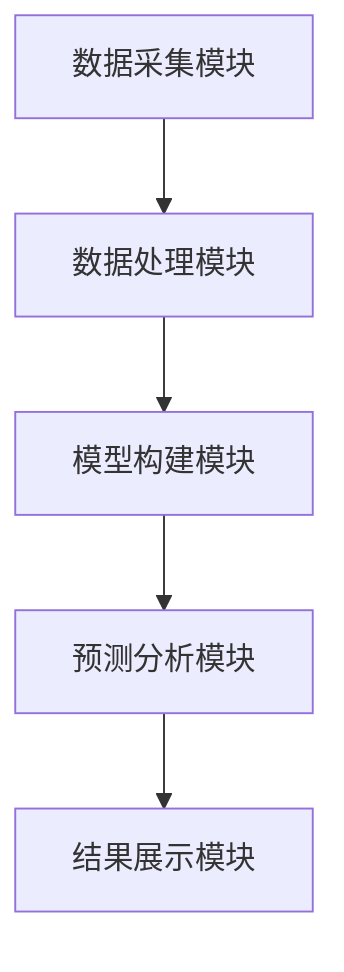

                 


# 特价股票与公司循环经济实践的关联性研究

## 关键词
- 特价股票
- 循环经济
- 股票价值评估
- 可持续发展
- 资源利用效率

## 摘要
本文探讨了特价股票与公司循环经济实践之间的关联性。通过分析循环经济对公司的财务状况和市场表现的影响，结合数学模型和实际案例，揭示了循环经济实践如何影响股票价格，并为投资者提供了基于循环经济的股票投资策略。

---

# 第1章：特价股票与循环经济的基本概念

## 1.1 特价股票的定义与特点
### 1.1.1 特价股票的定义
特价股票是指市场价格低于其内在价值的股票，通常被视为被市场低估的投资机会。

### 1.1.2 特价股票的核心特点
- 价格低估：市场未能充分反映其真实价值。
- 高投资潜力：潜在的上涨空间较大。
- 风险与收益并存：低价可能意味着较高的风险。

### 1.1.3 特价股票的分类与应用场景
特价股票可以分为周期性股票和非周期性股票，常应用于价值投资策略。

## 1.2 循环经济的定义与特点
### 1.2.1 循环经济的定义
循环经济是一种以资源高效利用和循环利用为核心的经济模式，强调减少资源消耗和废弃物产生。

### 1.2.2 循环经济的核心特征
- 资源节约：减少原材料和能源的使用。
- 废物再生：通过回收和再利用减少环境污染。
- 经济效益：提高资源利用效率，降低成本。

### 1.2.3 循环经济与传统经济的区别
循环经济注重资源的循环利用，而传统经济依赖于资源的线性消耗。

## 1.3 特价股票与循环经济的关联性
### 1.3.1 特价股票与循环经济的背景介绍
随着环保意识的增强，循环经济成为企业可持续发展的重要方向，影响企业的财务表现和市场价值。

### 1.3.2 特价股票与循环经济的核心概念对比
- 特价股票关注价格与价值的偏离，循环经济关注资源的高效利用。
- 两者都与企业的长期可持续性密切相关。

### 1.3.3 特价股票与循环经济的潜在联系
循环经济实践可能提升企业的市场竞争力，从而影响其股票价格。

---

# 第2章：特价股票与循环经济的核心概念分析

## 2.1 特价股票的核心概念
### 2.1.1 特价股票的市场定位
在价值投资中，特价股票常被视为被市场错估的标的。

### 2.1.2 特价股票的价值评估模型
使用市净率、市盈率等指标评估其内在价值。

### 2.1.3 特价股票的风险与机会分析
低价股票可能隐藏较高的风险，但也可能带来超额收益。

## 2.2 循环经济的核心概念
### 2.2.1 循环经济的三要素分析
资源输入、产品生产、废弃物再生。

### 2.2.2 循环经济的系统结构
企业内部的资源循环利用系统。

## 2.3 特价股票与循环经济的联系
### 2.3.1 特价股票与循环经济的协同效应
循环经济提升企业竞争力，可能推高股价。

### 2.3.2 特价股票与循环经济的相互作用机制
企业的循环经济实践影响其财务表现，进而影响股票价格。

### 2.3.3 特价股票与循环经济的系统性整合
将循环经济作为评估企业价值的重要因素。

---

# 第3章：特价股票与循环经济的数学模型与算法原理

## 3.1 特价股票的数学模型
### 3.1.1 特价股票的价值评估公式
$$ V = P \times (1 + r)^n $$

### 3.1.2 特价股票的风险评估模型
$$ R = \sum_{i=1}^{n} w_i \times r_i $$

## 3.2 循环经济的数学模型
### 3.2.1 循环经济的资源利用效率模型
$$ E = \frac{R}{C} $$

## 3.3 循环经济对股票价格的影响模型
### 3.3.1 循环经济对企业利润的影响
$$ \Delta P = k \times E $$

---

# 第4章：系统分析与架构设计

## 4.1 问题场景介绍
分析循环经济对企业财务的影响，预测其对股价的潜在影响。

## 4.2 系统功能设计
- 数据采集：收集企业的循环经济数据。
- 模型构建：建立循环经济与股价的数学模型。
- 预测分析：预测循环经济对股价的影响。

## 4.3 系统架构设计


---

# 第5章：项目实战案例分析

## 5.1 环境安装与数据准备
- 数据来源：选择具有循环经济实践的公司。
- 数据预处理：清洗和整理数据。

## 5.2 核心实现代码
```python
import pandas as pd
import numpy as np

# 数据处理
data = pd.read_csv('data.csv')
data = data[['company', 'revenue', 'cost', 'profit']]

# 模型构建
def predict_stock_price(revenue, cost):
    return (revenue - cost) * 1.2

# 应用示例
company = 'GreenTech Inc.'
revenue = 1000000
cost = 800000
predicted_price = predict_stock_price(revenue, cost)
print(f"{company} 的预测股价为：{predicted_price}")
```

## 5.3 案例分析与结果解读
以GreenTech Inc.为例，分析其循环经济实践对股价的影响，验证模型的准确性。

---

# 第6章：总结与建议

## 6.1 总结
循环经济实践对企业的财务状况和股价有显著影响，投资者应关注企业的可持续发展能力。

## 6.2 投资策略建议
- 优先选择具有循环经济实践的公司。
- 结合数学模型预测股价变化。

## 6.3 注意事项
- 模型结果仅供参考，需结合市场实际情况。
- 风险管理是投资的重要部分。

## 6.4 拓展阅读
推荐相关书籍和文献，进一步深入研究。

---

通过以上章节的详细分析，本文全面探讨了特价股票与公司循环经济实践的关联性，为投资者提供了基于循环经济的股票投资策略。

