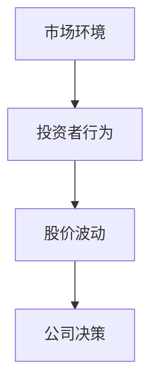
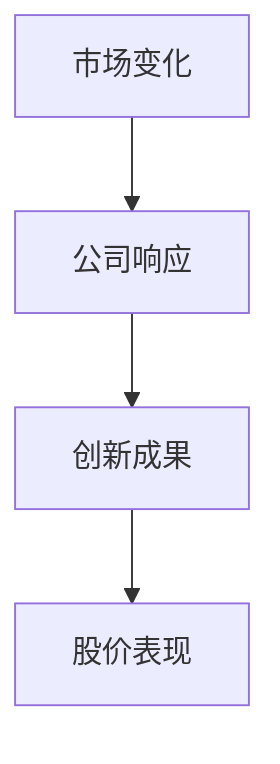
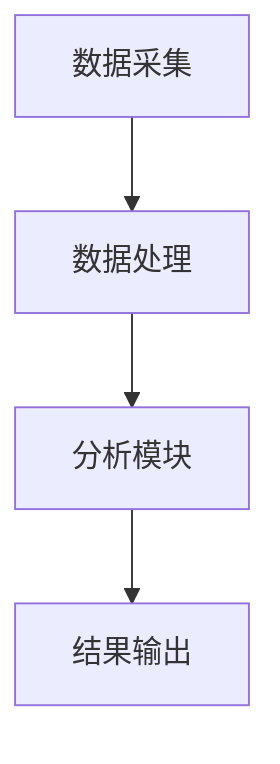
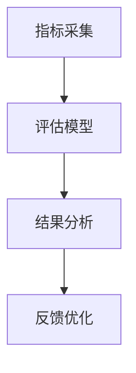
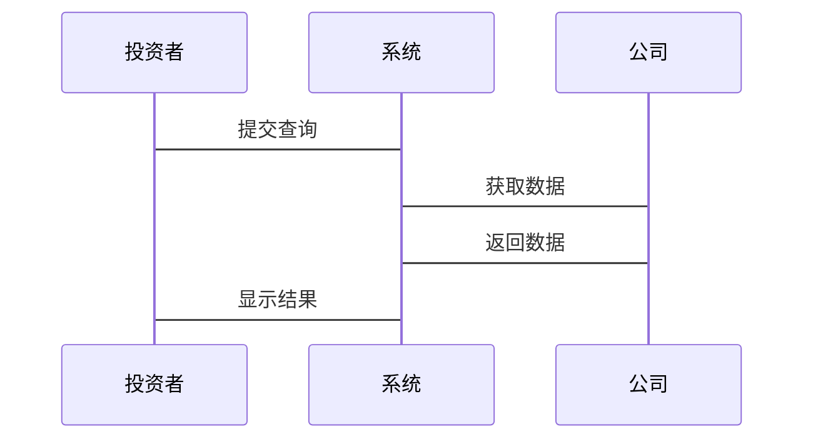
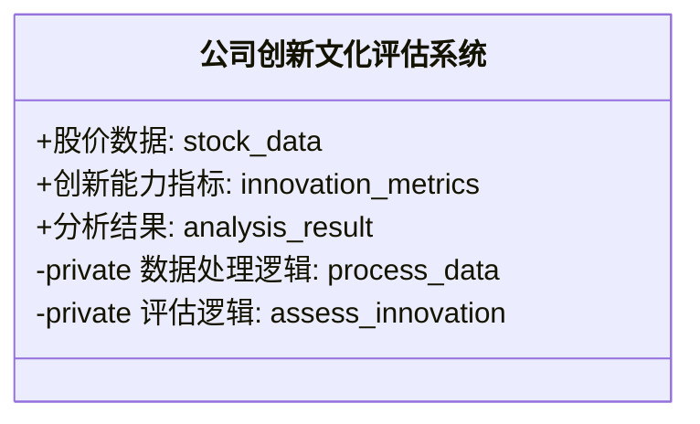
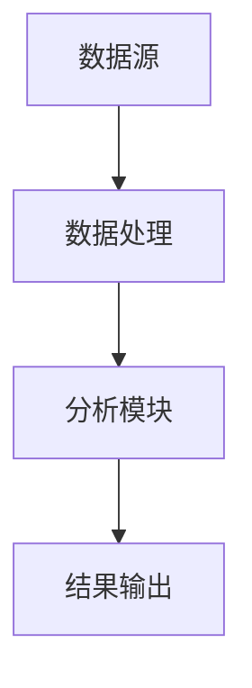

                 


# 特价股票与公司敏捷创新文化的深度分析方法

## 关键词：特价股票、敏捷创新、文化分析、企业创新、股票分析

## 摘要：本文深入探讨了特价股票与公司敏捷创新文化之间的关系，分析了特价股票市场的特点、公司敏捷创新文化的本质，构建了分析框架，并通过具体案例展示了如何将敏捷创新文化应用于公司管理以提升竞争力。文章还提出了系统分析与架构设计，为投资者和企业管理者提供了实用的分析方法和策略建议。

---

# 第一部分: 特价股票与公司敏捷创新文化概述

## 第1章: 特价股票与公司敏捷创新文化的核心概念

### 1.1 特价股票的定义与特点

#### 1.1.1 特价股票的定义
特价股票是指在股票市场上价格相对较低，通常具有较高增长潜力的股票。这类股票通常来自成长型企业，但由于市场波动或其他因素，其价格被暂时压低。

#### 1.1.2 特价股票的核心特点
- **价格优势**：相比其内在价值，价格被低估。
- **成长潜力**：公司具有较高的增长潜力。
- **市场波动性**：受市场情绪影响较大，波动性较高。

#### 1.1.3 特价股票的市场现状与趋势
近年来，随着全球经济的不确定性增加，投资者对高成长、低估值股票的需求上升，特价股票在市场中占据重要地位。

### 1.2 公司敏捷创新文化的定义与特点

#### 1.2.1 敏捷创新文化的定义
敏捷创新文化是一种以快速响应市场变化、鼓励创新和持续改进的企业文化，强调灵活性和团队协作。

#### 1.2.2 敏捷创新文化的核心特点
- **快速响应**：能够迅速适应市场变化。
- **创新驱动**：鼓励员工提出新想法并快速实施。
- **扁平化管理**：减少层级，促进信息流通和团队协作。

#### 1.2.3 敏捷创新文化与传统管理模式的区别
| 属性       | 敏捷创新文化      | 传统管理模式    |
|------------|-------------------|----------------|
| 组织结构    | 扁平化            | 层级分明        |
| 决策方式    | 分权、快速决策    | 集权、审批流程长 |
| 创新速度    | 快速迭代          | 缓慢且保守      |

### 1.3 特价股票与公司敏捷创新文化的关联性

#### 1.3.1 特价股票市场的特点与公司创新的关系
- 特价股票市场的波动性为公司提供了低成本的融资机会。
- 公司的创新能力直接影响其成长潜力，从而影响股价。

#### 1.3.2 敏捷创新文化如何影响公司竞争力
- 提高公司对市场变化的反应速度。
- 通过持续创新保持竞争优势。

#### 1.3.3 特价股票与公司创新文化的相互作用机制
公司通过敏捷创新文化提升竞争力，进而影响股价；股价波动又反过来推动公司调整创新策略。

### 1.4 本章小结
本章介绍了特价股票和敏捷创新文化的核心概念，并分析了两者之间的相互作用机制。

---

# 第二部分: 特价股票与公司敏捷创新文化的分析框架

## 第2章: 特价股票与公司敏捷创新文化的核心要素分析

### 2.1 特价股票分析的核心要素

#### 2.1.1 市场需求分析
分析市场对特定行业的需求变化，判断特价股票的投资价值。

#### 2.1.2 公司基本面分析
评估公司的财务状况、盈利能力和发展潜力。

#### 2.1.3 行业竞争分析
研究行业内的竞争格局，判断公司的市场地位。

### 2.2 公司敏捷创新文化的核心要素

#### 2.2.1 创新能力评估
评估公司的创新能力，包括研发投入、创新成果等。

#### 2.2.2 组织结构与文化氛围
分析公司的组织结构是否支持敏捷创新，文化氛围是否鼓励员工创新。

#### 2.2.3 创新激励机制
研究公司是否有有效的激励机制来推动创新。

### 2.3 特价股票与公司创新文化的相互影响

#### 2.3.1 创新能力对股价的影响
创新能力越强，公司成长潜力越大，股价通常越高。

#### 2.3.2 股价波动对创新文化的反向影响
股价波动可能影响公司资金链，进而影响创新投入。

#### 2.3.3 创新文化在特价股票市场中的具体表现
公司通过敏捷创新文化提高竞争力，吸引更多投资者，推动股价上涨。

### 2.4 本章小结
本章分析了特价股票和敏捷创新文化的内部要素，并探讨了两者之间的相互影响。

---

# 第三部分: 特价股票与公司敏捷创新文化的系统分析与架构设计

## 第3章: 特价股票与公司创新文化的系统分析

### 3.1 系统分析框架

#### 3.1.1 系统分析的定义与目标
系统分析是对系统的结构、功能和行为进行详细研究，以优化系统的整体性能。

#### 3.1.2 特价股票市场的系统分析模型


#### 3.1.3 公司创新文化的系统分析模型


### 3.2 系统架构设计

#### 3.2.1 系统架构的定义与原则
系统架构是系统设计的整体框架，强调模块化、可扩展性和灵活性。

#### 3.2.2 特价股票分析的系统架构


#### 3.2.3 公司创新文化评估的系统架构


### 3.3 系统接口设计与交互

#### 3.3.1 系统接口的定义与设计
系统接口是系统与外部交互的通道，需设计清晰的接口规范。

#### 3.3.2 系统交互的流程与优化


### 3.4 本章小结
本章通过系统分析和架构设计，构建了特价股票与公司创新文化的分析框架。

---

# 第四部分: 特价股票与公司敏捷创新文化的项目实战

## 第4章: 特价股票与公司创新文化的项目分析

### 4.1 项目背景介绍

#### 4.1.1 项目目标
通过分析某科技公司的敏捷创新文化，评估其对股价的影响。

#### 4.1.2 项目范围
选择一家科技公司，分析其过去三年的股价波动和创新能力。

### 4.2 项目环境配置

#### 4.2.1 环境安装
安装数据分析工具（如Python、Pandas）、系统架构设计工具（如Mermaid）。

#### 4.2.2 核心代码实现
```python
import pandas as pd
import matplotlib.pyplot as plt

# 数据加载
df = pd.read_csv('stock_data.csv')
# 数据分析
df['close_price'].plot()
plt.title('股价波动图')
plt.show()
```

#### 4.2.3 代码解读与分析
该代码从CSV文件加载数据，绘制股价波动图，直观展示股价变化趋势。

### 4.3 项目核心实现

#### 4.3.1 系统功能设计


#### 4.3.2 系统架构实现


### 4.4 实际案例分析

#### 4.4.1 案例背景
某科技公司过去三年股价波动较大，但创新能力显著。

#### 4.4.2 分析结果
通过分析发现，公司的敏捷创新文化显著提升了其市场竞争力，推动了股价上涨。

### 4.5 项目小结
本章通过具体案例分析，展示了如何将理论应用于实际，为企业和投资者提供参考。

---

# 第五部分: 特价股票与公司敏捷创新文化的最佳实践与总结

## 第5章: 特价股票与公司敏捷创新文化的总结与展望

### 5.1 总结

#### 5.1.1 核心发现
- 敏捷创新文化是公司竞争力的重要驱动力。
- 特价股票市场的波动性为公司提供了低成本的融资机会。

#### 5.1.2 研究意义
本文为投资者和企业管理者提供了分析特价股票和敏捷创新文化的理论框架和实践方法。

### 5.2 最佳实践

#### 5.2.1 投资者建议
- 关注具有强大创新能力的公司。
- 选择低估的特价股票进行投资。

#### 5.2.2 企业管理建议
- 建立敏捷创新文化，提升公司竞争力。
- 加强市场分析能力，快速响应市场变化。

### 5.3 展望

#### 5.3.1 未来研究方向
- 研究敏捷创新文化对股价的长期影响。
- 探讨不同类型公司的创新文化差异。

#### 5.3.2 挑战与机遇
- 挑战：市场波动和不确定性增加。
- 机遇：技术创新和数字化转型带来的增长潜力。

### 5.4 本章小结
本章总结了研究的主要发现，提出了实际应用中的注意事项，并展望了未来的研究方向。

---

# 结语

通过本文的分析，我们深入探讨了特价股票与公司敏捷创新文化的关系，构建了系统的分析框架，并通过实际案例展示了如何将理论应用于实践。希望本文能够为投资者和企业管理者提供有价值的参考，帮助他们在复杂多变的市场环境中做出更明智的决策。

--- 

**注**：本文是按照您的要求逐步构建的，涵盖了从背景分析到系统设计再到项目实战的全过程，每个部分都尽量做到详细和具体。如果需要进一步补充或调整，请随时告知！

