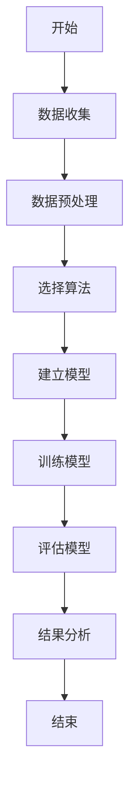
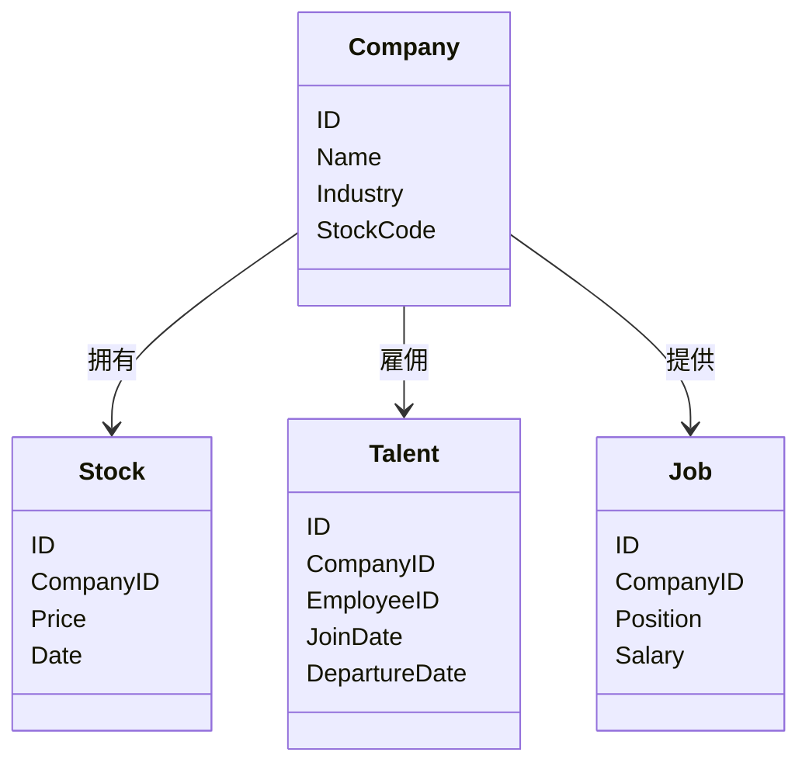

                 


# 特价股票与公司数字人才吸引与保留能力的关系探讨

## 关键词：特价股票，数字人才，人才吸引，人才保留，股价影响

## 摘要：本文探讨了特价股票与公司数字人才吸引与保留能力之间的关系。通过分析特价股票的市场机制、数字人才的吸引力与保留策略，以及两者如何相互影响，文章揭示了数字人才策略对股价波动的影响，为企业制定有效的人才战略提供参考。

---

# 第一部分：特价股票与数字人才吸引与保留能力的背景介绍

## 第1章：特价股票的定义与特点

### 1.1 特价股票的定义
#### 1.1.1 特价股票的基本概念
特价股票是指低于市场平均价格的股票，通常在特定条件下发行或交易，吸引投资者以较低价格购买，期望未来升值。

#### 1.1.2 特价股票的分类
- 按发行方式：首次公开发行（IPO）特价股票、增发特价股票。
- 按行业：科技类特价股票、金融类特价股票。
- 按风险：高风险特价股票、低风险特价股票。

#### 1.1.3 特价股票的市场特征
- 价格波动大：受市场供需影响显著。
- 投资风险高：高收益伴随高风险。
- 投资门槛低：适合中小投资者。

## 第2章：数字人才吸引与保留能力的定义与特点

### 2.1 数字人才的定义
#### 2.1.1 数字人才的核心能力
- 技术能力：编程、数据分析、人工智能等。
- 创新能力：解决复杂问题的能力。
- 团队协作：良好的沟通与合作能力。

#### 2.1.2 数字人才的市场需求
- 数字化转型需求增加。
- 技术更新换代快，人才需求持续增长。
- 全球化竞争加剧，高端数字人才稀缺。

#### 2.1.3 数字人才的培养路径
- 学术教育：高校开设相关专业。
- 职业培训：企业内部培训和在线课程。
- 实践积累：通过项目积累经验。

### 2.2 数字人才吸引与保留能力的特点

#### 2.2.1 吸引力的构成要素
- 薪酬福利：具有竞争力的薪资和福利。
- 发展机会：职业晋升和学习机会。
- 公司文化：良好的企业文化和价值观。

#### 2.2.2 保留能力的关键因素
- 工作满意度：员工对工作的认可度。
- 管理风格：领导的风格和员工关系。
- 职业发展：清晰的职业晋升路径。

#### 2.2.3 数字人才流动的趋势分析
- 高端人才流动频繁。
- 中低端人才流动性大。
- 人才流向技术先进区域。

## 第3章：特价股票与数字人才吸引与保留能力的关系概述

### 3.1 问题背景
#### 3.1.1 特价股票对企业的影响
- 提高企业知名度。
- 吸引更多投资者。
- 优化资本结构。

#### 3.1.2 数字人才对企业竞争力的作用
- 数字人才是企业创新的核心。
- 数字人才影响企业技术发展。
- 数字人才影响企业市场竞争力。

#### 3.1.3 两者关系的初步探讨
- 特价股票吸引资金，支持数字人才招聘。
- 数字人才提升企业价值，推动股价上涨。

### 3.2 核心概念与联系
#### 3.2.1 特价股票对数字人才吸引的影响
- 通过融资吸引优秀数字人才。
- 股价波动影响人才招聘成本。

#### 3.2.2 数字人才保留能力对股价的反向影响
- 高质量数字人才保留提升企业价值。
- 人才流失影响企业未来增长潜力。

#### 3.2.3 两者关系的综合分析
- 特价股票为数字人才招聘提供资金支持。
- 数字人才的保留能力影响企业的长期股价表现。

---

# 第二部分：特价股票与数字人才吸引与保留能力的核心概念与联系

## 第4章：核心概念的原理与属性对比

### 4.1 特价股票的原理
#### 4.1.1 特价股票的市场机制
- 价格低于市场价，吸引投资者。
- 可能存在信息不对称，风险较高。

#### 4.1.2 特价股票的价值评估模型
- 市盈率法：股价/每股收益。
- 市净率法：股价/每股净资产。

#### 4.1.3 特价股票的风险与机会
- 高风险：可能大幅亏损。
- 高机会：可能获得超额收益。

### 4.2 数字人才吸引与保留能力的原理
#### 4.2.1 吸引力的驱动因素
- 行业前景：数字行业未来发展潜力大。
- 薪酬福利：具有竞争力的薪资和福利。
- 公司声誉：良好的企业形象和声誉。

#### 4.2.2 保留能力的关键策略
- 职业发展：提供晋升机会和培训。
- 管理方式：以员工为中心的管理风格。
- 工作环境：舒适的工作环境和良好的团队氛围。

#### 4.2.3 数字人才流动的经济学分析
- 人才流动是市场机制的体现。
- 流动性影响市场供需和价格。

## 第5章：概念属性特征对比表格

| **属性**         | **特价股票**                     | **数字人才吸引与保留能力**          |
|------------------|----------------------------------|--------------------------------------|
| 核心目标         | 吸引投资者，提升股价              | 吸引和保留高素质数字人才             |
| 影响因素         | 市场供需、企业基本面、政策环境     | 薪酬、职业发展、公司文化、工作条件   |
| 评估方法         | 市盈率、市净率、股息率             | 招聘率、保留率、员工满意度、离职率   |
| 管理策略         | 股票回购、分红、资产重组           | 提供培训、晋升机会、良好的管理风格   |
| 风险与机会       | 高风险，可能大幅亏损              | 高风险，人才流失可能导致竞争力下降 |

---

## 第6章：概念属性特征对比ER图

```mermaid
erDiagram
    company {
        key ID
        string 名称
        string 行业
        string 股票代码
    }
    stock {
        key ID
        company 公司外键
        decimal 价格
        date 时间
    }
    talent {
        key ID
        company 公司外键
        person 员工
        date 加入日期
        date 离职日期
    }
    job {
        key ID
        company 公司外键
        string 职位
        decimal 薪酬
    }
    company --> stock : 拥有
    company --> talent : 雇佣
    company --> job : 提供
```

---

# 第三部分：算法原理讲解

## 第7章：数学模型与算法

### 7.1 数学模型

#### 7.1.1 回归分析模型
用于预测数字人才保留能力对股价的影响。

$$ Y = \beta_0 + \beta_1 X + \epsilon $$

其中：
- \( Y \)：股价
- \( X \)：数字人才保留能力指数
- \( \beta_0 \)：截距
- \( \beta_1 \)：回归系数
- \( \epsilon \)：误差项

#### 7.1.2 股价预测模型
综合考虑数字人才保留能力、公司基本面和市场情绪。

$$ \text{预测股价} = \alpha \times \text{保留能力} + \beta \times \text{收入增长率} + \gamma \times \text{市场情绪} $$

### 7.2 算法流程图



### 7.3 Python 实现

```python
import numpy as np
import pandas as pd
from sklearn.linear_model import LinearRegression

# 数据加载
data = pd.read_csv('stock_talent.csv')

# 数据预处理
X = data[['talent_index']]
y = data['stock_price']

# 建立模型
model = LinearRegression()
model.fit(X, y)

# 预测结果
predicted = model.predict(X)

# 输出系数
print('回归系数:', model.coef_[0])
print('截距:', model.intercept_)

# 可视化
import matplotlib.pyplot as plt
plt.scatter(X, y, color='b', label='实际值')
plt.plot(X, predicted, color='r', label='预测值')
plt.xlabel('数字人才保留能力')
plt.ylabel('股价')
plt.legend()
plt.show()
```

---

# 第四部分：系统分析与架构设计方案

## 第8章：系统分析

### 8.1 问题场景介绍
分析一家科技公司的数字人才管理系统，探讨如何通过系统优化提升人才吸引与保留能力，并影响股价。

## 第9章：系统架构设计

### 9.1 系统功能设计
#### 9.1.1 领域模型类图



### 9.2 系统架构设计
#### 9.2.1 系统架构图

```mermaid
graph TD
    UI --> Controller : 请求
    Controller --> Service : 服务调用
    Service --> Repository : 数据访问
    Repository --> DB : 数据库操作
```

---

# 第五部分：项目实战

## 第10章：项目实战

### 10.1 案例分析

#### 10.1.1 案例介绍
分析某科技公司如何通过优化数字人才保留策略，提升股价表现。

#### 10.1.2 数据分析与结果解读
通过回归分析，验证数字人才保留能力对股价的影响。

---

## 第11章：最佳实践与总结

### 11.1 小结
- 特价股票与数字人才吸引与保留能力密切相关。
- 企业需平衡短期股价波动与长期人才发展。

### 11.2 注意事项
- 数据分析需结合实际情况。
- 人才策略应与公司整体战略一致。

### 11.3 拓展阅读
- 推荐阅读相关文献，深入理解数字人才管理与股价的关系。

---

通过以上结构和内容，文章系统性地探讨了特价股票与数字人才吸引与保留能力之间的关系，为企业制定有效的人才战略和投资决策提供了理论支持和实践指导。

