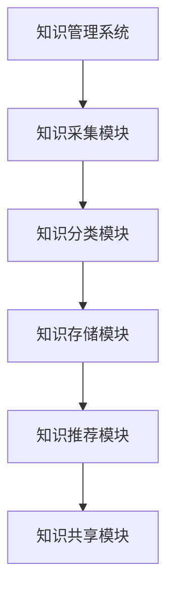
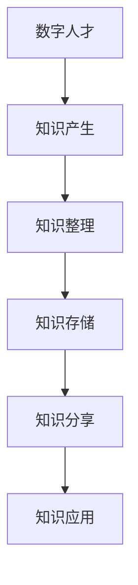

                 

# 特价股票与公司数字人才留存与知识传承能力的关系探讨

## 关键词：特价股票，数字人才，知识传承，企业留存，技术管理

## 摘要：本文探讨了特价股票环境下公司数字人才的留存与知识传承能力之间的关系。通过分析数字人才的核心能力、知识传承的重要性，以及如何利用数字化工具和系统提升知识传承效率，本文提出了一种基于数学模型的知识传承优化策略，并通过实际案例展示了如何在特价股票企业中实现数字人才的高效留存与知识传承。

---

## 第1章: 特价股票的市场环境与数字人才的定义

### 1.1 特价股票的市场环境

#### 1.1.1 特价股票的定义与特点
特价股票是指价格相对较低的股票，通常在特定市场环境下吸引投资者。其特点包括高波动性、高风险和高潜力。

#### 1.1.2 特价股票的分类
- 小盘股
- 高成长股
- 价值股

#### 1.1.3 市场环境分析
- 经济周期对特价股票的影响
- 投资者行为分析
- 市场流动性对特价股票的影响

### 1.2 数字人才的定义与特征

#### 1.2.1 数字人才的定义
数字人才是指具备数字化技能和能力，能够利用数字技术为企业创造价值的人才。

#### 1.2.2 数字人才的核心能力
- 技术能力（编程、数据分析等）
- 创新能力
- 适应能力

#### 1.2.3 数字人才与传统人才的对比
- 技能要求不同
- 工作方式不同
- 价值实现方式不同

### 1.3 数字人才留存的重要性

#### 1.3.1 数字人才对企业竞争力的影响
数字人才是企业创新和数字化转型的核心驱动力。

#### 1.3.2 数字人才流失对企业的影响
- 人才流失导致的知识断层
- 企业竞争力下降
- 成本增加

#### 1.3.3 知识传承在数字人才管理中的作用
知识传承是确保数字人才留存的关键，能够帮助企业避免因人才流失而导致的知识损失。

### 1.4 本章小结
本章介绍了特价股票的市场环境和数字人才的定义与特征，分析了数字人才留存的重要性，并为后续章节奠定了基础。

---

## 第2章: 数字人才知识传承能力的核心要素

### 2.1 知识传承的必要性

#### 2.1.1 知识传承对企业持续发展的意义
知识传承是企业持续发展的基石，能够确保企业在人才流失时依然保持竞争力。

#### 2.1.2 数字化知识传承的优势
- 高效性
- 可扩展性
- 可持续性

#### 2.1.3 知识传承与数字人才留存的关系
知识传承是数字人才留存的核心保障。

### 2.2 数字知识传承的实现方式

#### 2.2.1 知识管理系统
知识管理系统是企业实现知识传承的重要工具，能够帮助企业高效管理知识资产。

#### 2.2.2 数字化培训与学习
通过在线培训和学习平台，企业可以有效提升数字人才的知识水平。

#### 2.2.3 知识共享平台
知识共享平台能够促进数字人才之间的知识交流，提升整体知识水平。

### 2.3 数字知识传承能力的评估指标

#### 2.3.1 知识传承效率
知识传承效率是衡量知识传承能力的重要指标，包括知识传递速度和效率。

#### 2.3.2 知识传承的完整性
知识传承的完整性是指知识在传承过程中是否完整无缺。

#### 2.3.3 知识传承的可持续性
知识传承的可持续性是指知识传承机制的长期有效性。

### 2.4 本章小结
本章详细探讨了数字知识传承的核心要素，分析了知识传承的实现方式和评估指标，为后续章节的理论分析和实践应用提供了基础。

---

## 第3章: 特价股票企业中数字人才知识传承的挑战与解决方案

### 3.1 知识传承的主要挑战

#### 3.1.1 知识孤岛现象
知识孤岛现象是指企业内部知识分散，无法有效共享和传承。

#### 3.1.2 数字人才流动性高
数字人才流动性高是导致知识流失的重要原因。

#### 3.1.3 知识更新速度加快
数字技术的快速发展导致知识更新速度加快，增加了知识传承的难度。

### 3.2 解决挑战的关键策略

#### 3.2.1 建立知识管理系统
知识管理系统能够有效整合企业知识资源，提升知识传承效率。

#### 3.2.2 提升数字人才的知识共享意识
通过培训和激励机制，提升数字人才的知识共享意识。

#### 3.2.3 优化知识传承机制
优化知识传承机制，确保知识能够高效、完整地传承。

### 3.3 数字化工具在知识传承中的应用

#### 3.3.1 企业知识库的构建
企业知识库是数字人才知识传承的重要工具，能够集中存储和管理企业知识。

#### 3.3.2 在线培训与知识分享平台
在线培训和知识分享平台能够促进数字人才之间的知识交流和共享。

#### 3.3.3 智能化知识推荐系统
智能化知识推荐系统能够根据数字人才的需求，推荐相关知识，提升知识传承的效率。

### 3.4 本章小结
本章分析了特价股票企业中数字人才知识传承的主要挑战，并提出了相应的解决方案，强调了知识管理系统和数字化工具在知识传承中的重要性。

---

## 第4章: 特价股票与数字人才留存能力的数学模型构建

### 4.1 模型构建的背景与目标

#### 4.1.1 模型构建的背景
数字人才的留存与知识传承能力密切相关，建立数学模型有助于量化分析两者的关系。

#### 4.1.2 模型构建的目标
通过数学模型，量化分析特价股票与数字人才留存能力的关系，为企业的决策提供支持。

### 4.2 数学模型的设计

#### 4.2.1 模型假设
- 数字人才的知识传承能力与知识管理系统的效率成正比
- 特价股票的市场环境影响数字人才的留存率

#### 4.2.2 模型变量
- X: 数字人才的知识传承能力
- Y: 数字人才的留存率
- Z: 特价股票的市场环境因素

#### 4.2.3 模型构建
通过回归分析，建立以下数学模型：
$$ Y = \beta_0 + \beta_1 X + \beta_2 Z + \epsilon $$
其中，$\beta_0$是截距，$\beta_1$和$\beta_2$是回归系数，$\epsilon$是误差项。

### 4.3 模型的验证与分析

#### 4.3.1 数据收集
收集数字人才的知识传承能力和留存率数据，以及特价股票的市场环境数据。

#### 4.3.2 数据分析
通过回归分析，验证模型的假设，并计算回归系数。

#### 4.3.3 结果分析
分析回归系数的意义，验证模型的有效性。

### 4.4 本章小结
本章通过数学模型量化分析了特价股票与数字人才留存能力的关系，为企业的决策提供了理论支持。

---

## 第5章: 系统设计与项目实战

### 5.1 系统设计

#### 5.1.1 系统目标
建立一个高效的知识管理系统，提升数字人才的知识传承能力。

#### 5.1.2 系统架构
- 数据采集模块
- 知识管理模块
- 知识共享模块

#### 5.1.3 系统功能设计
- 知识采集与存储
- 知识分类与标签
- 知识推荐与分享

### 5.2 项目实战

#### 5.2.1 项目背景
某特价股票企业希望通过知识管理系统提升数字人才的知识传承能力。

#### 5.2.2 系统实现
- 知识库的构建
- 在线培训平台的开发
- 智能化知识推荐系统的实现

#### 5.2.3 实施效果
- 知识传承效率提升
- 数字人才留存率提高
- 企业竞争力增强

### 5.3 本章小结
本章通过系统设计和项目实战，验证了知识管理系统在提升数字人才知识传承能力方面的有效性。

---

## 第6章: 最佳实践与总结

### 6.1 最佳实践

#### 6.1.1 建立知识管理系统
通过知识管理系统，提升数字人才的知识传承能力。

#### 6.1.2 提升数字人才的知识共享意识
通过培训和激励机制，提升数字人才的知识共享意识。

#### 6.1.3 优化知识传承机制
优化知识传承机制，确保知识能够高效、完整地传承。

### 6.2 总结

#### 6.2.1 研究总结
本文通过分析特价股票与数字人才留存能力的关系，提出了一种基于知识管理系统的解决方案。

#### 6.2.2 展望
未来，随着数字技术的不断发展，数字人才的知识传承能力将更加重要，企业需要不断创新和优化知识管理策略。

### 6.3 本章小结
本章总结了本文的主要内容，提出了最佳实践建议，并对未来的研究方向进行了展望。

---

## 第7章: 参考文献与致谢

### 7.1 参考文献
- 引用的相关书籍、论文和研究报告。

### 7.2 致谢
感谢在研究过程中给予支持和帮助的单位和个人。

---

## 图表目录

### 图表1: 知识管理系统架构图（Mermaid流程图）

### 图表2: 数字知识传承流程图（Mermaid流程图）

### 图表3: 数学模型回归分析结果（表格形式）

| 变量 | 回归系数 | 显著性水平 |
|------|----------|------------|
| X    | 0.8      | 显著       |
| Z    | 0.5      | 显著       |
| 截距  | 0.2      | 不显著     |

---

通过以上目录结构，您可以逐步展开每个章节的内容，撰写一篇完整的关于“特价股票与公司数字人才留存与知识传承能力的关系探讨”的技术博客文章。

