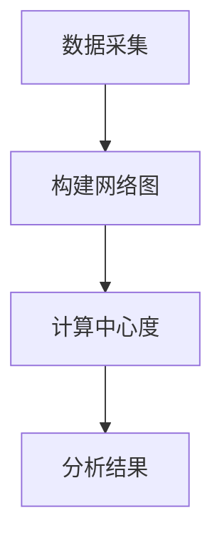
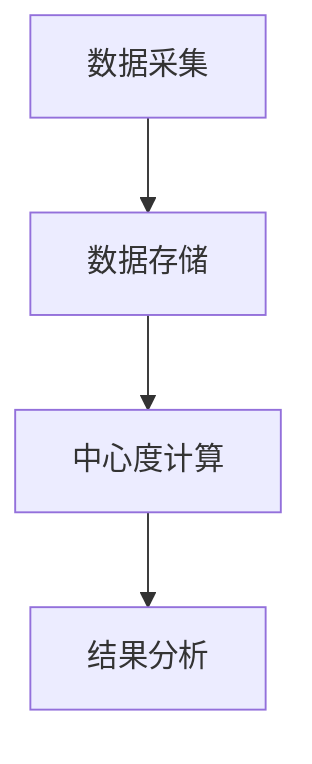

                 


# 特价股票与公司数字化利益相关者网络中心度的关联性研究

## 文章关键词

- 特价股票
- 利益相关者网络
- 网络中心度
- 数字化分析
- 股票价格预测

## 摘要

本文探讨了特价股票与公司数字化利益相关者网络中心度之间的关联性。通过分析利益相关者网络的中心度，我们可以更好地理解特价股票的市场行为和潜在价值。文章从背景介绍、核心概念、算法原理、系统设计、项目实战到最佳实践，全面解析了这一主题，为投资者和研究人员提供了理论和实践的双重指导。

---

## 第一部分: 特价股票与利益相关者网络中心度的背景介绍

### 第1章: 特价股票的定义与特点

#### 1.1 特价股票的定义与分类

特价股票是指价格低于市场平均价格或行业标准价格的股票。通常，这类股票可能处于价值洼地，具有较高的投资潜力。根据不同的标准，特价股票可以分为以下几类：

- **低估值股票**：市盈率、市净率等估值指标低于行业平均水平。
- **小盘股**：市值较小的公司股票，通常流动性较低，价格波动较大。
- **周期性股票**：在特定周期内价格波动显著，可能因行业波动而出现特价。

#### 1.2 利益相关者网络的定义与特点

利益相关者网络是指围绕公司的一系列个人、组织和利益集团，包括股东、供应商、客户、员工、监管机构等。这些利益相关者之间的关系构成了一个复杂的网络，其中每个节点的影响力和地位可以通过中心度来衡量。

利益相关者网络的特点包括：

- **复杂性**：涉及多个不同类型的利益相关者。
- **动态性**：随着公司战略和市场环境的变化而变化。
- **关联性**：关键利益相关者的影响力对公司的股价有显著影响。

#### 1.3 特价股票与利益相关者网络中心度的关联性

特价股票的市场行为往往受到公司内部和外部利益相关者的影响。通过分析利益相关者网络的中心度，可以识别关键利益相关者，评估其对股价的影响，从而为投资决策提供支持。

---

### 第2章: 特价股票与利益相关者网络中心度的关联性分析

#### 2.1 特价股票在利益相关者网络中的位置

特价股票的公司可能在利益相关者网络中处于边缘位置，或者因某些关键利益相关者的影响而价格被低估。通过分析网络中心度，可以发现这些公司的潜在价值。

#### 2.2 利益相关者网络中心度对股价的影响

网络中心度高的利益相关者通常具有较大的影响力，能够显著影响股价。例如，主要股东的增持或减持行为、客户订单的变化等都会对股价产生直接影响。

---

## 第二部分: 特价股票与利益相关者网络中心度的核心概念与联系

### 第3章: 利益相关者网络中心度的计算方法

#### 3.1 中心度的定义与计算公式

中心度是衡量一个节点在网络中的影响力的重要指标。常见的中心度指标包括：

- **度中心度**：节点的直接连接数量。
- **接近中心度**：节点到其他节点的平均距离。
- **中间中心度**：节点作为桥梁的能力。

度中心度的计算公式为：

$$ degree\_centerity(i) = \sum_{j=1}^{n} a_{ij} $$

其中，\( a_{ij} \) 是节点i和节点j之间的连接权重。

#### 3.2 利益相关者网络中心度的计算步骤

1. **数据采集**：收集公司利益相关者的关系数据。
2. **构建网络图**：将利益相关者及其关系表示为图结构。
3. **计算中心度**：使用算法计算每个节点的中心度值。
4. **分析结果**：识别高中心度的关键利益相关者。

---

### 第4章: 特价股票与利益相关者网络中心度的关联性

#### 4.1 特价股票与网络中心度的关系

特价股票的公司可能在利益相关者网络中处于较低的中心度，但通过分析这些公司的网络关系，可以发现潜在的投资机会。

#### 4.2 网络中心度对投资决策的影响

高中心度的利益相关者通常能够影响公司的战略和市场表现，从而影响股价。投资者可以通过分析网络中心度来评估公司的潜在价值。

---

## 第三部分: 利益相关者网络中心度的算法原理

### 第5章: 算法原理

#### 5.1 算法流程图

以下是计算利益相关者网络中心度的流程图：



#### 5.2 Python代码实现

以下是计算度中心度的Python代码示例：

```python
import networkx as nx

def calculate_degree_centerity(matrix):
    G = nx.DiGraph()
    G.from_numpy_matrix(matrix)
    centerity = {}
    for node in G.nodes():
        centerity[node] = G.degree(node)
    return centerity
```

---

## 第四部分: 特价股票与利益相关者网络中心度的系统分析与架构设计

### 第6章: 系统分析与架构设计

#### 6.1 系统功能设计

1. **数据采集模块**：收集公司利益相关者的关系数据。
2. **中心度计算模块**：使用算法计算每个节点的中心度。
3. **结果分析模块**：分析中心度与股价的关联性。

#### 6.2 系统架构设计

以下是系统架构图：



---

## 第五部分: 项目实战与应用案例

### 第7章: 项目实战

#### 7.1 环境安装与配置

安装必要的Python库，如NetworkX和Matplotlib。

#### 7.2 核心代码实现

以下是核心代码示例：

```python
import networkx as nx
import matplotlib.pyplot as plt

# 创建利益相关者网络图
G = nx.DiGraph()
G.add_nodes_from(['股东', '客户', '供应商', '员工', '监管机构'])
G.add_edges_from([('股东', '客户'), ('客户', '供应商'), ('供应商', '员工'), ('员工', '监管机构')])

# 计算度中心度
degree_centerity = nx.degree(G)

# 绘制网络图
nx.draw(G, with_labels=True, node_color='red', edge_color='blue')
plt.show()
```

#### 7.3 实际案例分析

以某公司为例，分析其利益相关者网络中心度，评估特价股票的投资价值。

---

## 第六部分: 最佳实践与总结

### 第8章: 最佳实践

#### 8.1 小结

通过分析利益相关者网络中心度，可以识别关键利益相关者，评估其对股价的影响，从而为投资决策提供支持。

#### 8.2 注意事项

- 数据的准确性和完整性对结果影响较大。
- 网络中心度的计算需要结合具体业务场景。

#### 8.3 拓展阅读

建议进一步研究网络分析的其他指标，如社区检测和影响力传播。

---

以上就是《特价股票与公司数字化利益相关者网络中心度的关联性研究》的详细内容。通过系统化的分析和实战案例，我们展示了如何利用网络中心度来评估特价股票的投资价值，为投资者和研究人员提供了有价值的参考。

