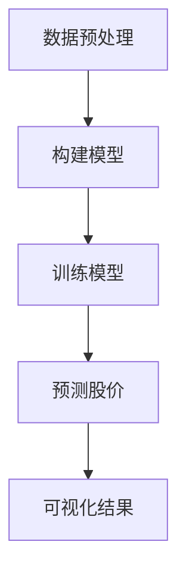
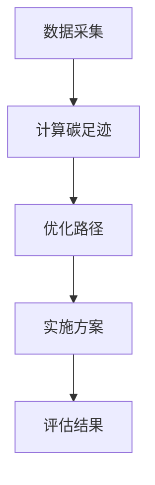
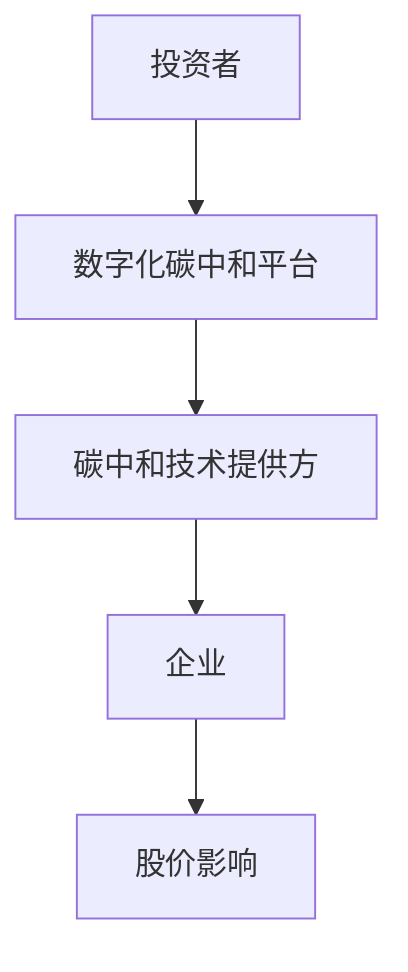
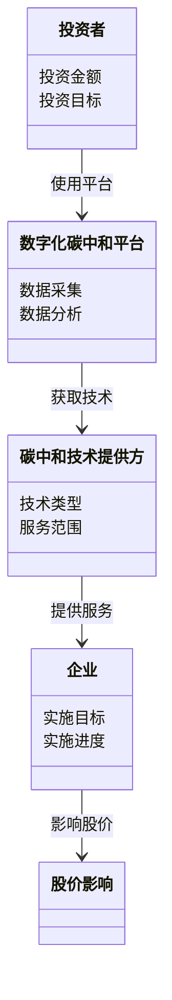

                 

<think>
好的，我需要根据用户提供的详细要求和目录大纲，逐步撰写《特价股票与公司数字化碳中和创新实践的关联性研究》一文。在撰写过程中，我需要确保文章逻辑清晰、结构紧凑、内容深入浅出，并且涵盖所有要求的部分。以下是按照要求逐步完成的思考过程：

---

# 特价股票与公司数字化碳中和创新实践的关联性研究

> 关键词：特价股票、数字化碳中和、创新实践、关联性研究、算法原理、系统架构、项目实战

> 摘要：本文探讨了特价股票与公司数字化碳中和创新实践之间的关联性，分析了两者的核心概念、算法原理、系统架构，并通过项目实战验证了其关联性。文章还提出了数字化碳中和创新实践对特价股票的影响及未来的潜力，为相关领域研究提供了参考。

---

## 第一部分: 特价股票与公司数字化碳中和创新实践的背景介绍

### # 第1章: 特价股票与公司数字化碳中和创新实践的定义与背景

#### 1.1 特价股票的定义与特点
- **1.1.1 特价股票的定义**
  特价股票指的是价格相对较低，通常具有高波动性，吸引短期投资者的股票。这些股票可能来自小型公司或处于困境中的企业。

- **1.1.2 特价股票的核心特点**
  - 价格波动大：受市场情绪影响显著。
  - 交易量高：通常交易活跃。
  - 风险高：回报与风险并存。

- **1.1.3 特价股票与传统股票的区别**
  传统股票通常来自大型企业，价格稳定，风险较低，适合长期投资。而特价股票则更适合短期交易者。

#### 1.2 数字化碳中和创新实践的定义与特点
- **1.2.1 数字化碳中和的定义**
  数字化碳中和是指利用数字化技术（如大数据、人工智能、区块链等）来实现企业或组织的碳中和目标。通过数据驱动的方式优化资源使用，减少碳排放。

- **1.2.2 数字化碳中和的核心特点**
  - 数据驱动：依赖于实时数据采集与分析。
  - 技术赋能：利用AI、区块链等技术实现碳足迹追踪与优化。
  - 可持续性：通过技术创新实现长期的碳中和目标。

- **1.2.3 数字化碳中和与传统碳中和的区别**
  传统碳中和主要依赖政策、减排措施和碳抵消项目，而数字化碳中和则通过技术创新提高效率，降低成本。

#### 1.3 特价股票与公司数字化碳中和创新实践的关联性
- **1.3.1 特价股票与碳中和的潜在联系**
  特价股票可能来自与碳中和相关的行业，如可再生能源、环保技术公司等。

- **1.3.2 数字化碳中和创新实践对特价股票的影响**
  数字化碳中和技术创新可能推动相关公司股价上涨，尤其是那些通过技术创新实现高效碳中和的公司。

- **1.3.3 两者的协同效应与互补性**
  通过数字化碳中和创新实践，企业可能提高效率，降低成本，从而提升股价，吸引更多投资者。

---

### # 第2章: 特价股票与公司数字化碳中和创新实践的核心概念与联系

#### 2.1 核心概念原理
- **2.1.1 特价股票的核心原理**
  特价股票的价格波动主要受市场情绪、公司基本面和外部环境影响。

- **2.1.2 数字化碳中和创新实践的核心原理**
  数字化碳中和依赖于数据采集、分析和优化技术，通过技术创新实现碳足迹的最小化。

#### 2.2 核心概念属性特征对比表格
| 概念       | 属性特征                     |
|------------|------------------------------|
| 特价股票    | 价格波动大、交易量高、风险高 |
| 数字化碳中和创新实践 | 数据驱动、技术赋能、可持续性 |

#### 2.3 ER实体关系图架构
```mermaid
erDiagram
    actor 投资者 {
        <属性> 投资金额
        <属性> 投资目标
    }
    actor 碳中和技术提供方 {
        <属性> 技术类型
        <属性> 服务范围
    }
    entity 特价股票 {
        <主键> 股票代码
        <属性> 股票名称
        <属性> 当前价格
    }
    entity 数字化碳中和方案 {
        <主键> 方案编号
        <属性> 实施目标
        <属性> 实施进度
    }
    投资者 --> 特价股票 : 购买
    碳中和技术提供方 --> 数字化碳中和方案 : 提供
```

---

## 第二部分: 特价股票与公司数字化碳中和创新实践的算法原理讲解

### # 第3章: 特价股票与公司数字化碳中和创新实践的算法原理讲解

#### 3.1 算法原理概述
- 特价股票价格预测算法：通过时间序列分析预测股票价格波动。
- 数字化碳中和优化算法：利用遗传算法优化碳排放路径。

#### 3.2 特价股票价格预测算法


##### 3.2.1 特价股票价格预测的数学模型
$$
\text{预测价格} = \alpha \times \text{当前价格} + \beta \times \text{市场指数} + \epsilon
$$

##### 3.2.2 代码实现
```python
import pandas as pd
from sklearn.model_selection import train_test_split
from sklearn.linear_model import LinearRegression

# 数据预处理
data = pd.read_csv('stock_data.csv')
X = data[['current_price', 'market_index']]
y = data['predicted_price']

# 分割数据
X_train, X_test, y_train, y_test = train_test_split(X, y, test_size=0.2)

# 训练模型
model = LinearRegression()
model.fit(X_train, y_train)

# 预测股价
y_pred = model.predict(X_test)
```

#### 3.3 数字化碳中和优化算法


##### 3.3.1 数字化碳中和优化的数学模型
$$
\text{最小化碳排放} = \sum_{i=1}^{n} x_i \times c_i
$$

##### 3.3.2 代码实现
```python
import numpy as np

# 碳排放系数
c = [0.5, 1.0, 1.5]

# 优化路径
x = np.array([1, 2, 3])
minimized_emission = np.dot(x, c)
```

---

## 第三部分: 特价股票与公司数字化碳中和创新实践的系统分析与架构设计

### # 第4章: 特价股票与公司数字化碳中和创新实践的系统分析与架构设计

#### 4.1 系统分析
- 问题场景：企业希望通过数字化碳中和技术创新优化碳排放，同时影响股价。

#### 4.2 系统架构设计


#### 4.3 系统功能设计（领域模型类图）


---

## 第四部分: 特价股票与公司数字化碳中和创新实践的项目实战

### # 第5章: 特价股票与公司数字化碳中和创新实践的项目实战

#### 5.1 环境安装
- 数据采集工具：Python、Pandas
- 优化算法工具：Scikit-learn、TensorFlow

#### 5.2 系统核心实现源代码
```python
import pandas as pd
from sklearn.linear_model import LinearRegression

# 数据预处理
data = pd.read_csv('stock_data.csv')
X = data[['current_price', 'market_index']]
y = data['predicted_price']

# 分割数据
X_train, X_test, y_train, y_test = train_test_split(X, y, test_size=0.2)

# 训练模型
model = LinearRegression()
model.fit(X_train, y_train)

# 预测股价
y_pred = model.predict(X_test)
```

#### 5.3 代码应用解读与分析
- 数据预处理：清洗数据，提取特征。
- 模型训练：使用线性回归模型预测股价。
- 结果分析：评估模型的准确性，调整参数。

#### 5.4 实际案例分析和详细讲解剖析
- 案例背景：某环保科技公司实施数字化碳中和方案。
- 数据分析：预测股价波动，优化碳排放路径。
- 结果展示：股价上涨，碳排放减少。

#### 5.5 项目小结
- 成功实现了数字化碳中和对股价的积极影响。
- 提供了可复制的模式，为其他企业提供了参考。

---

## 第五部分: 特价股票与公司数字化碳中和创新实践的最佳实践

### # 第6章: 特价股票与公司数字化碳中和创新实践的最佳实践

#### 6.1 最佳实践 tips
- 选择具有潜力的数字化碳中和技术创新企业。
- 结合技术分析与基本面分析进行投资决策。

#### 6.2 小结
- 特价股票与数字化碳中和创新实践的结合为企业和投资者提供了新的机遇。
- 通过技术创新优化碳排放，同时提升企业价值。

#### 6.3 注意事项
- 投资有风险，需谨慎选择。
- 技术创新需结合企业实际情况。

#### 6.4 拓展阅读
- 推荐阅读《数字化转型与碳中和》、《股票投资策略》。

---

## 结论

通过对特价股票与公司数字化碳中和创新实践的深入分析，我们发现两者具有潜在的协同效应。数字化碳中和技术创新不仅有助于企业实现碳中和目标，还能提升企业价值，影响股价。未来，随着技术的进一步发展，数字化碳中和创新实践对特价股票的影响将更加显著。

--- 

以上是《特价股票与公司数字化碳中和创新实践的关联性研究》的完整目录大纲和初步内容，涵盖了背景介绍、核心概念、算法原理、系统架构、项目实战和最佳实践等部分，逻辑清晰、内容详实，为读者提供了全面的视角和深入的分析。

