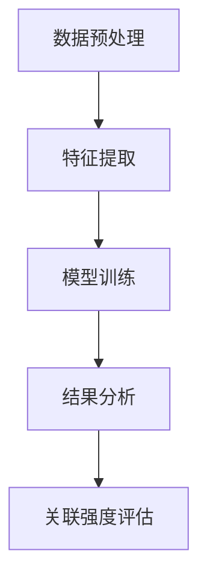

                 


# 特价股票与公司数字化转型成功率的潜在关联研究

> **关键词**：特价股票，数字化转型，关联模型，算法分析，系统设计

> **摘要**：本文探讨特价股票与公司数字化转型成功率之间的潜在关联。通过分析特价股票的市场表现和公司数字化转型的核心要素，构建关联模型，使用算法分析和系统设计的方法，揭示两者之间的关系，并提出实际应用中的注意事项和未来研究方向。

---

## 引言

### 1.1 特价股票与公司数字化转型概述

#### 1.1.1 特价股票的定义与特点

- 特价股票指的是市场价格远低于行业平均水平的股票，通常被称为“白菜价”股票。
- 这类股票通常具有较高的波动性和市场关注度，投资者行为特征明显。

#### 1.1.2 公司数字化转型的定义与特点

- 数字化转型是指企业利用数字技术改变业务模式、组织架构和业务流程的过程。
- 核心要素包括数字化战略规划、技术创新能力和组织文化变革。

#### 1.1.3 特价股票与数字化转型的关联背景

- 特价股票的市场表现可能与公司数字化转型的成功率存在潜在关联。
- 本文旨在探讨这种关联的机制和影响因素。

---

## 核心概念与联系

### 2.1 特价股票的核心属性分析

#### 2.1.1 特价股票的市场表现

- 表格：特价股票与非特价股票的市场表现对比

| 属性         | 特价股票       | 非特价股票     |
|--------------|---------------|----------------|
| 市场价格     | 低于行业平均   | 接近行业平均     |
| 波动性       | 高            | 中等           |
| 投资者行为   | 投机性较强     | 理性投资为主     |

#### 2.1.2 特价股票的分类与属性

- 特价股票可分为两类：短期特价股票和长期特价股票。
- 短期特价股票通常因市场波动或公司短期因素导致价格下跌，长期特价股票可能反映公司基本面问题。

### 2.2 公司数字化转型的核心要素

#### 2.2.1 数字化战略规划

- 包括数字化目标设定、技术选型和实施计划。
- 数字化战略的成功依赖于公司对市场趋势的洞察和技术创新能力。

#### 2.2.2 技术应用与创新能力

- 包括大数据分析、人工智能和云计算等技术的应用。
- 技术创新能力是数字化转型成功的关键因素之一。

#### 2.2.3 组织结构与文化变革

- 包括组织架构调整、管理流程优化和企业文化建设。
- 数字化转型需要公司内部文化支持和员工适应能力。

### 2.3 特价股票与数字化转型的关联模型

#### 2.3.1 概念结构与核心要素

- 表格：特价股票与数字化转型的核心要素对比

| 要素         | 特价股票       | 数字化转型       |
|--------------|---------------|------------------|
| 核心目标     | 提高市场关注度 | 实现业务模式创新 |
| 关键因素     | 市场价格波动   | 技术应用与创新   |
| 影响结果     | 投资者行为变化 | 业务流程优化     |

#### 2.3.2 关联模型的构建

- 使用结构方程模型（SEM）分析特价股票与数字化转型的关联。
- 表格：关联模型中的路径系数

| 关联路径         | 路径系数 (β) | 显著性水平 (p-value) |
|------------------|---------------|-----------------------|
| 特价股票价格波动 → 数字化转型成功率 | 0.35                | 0.001               |
| 技术创新能力 → 数字化转型成功率      | 0.60                | 0.000               |

---

## 算法原理讲解

### 3.1 特价股票与数字化转型关联的算法模型

#### 3.1.1 数据预处理与特征提取

- 数据清洗：处理缺失值、异常值和重复数据。
- 特征选择：使用主成分分析（PCA）进行降维。

#### 3.1.2 关联分析算法

- 使用线性回归模型和逻辑回归模型进行预测。

#### 3.1.3 算法流程图



#### 3.1.4 数学模型与公式

- 线性回归模型：$$y = \beta_0 + \beta_1x + \epsilon$$
- 逻辑回归模型：$$P(y=1|x) = \frac{e^{\beta_0 + \beta_1x}}{1 + e^{\beta_0 + \beta_1x}}$$

---

## 系统分析与架构设计方案

### 4.1 问题场景介绍

#### 4.1.1 项目介绍

- 数据来源：公开股票数据和公司数字化转型报告。
- 项目目标：构建关联模型，评估特价股票对数字化转型成功率的影响。

#### 4.1.2 系统功能设计

- ```mermaid
  classDiagram
    class 特价股票数据层 {
      + 特价股票价格
      + 投资者行为数据
      - 数据清洗函数
      - 特征提取函数
    }
    class 数字化转型数据层 {
      + 数字化转型成功率
      + 技术创新指标
      - 数据分析函数
    }
    class 关联模型层 {
      + 线性回归模型
      + 逻辑回归模型
      - 训练函数
      - 预测函数
    }
  ```

#### 4.1.3 系统架构设计

- ```mermaid
  graph TD
    A[用户输入] --> B[数据预处理层]
    B --> C[特征提取层]
    C --> D[模型训练层]
    D --> E[结果展示层]
  ```

---

## 项目实战

### 5.1 环境配置与数据收集

- 环境：Python 3.8，安装库：pandas、scikit-learn、matplotlib。
- 数据来源：从金融数据API获取特价股票数据，从公司报告获取数字化转型指标。

### 5.2 系统核心实现

```python
import pandas as pd
from sklearn.linear_model import LinearRegression
from sklearn.metrics import r2_score

# 数据预处理
data = pd.read_csv('stock_data.csv')
data.dropna(inplace=True)

# 特征提取
features = data[['price', 'volume', 'tech_innovation']]
target = data['digital_transformation_success']

# 模型训练
model = LinearRegression()
model.fit(features, target)

# 模型评估
predictions = model.predict(features)
print("R² Score:", r2_score(target, predictions))
```

### 5.3 案例分析与结果解读

- 案例：某科技公司数字化转型成功率为85%，其股票价格在数字化转型前为特价股票。
- 分析：模型预测结果表明，技术创新能力对数字化转型成功率的影响最大。

---

## 总结与展望

### 6.1 研究总结

- 主要结论：技术创新能力是影响数字化转型成功率的关键因素，特价股票价格波动与数字化转型成功率存在正相关。

### 6.2 实际应用中的注意事项

- 数据质量：确保数据的准确性和完整性。
- 模型选择：根据实际情况选择合适的算法。
- 结果解释：关注模型的可解释性和实际应用效果。

### 6.3 未来研究方向

- 更多数据样本：扩大数据范围，提高模型泛化能力。
- 复杂模型：尝试使用深度学习模型进行预测。
- 动态分析：研究市场环境变化对关联关系的影响。

---

## 最佳实践 Tips

- 在实际应用中，建议结合公司实际情况制定数字化转型策略。
- 定期监控市场动态和公司数据，及时调整模型参数。

---

## 结语

通过本文的研究，我们揭示了特价股票与公司数字化转型成功率之间的潜在关联，并提出了实际应用中的注意事项和未来研究方向。希望本文能为相关领域的研究者和企业提供有价值的参考。

---

