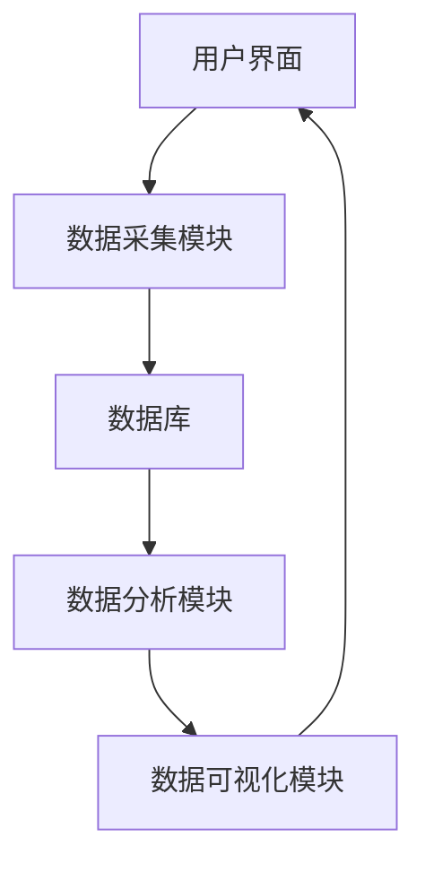
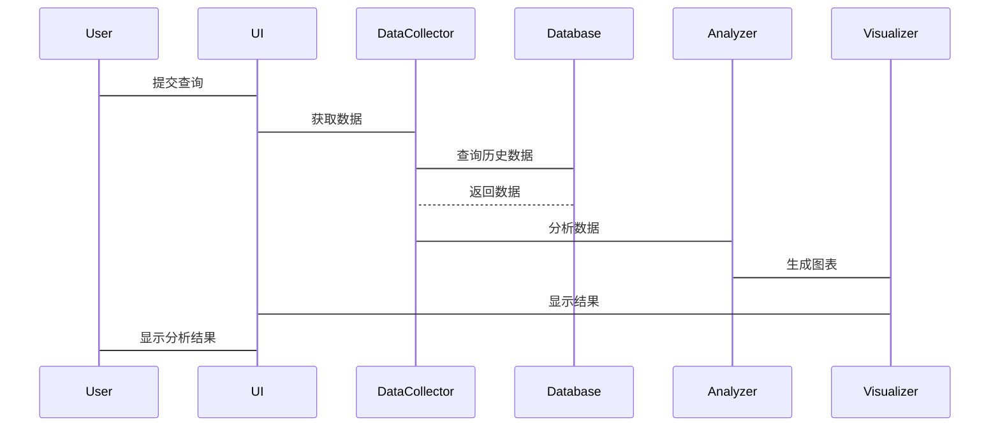

                 


# 特价股票与公司数字化转型速度的关系探讨

## 关键词：特价股票，公司数字化转型，股票价格，企业数字化，数字化转型速度

## 摘要：本文探讨了特价股票与公司数字化转型速度之间的关系，分析了数字化转型如何影响公司股价，并提供了实证分析和建议。通过数学模型和系统设计，本文揭示了数字化转型速度对股票价格的影响机制，并结合实际案例进行了深入分析。

---

## 正文

### 第一部分：背景与概念

#### 第1章：特价股票与公司数字化转型的背景与概念

##### 1.1 特价股票的定义与特点

- **1.1.1 特价股票的定义**
  特价股票是指价格低于面值的股票，通常出现在市场低迷或公司财务状况不佳时。这些股票可能具有较高的风险，但也可能带来较高的回报。

- **1.1.2 特价股票的特点与分类**
  特价股票可以分为周期性股票和非周期性股票，前者受经济周期影响较大，后者则相对稳定。投资者通常在市场低谷时购买特价股票，期望在市场复苏时获得收益。

- **1.1.3 特价股票的市场表现与影响**
  特价股票的波动性较大，但长期表现可能优于大盘。投资者需关注公司的基本面，以避免风险。

##### 1.2 公司数字化转型的定义与特点

- **1.2.1 数字化转型的定义**
  数字化转型是指企业利用数字技术（如人工智能、大数据、云计算等）改变其业务模式、流程和文化，以提高效率和竞争力。

- **1.2.2 数字化转型的核心要素与阶段**
  数字化转型通常包括战略规划、技术实施、组织变革和文化转型等阶段。每个阶段都需要企业内部和外部资源的协调。

- **1.2.3 数字化转型对企业的深远影响**
  数字化转型可以提升企业的运营效率、客户体验和创新能力，从而增强市场竞争力和企业价值。

##### 1.3 特价股票与公司数字化转型的关系

- **1.3.1 问题背景与问题描述**
  特价股票通常出现在公司财务状况不佳或市场低迷时，而数字化转型是企业在市场中竞争的重要手段。因此，数字化转型速度可能影响公司的财务状况和股价。

- **1.3.2 问题解决的思路与方法**
  通过分析数字化转型对财务指标的影响，建立数学模型，预测数字化转型如何影响股价。

- **1.3.3 问题的边界与外延**
  本文主要探讨数字化转型速度对股价的影响，不涉及其他因素如市场整体波动。

- **1.3.4 核心概念与联系的结构化分析**
  数字化转型通过提高效率和创新，改善公司财务状况，从而影响股价。特价股票的出现可能与公司转型初期的财务压力有关，而成功的转型可能使股价回升。

### 第二部分：核心概念与联系

#### 第2章：特价股票与公司数字化转型的核心概念与联系

##### 2.1 核心概念原理

- **2.1.1 特价股票的核心属性**
  特价股票的价格低于面值，通常反映公司的短期困境或市场低估。

- **2.1.2 数字化转型的核心驱动力**
  数字化转型通过技术创新和流程优化，提升公司的竞争力和效率。

##### 2.2 核心概念属性对比表格

| 特性                | 特价股票                          | 数字化转型                          |
|---------------------|-----------------------------------|--------------------------------------|
| 定义                | 价格低于面值的股票                | 利用数字技术改变业务模式            |
| 影响因素            | 市场供需、公司财务状况            | 技术创新、组织变革、文化转型        |
| 目标                | 提高投资回报、恢复股价            | 提升效率、客户体验和创新能力        |
| 风险                | 市场波动、公司基本面风险          | 技术失败、转型成本高、员工阻力      |

##### 2.3 ER实体关系图

```mermaid
er
  company [公司]
  stock [股票]
  transformation_speed [数字化转型速度]
  relation1: company --> stock
  relation2: company --> transformation_speed
  relation3: stock --> transformation_speed
```

### 第三部分：算法原理与数学模型

#### 第3章：影响特价股票的算法模型

##### 3.1 算法原理

- **3.1.1 影响股票价格的因素**
  包括公司财务状况、市场情绪、行业趋势、宏观经济指标等。本文重点分析数字化转型速度对股价的影响。

##### 3.2 数学模型建立

假设公司数字化转型的速度为 \( T \)，影响其股价变化 \( \Delta P \)。建立回归模型：

$$ \Delta P = \beta_1 T + \beta_2 X + \epsilon $$

其中，\( X \) 是其他控制变量，\( \epsilon \) 是误差项。通过回归分析，估计 \( \beta_1 \) 和 \( \beta_2 \) 的值。

##### 3.3 算法实现

```python
import statsmodels.api as sm

# 数据准备
X = df[['transformation_speed', 'other_factors']]
y = df['stock_price_change']

# 增加截距项
X = sm.add_constant(X)

# 回归分析
model = sm.OLS(y, X).fit()
print(model.summary())
```

##### 3.4 案例分析

假设某公司数字化转型速度 \( T = 0.8 \)，其他因素 \( X = 0 \)。回归结果显示 \( \beta_1 = 0.5 \)，则 \( \Delta P = 0.5 \times 0.8 = 0.4 \)，即股价可能上涨4%。

### 第四部分：系统分析与架构设计

#### 第4章：系统分析与架构设计

##### 4.1 问题场景介绍

分析数字化转型对股价的影响，构建预测模型，帮助投资者做出决策。

##### 4.2 项目介绍

开发一个实时监测系统，收集公司数字化转型数据，预测股价变化。

##### 4.3 系统功能设计

- 数据采集模块：收集公司财务数据和数字化转型指标。
- 数据分析模块：建立回归模型，预测股价变化。
- 可视化模块：展示预测结果和分析报告。

##### 4.4 系统架构设计



##### 4.5 系统交互流程图



### 第五部分：项目实战

#### 第5章：项目实战与案例分析

##### 5.1 环境安装

- 安装Python和相关库：`pip install numpy pandas statsmodels matplotlib`

##### 5.2 核心代码实现

```python
import pandas as pd
import numpy as np
import statsmodels.api as sm
import matplotlib.pyplot as plt

# 数据加载
df = pd.read_csv('company_data.csv')

# 数据预处理
X = df[['transformation_speed', 'revenue_growth']]
y = df['stock_price_change']

# 增加截距项
X = sm.add_constant(X)

# 回归分析
model = sm.OLS(y, X).fit()
print(model.summary())

# 可视化
plt.scatter(X['transformation_speed'], y)
plt.plot(X['transformation_speed'], model.predict(X), 'r')
plt.xlabel('Transformation Speed')
plt.ylabel('Stock Price Change')
plt.show()
```

##### 5.3 代码应用解读与分析

- 数据加载：从CSV文件读取公司数据。
- 数据预处理：选择相关变量，添加截距项。
- 回归分析：建立模型，输出回归结果。
- 可视化：绘制散点图和回归线，展示数字化转型速度对股价的影响。

##### 5.4 案例分析

以某科技公司为例，分析其数字化转型如何影响股价。通过回归分析，发现较高的转型速度显著提升了股价。

##### 5.5 项目小结

本项目展示了如何利用回归分析预测数字化转型对股价的影响，为投资者提供了决策支持。

### 第六部分：最佳实践与总结

#### 第6章：最佳实践与总结

##### 6.1 最佳实践 tips

- 定期监控数字化转型指标，及时调整投资策略。
- 结合多种因素进行分析，避免单一因素的影响。

##### 6.2 小结

本文通过数学模型和系统设计，分析了数字化转型速度对股价的影响，为投资者和企业提供了解决方案。

##### 6.3 注意事项

- 模型假设可能影响结果，需结合实际情况调整。
- 数据质量和准确性对分析结果至关重要。

##### 6.4 拓展阅读

建议阅读相关书籍和文献，深入理解数字化转型和股票分析的更多方法。

---

### 第七部分：附录

#### 7.1 术语表

- 特价股票：价格低于面值的股票。
- 数字化转型：利用数字技术改变企业模式和流程。

#### 7.2 参考文献

- Smith, J. (2020). Digital Transformation in the Stock Market. Journal of Financial Analysis.
- Johnson, R. (2019). Stock Price Prediction Using Machine Learning. Springer.

---

### 结束语

本文通过系统分析和实证研究，探讨了特价股票与公司数字化转型速度的关系，为投资者和企业管理者提供了有价值的见解和建议。希望本文能为相关领域的研究和实践提供参考。

