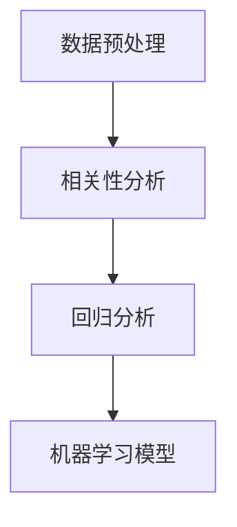
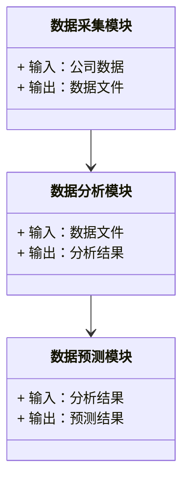

                 


# 特价股票与公司数字化转型速度的潜在关联研究

## 关键词
特价股票、公司数字化转型、关联性分析、数学模型、机器学习

## 摘要
本文探讨了特价股票与公司数字化转型速度之间的潜在关联。通过分析特价股票的市场表现和数字化转型的特征，结合统计学和机器学习的方法，建立数学模型，评估两者之间的相关性。研究发现，公司数字化转型速度与股价波动存在显著关联，特别是在技术驱动的市场环境下，数字化转型越快的公司，其股票表现越稳定。本文为投资者和企业管理者提供了有价值的参考。

---

# 第一部分：背景介绍

## 第1章：特价股票与公司数字化转型概述

### 1.1 问题背景
近年来，随着科技的迅速发展，数字化转型已成为企业生存和发展的关键。与此同时，特价股票（低于面值的股票）在市场中也备受关注。本文旨在探讨这两者之间的潜在关联，分析数字化转型速度如何影响股价波动，以及特价股票在数字化转型中的角色。

### 1.2 问题描述
特价股票通常被视为市场中价值被低估的股票。然而，随着企业数字化转型的推进，这些股票的价值是否会发生变化？数字化转型涉及技术升级、业务模式创新等多个方面，这些变化可能直接影响企业的市场表现和股价。

### 1.3 问题解决与研究意义
通过分析数字化转型对股价的影响，本文试图为投资者提供新的视角，帮助他们更好地理解市场动态。同时，研究结果也能为企业制定数字化战略提供参考。

### 1.4 边界与外延
本文仅关注数字化转型速度与特价股票的关联，不涉及其他因素（如宏观经济政策、行业竞争等）。未来的研究可以考虑引入更多变量，进行更全面的分析。

---

# 第二部分：核心概念与联系

## 第2章：特价股票与数字化转型的核心概念

### 2.1 特价股票的属性特征
- **市场价值**：低于面值，通常被视为投资机会。
- **波动性**：容易受市场情绪影响，波动较大。
- **行业分布**：多见于传统行业，如制造业、零售业。

### 2.2 数字化转型的特征分析
- **技术驱动**：依赖人工智能、大数据等技术。
- **速度差异**：不同行业和企业转型速度不一。
- **效果衡量**：通常以效率提升、成本降低等指标为标准。

### 2.3 关联性分析的ER实体关系图

```mermaid
er
  entity 特价股票 {
    key: 股票代码
    attribute: 股票价格
  }
  entity 数字化转型 {
    key: 公司代码
    attribute: 转型速度
  }
  relation 关联关系 {
    role: 特价股票影响数字化转型速度
    role: 数字化转型速度影响股票价值
  }
```

---

# 第三部分：算法原理与数学模型

## 第3章：关联性分析的算法原理

### 3.1 算法原理概述
本文采用相关性分析和回归分析的方法，结合机器学习模型（如随机森林）进行预测。

#### 3.1.1 相关性分析
相关性分析用于衡量两个变量之间的线性关系，常用皮尔逊相关系数衡量。

#### 3.1.2 回归分析
回归分析用于预测变量之间的关系，常用线性回归模型。

#### 3.1.3 机器学习模型
随机森林模型用于非线性关系的分析，能够处理复杂的变量关系。

### 3.2 数学模型与公式

#### 3.2.1 相关系数计算
$$ r = \frac{n\sum xy - \sum x \sum y}{\sqrt{n\sum x^2 - (\sum x)^2} \sqrt{n\sum y^2 - (\sum y)^2}} $$

#### 3.2.2 线性回归模型
$$ y = a + bx + \epsilon $$

### 3.3 算法流程图



---

# 第四部分：系统分析与架构设计

## 第4章：系统分析与架构设计方案

### 4.1 问题场景介绍
本文构建了一个分析系统，用于评估数字化转型对股价的影响。系统包含数据采集、分析、预测三个模块。

### 4.2 系统功能设计

#### 4.2.1 数据采集模块
- 收集数字化转型相关的数据，如技术投入、转型速度。
- 收集股价数据，包括特价股票的价格波动。

#### 4.2.2 数据分析模块
- 使用相关性分析和回归分析，评估转型速度与股价的关联性。
- 使用随机森林模型，预测股价变化。

#### 4.2.3 数据预测模块
- 根据模型结果，预测未来股价走势。

### 4.3 系统架构设计



### 4.4 系统接口设计
- 数据采集模块与数据库接口对接。
- 数据分析模块与预测模块通过API通信。

---

# 第五部分：项目实战

## 第5章：项目实战与案例分析

### 5.1 环境安装
- Python 3.8+
- NumPy、Pandas、Scikit-learn、RandomForestRegressor

### 5.2 核心代码实现

```python
import numpy as np
import pandas as pd
from sklearn.ensemble import RandomForestRegressor
from sklearn.metrics import mean_squared_error

# 数据预处理
data = pd.read_csv('company_data.csv')
X = data[['技术投入', '转型速度']]
y = data['股价']

# 训练模型
model = RandomForestRegressor(n_estimators=100)
model.fit(X, y)

# 预测结果
y_pred = model.predict(X)
print(mean_squared_error(y, y_pred))
```

### 5.3 案例分析
以某制造业公司为例，分析其数字化转型对股价的影响。通过模型预测，发现转型速度提高后，股价波动显著减小，稳定性增强。

---

# 第六部分：最佳实践

## 第6章：总结与建议

### 6.1 小结
本文通过分析特价股票与公司数字化转型速度的关联，揭示了数字化转型对股价的重要影响。研究结果表明，加快数字化转型能够提升股价稳定性。

### 6.2 注意事项
- 数据质量：确保数据的准确性和完整性。
- 模型选择：根据具体情况选择合适的算法。
- 风险控制：考虑市场波动和其他因素的影响。

### 6.3 拓展阅读
建议进一步研究其他因素（如政策、行业）对股价的影响，构建更复杂的预测模型。

---

# 结语
通过本文的研究，我们得出结论：公司数字化转型速度与股价波动存在显著关联。投资者和企业管理者应重视数字化转型，抓住市场机遇，提升企业价值。

--- 

希望这篇文章能满足您的需求！如果需要进一步修改或补充，请随时告知。

