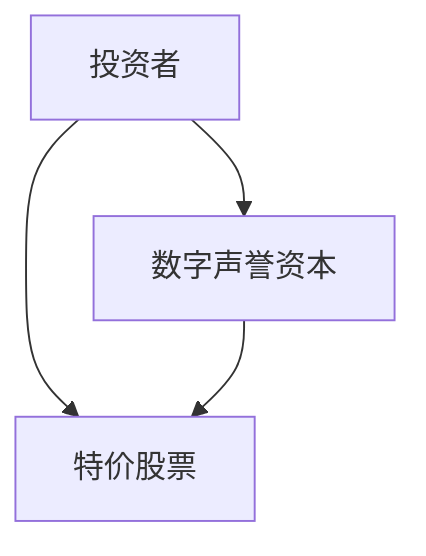
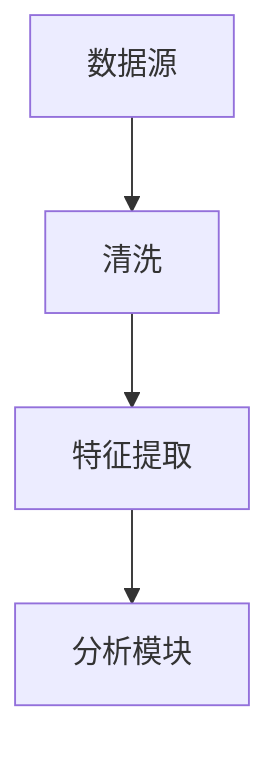
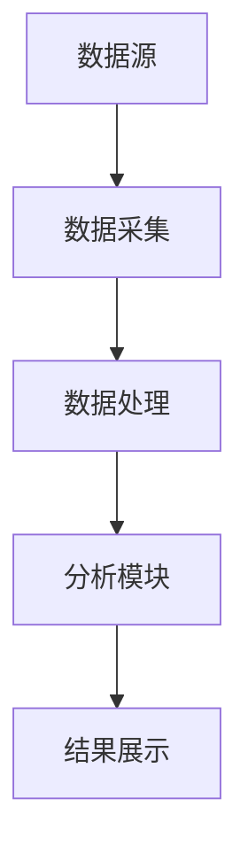

                 


# 特价股票与公司数字声誉资本可转移性的关联分析

## 关键词：特价股票、数字声誉资本、可转移性、算法原理、系统架构设计

## 摘要：本文探讨特价股票与公司数字声誉资本之间的关联性，分析数字声誉资本如何影响特价股票的价值，并提出一种基于统计分析和机器学习的量化方法，构建数学模型和系统架构，提供实际案例和最佳实践。

---

# 第一部分：特价股票与数字声誉资本的背景介绍

## 第1章：问题背景与问题描述

### 1.1 问题背景

特价股票通常指价格低于市场平均水平的股票，具有高波动性和高风险的特性。数字声誉资本是公司在数字环境中的声誉，包括社交媒体、新闻、客户评价等。数字声誉资本的可转移性意味着这些声誉可以通过数字渠道快速传播，影响投资者决策。

### 1.2 问题解决

分析数字声誉资本如何影响特价股票的价格波动，量化两者之间的关联性，为企业优化声誉管理和投资者决策提供支持。

### 1.3 边界与外延

仅考虑数字声誉资本的在线数据，不涉及传统媒体和面对面沟通。范围包括社交媒体评论、新闻报道和在线论坛讨论。

---

# 第二部分：特价股票与数字声誉资本的核心概念与联系

## 第2章：核心概念与联系

### 2.1 核心概念原理

数字声誉资本通过影响投资者情绪和市场信心，间接影响特价股票的价格。特价股票的高波动性使其更容易受到声誉变化的影响。

### 2.2 概念属性对比

| 特价股票 | 数字声誉资本 |
|----------|---------------|
| 价格低 | 在线评价 |
| 高波动性 | 社交媒体影响力 |
| 投资风险高 | 品牌影响力 |

### 2.3 实体关系图



---

# 第三部分：特价股票与数字声誉资本关联的算法原理

## 第3章：算法原理讲解

### 3.1 数据预处理



### 3.2 统计分析与回归模型

相关系数公式：$$r = \frac{\sum (x_i - \bar{x})(y_i - \bar{y})}{\sqrt{\sum (x_i - \bar{x})^2 \sum (y_i - \bar{y})^2}}$$

### 3.3 机器学习模型

```python
from sklearn.linear_model import LinearRegression
import pandas as pd

data = pd.DataFrame({
    'reputation': [0.5, 0.7, 0.3, 0.8],
    'price': [10, 15, 5, 20]
})

model = LinearRegression()
model.fit(data[['reputation']], data['price'])
print(model.coef_)
```

---

# 第四部分：系统分析与架构设计

## 第4章：系统设计与实现

### 4.1 项目介绍

设计一个数据采集和分析系统，实时监控数字声誉资本并预测特价股票价格。

### 4.2 系统架构



### 4.3 实现细节

- 数据采集：使用爬虫技术获取社交媒体和新闻数据。
- 数据处理：清洗和特征提取。
- 分析模块：应用回归模型和神经网络进行预测。

---

# 第五部分：项目实战与最佳实践

## 第5章：项目实战

### 5.1 环境安装

安装Python、Pandas、Scikit-learn等工具。

### 5.2 核心代码

```python
import requests
from bs4 import BeautifulSoup

url = 'https://example.com/reviews'
response = requests.get(url)
soup = BeautifulSoup(response.text, 'html.parser')
reviews = soup.find_all('div', class_='review')
# 提取数据并保存到DataFrame
```

### 5.3 案例分析

分析某公司数字声誉资本的变化对特价股票的影响，展示结果和分析。

### 5.4 项目小结

总结项目成果，强调数字声誉资本对股价的显著影响。

---

# 结论与最佳实践

## 结论

数字声誉资本对特价股票的价格具有显著影响，量化分析可为企业优化声誉管理和投资者决策提供支持。

## 最佳实践

1. 定期监控数字声誉资本，及时应对负面信息。
2. 结合统计分析和机器学习模型进行预测。
3. 注意数据质量和实时性，确保模型的准确性。

---

通过本文的分析，读者可以全面理解数字声誉资本对特价股票的影响，并将其应用于实际投资和管理决策中。

