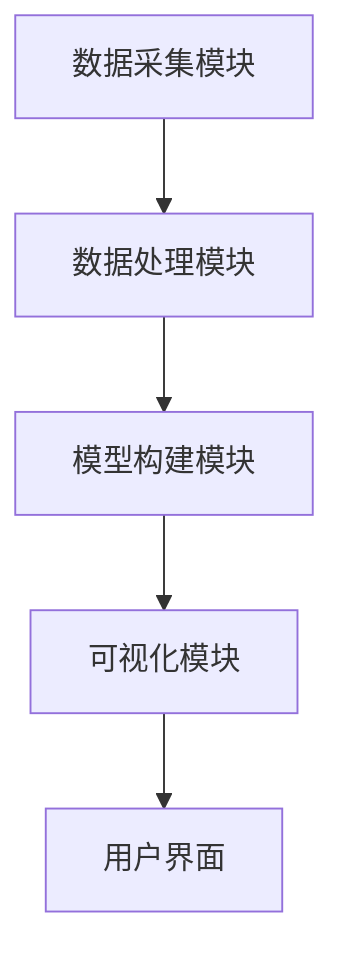
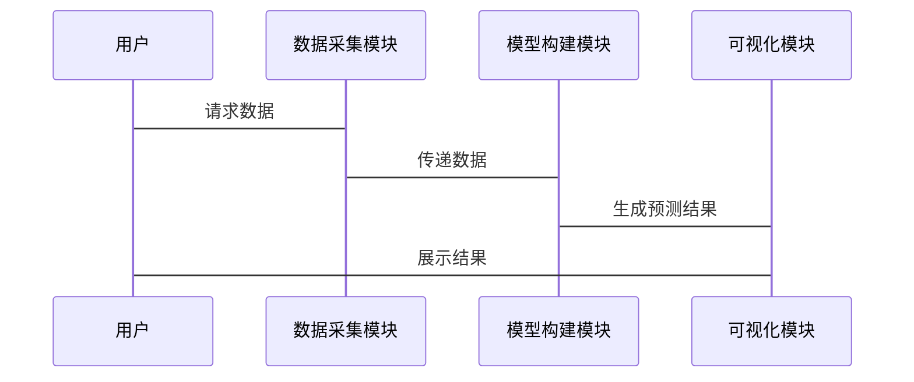

                 


# 特价股票与公司数字孪生技术应用水平的潜在联系

## 关键词：特价股票、数字孪生技术、股价预测、数据驱动、实时分析

## 摘要：本文探讨了特价股票与公司数字孪生技术应用水平之间的潜在联系。通过分析数字孪生技术的核心概念、算法原理和系统架构，结合实际项目案例，揭示数字孪生技术在股票分析中的应用前景和量化方法，帮助投资者和企业更好地理解数字孪生技术对股价波动的潜在影响。

---

# 第一部分: 特价股票与数字孪生技术的背景与概念

## 第1章: 特价股票与数字孪生技术概述

### 1.1 特价股票的定义与特点
#### 1.1.1 特价股票的定义
特价股票通常指价格低于市场平均水平的股票，具有高波动性和高风险的特性。

#### 1.1.2 特价股票的核心特点
- 价格波动大
- 市场流动性较低
- 投机性较强

#### 1.1.3 特价股票的市场定位
特价股票主要集中在中小型企业或新兴行业，是高风险投资者的关注点。

### 1.2 数字孪生技术的定义与特点
#### 1.2.1 数字孪生技术的定义
数字孪生技术是一种通过数字模型实时反映物理实体状态的技术，能够实现数据的实时采集、分析和反馈。

#### 1.2.2 数字孪生技术的核心特点
- 数据驱动
- 实时性
- 可视化

#### 1.2.3 数字孪生技术与传统IT技术的区别
数字孪生技术注重实时性和动态性，与传统IT技术的静态性形成对比。

### 1.3 特价股票与数字孪生技术的潜在联系
#### 1.3.1 特价股票波动的潜在驱动因素
- 公司基本面变化
- 市场情绪波动
- 技术创新的影响

#### 1.3.2 数字孪生技术在股票分析中的应用前景
数字孪生技术可以用于实时监控公司运营状况，预测股价波动。

#### 1.3.3 特价股票与数字孪生技术的结合场景
通过数字孪生技术分析公司数字应用水平，评估其对股价的影响。

### 1.4 本章小结
本章介绍了特价股票和数字孪生技术的基本概念，并探讨了两者之间的潜在联系。

---

# 第二部分: 数字孪生技术的核心概念与原理

## 第2章: 数字孪生技术的核心概念

### 2.1 数字孪生技术的核心要素
#### 2.1.1 数据采集与处理
数字孪生技术依赖于实时数据的采集和处理，如传感器数据、市场数据等。

#### 2.1.2 模型构建与优化
通过建立数学模型，模拟物理实体的行为和变化，实现优化和预测。

#### 2.1.3 实时交互与反馈
数字孪生系统能够实时响应用户操作，并提供反馈，形成闭环。

### 2.2 数字孪生技术的属性特征对比
#### 2.2.1 数据驱动性对比
数字孪生技术依赖于数据驱动，传统技术则更多依赖规则驱动。

#### 2.2.2 实时性对比
数字孪生技术强调实时性，传统技术则更多关注静态数据。

#### 2.2.3 可视化能力对比
数字孪生技术提供丰富的可视化功能，传统技术则较为单一。

### 2.3 数字孪生技术的ER实体关系图
```mermaid
erDiagram
    actor 投资者 {
        <属性> 股票代码
        <属性> 股票名称
        <属性> 持股数量
    }
    actor 公司 {
        <属性> 公司代码
        <属性> 公司名称
        <属性> 数字孪生应用水平
    }
    actor 交易平台 {
        <属性> 交易代码
        <属性> 交易时间
        <属性> 交易价格
    }
    investor -- company : 持股关系
    company -- trading_platform : 交易关系
```

---

## 第3章: 数字孪生技术的算法原理与实现

### 3.1 数据预处理与特征提取
#### 3.1.1 数据清洗
对原始数据进行去噪和归一化处理，确保数据质量。

#### 3.1.2 特征提取
从数据中提取关键特征，如公司业绩、市场情绪等。

### 3.2 算法选择与实现
#### 3.2.1 算法选择
选择合适的算法，如时间序列分析、神经网络等。

#### 3.2.2 算法实现
使用Python实现时间序列预测模型，如ARIMA。

### 3.3 数学模型与公式
#### 3.3.1 线性回归模型
$$ y = \beta_0 + \beta_1 x + \epsilon $$

#### 3.3.2 时间序列模型
使用ARIMA模型进行预测。

### 3.4 代码实现
```python
import pandas as pd
from statsmodels.tsa.arima.model import ARIMA

# 加载数据
data = pd.read_csv('stock_prices.csv')

# 拟合ARIMA模型
model = ARIMA(data['price'], order=(5,1,0))
model_fit = model.fit()

# 预测未来价格
forecast = model_fit.forecast(steps=10)
print(forecast)
```

---

## 第4章: 数字孪生系统的架构设计

### 4.1 系统功能设计
#### 4.1.1 数据采集模块
负责采集实时数据，如股价、交易量等。

#### 4.1.2 模型构建模块
构建数字孪生模型，模拟股价波动。

#### 4.1.3 可视化模块
提供直观的可视化界面，展示股价预测结果。

### 4.2 系统架构设计


### 4.3 系统接口设计
定义API接口，实现模块之间的数据交互。

### 4.4 系统交互设计


---

## 第5章: 数字孪生技术在特价股票分析中的应用

### 5.1 项目背景与目标
分析数字孪生技术对特价股票的影响，提升投资决策的准确性。

### 5.2 项目实施步骤
#### 5.2.1 数据收集与预处理
收集特价股票的历史数据，进行清洗和特征提取。

#### 5.2.2 模型训练与优化
训练数字孪生模型，优化预测准确率。

#### 5.2.3 系统开发与测试
开发数字孪生系统，进行功能测试和性能调优。

### 5.3 实际案例分析
以某科技公司为例，分析数字孪生技术对其股价的影响。

### 5.4 项目小结
总结项目成果，提出改进建议。

---

## 第6章: 数字孪生技术的应用价值与未来展望

### 6.1 数字孪生技术在投资领域的价值
提升投资决策的科学性和准确性。

### 6.2 数字孪生技术的未来发展趋势
智能化、个性化和实时化是未来的主要发展方向。

### 6.3 投资者与企业的注意事项
注重数据质量和模型优化，防范技术风险。

---

## 结论

数字孪生技术为特价股票分析提供了新的视角和方法，通过实时数据分析和预测，投资者可以更好地把握市场动态，优化投资策略。未来，随着技术的进步，数字孪生在金融领域的应用将更加广泛和深入。

---

## 参考文献

（此处列出相关文献和资料）

---

## 致谢

感谢读者的支持与关注，感谢所有参与项目开发的团队成员。

