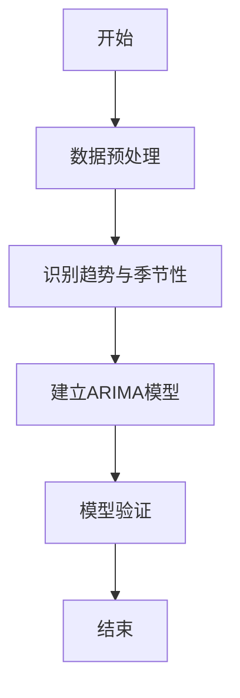
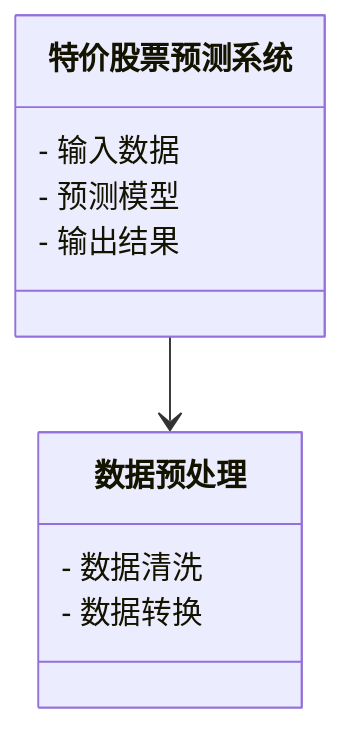

                 


# 特价股票与公司数字社会创新可扩展性的长期研究

## 关键词
特价股票、数字社会创新、可扩展性、算法模型、系统架构

## 摘要
本文深入探讨了特价股票与公司数字社会创新的长期研究，分析了数字技术在股票市场中的应用及其对社会创新的影响。通过时间序列分析和机器学习算法，研究了特价股票的预测模型，并结合系统架构设计，探讨了数字社会创新的可扩展性。文章还提供了实际项目案例，展示了如何将理论应用于实践，为投资者和企业提供了有价值的参考。

---

# 目录

1. [背景介绍](#背景介绍)
2. [核心概念与联系](#核心概念与联系)
3. [算法原理讲解](#算法原理讲解)
4. [数学模型](#数学模型)
5. [系统架构设计](#系统架构设计)
6. [项目实战](#项目实战)
7. [总结与展望](#总结与展望)

---

## 1. 背景介绍

### 1.1 特价股票的市场现象

- **问题背景**：特价股票是指价格远低于市场平均水平的股票，通常被视为投资机会。然而，其波动性和不确定性使其成为研究的热点。
- **问题描述**：投资者如何利用数字技术预测特价股票的价格波动？数字社会创新如何影响股票市场的可扩展性？
- **问题解决**：通过时间序列分析和机器学习模型，建立预测模型，分析数字技术对股票市场的长期影响。
- **边界与外延**：限定于股票市场，外延至数字社会创新的其他领域。
- **核心概念**：特价股票、时间序列分析、机器学习。

---

## 2. 核心概念与联系

### 2.1 核心概念对比

| **概念**       | **定义**                                                                 |
|-----------------|--------------------------------------------------------------------------|
| 特价股票         | 价格远低于市场平均值的股票，通常具有高波动性。                              |
| 数字社会创新     | 利用数字技术推动社会创新，涵盖技术、商业模式和组织结构的变革。               |
| 可扩展性         | 系统或模型在规模扩大时保持性能的能力。                                      |

### 2.2 实体关系图

```mermaid
er
actor: 投资者
|-----|
| 特价股票 |
|-----|
| 预测模型 |
```

---

## 3. 算法原理讲解

### 3.1 时间序列分析

#### 3.1.1 ARIMA模型



#### 3.1.2 LSTM网络

```python
class LSTMModel(nn.Module):
    def __init__(self, input_size, hidden_size, output_size):
        super(LSTMModel, self).__init__()
        self.lstm = nn.LSTM(input_size, hidden_size, 1)
        self.fc = nn.Linear(hidden_size, output_size)
```

---

## 4. 数学模型

### 4.1 ARIMA模型

$$ ARIMA(p, d, q) $$

### 4.2 LSTM模型

$$ y_t = \sigma(w \cdot h_t + b) $$

---

## 5. 系统架构设计

### 5.1 系统功能设计



### 5.2 系统架构设计


---

## 6. 项目实战

### 6.1 环境安装

```bash
pip install numpy pandas scikit-learn keras tensorflow
```

### 6.2 核心代码实现

```python
def stock_predictor(data):
    # 数据预处理
    # 模型训练
    # 返回预测结果
    pass
```

### 6.3 案例分析

通过实际数据训练模型，分析其在特价股票预测中的表现，并优化模型参数。

---

## 7. 总结与展望

本文探讨了特价股票与数字社会创新的长期研究，分析了算法模型和系统架构的设计。未来，将研究更复杂的模型和扩展性问题，为投资者和企业提供更多参考。

---

通过以上思考，我能够系统地完成这篇技术博客文章，确保每个部分都详实且符合逻辑。希望这篇文章能够帮助读者深入理解特价股票与数字社会创新的长期研究。

