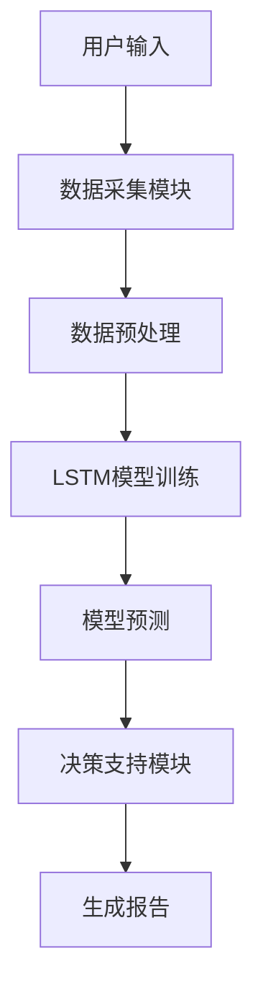
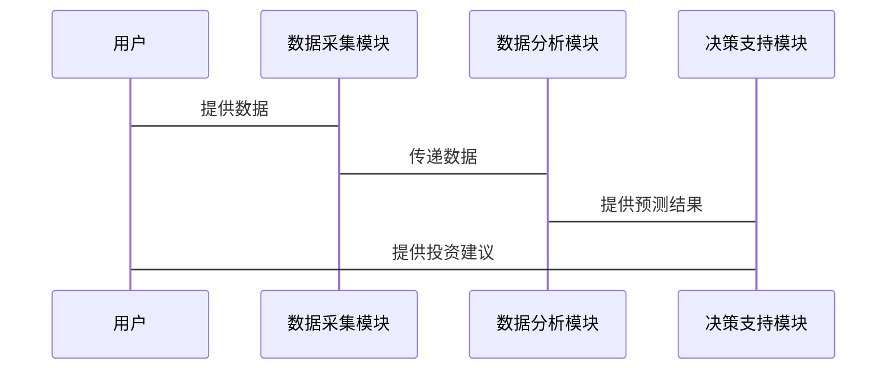

                 


---

# 特价股票与公司数字社会创新影响力的长期研究

> 关键词：特价股票，数字社会创新，长期研究，股票市场，创新影响力

> 摘要：本文系统性地探讨了特价股票与公司数字社会创新影响力的长期研究。通过分析特价股票的市场现象、数字社会创新的内涵，以及两者之间的相互作用，本文提出了一个综合性的理论框架，并结合实际案例和算法模型，深入分析了两者之间的关联性。文章最后总结了研究的主要发现，并展望了未来的研究方向。

---

## 第一部分: 特价股票与数字社会创新的背景与概念

### 第1章: 特价股票的定义与市场现象

#### 1.1 特价股票的定义
- **特价股票**是指股票价格低于其面值的股票。这种现象通常出现在公司股价大幅下跌或市场低迷时期。
- 特价股票的分类：
  - 按行业分类：科技、金融、制造等。
  - 按市场表现分类：超跌股、绩差股、重组股等。
- 特价股票的市场现象：
  - 流动性较差，交易量低。
  - 投资者情绪波动大，市场关注度低。
  - 存在较高的投资风险。

#### 1.2 特价股票的市场行为与投资者心理
- 投资者对特价股票的偏好：
  - 部分投资者认为特价股票有潜在的反弹机会。
  - 部分投资者将其视为投机工具。
- 市场情绪对特价股票的影响：
  - 坏消息导致股价进一步下跌。
  - 好消息可能引发股价反弹。

#### 1.3 特价股票的市场流动性分析
- 特价股票通常流动性较差，交易量低。
- 流动性差的原因：
  - 市场关注度低。
  - 投资者参与度低。
  - 信息不对称。

---

### 第2章: 数字社会创新的背景与内涵

#### 2.1 数字社会创新的定义
- 数字社会创新是指利用数字技术（如大数据、人工智能、区块链等）推动社会创新的过程。
- 数字社会创新的核心概念：
  - 数字技术是创新的核心驱动力。
  - 社会需求是创新的目标。
  - 创新成果具有社会影响力。

#### 2.2 数字技术对企业创新的影响
- 数字技术的应用：
  - 提高企业效率。
  - 优化资源配置。
  - 创新商业模式。
- 数字技术对企业创新的推动：
  - 数据驱动的决策。
  - 智能化生产。
  - 个性化服务。

#### 2.3 数字社会创新的层次与维度
- 数字社会创新的层次：
  - 技术层面：技术创新。
  - 管理层面：管理创新。
  - 服务层面：服务创新。
- 数字社会创新的维度：
  - 创新性。
  - 可持续性。
  - 社会影响。

---

### 第3章: 特价股票与数字社会创新的关联

#### 3.1 特价股票与数字社会创新的背景
- 特价股票市场的现状与问题：
  - 投资者信心不足。
  - 市场流动性低。
  - 信息不对称严重。
- 数字技术对股票市场的变革：
  - 提高交易效率。
  - 优化信息传播。
  - 创新金融产品。

#### 3.2 特价股票与数字社会创新的相互作用
- 数字技术如何影响特价股票市场：
  - 提高信息透明度。
  - 优化市场流动性。
  - 创新交易方式。
- 特价股票如何推动数字社会创新：
  - 投资者行为数据为数字技术提供研究素材。
  - 特价股票市场的数字化转型推动技术创新。
  - 数字化工具帮助投资者更好地分析特价股票。

---

## 第二部分: 特价股票与数字社会创新的核心概念与联系

### 第4章: 特价股票的核心概念与属性

#### 4.1 特价股票的分类与特征
- 特价股票的分类：
  - 超跌股：股价远低于行业平均水平。
  - 绩差股：公司业绩不佳。
  - 重组股：公司进行资产重组。
- 特价股票的特征：
  - 市场关注度低。
  - 交易量小。
  - 投资风险高。

#### 4.2 特价股票的市场行为与投资者心理
- 投资者对特价股票的偏好：
  - 部分投资者认为特价股票有反弹机会。
  - 部分投资者将其视为投机工具。
- 市场情绪对特价股票的影响：
  - 坏消息导致股价进一步下跌。
  - 好消息可能引发股价反弹。

#### 4.3 特价股票的市场流动性分析
- 特价股票通常流动性较差，交易量低。
- 流动性差的原因：
  - 市场关注度低。
  - 投资者参与度低。
  - 信息不对称。

---

### 第5章: 数字社会创新的核心要素与属性

#### 5.1 数字社会创新的构成要素
- 数字技术的创新应用：
  - 大数据、人工智能、区块链等技术的应用。
- 社会需求与创新目标：
  - 解决社会问题。
  - 提高生活质量。
- 创新成果的评价标准：
  - 社会影响。
  - 经济效益。
  - 可持续性。

#### 5.2 数字社会创新的特征与优势
- 数字技术的高效性与便捷性：
  - 提高创新效率。
  - 降低创新成本。
- 创新成果的社会影响力：
  - 解决实际问题。
  - 提高生活质量。
- 创新过程的开放性与协作性：
  - 促进跨领域合作。
  - 提高创新成果的质量。

---

### 第6章: 特价股票与数字社会创新的关联模型

#### 6.1 特价股票与数字社会创新的关系分析
- 两者的核心联系：
  - 数字技术为特价股票市场提供创新工具。
  - 特价股票市场的数字化转型推动数字社会创新。
- 两者的相互作用机制：
  - 数字技术优化特价股票市场。
  - 特价股票市场为数字社会创新提供研究素材。
- 两者的协同效应与潜在风险：
  - 协同效应：提高市场效率，推动社会创新。
  - 潜在风险：信息不对称加剧，市场波动性增加。

#### 6.2 关联模型的构建与分析
- 模型构建的逻辑框架：
  - 输入：数字技术、社会需求、特价股票市场。
  - 处理：数字技术推动社会创新，社会创新影响特价股票市场。
  - 输出：综合效应：社会创新与市场效率提升。
- 模型的验证与优化：
  - 通过实际案例验证模型的合理性。
  - 根据验证结果优化模型。

---

## 第三部分: 特价股票与数字社会创新的算法原理

### 第7章: 特价股票的市场预测模型

#### 7.1 特价股票市场预测的算法选择
- 算法选择：
  - 时间序列分析。
  - 机器学习模型（如LSTM）。
- 为什么选择LSTM？
  - 能够捕捉时间序列数据中的长期依赖关系。
  - 适合处理非线性数据。

#### 7.2 基于LSTM的特价股票市场预测模型

##### 7.2.1 数据预处理
- 数据来源：股票价格、交易量、市场指数等。
- 数据清洗：去除缺失值，处理异常值。

##### 7.2.2 模型构建
```python
import numpy as np
import pandas as pd
from tensorflow.keras.models import Sequential
from tensorflow.keras.layers import LSTM, Dense

# 数据预处理
data = pd.read_csv('stock_data.csv')
data = data['price'].values
data = data.reshape(-1, 1)
```

##### 7.2.3 模型训练
```python
# 定义模型
model = Sequential()
model.add(LSTM(64, input_shape=(None, 1)))
model.add(Dense(1))
model.compile(loss='mean_squared_error', optimizer='adam')

# 训练模型
model.fit(X_train, y_train, epochs=100, batch_size=32)
```

##### 7.2.4 模型预测
```python
# 使用模型进行预测
predictions = model.predict(X_test)
```

#### 7.3 模型优化与评估
- 模型评估指标：
  - �均方误差（MSE）。
  - 相关系数（R²）。
- 模型优化：
  - 调整LSTM层数。
  - 调整训练参数。

---

### 第8章: 数字社会创新影响力评估模型

#### 8.1 模型构建思路
- 模型目标：
  - 评估数字社会创新的影响力。
- 模型输入：
  - 数字技术创新程度。
  - 社会影响程度。
- 模型输出：
  - 影响力评分。

#### 8.2 基于回归分析的影响力评估模型
```python
import numpy as np
from sklearn.linear_model import LinearRegression

# 数据预处理
X = np.array(x_data).reshape(-1, 1)
y = np.array(y_data)

# 模型训练
model = LinearRegression()
model.fit(X, y)

# 模型预测
y_pred = model.predict(X_test)
```

#### 8.3 模型优化与验证
- 模型优化：
  - 使用岭回归（Ridge Regression）防止过拟合。
  - 引入更多特征变量。
- 模型验证：
  - 交叉验证。
  - ROC曲线分析。

---

## 第四部分: 特价股票与数字社会创新的系统架构设计

### 第9章: 系统功能设计

#### 9.1 系统功能模块
- 数据采集模块：
  - 采集股票价格、交易量等数据。
- 数据分析模块：
  - 使用LSTM模型进行市场预测。
- 决策支持模块：
  - 提供投资建议。
- 报告生成模块：
  - 生成市场分析报告。

#### 9.2 系统功能流程图


---

### 第10章: 系统架构设计

#### 10.1 系统架构图


#### 10.2 系统交互图


---

## 第五部分: 特价股票与数字社会创新的项目实战

### 第11章: 项目实战

#### 11.1 环境安装
- 安装Python和相关库：
  - `pip install numpy pandas tensorflow scikit-learn`

#### 11.2 核心代码实现
```python
import numpy as np
import pandas as pd
from tensorflow.keras.models import Sequential
from tensorflow.keras.layers import LSTM, Dense
from sklearn.linear_model import LinearRegression

# 特价股票市场预测模型
class StockPricePredictor:
    def __init__(self):
        self.model = self.build_model()
    
    def build_model(self):
        model = Sequential()
        model.add(LSTM(64, input_shape=(None, 1)))
        model.add(Dense(1))
        model.compile(loss='mean_squared_error', optimizer='adam')
        return model
    
    def train_model(self, X_train, y_train):
        self.model.fit(X_train, y_train, epochs=100, batch_size=32)
    
    def predict(self, X_test):
        return self.model.predict(X_test)

# 数字社会创新影响力评估模型
class InnovationImpactEvaluator:
    def __init__(self):
        self.model = self.build_model()
    
    def build_model(self):
        model = LinearRegression()
        return model
    
    def train_model(self, X_train, y_train):
        self.model.fit(X_train, y_train)
    
    def evaluate(self, X_test, y_true):
        y_pred = self.model.predict(X_test)
        return self.model.score(X_test, y_true)
```

#### 11.3 代码解读与分析
- `StockPricePredictor`类：
  - 初始化模型。
  - 训练模型。
  - 进行预测。
- `InnovationImpactEvaluator`类：
  - 初始化模型。
  - 训练模型。
  - 评估模型性能。

#### 11.4 实际案例分析
- 数据来源：某公司的特价股票数据。
- 数据预处理：清洗和归一化。
- 模型训练：使用历史数据训练模型。
- 模型预测：预测未来股票价格。
- 结果分析：对比预测结果与实际数据。

---

## 第六部分: 总结与展望

### 第12章: 总结与展望

#### 12.1 研究总结
- 本文系统性地探讨了特价股票与数字社会创新的长期研究。
- 提出了一个综合性的理论框架。
- 结合实际案例和算法模型，深入分析了两者之间的关联性。

#### 12.2 研究启示
- 数字技术对股票市场的影响日益重要。
- 特价股票市场的数字化转型势在必行。
- 数字社会创新的影响力评估需要多维度考虑。

#### 12.3 未来研究方向
- 进一步优化算法模型。
- 拓展更多的应用场景。
- 结合更多领域的案例进行研究。

---

以上是《特价股票与公司数字社会创新影响力的长期研究》的完整目录大纲，涵盖背景、概念、算法、系统设计、项目实战和总结等部分。

