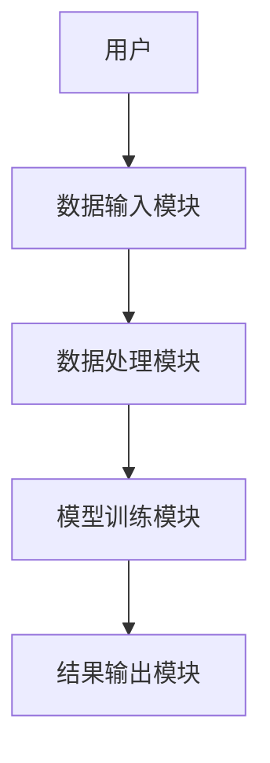
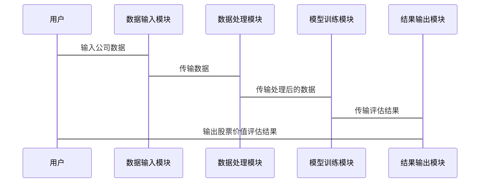

                 


# 特价股票与公司数据主权价值的评估

## 关键词
- 特价股票
- 数据主权
- 价值评估
- 数据分析
- 机器学习

## 摘要
在当前的金融市场中，特价股票作为一种特殊的投资标的，其价值评估不仅依赖于传统的财务指标，还与公司数据主权密切相关。数据主权是指公司在数据收集、存储、处理和使用过程中所拥有的合法权利和控制能力。本文将从数据主权的角度，探讨如何通过数据分析和机器学习算法，对特价股票的价值进行科学评估。通过构建综合评估模型，结合实际案例分析，本文旨在为投资者提供一种全新的视角，以更全面地评估特价股票的投资价值。

---

# 第1章: 特价股票与公司数据主权概述

## 1.1 特价股票的基本概念

### 1.1.1 特价股票的定义
特价股票是指价格低于面值的股票，通常出现在公司股价被市场低估或公司面临短期困境的情况下。这种股票往往具有较高的潜在回报，但也伴随着较高的风险。

### 1.1.2 特价股票的分类
特价股票可以分为以下几类：
- **周期性特价股票**：受行业周期影响较大的股票。
- **成长型特价股票**：具有较高增长潜力的股票。
- **价值型特价股票**：市场价格低于内在价值的股票。

### 1.1.3 特价股票的市场特征
- **低估值**：市场价格低于内在价值。
- **高波动性**：股价波动较大，容易受市场情绪影响。
- **风险与机遇并存**：高风险伴随着较高的潜在回报。

## 1.2 公司数据主权的定义与内涵

### 1.2.1 数据主权的定义
数据主权是指公司在数据生命周期中所拥有的合法权利和控制能力，包括数据的收集、存储、处理和使用等方面。

### 1.2.2 数据主权的核心要素
- **数据所有权**：公司对数据的合法所有权。
- **数据控制权**：公司对数据的处理和使用的控制能力。
- **数据隐私权**：公司保护数据隐私的能力。
- **数据安全权**：公司确保数据安全的能力。

### 1.2.3 数据主权与公司价值的关系
数据主权是公司核心竞争力的重要组成部分，能够提升公司的市场地位和抗风险能力。

---

# 第2章: 特价股票与公司数据主权价值评估的背景分析

## 2.1 当前金融市场中的特价股票现象

### 2.1.1 特价股票的市场现状
近年来，随着市场的波动加剧，越来越多的公司股票成为特价股票，尤其是在经济下行周期中。

### 2.1.2 特价股票的投资机会与风险
- **机会**：市场低估，潜在回报高。
- **风险**：公司基本面恶化，股价可能继续下跌。

### 2.1.3 特价股票与市场周期的关系
特价股票的出现与市场周期密切相关，尤其是在经济衰退或市场调整时期。

## 2.2 公司数据主权的崛起与挑战

### 2.2.1 数据主权的全球发展趋势
随着数据的重要性日益凸显，各国纷纷出台数据主权相关法律法规。

### 2.2.2 数据主权对企业的影响
- **竞争优势**：数据主权强的公司更具竞争优势。
- **风险降低**：数据主权能够降低数据泄露等风险。

### 2.2.3 数据主权与公司价值评估的结合
数据主权已成为公司价值评估的重要指标之一，尤其是在评估特价股票时。

---

# 第3章: 特价股票与公司数据主权价值评估的核心概念

## 3.1 数据主权的评估指标

### 3.1.1 数据资产的分类与评估
数据资产可以分为以下几类：
- **结构化数据**：如数据库中的表格数据。
- **非结构化数据**：如文本、图像等。

### 3.1.2 数据质量的评估标准
- **完整性**：数据是否完整。
- **准确性**：数据是否准确。
- **一致性**：数据是否一致。

### 3.1.3 数据安全与隐私的评估
- **数据加密**：数据在传输和存储过程中是否加密。
- **访问控制**：数据访问是否受到严格的权限控制。

## 3.2 特价股票的评估模型

### 3.2.1 股票价值的传统评估方法
- **市盈率法**：市盈率=股价/每股收益。
- **市净率法**：市净率=股价/每股净资产。

### 3.2.2 数据驱动的股票价值评估模型
- **回归分析**：通过回归模型预测股票价格。
- **机器学习模型**：使用机器学习算法预测股票价格。

### 3.2.3 特价股票的特殊评估方法
- **折扣现金流法**：预测未来现金流的现值。
- **相对价值法**：比较同行业公司的估值。

## 3.3 数据主权与股票价值的综合评估框架

### 3.3.1 数据主权对股票价值的影响路径
- **数据资产的价值**：数据资产的多少直接影响公司价值。
- **数据安全的风险**：数据安全问题可能影响公司股价。

### 3.3.2 数据主权与股票价值的综合评估模型
综合评估模型包括以下几个步骤：
1. **数据资产评估**：评估公司数据资产的价值。
2. **数据安全评估**：评估公司数据安全的能力。
3. **股票价值预测**：结合数据资产和数据安全评估结果，预测股票价值。

### 3.3.3 综合评估框架的应用场景
- **投资决策**：帮助投资者做出更明智的投资决策。
- **风险管理**：帮助公司识别和管理数据安全风险。

---

# 第4章: 数据主权价值评估的算法原理

## 4.1 数据清洗与特征工程

### 4.1.1 数据清洗
- **去除重复数据**：删除重复的记录。
- **处理缺失值**：填充或删除缺失值。
- **异常值处理**：识别并处理异常值。

### 4.1.2 特征工程
- **特征选择**：选择对目标变量影响较大的特征。
- **特征转换**：对特征进行标准化或归一化处理。

## 4.2 数据分析与建模

### 4.2.1 回归分析
- **线性回归**：预测股票价格与相关变量之间的线性关系。
- **逻辑回归**：预测股票价格的涨跌趋势。

### 4.2.2 机器学习模型
- **随机森林**：通过树投票机制进行预测。
- **支持向量机**：通过构建超平面进行分类。

## 4.3 算法实现与优化

### 4.3.1 算法实现
- **数据预处理**：使用Python的pandas库进行数据清洗。
- **模型训练**：使用scikit-learn库训练模型。
- **模型评估**：使用交叉验证评估模型性能。

### 4.3.2 算法优化
- **参数调优**：通过网格搜索优化模型参数。
- **特征重要性分析**：分析特征对模型预测结果的影响。

---

# 第5章: 系统分析与架构设计方案

## 5.1 问题场景介绍
我们希望通过构建一个系统，对特价股票的价值进行科学评估，同时考虑公司数据主权的影响。

## 5.2 系统功能设计

### 5.2.1 领域模型设计
- **数据资产模块**：管理公司数据资产。
- **数据安全模块**：评估公司数据安全能力。
- **股票评估模块**：预测股票价值。

### 5.2.2 功能模块设计
- **数据输入**：用户输入公司数据。
- **数据处理**：对数据进行清洗和特征工程。
- **模型训练**：训练机器学习模型。
- **结果输出**：输出股票价值评估结果。

## 5.3 系统架构设计

### 5.3.1 架构图


### 5.3.2 接口设计
- **数据输入接口**：用户输入公司数据。
- **模型训练接口**：训练股票价值评估模型。
- **结果输出接口**：输出股票价值评估结果。

## 5.4 系统交互设计

### 5.4.1 交互流程


---

# 第6章: 项目实战

## 6.1 环境安装
- **Python**：安装Python 3.8及以上版本。
- **依赖库**：安装numpy、pandas、scikit-learn等库。

## 6.2 系统核心实现源代码

### 6.2.1 数据清洗与特征工程
```python
import pandas as pd
import numpy as np

# 数据清洗
def data_cleaning(data):
    # 去除重复数据
    data = data.drop_duplicates()
    # 处理缺失值
    data = data.dropna()
    return data

# 特征工程
def feature_engineering(data):
    # 特征选择
    features = ['feature1', 'feature2', 'feature3']
    data = data[features]
    # 特征标准化
    from sklearn.preprocessing import StandardScaler
    scaler = StandardScaler()
    data = scaler.fit_transform(data)
    return data
```

### 6.2.2 模型训练与评估
```python
# 模型训练
from sklearn.ensemble import RandomForestRegressor
from sklearn.metrics import mean_squared_error

def train_model(data, labels):
    # 训练模型
    model = RandomForestRegressor()
    model.fit(data, labels)
    return model

# 模型评估
def evaluate_model(model, data, labels):
    # 预测结果
    predictions = model.predict(data)
    # 计算均方误差
    mse = mean_squared_error(labels, predictions)
    return mse
```

## 6.3 实际案例分析
假设我们有一个公司A的特价股票数据，我们可以通过上述代码对数据进行清洗和特征工程，然后训练随机森林回归模型，预测股票价值。

---

# 第7章: 最佳实践、小结与拓展阅读

## 7.1 最佳实践
- **数据清洗**：确保数据质量。
- **特征工程**：选择合适的特征。
- **模型调优**：优化模型性能。

## 7.2 小结
通过本文的分析，我们了解了特价股票与公司数据主权价值评估的重要性，并通过实际案例展示了如何通过数据分析和机器学习算法对特价股票的价值进行科学评估。

## 7.3 注意事项
- **数据隐私**：注意保护数据隐私。
- **模型局限性**：模型预测结果仅供参考，不能保证100%准确。

## 7.4 拓展阅读
- **相关书籍**：《股票投资实战技巧》。
- **在线课程**：Coursera上的《数据科学与机器学习基础》。

---

# 结语

通过本文的探讨，我们不仅了解了特价股票与公司数据主权价值评估的基本概念，还通过实际案例展示了如何通过数据分析和机器学习算法对特价股票的价值进行科学评估。希望本文能够为投资者提供一种全新的视角，以更全面地评估特价股票的投资价值。

