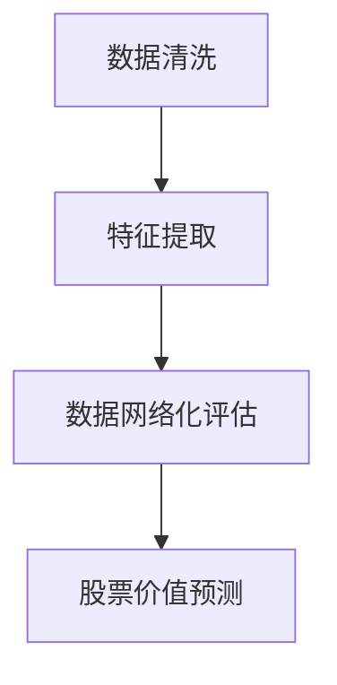
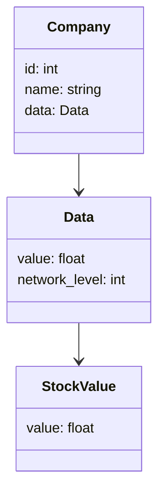

                 


# 特价股票与公司数据价值链网络化程度的关系探讨

> 关键词：特价股票，数据价值链，网络化程度，数据网络化，股票价值

> 摘要：本文探讨了特价股票与公司数据价值链网络化程度之间的关系，分析了数据网络化程度对股票价值的影响，并通过算法模型和案例分析，展示了如何利用数据网络化提升公司价值。文章内容涵盖了背景介绍、核心概念与联系、算法原理、数学模型、系统分析、项目实战、最佳实践等部分，深入剖析了数据网络化对股票价值的潜在影响。

---

## 第一部分：背景介绍

### 第1章：特价股票与数据价值链的背景

#### 1.1 特价股票的定义与特征
- **1.1.1 特价股票的定义**  
  特价股票指的是市场价格低于其内在价值的股票。通常，这些股票可能被市场低估，具有较大的增值潜力。

- **1.1.2 特价股票的市场特征**  
  - 市场价格与内在价值的差异较大。
  - 投资者可能低估了公司的潜在价值。
  - 具备较高的风险与回报比。

- **1.1.3 特价股票的投资价值**  
  投资者可以通过挖掘公司基本面，寻找被市场低估的投资机会。

#### 1.2 数据价值链的构建
- **1.2.1 数据价值链的概念**  
  数据价值链是指从数据采集、处理、分析到应用的完整流程。

- **1.2.2 数据价值链的核心环节**  
  - 数据采集：从各种来源获取数据。
  - 数据处理：清洗、转换、整合数据。
  - 数据分析：利用数据分析技术提取价值。
  - 数据应用：将分析结果应用于业务决策。

- **1.2.3 数据价值链的优化策略**  
  - 提高数据采集的效率。
  - 强化数据分析的能力。
  - 优化数据应用的效果。

#### 1.3 网络化程度的影响因素
- **1.3.1 数据网络化的定义**  
  数据网络化是指数据在不同系统、部门或业务流程之间的共享与整合程度。

- **1.3.2 网络化程度的关键指标**  
  - 数据共享的频率。
  - 数据整合的效率。
  - 数据系统的互联互通性。

- **1.3.3 网络化程度与公司价值的关系**  
  数据网络化程度越高，公司能够更高效地利用数据资源，提升决策能力。

#### 1.4 特价股票与数据价值链网络化的关系
- **1.4.1 特价股票与数据网络化的关联**  
  特价股票的发现往往依赖于对公司数据的深入分析，而数据网络化程度影响分析的深度。

- **1.4.2 数据网络化对股票价值的影响**  
  数据网络化能够提高公司数据的利用效率，从而影响股票的市场价值。

- **1.4.3 网络化程度与公司竞争力的关系**  
  网络化程度高的公司通常具有更强的竞争力，能够更好地应对市场变化。

---

## 第二部分：核心概念与联系

### 第2章：核心概念的原理与特征

#### 2.1 特价股票的属性特征
- **2.1.1 市场价格与内在价值的对比**  
  特价股票的价格通常低于其真实价值，具有较大的上升空间。

- **2.1.2 特价股票的市场风险**  
  由于市场价格较低，可能存在较高的市场波动风险。

- **2.1.3 特价股票的投资机会**  
  投资者可以通过分析公司基本面，寻找被低估的投资机会。

#### 2.2 数据价值链的属性特征
- **2.2.1 数据采集的多样性**  
  数据来源多样化，包括内部数据和外部数据。

- **2.2.2 数据处理的复杂性**  
  数据清洗和转换过程复杂，需要专业的技术和工具。

- **2.2.3 数据应用的广泛性**  
  数据可以应用于多个业务领域，提升公司的整体竞争力。

#### 2.3 数据网络化程度的属性特征
- **2.3.1 数据共享的便捷性**  
  网络化程度高的数据能够快速在不同部门之间共享。

- **2.3.2 数据整合的高效性**  
  数据整合能力强，能够快速生成有价值的分析结果。

- **2.3.3 数据安全的保障性**  
  网络化程度高的数据需要具备完善的安全保障机制。

#### 2.4 概念属性特征对比表格

| 概念       | 特价股票         | 数据价值链       | 数据网络化程度 |
|------------|------------------|-----------------|----------------|
| 定义       | 价格低于价值的股票 | 数据流的完整流程 | 数据共享与整合的程度 |
| 特征       | 市场价格低       | 多元化数据来源   | 高效共享       |
| 影响因素   | 市场低估         | 数据处理能力     | 网络基础设施     |

#### 2.5 ER实体关系图架构
```mermaid
er
  company --|{公司数据}|-> data_value
  data_value --|{数据网络化}|-> stock_value
  stock_value --|{股票价值}|-> company_value
```

---

## 第三部分：算法原理讲解

### 第3章：数据网络化程度对股票价值影响的算法分析

#### 3.1 数据网络化程度的算法模型
- **3.1.1 数据清洗与预处理**  
  使用Python的Pandas库进行数据清洗和预处理。

```python
import pandas as pd
data = pd.read_csv('company_data.csv')
data_cleaned = data.dropna().astype(float)
```

- **3.1.2 数据特征提取**  
  从数据中提取关键特征，例如收益增长率、成本控制能力等。

```python
features = data_cleaned[['revenue_growth', 'cost_control']]
```

- **3.1.3 数据网络化程度的评估算法**  
  使用主成分分析（PCA）评估数据网络化程度。

```python
from sklearn.decomposition import PCA
pca = PCA(n_components=2)
principal_components = pca.fit_transform(features)
```

#### 3.2 算法流程图


#### 3.3 算法数学模型
- **3.3.1 线性回归模型**  
  $$ y = \beta_0 + \beta_1 x_1 + \beta_2 x_2 + \epsilon $$
  其中，y为股票价值，x1和x2为数据网络化特征。

- **3.3.2 神经网络模型**  
  构建一个简单的神经网络模型来预测股票价值。

```python
import tensorflow as tf
model = tf.keras.Sequential([
    tf.keras.layers.Dense(64, activation='relu'),
    tf.keras.layers.Dense(1)
])
model.compile(optimizer='adam', loss='mean_squared_error')
model.fit(X_train, y_train, epochs=100, batch_size=32)
```

---

## 第四部分：数学模型与公式推导

### 第4章：数据网络化程度对股票价值的数学分析

#### 4.1 数据网络化程度的数学表达
- 数据网络化程度可以用以下公式表示：
  $$ \text{网络化程度} = \frac{\text{数据共享量}}{\text{数据总量}} $$

#### 4.2 股票价值的数学模型
- 股票价值的预测模型可以表示为：
  $$ \hat{y} = w \cdot x + b $$
  其中，w为权重，x为数据网络化特征，b为偏置。

---

## 第五部分：系统分析与架构设计

### 第5章：系统分析与架构设计方案

#### 5.1 问题场景介绍
- 本系统旨在通过数据网络化分析，预测公司股票的价值。

#### 5.2 系统功能设计
- **领域模型**  
  使用Mermaid绘制领域模型图。



#### 5.3 系统架构设计
- 使用Mermaid绘制系统架构图。

```mermaid
architectural
    Data Layer
    |       |
    |       |
    Business Layer
    |       |
    |       |
    Presentation Layer
```

#### 5.4 系统接口设计
- 定义系统接口和交互流程。

---

## 第六部分：项目实战

### 第6章：项目实战与案例分析

#### 6.1 项目环境安装
- 安装必要的Python库：
  ```bash
  pip install pandas scikit-learn tensorflow
  ```

#### 6.2 核心代码实现
- 数据网络化分析的核心代码：
  ```python
  import pandas as pd
  from sklearn.decomposition import PCA

  data = pd.read_csv('company_data.csv')
  data_cleaned = data.dropna().astype(float)
  features = data_cleaned[['revenue_growth', 'cost_control']]
  pca = PCA(n_components=2)
  principal_components = pca.fit_transform(features)
  ```

#### 6.3 实际案例分析
- 通过具体案例分析，展示数据网络化对股票价值的影响。

---

## 第七部分：最佳实践与总结

### 第7章：最佳实践与总结

#### 7.1 最佳实践
- 数据网络化程度高的公司具有更高的市场竞争力。
- 投资者应关注公司数据网络化能力，寻找被低估的股票。

#### 7.2 小结
- 本文探讨了特价股票与公司数据网络化程度的关系，通过算法模型和案例分析，展示了数据网络化对股票价值的潜在影响。

#### 7.3 注意事项
- 数据网络化分析需要结合实际市场情况，避免片面分析。
- 投资者应保持理性，避免盲目跟风。

#### 7.4 拓展阅读
- 《数据科学与股票投资》
- 《网络化数据处理与分析》

---

通过以上分析，我们可以看到，数据网络化程度对股票价值的影响是深远的。投资者和公司管理层都应重视数据网络化能力，以提升公司的市场竞争力和股票的潜在价值。

