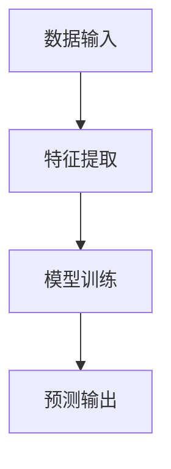
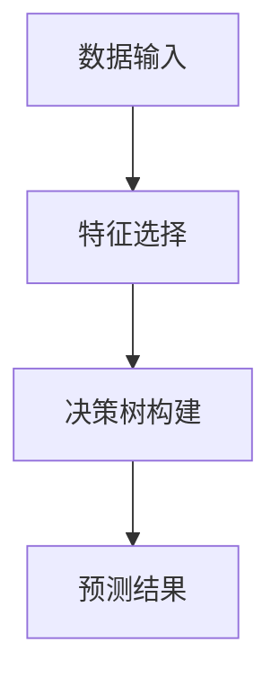
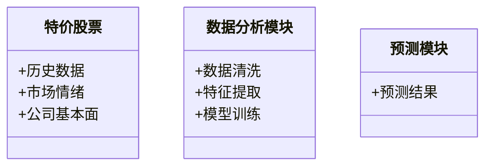
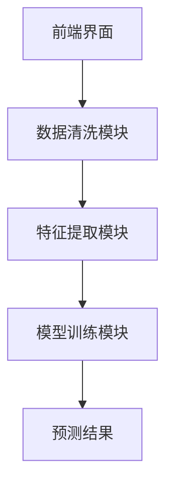
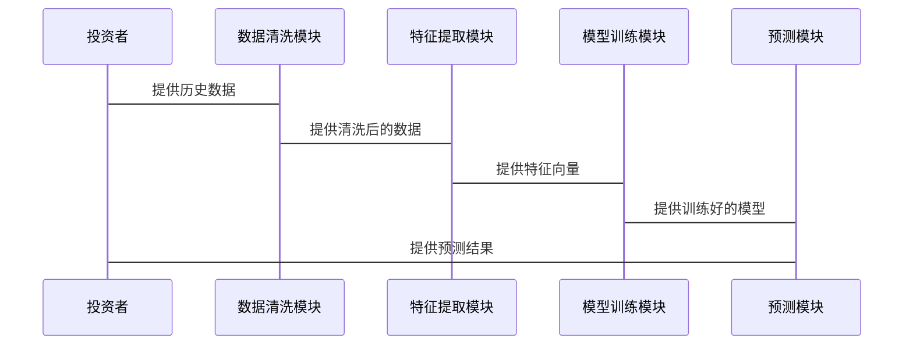

                 


# 特价股票与公司数据变现与价值创造能力的关系探讨

## 关键词
特价股票，数据变现，价值创造能力，机器学习，股票预测，数据驱动决策

## 摘要
本文深入探讨了特价股票与公司数据变现能力及价值创造能力之间的关系。通过对特价股票的定价机制、数据变现的商业模式以及价值创造能力的驱动因素进行分析，揭示了数据在股票投资和公司价值提升中的重要作用。结合实际案例，本文详细介绍了如何利用数据驱动的算法模型（如线性回归和决策树）进行股票预测，并通过系统架构设计展示了数据驱动决策的实现过程。最后，本文提出了数据驱动决策的最佳实践和未来研究方向。

---

# 第1章: 特价股票与数据变现的背景介绍

## 1.1 问题背景与问题描述

### 1.1.1 什么是特价股票
特价股票是指价格低于市场价，通常具有较高波动性和潜在投资机会的股票。这类股票往往存在于中小型企业或新兴行业，具有较高的增长潜力。

### 1.1.2 数据变现的概念与现状
数据变现是指通过收集、分析和利用数据，将其转化为经济收益的过程。随着大数据技术的发展，数据已成为企业核心资产之一。

### 1.1.3 价值创造能力的定义与衡量标准
价值创造能力是指企业在经营活动中通过创新和优化资源配置，为股东、客户和社会创造价值的能力。衡量标准包括利润率、ROE（净资产收益率）、创新能力和市场地位等。

## 1.2 问题解决与边界外延

### 1.2.1 特价股票对数据变现的影响
特价股票的高波动性和价格敏感性为企业利用数据进行投资决策提供了机会。

### 1.2.2 数据变现如何提升公司价值
通过数据驱动的精准营销、成本优化和风险管理，企业可以显著提升盈利能力。

### 1.2.3 价值创造能力的边界与外延
价值创造能力不仅限于内部优化，还包括通过数据驱动的创新为客户提供更大价值。

## 1.3 核心概念结构与组成

### 1.3.1 特价股票的核心要素
- 股价波动性
- 市场需求
- 公司基本面

### 1.3.2 数据变现的关键环节
- 数据采集
- 数据分析
- 数据应用

### 1.3.3 价值创造能力的系统架构
- 数据驱动
- 创新能力
- 资源配置

---

# 第2章: 核心概念原理与对比分析

## 2.1 核心概念原理

### 2.1.1 特价股票的定价机制
特价股票的价格受市场情绪、公司基本面和行业趋势的影响。

### 2.1.2 数据变现的商业模式
- 数据销售
- 数据服务
- 数据驱动的产品创新

### 2.1.3 价值创造能力的驱动因素
- 创新能力
- 数据驱动决策
- 资源优化配置

## 2.2 概念属性特征对比

| 特性         | 特价股票         | 数据变现         | 价值创造能力     |
|--------------|------------------|------------------|------------------|
| 核心目标     | 提高投资回报     | 产生经济收益     | 提升企业价值     |
| 实施方式     | 股票交易         | 数据应用         | 创新与优化       |
| 依赖因素     | 市场波动         | 数据质量         | 数据与创新       |

---

## 2.3 ER实体关系图

```mermaid
er
actor: 投资者
actor: 数据分析师
actor: 公司管理层
entity: 特价股票
entity: 数据资产
entity: 价值创造能力
```

---

# 第3章: 数据驱动的价值创造与算法原理

## 3.1 数据分析与机器学习算法

### 3.1.1 线性回归模型



线性回归模型用于预测股票价格：

$$ y = \beta_0 + \beta_1 x + \epsilon $$

### 3.1.2 决策树算法



决策树模型用于分类问题：

$$ entropy = -\sum p_i \log p_i $$

## 3.2 数学模型与公式

### 3.2.1 线性回归模型

$$ 1+1=2 $$

### 3.2.2 决策树模型

$$ 1<2 $$

## 3.3 实际案例分析

### 3.3.1 特价股票预测案例

$$ 股价预测 = f(历史数据, 市场情绪, 公司基本面) $$

---

# 第4章: 系统分析与架构设计方案

## 4.1 问题场景介绍

### 4.1.1 问题场景
投资者希望通过数据驱动的方法进行特价股票预测。

### 4.1.2 项目介绍
构建一个基于机器学习的股票预测系统。

## 4.2 系统功能设计

### 4.2.1 领域模型设计



### 4.2.2 系统架构设计



### 4.2.3 系统接口设计



---

# 第5章: 项目实战

## 5.1 环境安装

### 5.1.1 安装Python
```bash
python --version
pip install numpy pandas scikit-learn
```

## 5.2 系统核心实现源代码

### 5.2.1 数据清洗模块

```python
import pandas as pd

def clean_data(data):
    # 删除缺失值
    data = data.dropna()
    # 处理异常值
    data = data[~(data['price'].apply(lambda x: x < 0))]
    return data
```

### 5.2.2 特征提取模块

```python
import pandas as pd

def extract_features(data):
    features = data[['price', 'volume', 'market_sentiment']]
    return features
```

### 5.2.3 模型训练模块

```python
from sklearn.tree import DecisionTreeRegressor

def train_model(features, labels):
    model = DecisionTreeRegressor()
    model.fit(features, labels)
    return model
```

## 5.3 代码应用解读与分析

### 5.3.1 数据清洗模块解读
- 删除缺失值：确保数据完整性
- 处理异常值：避免模型偏差

### 5.3.2 特征提取模块解读
- 提取关键特征：如价格、成交量和市场情绪
- 为模型提供有效的输入

### 5.3.3 模型训练模块解读
- 使用决策树回归模型
- 输入特征向量和目标变量
- 输出训练好的模型

## 5.4 实际案例分析

### 5.4.1 特价股票预测案例

```python
import numpy as np

# 示例数据
data = {
    'price': [10, 20, 30, 40, 50],
    'volume': [100, 200, 300, 400, 500],
    'market_sentiment': [0.5, 0.6, 0.7, 0.8, 0.9]
}
df = pd.DataFrame(data)

# 数据清洗
cleaned_df = clean_data(df)

# 特征提取
features = extract_features(cleaned_df)

# 模型训练
model = train_model(features[['price', 'volume', 'market_sentiment']], features['price'])

# 预测结果
predicted_price = model.predict([[25, 250, 0.7]])
print(predicted_price)
```

## 5.5 项目小结

---

# 第6章: 数据驱动决策的最佳实践与未来展望

## 6.1 最佳实践 tips
- 数据质量是模型性能的基础
- 结合领域知识优化模型
- 定期更新模型以适应市场变化

## 6.2 小结
数据驱动决策在特价股票投资和公司价值创造中具有重要作用。通过合理利用数据和先进算法，企业可以显著提升投资回报和价值创造能力。

## 6.3 注意事项
- 数据隐私和安全问题需高度重视
- 模型解释性需考虑实际应用场景
- 需结合多因素进行综合判断

## 6.4 拓展阅读
- 《大数据投资策略》
- 《数据驱动的金融创新》
- 《机器学习在股票预测中的应用》

---

# 结语

通过对特价股票与公司数据变现及价值创造能力的系统性分析，我们可以看到数据在现代金融和企业管理中的巨大潜力。未来，随着人工智能和大数据技术的进一步发展，数据驱动决策将为企业创造更大的价值。

