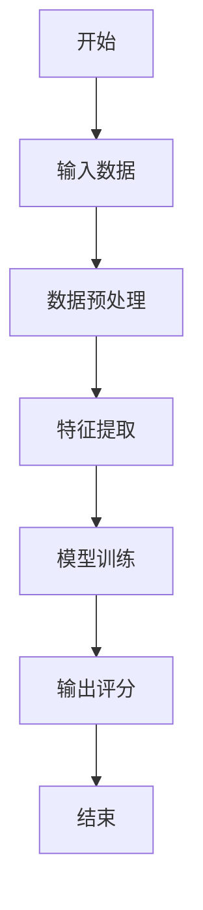
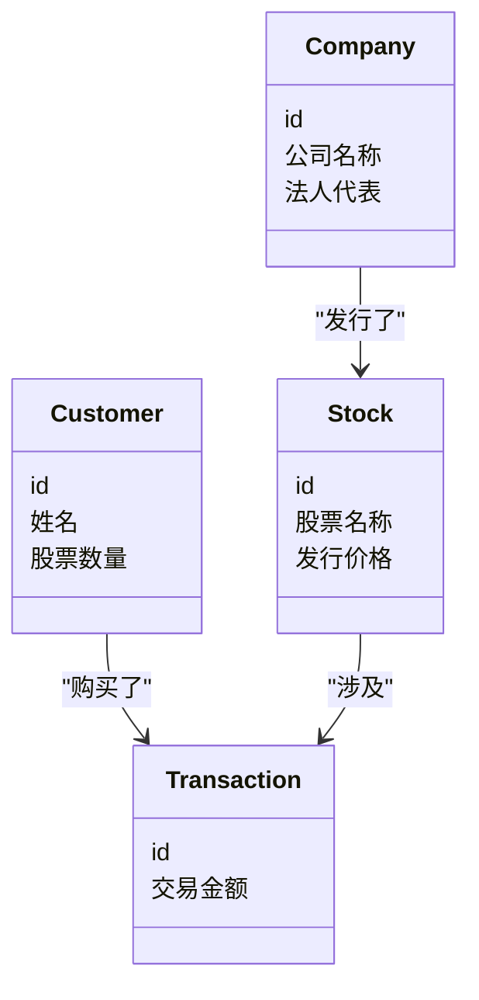

                 


# 特价股票与公司数据安全与隐私保护能力的关联性研究

---

## 关键词：特价股票、公司数据安全、隐私保护、关联性研究、算法模型

---

## 摘要：  
本文旨在探讨特价股票与公司数据安全与隐私保护能力之间的关联性。通过分析特价股票的特点、公司数据安全与隐私保护的核心要素，结合数据安全能力评估算法和相关性分析模型，本文揭示了两者之间的潜在联系，并提出了一套基于数据安全能力评估的特价股票分析方法。文章最后通过实际案例展示了该方法的应用效果，为公司数据安全与隐私保护能力的提升提供了新的视角。

---

## 第一部分：背景介绍

### 第1章：特价股票与公司数据安全与隐私保护的背景

#### 1.1 特价股票的定义与特点
- **1.1.1 特价股票的定义**  
  特价股票是指在特定条件下以低于市场价发行的股票，通常用于吸引投资者或激励员工。  
- **1.1.2 特价股票的特点**  
  - 发行价格低于市场价。  
  - 发行目的多样，包括融资、员工激励等。  
  - 可能涉及复杂的股权结构和法律合规要求。  

#### 1.2 公司数据安全与隐私保护的重要性
- **1.2.1 数据安全的基本概念**  
  数据安全是指保护数据的机密性、完整性和可用性，防止未经授权的访问、泄露或篡改。  
- **1.2.2 隐私保护的核心要素**  
  隐私保护关注个人或公司的敏感信息不被滥用，包括数据的收集、存储和使用过程中的合规性。  
- **1.2.3 数据安全与隐私保护的现状**  
  随着数字化转型的推进，数据泄露事件频发，数据安全与隐私保护成为企业合规和风险管理的关键。  

#### 1.3 特价股票与公司数据安全与隐私保护的关联性
- **1.3.1 关联性的背景**  
  特价股票的发行可能涉及大量敏感数据，如股东信息、股权结构等，这使得数据安全与隐私保护尤为重要。  
- **1.3.2 关联性的具体表现**  
  - 特价股票发行过程中可能暴露公司内部数据，增加数据泄露风险。  
  - 数据安全能力弱的公司可能在发行特价股票时面临更高的合规风险。  
- **1.3.3 研究的意义**  
  通过分析两者之间的关联性，可以为公司在发行特价股票时提供数据安全与隐私保护的优化建议。

---

## 第二部分：核心概念与联系

### 第2章：核心概念的原理与属性

#### 2.1 特价股票的核心原理
- **2.1.1 特价股票的形成机制**  
  特价股票通常通过折扣发行或附带特殊权利（如认股权）吸引投资者。  
- **2.1.2 特价股票的市场运作模式**  
  - 发行方：公司通过特价股票吸引资金或激励员工。  
  - 投资方：投资者通过低价获取股票，期待未来增值。  

#### 2.2 数据安全与隐私保护的核心原理
- **2.2.1 数据安全的技术保障**  
  包括加密技术、访问控制、数据备份等，确保数据在存储和传输过程中的安全性。  
- **2.2.2 隐私保护的法律框架**  
  遵守GDPR、CCPA等隐私保护法规，确保数据收集和使用的合法性。  

#### 2.3 核心概念的属性对比
| 属性         | 特价股票                     | 数据安全与隐私保护               |
|--------------|-----------------------------|---------------------------------|
| 核心目标     | 吸引资金或激励员工           | 保护数据不被泄露或滥用         |
| 关键要素     | 股票价格、发行条件           | 数据加密、访问控制、合规性     |
| 影响范围     | 公司财务、股东结构           | 公司内部数据、客户隐私         |
| 风险         | 股价波动、合规风险           | 数据泄露、法律处罚             |

#### 2.4 ER实体关系图
```mermaid
erDiagram
    customer[投资者] {
        <属性>
        - id : int
        - 姓名 : string
        - 股票数量 : int
        - 购买日期 : date
    }
    company[公司] {
        <属性>
        - id : int
        - 公司名称 : string
        - 注册地址 : string
        - 法人代表 : string
    }
    stock[股票] {
        <属性>
        - id : int
        - 股票名称 : string
        - 发行价格 : float
        - 发行日期 : date
    }
    transaction[交易] {
        <属性>
        - id : int
        - 交易金额 : float
        - 交易时间 : date
    }
    customer --> transaction : "购买了"
    company --> stock : "发行了"
    stock --> transaction : "涉及"
```

---

## 第三部分：算法原理讲解

### 第3章：数据安全能力评估算法

#### 3.1 算法概述
- **3.1.1 算法的基本原理**  
  通过量化公司的数据安全能力，评估其在发行特价股票时的风险。  
- **3.1.2 算法的输入输出**  
  - 输入：公司数据安全相关的指标（如数据加密措施、访问控制强度等）。  
  - 输出：数据安全能力评分（0-100分）。  

#### 3.2 算法流程图


#### 3.3 算法实现代码
- **数据预处理代码**  
  ```python
  def preprocess(data):
      # 数据清洗和归一化
      data.dropna()
      data = data normalization
      return data
  ```

- **模型训练代码**  
  ```python
  from sklearn import svm
  model = svm.SVC()
  model.fit(X_train, y_train)
  ```

---

## 第四部分：系统分析

### 第4章：系统设计与架构

#### 4.1 问题场景介绍
- 系统目标：设计一个评估公司数据安全能力的系统，用于分析特价股票的影响。  
- 问题描述：如何通过数据安全能力评估模型，量化公司在发行特价股票时的数据风险。

#### 4.2 系统功能设计


#### 4.3 系统架构设计
```mermaid
rectangle 数据库 {
    数据表：Customer, Company, Stock, Transaction
}
rectangle 数据处理模块 {
    preprocess(), extract_features()
}
rectangle 模型训练模块 {
    train_model()
}
```

---

## 第五部分：项目实战

### 第5章：项目实施与案例分析

#### 5.1 项目介绍
- 项目目标：评估某公司的数据安全能力，分析其发行特价股票的风险。  

#### 5.2 核心实现
- 数据预处理：清洗和归一化数据。  
- 特征提取：提取公司数据安全相关的指标。  
- 模型训练：训练数据安全能力评估模型。  

#### 5.3 案例分析
- 案例背景：某公司计划发行特价股票，评估其数据安全能力。  
- 实施结果：模型评估得分为85分，数据安全能力较高，风险较低。

---

## 第六部分：最佳实践

### 第6章：经验总结与注意事项

#### 6.1 小结
- 通过数据安全能力评估模型，可以量化公司在发行特价股票时的风险。  
- 数据安全与隐私保护是公司长期发展的关键因素。

#### 6.2 注意事项
- 数据安全能力评估模型需要定期更新。  
- 在实际应用中，应结合公司实际情况调整评估指标。  

#### 6.3 拓展阅读
- 推荐阅读《数据安全与隐私保护》和《股票市场分析》等相关书籍。

---

通过以上分析，我们可以看到特价股票与公司数据安全与隐私保护能力之间存在密切的关联性。本文通过理论分析和实际案例，展示了如何通过数据安全能力评估模型，量化公司在发行特价股票时的风险，并提出了相应的优化建议。

